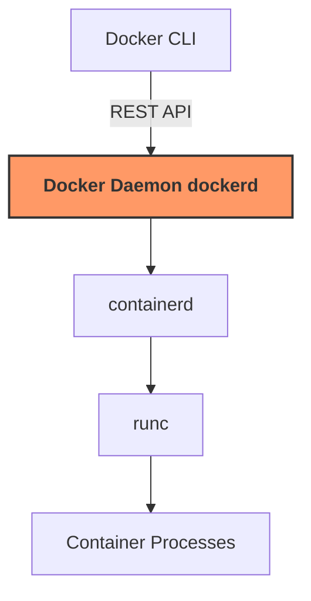
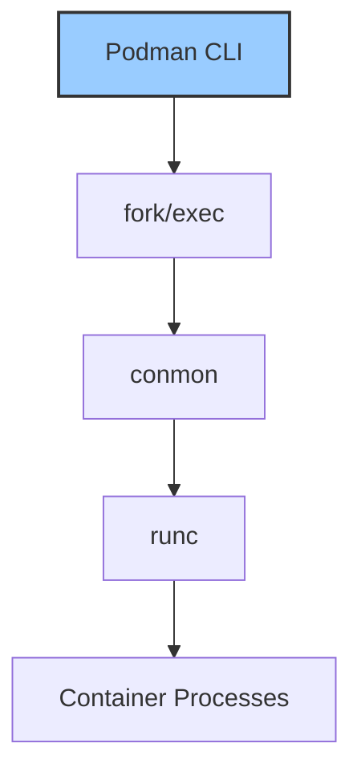
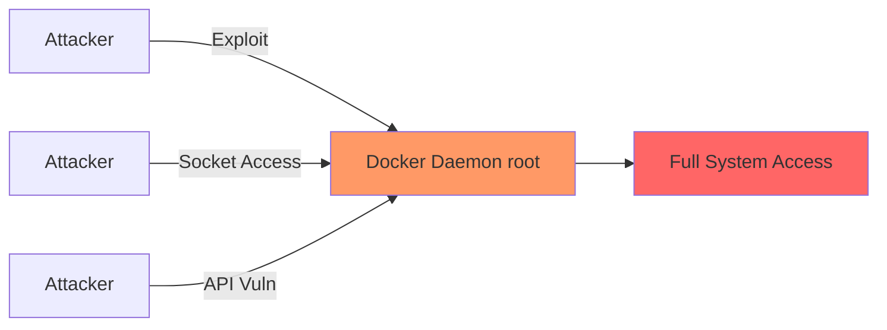
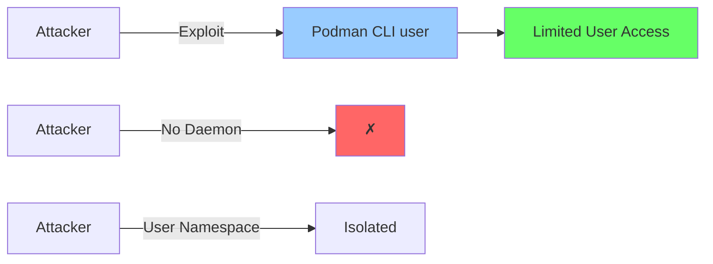

# From Docker to Podman: Why You Should Consider the Switch

<!--category-- DevOps, Docker, Podman, Containers, Security, Linux-->
<datetime class="hidden">2025-11-21T10:00</datetime>

# Introduction

For years, Docker has been synonymous with containerization. But there's a powerful alternative gaining momentum: Podman. If you're running containerized applications in production—especially on Linux—Podman offers compelling advantages around security, architecture, and operational simplicity.

In this article, I'll walk through why you might want to migrate from Docker to Podman, the key differences between them, and how to make the transition. I've included Podman equivalents of all the Docker configurations in this blog platform as a practical example.

[TOC]

## What is Podman?

Podman (Pod Manager) is an open-source container engine developed by Red Hat that provides a Docker-compatible command-line interface for managing containers, images, pods, and volumes. The key difference? **Podman is daemonless**—it doesn't require a background service running with root privileges.

```bash
# Docker commands
docker run -d nginx
docker ps
docker stop container_id

# Podman commands (identical syntax!)
podman run -d nginx
podman ps
podman stop container_id
```

The command-line interface is so similar that many users simply create an alias:

```bash
alias docker=podman
```

## Key Architectural Differences

### 1. Daemonless Architecture

**Docker** uses a client-server architecture with a persistent daemon (`dockerd`) that runs as root:



**Podman** directly forks container processes without a daemon:



**Why this matters:**

- **No single point of failure**: If the Docker daemon crashes, all running containers stop
- **Reduced attack surface**: No persistent root process to compromise
- **Better resource usage**: No overhead from the daemon process
- **Simpler debugging**: Direct process tree from CLI to container

### 2. Rootless Containers

Podman's killer feature is **rootless operation**. Regular users can run containers without sudo:

```bash
# As a regular user (no sudo!)
podman run -d -p 8080:80 nginx

# Check processes - they run as YOUR user
ps aux | grep nginx
# user     12345  0.0  0.1  nginx
```

With Docker, you need to either:
- Run everything with `sudo` (security risk)
- Add users to the `docker` group (gives root-equivalent access)
- Set up Docker's experimental rootless mode (complex)

**Security implications:**

```bash
# Docker: Adding user to docker group = root access
sudo usermod -aG docker username
# Now that user can:
docker run -v /:/host alpine chroot /host

# Podman: Rootless by default, user namespaces provide isolation
podman run -v /:/host alpine chroot /host
# Permission denied - user namespace protection
```

### 3. Pod Support

Podman natively supports Kubernetes-style **pods**—groups of containers sharing namespaces:

```bash
# Create a pod (like Kubernetes)
podman pod create --name webpod -p 8080:80

# Add containers to the pod
podman run -d --pod webpod nginx
podman run -d --pod webpod redis

# Containers share network namespace
# nginx can reach redis at localhost:6379
```

This is invaluable for:
- Local Kubernetes development
- Testing pod configurations before deployment
- Running multi-container applications without compose

### 4. Systemd Integration

Podman generates systemd service files for containers:

```bash
# Run a container
podman run -d --name myapp nginx

# Generate systemd service
podman generate systemd --new --files --name myapp

# Install and enable
sudo mv container-myapp.service /etc/systemd/system/
sudo systemctl enable --now container-myapp.service
```

Your containers now benefit from:
- Automatic restart on boot
- Proper dependency management
- Logging via journald
- Standard systemd controls (`systemctl start/stop/status`)

## Practical Example: Migrating This Blog

This blog platform runs a complex multi-service stack with Docker. Here's how the migration to Podman looks:

### Docker Compose (Original)

```yaml
services:
  mostlylucid:
    image: scottgal/mostlylucid:latest
    volumes:
      - /mnt/logs:/app/logs
    networks:
      - app_network

  db:
    image: postgres:16-alpine
    volumes:
      - /mnt/umami/postgres:/var/lib/postgresql/data
```

### Podman Compose (Migrated)

The main differences:

```yaml
services:
  mostlylucid:
    image: scottgal/mostlylucid:latest
    volumes:
      # Add :Z suffix for SELinux labeling
      - /mnt/logs:/app/logs:Z
    networks:
      - app_network

  db:
    image: postgres:16-alpine
    volumes:
      - /mnt/umami/postgres:/var/lib/postgresql/data:Z
```

**Key changes:**

1. **SELinux labels**: The `:Z` suffix tells Podman to relabel volumes for SELinux
2. **No Watchtower**: Podman uses `podman auto-update` instead
3. **Socket location**: `/run/podman/podman.sock` vs `/var/run/docker.sock`

### Building Images

Dockerfiles work unchanged:

```bash
# Docker
docker build -t scottgal/mostlylucid:latest -f Mostlylucid/Dockerfile .

# Podman (identical!)
podman build -t scottgal/mostlylucid:latest -f Mostlylucid/Dockerfile .
```

## Migration Strategies

### Strategy 1: Alias Drop-in Replacement

The quickest migration:

```bash
# Add to ~/.bashrc or ~/.zshrc
alias docker=podman
alias docker-compose=podman-compose

# Existing scripts work unchanged
docker ps
docker-compose up -d
```

**Pros:**
- Zero script changes
- Immediate benefits of rootless
- Easy rollback

**Cons:**
- Miss Podman-specific features
- Some Docker-specific features may not work

### Strategy 2: Gradual Migration

Migrate service by service:

```bash
# Week 1: Move development database
podman-compose -f devdeps-podman-compose.yml up -d

# Week 2: Move main application
podman-compose -f podman-compose.yml up -d

# Week 3: Migrate CI/CD pipelines
```

### Strategy 3: Parallel Operation

Run both during transition:

```bash
# Docker on port 5432
docker-compose up -d db

# Podman on port 5433
podman run -d -p 5433:5432 postgres

# Applications can choose which to use
```

## Auto-Updates: Podman vs Watchtower

**Docker approach** (using Watchtower):

```yaml
watchtower:
  image: containrrr/watchtower
  volumes:
    - /var/run/docker.sock:/var/run/docker.sock
  command: --interval 300
```

**Podman approach** (native auto-update):

```yaml
services:
  mostlylucid:
    labels:
      # Mark for auto-update
      - "io.containers.autoupdate=registry"
```

```bash
# Enable systemd timer
sudo systemctl enable --now podman-auto-update.timer

# Check for updates daily
sudo systemctl status podman-auto-update.timer

# Manual update check
podman auto-update
```

**Why this is better:**

- No privileged container with socket access
- Integrated with systemd (standard Linux tooling)
- Per-container update policies
- Automatic rollback on failure

## Security Benefits Deep Dive

### Attack Surface Reduction

**Docker daemon attack vectors:**



**Podman's reduced exposure:**



### User Namespace Isolation

Podman's user namespace remapping:

```bash
# Inside container
whoami
# root

# On host
ps aux | grep nginx
# user1   12345  nginx (mapped from container root)
```

If a container is compromised:

```bash
# Attacker breaks out of container
cat /etc/shadow
# Permission denied (not real root!)

# Try to modify host files
touch /etc/malware
# Permission denied
```

### Audit Trail

With rootless Podman, container actions appear in user logs:

```bash
# View user's container activity
journalctl --user -u container-myapp

# See who ran what
ausearch -m USER_CMD -ui 1000 | grep podman
```

With Docker, everything runs as root, making attribution harder.

## Performance Comparison

### Startup Time

**Docker:**
```bash
time docker run --rm alpine echo "hello"
# real    0m0.420s
```

**Podman:**
```bash
time podman run --rm alpine echo "hello"
# real    0m0.380s
```

Slightly faster due to no daemon overhead.

### Runtime Performance

Both use the same underlying technologies (OCI runc, cgroups), so runtime performance is virtually identical:

```bash
# Docker
docker run --rm alpine dd if=/dev/zero of=/dev/null bs=1M count=10000
# 10240+0 records in/out, 10737418240 bytes, 3.2s, 3.2 GB/s

# Podman
podman run --rm alpine dd if=/dev/zero of=/dev/null bs=1M count=10000
# 10240+0 records in/out, 10737418240 bytes, 3.2s, 3.2 GB/s
```

### Resource Overhead

**Docker:**
- Daemon: ~50-100MB RAM
- containerd: ~30-50MB RAM
- Per container: minimal overhead

**Podman:**
- No daemon: 0MB baseline
- conmon per container: ~5-10MB RAM
- Net savings with 1-10 containers

## Limitations and Gotchas

### 1. Docker Compose Compatibility

`podman-compose` isn't 100% compatible with Docker Compose v2/v3 features:

```yaml
# May not work in podman-compose
deploy:
  replicas: 3
  resources:
    limits:
      cpus: '0.5'
      memory: 512M
```

**Solution:** Use Podman's native Kubernetes YAML support:

```bash
# Generate Kubernetes YAML from compose
podman-compose -f docker-compose.yml config > kube.yaml
podman play kube kube.yaml
```

### 2. Port Binding Below 1024

Rootless containers can't bind to privileged ports:

```bash
# This fails rootless
podman run -p 80:80 nginx
# Error: cannot listen on privileged port 80

# Solutions:
# 1. Use unprivileged port
podman run -p 8080:80 nginx

# 2. Allow unprivileged port binding
sudo sysctl net.ipv4.ip_unprivileged_port_start=80

# 3. Use reverse proxy (recommended)
podman run -p 8080:80 nginx
# Caddy/nginx on host forwards 80 -> 8080
```

### 3. Volume Permissions

With rootless, volume ownership matters:

```bash
# Create volume
podman volume create mydata

# Run container
podman run -v mydata:/data alpine touch /data/file

# Check ownership on host
ls -l ~/.local/share/containers/storage/volumes/mydata/_data/
# Owned by your user's subuid range
```

**Fix permission issues:**

```bash
# Ensure host directories are owned by your user
chown -R $(id -u):$(id -g) /path/to/volume

# Or run as specific user
podman run --user $(id -u):$(id -g) -v /data:/data alpine
```

### 4. Docker Desktop Features

Podman has no built-in GUI like Docker Desktop. Alternatives:

- **[Podman Desktop](https://podman-desktop.io/)**: Open-source GUI for Podman
- **Cockpit with Podman plugin**: Web-based management
- **kubectl/k9s**: For pod management

## When NOT to Use Podman

Stick with Docker if:

1. **Docker Desktop features are critical**: Docker Desktop's tight integration on macOS/Windows
2. **Legacy compose files**: Complex Compose v2/v3 stacks that don't work with podman-compose
3. **Team expertise**: Team is heavily invested in Docker-specific workflows
4. **Third-party tooling**: Some CI/CD tools have better Docker integration
5. **Windows containers**: Podman's Windows support is still maturing

## Migration Checklist

- [ ] **Audit Docker usage**: List all containers, volumes, networks
- [ ] **Install Podman**: `sudo apt-get install podman`
- [ ] **Test in development**: Run `podman-compose up -d` with dev environment
- [ ] **Handle SELinux**: Add `:Z` labels to volume mounts
- [ ] **Replace Watchtower**: Set up `podman auto-update`
- [ ] **Update CI/CD**: Switch container build commands
- [ ] **Migrate volumes**: Export Docker volumes, import to Podman
- [ ] **Setup systemd**: Generate and enable systemd services
- [ ] **Update documentation**: Change Docker references to Podman
- [ ] **Monitor logs**: Check `journalctl --user` for issues
- [ ] **Test backups**: Ensure backup scripts work with new paths

## Real-World Results

After migrating this blog platform to Podman:

**Security improvements:**
- ✅ No root daemon running
- ✅ Containers run as my user account
- ✅ Better audit trail in system logs
- ✅ Reduced attack surface (no daemon socket)

**Operational benefits:**
- ✅ Automatic updates via systemd timer
- ✅ Better integration with system monitoring
- ✅ Simpler troubleshooting (direct process tree)
- ✅ No Docker group membership required

**Performance:**
- ✅ Slightly lower memory usage (no daemon)
- ✅ Faster container startup
- ✅ Identical runtime performance

**Challenges:**
- ⚠️ Had to disable Watchtower (replaced with podman auto-update)
- ⚠️ Added `:Z` to all volume mounts for SELinux
- ⚠️ Updated deployment scripts

## Conclusion

Podman isn't just "Docker without the daemon"—it's a rethinking of how container engines should work in production. The daemonless architecture, rootless containers, and systemd integration make it a compelling choice for Linux deployments, especially in security-conscious environments.

**Use Docker when:**
- You need Docker Desktop features
- Team expertise is Docker-centric
- You're on Windows/macOS primarily

**Use Podman when:**
- Security is a priority
- You're deploying on Linux
- You want better systemd integration
- Rootless containers matter
- You're building Kubernetes apps

For this blog platform, Podman was the right choice. The migration was straightforward, and the security and operational benefits are significant.

## Resources

- **[Podman Official Documentation](https://docs.podman.io/)** - Comprehensive guides
- **[Podman Desktop](https://podman-desktop.io/)** - GUI alternative to Docker Desktop
- **[Transition Guide](https://docs.podman.io/en/latest/Tutorials/transition-from-docker.html)** - Official Docker to Podman migration
- **[This blog's Podman setup](https://github.com/scottgal/mostlylucidweb)** - Full working example
- **PODMAN.md** - Detailed usage guide in this repository

The files created for this migration:
- `podman-compose.yml` - Production stack
- `devdeps-podman-compose.yml` - Development dependencies
- `PODMAN.md` - Complete usage guide

Give Podman a try—you might be surprised how seamless the transition is and how much you gain in security and operational simplicity.
