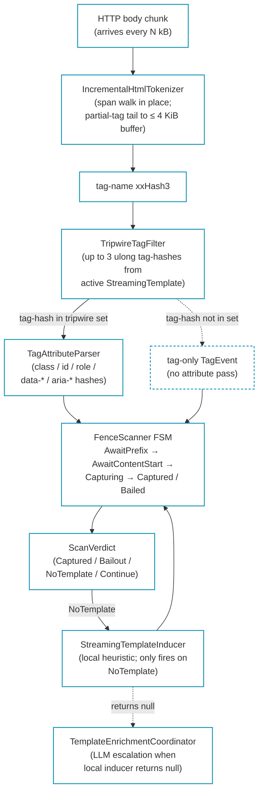

# Draft: streaming-layer content split out of the LLM induction post

These two blocks were written into `stylobot-release-styloextract-llm-induction.md` by accident. They belong in the part 2 post on the streaming fence scanner. Saved here as a starting point for that post. Voice still needs editing.

---

## Block 1: streaming heuristic inducer (originally written as §3.4 of the LLM post)

The fourth inducer mode runs at the gateway position, where bytes are still arriving and the consumer cannot buffer the response just to learn what is in it. It lives in [`StyloExtract.Streaming`](https://github.com/scottgal/styloextract/tree/main/src/StyloExtract.Streaming) as [`StreamingTemplateInducer`](https://github.com/scottgal/styloextract/blob/main/src/StyloExtract.Streaming/StreamingTemplateInducer.cs) and emits a `StreamingTemplate`, a tiny per-host record carrying three `IdentityClaim` *tripwires* (prefix, content-start, content-end) instead of the layout-side's selector-and-rule list.

Three claims, not three CSS paths. An `IdentityClaim` is the precomputed-hash projection of an element's identity attributes: tag-name hash, optional id hash, the first two stable class-token hashes if present, optional role / data-* / aria-* hash pairs. The scanner matches these hashes against per-event hash data emitted by the byte-stream tokenizer. No string materialisation, no DOM, no re-parse.

The shape heuristic the streaming inducer picks is deliberately small:

- **Prefix tripwire:** the first `<header>`, falling back to the first `<nav>`, last-ditch `<body>`.
- **Content-start tripwire:** the first `<article>`, then `<main>`, then the nearest common parent of any 2+ consecutive `
` siblings.
- **Content-end tripwire:** the same element as content-start. The scanner watches for its CLOSE event, which on the wire collapses to "fire the tripwire when this tag-hash arrives with `IsClose=true`."

This is not trying to be the layout-side inducer's twin. The layout side has the full DOM in front of it and can score 45 features per block; the streaming side has to commit to its targets the first time it sees a real page for the host. Three tripwires that gate "before content / inside content / after content" is enough to let the gateway emit a `Captured` verdict. The chunk range between content-start fire and content-end fire is what the downstream consumer treats as the article subtree.

Where the heuristic gives up (a grid-of-cards homepage with no header/main/article and no paragraph cluster, a JSON endpoint mis-served as HTML, an SVG-only page) the inducer returns `null` rather than fabricating bad tripwires. The escalation path is the same as for the layout side: LayoutExtractor's [`MaybeEnqueueEnrichmentAsync`](https://github.com/scottgal/styloextract/blob/main/src/StyloExtract.Core/LayoutExtractor.cs) fires when the buffered request reaches it, the LLM coordinator drains the queue and writes `<host>.yaml`, and a host with no streaming template still gets a learned operator template via the slower path.

The streaming template persists to its own SQLite store ([`SqliteStreamingTemplateStore`](https://github.com/scottgal/styloextract/blob/main/src/StyloExtract.Streaming/SqliteStreamingTemplateStore.cs)) keyed by host. Same audit shape as the layout side: a row per `(template_id, host_hash, version)` and a side-effect YAML if you want a human-readable copy. Two parallel inducers, two parallel stores, one shared escalation path when both deterministic paths run out.

---

## Block 2: scan-layer pipeline + alpha.24 tag-prefilter perf (originally written as §8 of the LLM post)

Everything in the LLM-induction post sits behind the layer that decides whether the request even *gets* a full DOM. In the gateway shape (a YARP middleware that wants to swap HTML for Markdown while the upstream response body is in flight) buffering a multi-megabyte page just to find out the verdict is "no template, pass through" is a non-starter. The answer has to come chunk-by-chunk, matched against the same per-host learned templates, and without allocating on the hot path.

`Mostlylucid.StyloExtract.Streaming` is that layer. As of alpha.24 it has its own three-tripwire FSM driving a `ref struct` scanner over a `ref struct` HTML tokenizer; the tokenizer walks each byte chunk in place, drops complete-tag bytes immediately, and only retains the partial tag straddling a chunk boundary in a small (≤ 4 KiB-capped) reusable buffer. Peak buffered memory on real responses sits at 154 bytes against a 199,506-byte mostlylucid.net page. A 0.08% ratio independent of chunk size.

The layers, end-to-end:

The dashed lane is the alpha.24 tuning. Most tags on a real page (every ``, ``, `<a>`, ` `) are not candidates for any of the three tripwires; the FSM rejects them on a single tag-hash compare. Before alpha.24 the attribute parser still ran for them, allocating a small `ulong[]` per open tag with classes. After alpha.24 the tokenizer hashes the tag name (cheap), asks [`TripwireTagFilter.Matches(ulong)`](https://github.com/scottgal/styloextract/blob/main/src/StyloExtract.Streaming/TripwireTagFilter.cs) (three ulong compares and an OR), and if it misses, emits a tag-only event with no further allocation. The FSM still sees every event for depth tracking; only the attribute pass is gated.

The win, on the `ExtractionComparisonBench` matrix (Apple M5, .NET 10):

| Fixture            | Before (alpha.23)   | After (alpha.24)    | Δ time | Δ alloc |
|--------------------|--------------------:|--------------------:|-------:|--------:|
| blog-styloextract  | 50.7 μs / 9.86 KB   | 28.7 μs / 392 B     | 1.77×  | 25.7×   |
| blog-sidecar       | 42.4 μs / 9.96 KB   | 21.6 μs / 392 B     | 1.96×  | 26.0×   |
| blog-fingerprint   | 46.0 μs / 9.91 KB   | 24.3 μs / 392 B     | 1.89×  | 25.9×   |
| home.html (dense)  | 159.4 μs / 52.02 KB | 48.2 μs / 1.75 KB   | 3.31×  | 30.4×   |

The win scales with tag count: home.html is tag-densest and gets the largest speedup. The 392-byte floor on the blog fixtures is fixed scanner / store overhead, nothing per-tag. Against the same alpha.24 LayoutExtractor in the same matrix the streaming scan is ~110-150× faster on blog pages and ~120× on home.html, with 4-10000× less allocation depending on shape.

What this layer is *not* doing: it is not building a DOM, it is not running the layout-side template, and it is not trying to be the canonical extractor. Its job is to emit a verdict ("this chunked response matches the host's known content fences, capture from byte X to byte Y" or "no match, fall through to the buffered pipeline") in microseconds, with bounded memory, on the same byte stream the consumer is already going to read. The buffered pipeline is what runs behind it when the verdict is `NoTemplate` or `Bailout`; the streaming layer is the cheap path that catches the 90%+ of requests where the host is already known.