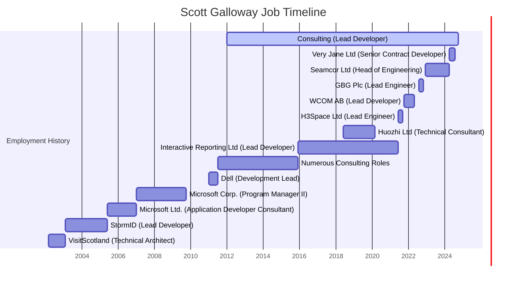

# Resume | Scott Galloway | .NET Developer | Remote

<!--category-- Resume , introduction -->
<datetime class="hidden">2024-09-29T22:30</datetime>

I'm a versatile and accomplished developer and lead with an over 25 year track record building teams and platforms and revitalising startups.
Proficient in C#, ASP.NET, and modern web frameworks, with extensive experience in cloud computing, DevOps, database management and search technologies. Proven track record of leading successful development projects across diverse industries, from technology giants to innovative startups.

Need help to build your next project?

**Email:** [scott.galloway@gmail.com](mailto:scott.galloway@gmail.com)

**Phone:** +44 7498 479 614

[TOC]

---

# Skills

### Languages & Frameworks
- Server Side: **C#** (25+ years), **JavaScript** (20+ years), **ASP.NET to .NET 8** (25+ years). To a lesser extent: **Python**, **Java**, **C++**, **PHP**
- Frontend: **Vue.js**, **JQuery**, **HTMX**, **Alpine.js**, **React**, **Angular**, **Blazor** (and many more)
- CSS Frameworks: **Tailwind CSS**, **Bootstrap**, **Manual**

### Databases
- **SQL**: SQL Server, PostgreSQL, MySQL, SQLite
- **NoSQL**: MongoDB, RavenDB

### Cloud Computing & DevOps
- **Azure**, **Docker**, **Kubernetes**

### Leadership & Software Development
- Roles: Lead Developer, Senior .NET Developer, Development Lead, Head of Engineering, CTO
- Methodologies: Agile, Scrum, Kanban
- Tools: Jira, Trello, Azure DevOps, GitHub, GitLab
- Training: Developer training program with 90% employment success rate
- Mentorship: Mentored junior developers and led geographically dispersed remote teams

---

## Professional Highlights

- **Proven Development Expertise**: A 25+ year track record in driving full-stack software development, from hands-on coding to executive leadership roles.
- **Industry Impact**: Made significant contributions to industry-leading organizations like Microsoft and Dell, as well as innovative startups across diverse sectors.
- **Remote Team Leadership**: Spearheaded remote teams, fostering collaboration and innovation across global teams, while designing a developer training program with a 90% employment success rate.
- **Cutting-Edge Technological Focus**: Continuously advancing expertise in modern development stacks, with a strong focus on remote and distributed work methodologies.
- **Strategic Product & Team Builder**: Built and mentored high-performing development teams, leading them to deliver impactful products across industries, ensuring alignment with both business goals and user needs.
---

# Employment History (abbreviated...I've been around a while)

## Consulting | Lead Developer / Architect / Managing Director | Remote
Jan 2012 – Present

Directed multiple client projects as Lead Developer, Architect, and interim CTO, ensuring successful product launches and project completions.
Developed a comprehensive training program for over 200 novice developers, achieving a 90% employment success rate.
Modernized legacy systems, enhancing operational efficiency and user experience through advanced technological solutions.
Overhauled an e-commerce platform, improving performance, scalability, and maintainability.

## Very Jane Ltd | Senior Contract Developer | Remote
Apr 2024 – Aug 2024

Architected backend systems for a large e-commerce application, integrating payment systems like Stripe Connect and Hyperwallet.
Implemented ASP.NET 8 solutions to streamline product loading, payments, and promotions.
## Seamcor Ltd | Head of Engineering (Contract) | Remote
Dec 2022 – Apr 2024

Led a team of 6 developers in building and rearchitecting an ASP.NET Core system, integrating Docker Compose and OpenSearch for enhanced data access and reporting.
Ensured seamless transition and scalability of systems to meet evolving customer needs.
## GBG Plc (Loqate) | Lead Engineer | Remote
Aug 2022 – Nov 2022

Spearheaded the development of a global search product using .NET 6 microservices and Kubernetes, optimizing for high throughput and large data sets.
Set the technical direction for CI/CD, testing, and global-scale system operations.
## WCOM AB | Lead Developer (Contract) | Remote
Oct 2021 – May 2022

Executed various projects using Azure DevOps, Azure Functions, and Blazor Server for comprehensive reporting and microservices architecture.
Developed SignalR-based IPC and screen mirroring applications for enhanced user interaction.
## H3Space Limited | Lead Engineer | Remote
Jun 2021 – Sep 2021

Built a development team and defined platform architecture for a scalable online community supporting a Unity 3D Desktop tool.
Delivered full-stack solutions using React JS, GraphQL, and Azure services.
## Huozhi Limited | Technical Consultant / Dev Lead (Contract) | Remote
Jun 2018 – Mar 2020

Provided technical leadership and team formation for a startup, returning to resolve development and release challenges.
## Interactive Reporting Limited | Lead Developer (Contract) | Remote
Dec 2015 – Jun 2021

Developed a web-based reporting platform using ASP.NET MVC, WPF, and WinForms, supporting multiple database backends.

## Dell | Development Lead | Glasgow, UK
Jan 2011 - July 2011
Led the development of a custom machine image deployment platform using ASP.NET MVC and SQL Server.

## Microsoft Corp. | Program Manager II | Redmond, WA, USA
Jan 2007 – Oct 2009

Drove the ASP.NET release lifecycle, managing bug triage and integration with the broader .NET community.
Delivered core features and new security infrastructure for Project Server.

## Microsoft Ltd. | Application Developer Consultant II | Reading, UK
Jun 2005 – Jan 2007

Specialised in performance analysis and tuning for a wide variety of customers ranging from a large NHS project through smaller travel companies, software for the UK police etc. I led multiple performance labs in the Microsoft UK labs as well as in HPC applications in Stuttgart.
Aided customers to deliver a very wide variety of systems whilst also liaising with numerous product teams at Microsoft corporate to assist customers in solving their development issues.

## StormID | Lead Developer  | Edinburgh, UK
Feb 2003 - Jun 2005

Fast paced agency environment where I worked on many and varied projects from a massively scalable (.5 million+) mail merge system using ASP.NET, Windows Services etc through an Education Portal for Microsoft UK and multiple custom ecommerce systems which variously increased conversion rates by orders of magnitude. 

## VisitScotland – Technical Architect | Edinburgh, UK
Mar 2002 - Feb 2003

Requirement for a ‘templatable’ number of websites based on newer technologies; existing skillset of developers was using a complex CORBA system which was no longer fit for purpose.
Directed training, architecture, workflow for the team of 20 developers to move to a J2EE / MVC based system which allowed the simple delivery of multiple themed websites based on a single expandable platform. 

# Education
University of Stirling | BSc (Hons) Psychology
Start Date: Sep 1992 - End Date: Jun 1996
Location: Stirling, Scotland, UK

# Links
LinkedIn: [Scott Galloway](https://www.linkedin.com/in/scott-galloway-91608691/)
GitHub: [This Blog](https://github.com/scottgal/mostlylucidweb)