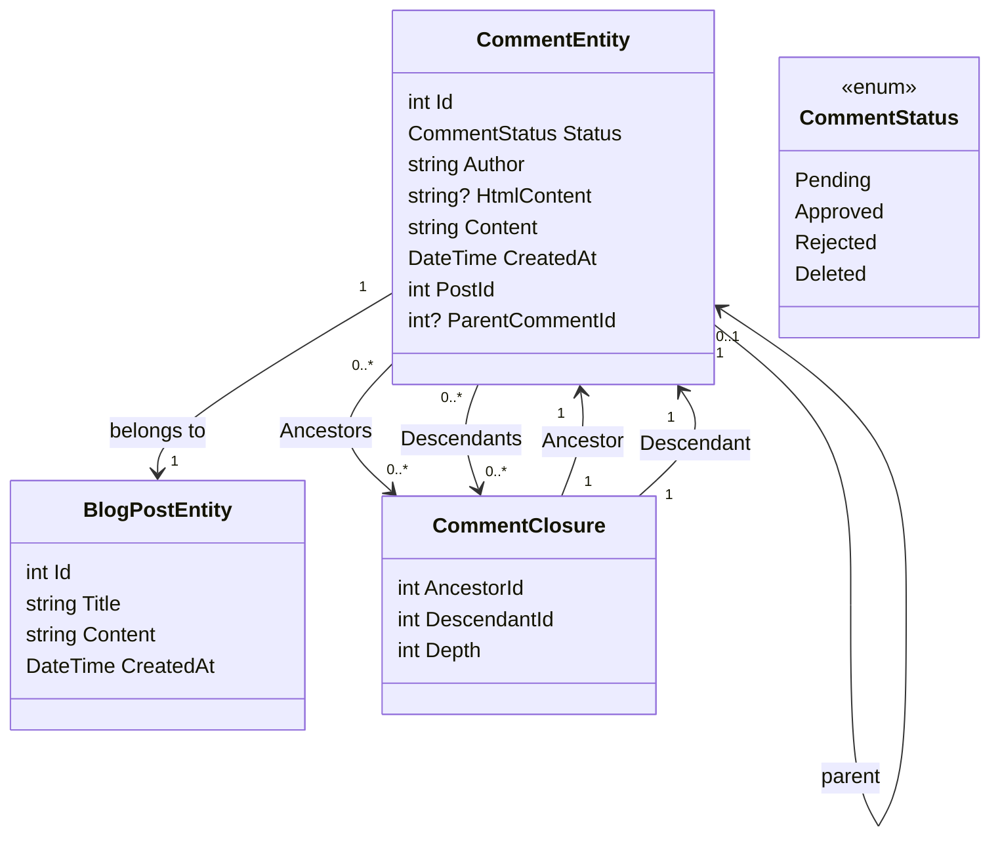

# Adding a Comment System Part 1 - Setting up the Database

<!--category-- Entity Framework  -->
<datetime class="hidden">2024-08-26T11:53</datetime>

## Introduction
One of the key aspects of a blogging site like this is a comments system. So, I decided to build one. This is the first part of a series of posts on how to build a comments system. In this post, I will be setting up the database.

[TOC]

## Setting up the Database
As with the rest of the site I'm using Postgres for the blogs; to start with I'm using recursive queries to store the comments. I dislike this intensely, but it gets us out the gate with a threaded comment system (and I don't have much traffic, so it's not a big deal). I'll be moving to a more efficient system in the future.

### The EF Context
In the current system we use a 'Comment Closure' to define the relationships between comments - so I can support threaded comments. Our class diagram looks like this:




You can see here that each `CommentEntity` has a `PostId` for the post it's attached to, and a `ParentCommentId` for the comment it's attached to (if any). The `CommentClosure` table is used to store the relationships between comments.

### The CommentService
The `CommentService` is responsible for managing comments. It has methods for adding, approving, rejecting, and deleting comments. It also has methods for getting comments for a post, and getting comments for a comment.

Our interface for this service looks like this:

```csharp
public interface ICommentService
{
    Task<string> Add( int postId, int? parentCommentId, string author, string content);
    Task<List<CommentEntity>> GetForPost(int blogPostId, int page = 1, int pageSize = 10, int? maxDepth = null, CommentStatus? status = null);
    Task<List<CommentEntity>> GetDescendants(int commentId, int maxDepth = 0);

     Task<CommentEntity> Get(int commentId);
    Task<List<CommentEntity>> GetAncestors(int commentId);
    Task Delete(int commentId);
    Task Reject(int commentId);
    Task Approve(int commentId);
}
```

#### The Add Method
Our Add method sums up the structure of this comments system. 

It first starts a new transaction; for those not familiar transactions are a way to ensure that a group of operations are treated as a single unit of work. If any of the operations fail, the transaction can be rolled back, and all changes are undone. This is important when you have multiple operations that need to be done together, and you want to ensure that they all succeed or fail together.

It then parses the comment text from Markdown to HTML using the Markdig library. This is a simple way to allow users to format their comments using Markdown.

Next it creates the entity and saves that to the database.

This is done in two steps - first the comment is saved, then the comment closure is saved. This is because the comment needs to be saved to generate the Id, which is used in the closure.

We next build the hierarchy of `CommentClosures` which define the relationships between comments. We start with a self-referencing closure entry, then if there is a parent comment we fetch all the ancestors of the parent comment and add them to the new comment. We then add a direct parent-child relationship.

Finally, we commit the transaction. If any of the operations fail, the transaction is rolled back.

```csharp
 public async Task<string> Add(int postId, int? parentCommentId, string author, string content)
  {
      await using var transaction = await context.Database.BeginTransactionAsync();
      try
      {
         var html = Markdig.Markdown.ToHtml(content);
          // Create the new comment
          var newComment = new CommentEntity()
          {
              HtmlContent = html,
              Content = content,
              CreatedAt = DateTime.UtcNow,
              PostId = postId,
              Author = author,
              Status = CommentStatus.Pending,
              ParentCommentId = parentCommentId
          };
            
          context.Comments.Add(newComment);
          await context.SaveChangesAsync();
          logger.LogInformation("Saved comment to DB");// Save to generate the new comment's Id

          // Insert into CommentClosure table
          var commentClosures = new List<CommentClosure>();

          // Self-referencing closure entry
          commentClosures.Add(new CommentClosure
          {
              AncestorId = newComment.Id,
              DescendantId = newComment.Id,
              Depth = 0
          });

          // If there is a parent comment, insert the ancestor relationships
          if (parentCommentId.HasValue)
          {
              // Fetch all ancestors of the parent comment
              var parentAncestors = await context.CommentClosures
                  .Where(cc => cc.DescendantId == parentCommentId.Value)
                  .ToListAsync();

              // Add ancestor relationships for the new comment
              foreach (var ancestor in parentAncestors)
              {
                  commentClosures.Add(new CommentClosure
                  {
                      AncestorId = ancestor.AncestorId,
                      DescendantId = newComment.Id,
                      Depth = ancestor.Depth + 1
                  });
              }

              // Add a direct parent-child relationship
              commentClosures.Add(new CommentClosure
              {
                  AncestorId = parentCommentId.Value,
                  DescendantId = newComment.Id,
                  Depth = 1
              });
          }

          context.CommentClosures.AddRange(commentClosures);
          await context.SaveChangesAsync();
          logger.LogInformation("Saved comment closure to DB");

          // Commit transaction
          await transaction.CommitAsync();
          return html;
      }
      catch (Exception e)
      {
          // Rollback transaction in case of failure
          await transaction.RollbackAsync();
          logger.LogError(e, "Failed to save comment to DB");
      }

      return string.Empty;
  }

```

#### The GetForPost Method
We won't cover the whole thing but `Add` and `Get` are our main CRUD operations for this service.

As you can see we have paging based on the top level comment. We also have a `maxDepth` parameter which allows us to limit the depth of the comment tree. This is useful if we only want to show the top-level comments, or if we want to limit the depth of the tree to improve performance.

Unfortuately with this recursive approach we need to apply the depth filter after we've fetched the comments, as we can't do it in the query. This is because the depth of a comment is determined by the number of ancestors it has, and we can't easily query this in SQL.

```csharp
  public async Task<List<CommentEntity>> GetForPost(int blogPostId, int page = 1, int pageSize = 10, int? maxDepth = null, CommentStatus? status = null)
  {
      // Step 1: Query the top-level comments for the specified blog post
      var query = context.Comments
          .Where(c => c.PostId == blogPostId)
          .OrderByDescending(c => c.CreatedAt)
          .Skip((page - 1) * pageSize)
          .Take(pageSize);

      // Step 2: Filter by status if provided
      if (status.HasValue)
      {
          query = query.Where(c => c.Status == status.Value);
      }

      var topLevelComments = await query
          .Include(c => c.ParentComment)
          .Include(d=>d.Descendants)
          .ToListAsync();

      // Step 4: Filter descendants based on the maxDepth
      foreach (var comment in topLevelComments)
      {
          if (maxDepth != null)
          {
              FilterDescendantsByDepth(comment, 0, maxDepth.Value);
          }
      }

      return topLevelComments;
  }

// Recursive helper method to limit the descendants based on the specified depth
  private void FilterDescendantsByDepth(CommentEntity comment, int currentDepth, int maxDepth)
  {
      if (currentDepth >= maxDepth)
      {
          // If the max depth is reached or there are no descendants, stop recursion
          comment.Descendants = new List<CommentClosure>();  // Clear further descendants beyond maxDepth
          return;
      }

      foreach (var closure in comment.Descendants.ToList())  // Iterate over a copy to prevent modification during iteration
      {
          FilterDescendantsByDepth(closure.Descendant, currentDepth + 1, maxDepth);
      }
  }

```

## In Conclusion
This is a simple threaded comment system that uses recursive queries to store the relationships between comments. It's not the most efficient system, but it's simple and it works. In the future, I'll cover the front end aspects of this system; lots of HTMX, Alpine.js, and Tailwind CSS.

Until then, feel free to leave a comment below! 