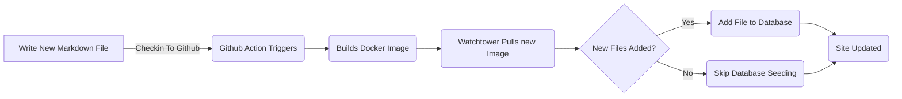

# Adding Entity Framework for Blog Posts (Pt 6)
<!--category-- ASP.NET, Entity Framework -->
<datetime class="hidden">2024-08-20T05:45</datetime>

# Introduction
Now that I have this blog running using Entity Framework I can add new posts and languages easily. I just add a new markdown file to the project and check it in. The GitHub action triggers and the site is updated.

In this post I'll cover a couple of small additions I made to this process and how it enables future enhancements. 

[TOC]

See parts [1](/blog/addingentityframeworkforblogpostspt1), [2](/blog/addingentityframeworkforblogpostspt2), [3](/blog/addingentityframeworkforblogpostspt3) , [4](/blog/addingentityframeworkforblogpostspt4) and [5](/blog/addingentityframeworkforblogpostspt5) for the previous steps.


# Background Updating
One of the issues I faced with moving to EF was keeping my process for updating the site while not delaying the site update. I wanted to keep the process of adding a new post as simple as possible.

In the previous parts I showed how I used a `MarkdownBlogService` to get the blog posts and languages. This service was injected into our controllers and views. This service was a simple service that read markdown files from disk and returned them as `BlogViewModels`.

The update process is as follows:



In order to allow background updating when the site starts in ASP.NET I use an  `IHostedService` to check for new files and add them to the database. 

It's super simple and all it does is below:
```csharp
public class BackgroundEFBlogUpdater(IServiceScopeFactory scopeFactory, ILogger<BackgroundEFBlogUpdater> logger) : IHostedService
{
    private Task _backgroundTask;
    public async Task StartAsync(CancellationToken cancellationToken)
    {
       
        var scope = scopeFactory.CreateScope();
        var context = scope.ServiceProvider.GetRequiredService<IBlogPopulator>();
        logger.LogInformation("Starting EF Blog Updater");
      
        _backgroundTask = Task.Run(async () =>    await  context.Populate(), cancellationToken);
       logger.LogInformation("EF Blog Updater Finished");
    }

    public async Task StopAsync(CancellationToken cancellationToken)
    {
        
    }
}
```
Note that one critical aspect here is that EF is very picky about it's scoping. I had to use `IServiceScopeFactory` to create a new scope for the service. This is because the service is a singleton and EF doesn't like being used in a singleton.
The use of the `IServiceScopeFactory` is a common pattern in ASP.NET Core when you need to use a scoped service in a singleton service.

I also had to use `Task.Run` to run the task in a new thread. This is because the `IHostedService` runs on the main thread and I didn't want to block the application from starting.


This is the `BackgroundEFBlogUpdater` class. It's injected using the `SetupBlog` extension method I showed before:
```csharp
    public static void SetupBlog(this IServiceCollection services, IConfiguration configuration, IWebHostEnvironment env)
    {
        var config = services.ConfigurePOCO<BlogConfig>(configuration.GetSection(BlogConfig.Section));
       services.ConfigurePOCO<MarkdownConfig>(configuration.GetSection(MarkdownConfig.Section));
       services.AddScoped<CommentService>();
        switch (config.Mode)
        {
            case BlogMode.File:
                Log.Information("Using file based blog");
                services.AddScoped<IBlogService, MarkdownBlogService>();
                services.AddScoped<IBlogPopulator, MarkdownBlogPopulator>();
                break;
            case BlogMode.Database:
                Log.Information("Using Database based blog");
                services.AddDbContext<MostlylucidDbContext>(options =>
                {
                    if (env.IsDevelopment())
                    {
                        options.EnableSensitiveDataLogging(true);
                    }
                    options.UseNpgsql(configuration.GetConnectionString("DefaultConnection"));
                });
                services.AddScoped<IBlogService, EFBlogService>();
            
                services.AddScoped<IBlogPopulator, EFBlogPopulator>();
                services.AddHostedService<BackgroundEFBlogUpdater>();
                break;
        }
        services.AddScoped<IMarkdownBlogService, MarkdownBlogPopulator>();

        services.AddScoped<MarkdownRenderingService>();
    }
```

Specifically this line `services.AddHostedService<BackgroundEFBlogUpdater>();`
In ASP.NET Core this starts a new HostedService that runs in the background. This service is started when the application starts and runs until the application stops.

This is a simple way to add background processing to your ASP.NET Core application.

# In Conclusion
In this post I showed how I added a background service to my ASP.NET Core application to update the database with new blog posts. This service runs when the application starts and adds any new files to the database.