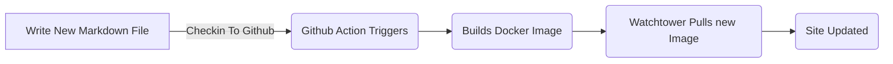
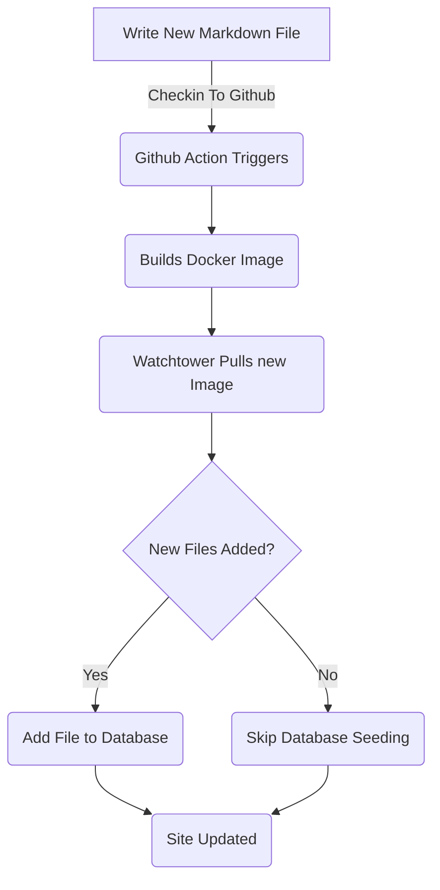

# Adding Entity Framework for Blog Posts (Part 5)
<!--category-- ASP.NET, Entity Framework -->
<datetime class="hidden">2024-08-18T01:20</datetime>

See parts [1](/blog/addingentityframeworkforblogpostspt1) and [2](/blog/addingentityframeworkforblogpostspt2) and [3](/blog/addingentityframeworkforblogpostspt3) and [4](/blog/addingentityframeworkforblogpostspt4) for the previous steps.

# Introduction

In previous parts we covered how to set up the database, how our controllers and views are structured, how our services worked, and how to seed the database with some initial data. In this part we'll cover details on how the EF Based services work and how we can use them in our controllers.

As usual you can see all the source for this on my GitHub [here](https://github.com/scottgal/mostlylucidweb/tree/main/Mostlylucid/Blog), in the Mostlylucid/Blog folder.

[TOC]

# Blog Services

## File Based Services
Previously we used a `MarkdownBlogService` to get our blog posts and languages. This service was injected into our controllers and views. This service was a simple service that read markdown files from disk and returned them as `BlogViewModels`.

This used a static Dictionary to hold the blog posts then returned results from that Dictionary.

```csharp
  public async Task<PostListViewModel> GetPagedPosts(int page = 1, int pageSize = 10, string language = EnglishLanguage)
    {
        var model = new PostListViewModel();
        var posts = GetPageCache().Where(x => x.Value.Language == language)
            .Select(x => GetListModel(x.Value)).ToList();
        model.Posts = posts.OrderByDescending(x => x.PublishedDate).Skip((page - 1) * pageSize).Take(pageSize).ToList();
        model.TotalItems = posts.Count();
        model.PageSize = pageSize;
        model.Page = page;
        return await Task.FromResult(model);
    }
```

This is the `GetPagedPosts` method from the `MarkdownBlogService`. This method gets the blog posts from the cache and returns them as a `PostListViewModel`. 

Using Files for storing Markdown files is still a good approach, it makes it simple to add posts (I just save markdown files to disk and check them in) and it's easy to manage. But we want to use the database to store the posts and languages.



## EF Based Services
In the [previous part]((/blog/addingentityframeworkforblogpostspt4) I showed how we seeded the database with the blog data. This updates each time we redeploy and restart the docker container ([using watchtower ](blog/dockercompose)) We used a `EFBlogPopulator` class to do this.

Now our flow looks like this
    


Now that we have the blog posts in our database we use the `EFBlogService` to supply the implementation for out `IBlogService` interface:

```csharp
public interface IBlogService
{
   Task<List<string>> GetCategories();
    Task<List<BlogPostViewModel>> GetPosts(DateTime? startDate = null, string category = "");
    Task<PostListViewModel> GetPostsByCategory(string category, int page = 1, int pageSize = 10, string language = MarkdownBaseService.EnglishLanguage);
    Task<BlogPostViewModel?> GetPost(string slug, string language = "");
    Task<PostListViewModel> GetPagedPosts(int page = 1, int pageSize = 10, string language = MarkdownBaseService.EnglishLanguage);
    
    Task<List<PostListModel>> GetPostsForLanguage(DateTime? startDate = null, string category = "", string language = MarkdownBaseService.EnglishLanguage);
}
```

This is the `IBlogService` interface. This is the interface that our controllers use to get the blog posts. The `EFBlogService` implements this interface and uses the `BlogContext` to get the data from the database.
As with out FileBased service [above](#file-based-services) we can get posts by category, by language, by date, and paged. 

### `GetPostList`

```csharp
    private async Task<PostListViewModel> GetPostList(int count, List<BlogPostEntity> posts, int page, int pageSize)
    {
        var languages = await NoTrackingQuery().Select(x =>
                new { x.Slug, x.LanguageEntity.Name }
            ).ToListAsync();

        var postModels = new List<PostListModel>();

        foreach (var postResult in posts)
        {
            var langArr = languages.Where(x => x.Slug == postResult.Slug).Select(x => x.Name).ToArray();

            postModels.Add(postResult.ToListModel(langArr));
        }

        var postListViewModel = new PostListViewModel
        {
            Page = page,
            PageSize = pageSize,
            TotalItems = count,
            Posts = postModels
        };

        return postListViewModel;
    }
```
Here we use our common `PostsQuery` but we add `NoTrackingQuery` which is a simple method that returns a queryable of the `BlogPostEntity` but with `AsNoTrackingWithIdentityResolution` added. This means that the entities are not tracked by the context and are read only. This is useful when we are just reading data and not updating it.


```csharp
     protected IQueryable<BlogPostEntity> PostsQuery()=>Context.BlogPosts.Include(x => x.Categories)
        .Include(x => x.LanguageEntity);
     
         private IQueryable<BlogPostEntity> NoTrackingQuery() => PostsQuery().AsNoTrackingWithIdentityResolution();
```
You can see that we also get the languages for the posts and then create a `PostListViewModel` which is a structure which accepts paging information (`Page`, `PageSize` and `TotalItems`) and is returned to the controller.


### `GetPost`
Our main method is the `GetPost` method which gets a single post by its `Slug` and `Language`. This is a simple method that uses the `PostsQuery` to get the post and then returns it as a `BlogPostViewModel`.
You can see that it also has an optional `Language` parameter which defaults to `EnglishLanguage` which is a constant in our `MarkdownBaseService` class.

```csharp
  public async Task<BlogPostViewModel?> GetPost(string slug, string language = "")
    {
        if (string.IsNullOrEmpty(language)) language =MarkdownBaseService.EnglishLanguage;
        var post = await NoTrackingQuery().FirstOrDefaultAsync(x => x.Slug == slug && x.LanguageEntity.Name == language);
        if (post == null) return null;
        var langArr = await GetLanguagesForSlug(slug);
        return post.ToPostModel(langArr);
    }
```

This also uses our common method `GetLanguagesForSlug` which gets the languages for a post. This is a simple method that returns the languages for a post.

```csharp
    private async Task<List<string>> GetLanguagesForSlug(string slug)=> await NoTrackingQuery()
        .Where(x => x.Slug == slug).Select(x=>x.LanguageEntity.Name).ToListAsync();
```

### `GetPostsByCategory`
This method gets the posts by category (like ASP.NET & Entity Framework for this post). It uses the `PostsQuery` to get the posts and then filters them by the category. It then returns the posts as a `PostListViewModel`.

```csharp
    public async Task<PostListViewModel> GetPostsByCategory(string category, int page = 1, int pageSize = 10,
        string language = MarkdownBaseService.EnglishLanguage)
    {
        
        var count = await NoTrackingQuery()
            .Where(x => x.Categories.Any(c => c.Name == category) && x.LanguageEntity.Name == language).CountAsync();
        var posts = await PostsQuery()
            .Where(x => x.Categories.Any(c => c.Name == category) && x.LanguageEntity.Name == language)
            .Skip((page - 1) * pageSize)
            .Take(pageSize)
            .ToListAsync();

        var languages = await GetLanguagesForSlugs(posts.Select(x => x.Slug).ToList());
        var postListViewModel = new PostListViewModel
        {
            Page = page,
            PageSize = pageSize,
            TotalItems = count,
            Posts = posts.Select(x => x.ToListModel(
                languages.FirstOrDefault(entry => entry.Key == x.Slug).Value.ToArray())).ToList()
        };
        return postListViewModel;
    }
```

# In Conclusion
You can see that the EF Based services are a bit more complex than the File Based services but they are more flexible and can be used in more complex scenarios. We can use the EF Based services in our controllers and views to get the blog posts and languages.
In future we'll build on these and add services like inline editing and comments.
We'll also look at how we might synchronize these across multiple systems. 