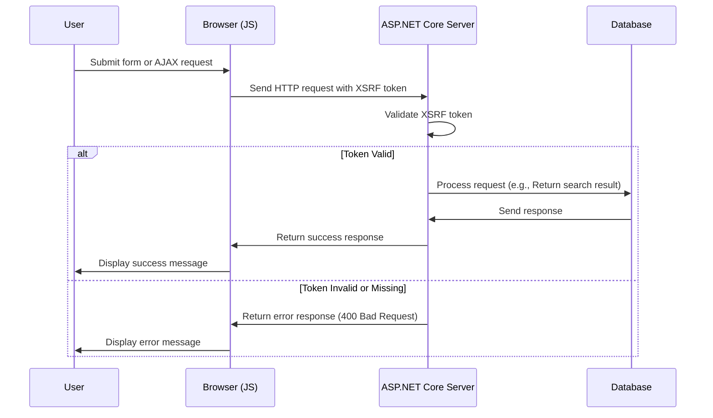

# Adding XSRF for JavaScript

<!--category-- ASP.NET, Javascript -->
<datetime class="hidden">2024-08-22T05:30</datetime>
## Introduction
When adding the search box in the [prior article](), we left out a critical security feature: XSRF protection. This article will cover how to add XSRF protection to the search box.

[TOC]

## What is XSRF?
XSRF stands for Cross-Site Request Forgery. It is a type of attack where a malicious website tricks a user into performing actions on another website. For example, a malicious website could trick a user into submitting a search query on our website. But more likely there could be a script run against our search endpoint bringing the site to a grinding halt.



## Configuration
To add Javascript XSRF we need to add a config setting to our `Program.cs` which tells the app to accept a header name for the XSRF token. This is done by adding the following code in `Program.cs`:

```csharp
services.AddAntiforgery(options =>
{
    options.HeaderName = "X-CSRF-TOKEN";
});
```

This tells the app to look for the `X-CSRF-TOKEN` header when validating the XSRF token.

### Adding the XSRF Token to the Search API
We also need to add an attribute on the API `[ValidateAntiForgeryToken]` this forces the use of this token.

## Adding the XSRF Token to the Search Box
In the search box, we need to add the XSRF token to the headers. We first add the tag to generate the token:

```razor
<div x-data="window.mostlylucid.typeahead()" class="relative" id="searchelement"  x-on:click.outside="results = []">
    @Html.AntiForgeryToken()
```

We then add the token to the headers in the JavaScript:
```javascript
    let token = document.querySelector('#searchelement input[name="__RequestVerificationToken"]').value;
console.log(token);
            fetch(`/api/search/${encodeURIComponent(this.query)}`, { // Fixed the backtick and closing bracket
                method: 'GET', // or 'POST' depending on your needs
                headers: {
                    'Content-Type': 'application/json',
                    'X-CSRF-TOKEN': token // Attach the AntiForgery token in the headers
                }
            })
                .then(response => response.json())
                .then(data => {
                    this.results = data;
                    this.highlightedIndex = -1; // Reset index on new search
                });

```
As you can see this gets the value of the token from the input field and adds it to the headers.

## In Conclusion
It's relatively simple to add XSRF protection to your JavaScript. It's a critical security feature that should be added to all your forms and API endpoints.