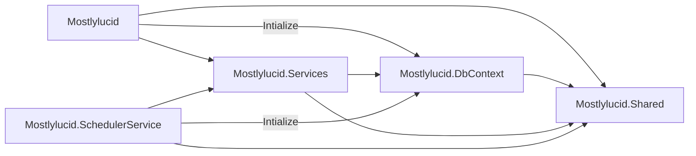

# A Newsletter Subscription Service Part 2 - Refactoring the Services (and a little Hangfire)

# Introduction
In [part 1 of this series](/blog/anewslettersubscriptionservicept1) I showed you how I created a new Newsletter Subscription page. In this part I'll cover how I restructured the solution to allow for sharing of Services and Models between the Website project (Mostlylucid) and the Scheduler Service project (Mostlylucid.SchedulerService).

[TOC]

<!--category-- ASP.NET, Hangfire, Email Newsletter -->
<datetime class="hidden">2024-09-23T10:45</datetime>

# The Projects
Originally I only had a single, monolithic project that contained all the code for the website. This is a decent approach for smaller applications, it gives you a simple to navigate, build and deploy solution; all of which are reasonable considerations. However as you scale up a solution you'll want to start splitting your project out to allow isolation of concerns and to allow for easier testing, navigation (big project with lots of bits can be tricky to navigate). 
Additionally splitting out the scheduler service makes sense for me as I can deploy this as a separate docker container allowing me to update the website without causing the scheduler to restart.

To do this I grouped the concerns logically into 5 projects. This is a common approach in ASP.NET applications. 

I can now add test projects for each of these and test them in isolation. This is a big advantage as it allows me to test the services without needing to spin up the whole application.

## Mostlylucid
This project is an ASP.NET Core (8) web project, it holds all the Controllers & Views to display pages to the user. 

## Mostlylucid.DbContext
This holds my main context definition used to interact with the database. Including the EF Core DbContext.

## Mostlylucid.Services
This is the main class library project that holds all the services that interact with the database / Markdown files / Email services etc.

## Mostlylucid.Shared
This is a class library project that holds all the shared models that are used by both the Mostlylucid and Mostlylucid.SchedulerService projects.

## Mostlylucid.SchedulerService
This is a Web application which controls the Hangfire service that runs the scheduled tasks as well as the endpoints to handle sending emails. 

The structure of this is shown below.
You can see that SchedulerService and the main Mostlylucid only use the DbContext class for initial setup.



As usual I use an extension method as the entryppoint for setting up the database.

```csharp
public static class Setup
{
    public static void SetupDatabase(this IServiceCollection services, IConfiguration configuration,
        IWebHostEnvironment env, string applicationName="mostlylucid")
    {
        services.AddDbContext<IMostlylucidDBContext, MostlylucidDbContext>(options =>
        {
            if (env.IsDevelopment())
            {
                options.EnableDetailedErrors(true);
                options.EnableSensitiveDataLogging(true);
            }
            var connectionString = configuration.GetConnectionString("DefaultConnection");
            var connectionStringBuilder = new NpgsqlConnectionStringBuilder(connectionString)
            {
                ApplicationName = applicationName
            };
            options.UseNpgsql(connectionStringBuilder.ConnectionString);
        });
    }
}
```

Apart from calling this method neither top level project has any dependencies on the DbContext project.

NOTE: It's important to avoid a race condition when  initializing DbContext (especially if you run migrations) to do this simply here I just added a dependency in my Docker Compose file to ensure that the main Mostlylucid project is up and running before starting my SchedulerService. This is added to the service definition for my SchedulerService in the docker-compose file.

```dockerfile
  depends_on:
      - mostlylucid 
  healthcheck:
      test: ["CMD", "curl", "-f", "http://mostlylucid:80/healthy"]
      interval: 30s
      timeout: 10s
      retries: 5
```
You can also accomplish this in other ways, for instance in the past when running multiple instances of the same app I've used [Redis](https://redis.io/) to set a lock flag which each instance checks before running migrations / other tasks ensuring only one instance can run at a time. 

Of course Redis also has many other uses; particularly with ASP.NET 8's new `IDistributedCache` interface which allows you to use Redis as a cache provider with tag based expiration.

# Hangfire setup
I chose to use Hangfire to handle my scheduling as it has convenient integration with ASP.NET Core and is easy to use.

For this in the SchedulerService project I added the following NuGet packages.

```bash
dotnet add package Hangfire.AspNetCore
dotnet add package Hangfire.PostgreSql
```
This means I can use Postgres as my store for the scheduled tasks.

Now I have Hangfire seetup I can start to add my scheduled jobs.

```csharp
public static class JobInitializer
{
    private const string AutoNewsletterJob = "AutoNewsletterJob";
    private const string DailyNewsletterJob = "DailyNewsletterJob";
    private const string WeeklyNewsletterJob = "WeeklyNewsletterJob";
    private const string MonthlyNewsletterJob = "MonthlyNewsletterJob";
    public static void InitializeJobs(this IApplicationBuilder app)
    {
      var scope=  app.ApplicationServices.CreateScope();
        var recurringJobManager = scope.ServiceProvider.GetRequiredService<RecurringJobManager>();
      
        recurringJobManager.AddOrUpdate<NewsletterSendingService>(AutoNewsletterJob,  x =>  x.SendNewsletter(SubscriptionType.EveryPost), Cron.Hourly);
        recurringJobManager.AddOrUpdate<NewsletterSendingService>(DailyNewsletterJob,  x =>  x.SendNewsletter(SubscriptionType.Daily), "0 17 * * *");
        recurringJobManager.AddOrUpdate<NewsletterSendingService>(WeeklyNewsletterJob,  x =>  x.SendNewsletter(SubscriptionType.Weekly), "0 17 * * *");
        recurringJobManager.AddOrUpdate<NewsletterSendingService>(MonthlyNewsletterJob,  x => x.SendNewsletter(SubscriptionType.Monthly), "0 17 * * *");
    }
}
```
Here you see I have a job for each `SubscriptionType` which is a flag that determines how often the newsletter is sent. I use the `Cron` class to set the frequency of the job.

As I have the option for day for both Monthly and Weekly subscriptions I set the time to 17:00 (5pm) as this is a good time to send newsletters (end of day in the UK and start in the US). 
I also have a job that runs every hour to send the newsletter to those who have subscribed to every post.

This then calls into a `SendNewsletter` method in the `NewsletterSendingService` class. Which I'll go into more detail in a later post.

# Dtos and Mapping
I use [DTOs](https://en.wikipedia.org/wiki/Data_transfer_object) to carry data between the layers of my application. This DOES add complexity as I need to map (often twice) the Entities to Dtos and then the Dtos to ViewModels (and back). However, I find this separation of concerns to be worth it as it allows me to change the underlying data structure without affecting the UI.

You can use approaches like AutoMapper / Mapster etc to do this mapping. Using these can also have significant performance advantages for .AsNoTracking() queries as you can map directly to the Dto and avoid the overhead of tracking changes. For example AutoMapper has an [IQueryable extension](https://docs.automapper.org/en/stable/Queryable-Extensions.html) method that allows you to map directly to the Dto in the query.

However in this case I decided just to add mapper extensions where I needed. This allows me to have more control over the mapping for each level (but is more work, especially if you have a lot of entities).

```csharp
public static class BlogPostEntityMapper
{
   public static BlogPostDto ToDto(this BlogPostEntity entity, string[] languages = null)
    {
        return new BlogPostDto
        {
            Id = entity.Id.ToString(),
            Title = entity.Title,
            Language = entity.LanguageEntity?.Name,
            Markdown = entity.Markdown,
            UpdatedDate = entity.UpdatedDate.DateTime,
            HtmlContent = entity.HtmlContent,
            PlainTextContent = entity.PlainTextContent,
            Slug = entity.Slug,
            WordCount = entity.WordCount,
            PublishedDate = entity.PublishedDate.DateTime,
            Languages = languages ?? Array.Empty<string>()
        };
    }
}
```
Here you can see I map the `BlogPostEntity` to my main `BlogPostDto` which is my transfer object.  
The aim is that the front end services don't know anything about the Entity object and are 'abstracted' from the underlying data structure.

In these top level services I then have code to map these Dtos to ViewModels which are then used in the Controllers.

```csharp
    public static PostListModel ToPostListModel(this BlogPostDto dto)
    {
        return new PostListModel
        {
            Id = dto.Id,
            Title = dto.Title,
            Language = dto.Language,
            UpdatedDate = dto.UpdatedDate.DateTime,
            Slug = dto.Slug,
            WordCount = dto.WordCount,
            PublishedDate = dto.PublishedDate,
            Languages = dto.Languages
        };
    }
    
    public static BlogPostViewModel ToViewModel(this BlogPostDto dto)
    {
        return new BlogPostViewModel
        {
            Id = dto.Id,
            Title = dto.Title,
            Language = dto.Language,
            Markdown = dto.Markdown,
            UpdatedDate = dto.UpdatedDate.DateTime,
            HtmlContent = dto.HtmlContent,
            PlainTextContent = dto.PlainTextContent,
            Slug = dto.Slug,
            WordCount = dto.WordCount,
            PublishedDate = dto.PublishedDate,
            Languages = dto.Languages
        };
    }
```

Again, using a Mapper tool can avoid this boilerplate code (and reduce errors) but I find this approach works well for me in this instance. 

Now I have all these models set up I can start adding controller methods to use them. 
I'll cover this flow in the next part.

# In Conclusion
We now have the structure allowing us to start offering newsletter subscriptions to our users.
This refactoring was slightly painful but it's a fact of life for most projects. Start simple and add architectural complication when required. 
Future posts will cover the rest of this, including a followup on my use of [FluentMail]() to send the emails and the Hosted Service...and maybe a little more Hangfire.