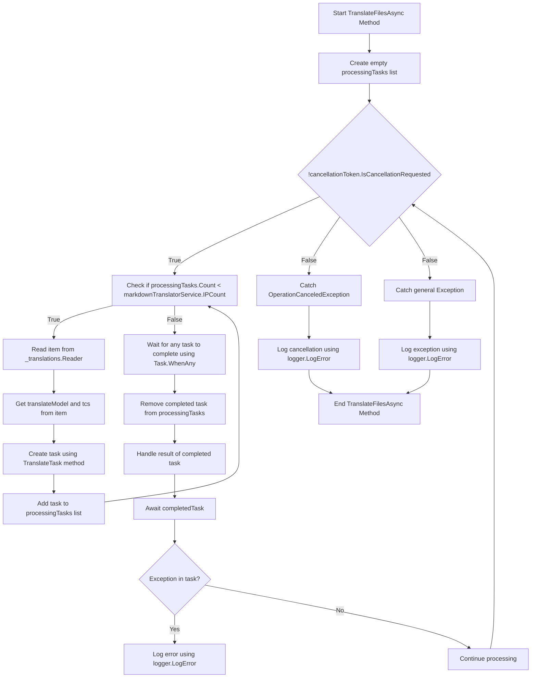

# Background Translations Pt. 2

<datetime class="hidden">2024-08-23T19:52</datetime>
<!--category-- EasyNMT, ASP.NET -->

## Introduction
In our previous post [here](/blog/backgroundtranslationspt1) we discussed how we can use EasyNMT to translate our `.md` files into different languages. We also discussed how we can surface this functionality to the user by adding a dropdown to the markdown editor. In this post we'll discuss how we can use a background service to handle the translation tasks.

[TOC]

## Docker Setup
The first thing we need to do is set up a docker container to run our translation service. We'll use the `EasyNMT` docker image which is available on Docker Hub. 

```yaml
  easynmt:
    image: easynmt/api:2.0.2-cpu
    volumes:
      - /mnt/easynmt:/cache/
    deploy:
      resources:
        limits:
          cpus: "4.0"
    networks:
      - app_network
```
Here we are setting up a service called `easynmt` which uses the `easynmt/api:2.0.2-cpu` image. We are also mounting a volume to store the translation cache. We are also setting resource limits to ensure that the service doesn't consume all the resources on the host machine (EasyNMT is a bit of a resource hog).

## Background Service
One issue is that EasyNMT can either take a bit to start up and/or go down randomly. So in our [BackgroundService](https://github.com/scottgal/mostlylucidweb/blob/main/Mostlylucid/MarkdownTranslator/BackgroundTranslateService.cs) we need to handle this.

### Startup

When starting the service we need to check if the EasyNMT service is running. If it isn't we freeze future processing until it is. We also need to handle the case where the service goes down (as it canm randomly).

```csharp
    private async Task<bool> StartupHealthCheck(CancellationToken cancellationToken)
    {
        var count = 1;
        var isUp = false;
        while (true)
        {
            if (await Ping(cancellationToken))
            {
                logger.LogInformation("Translation service is available");
                isUp = true;
                break;
            }

            await Task.Delay(10000, cancellationToken);
            count++;
            if (count > 3)
            {
                logger.LogError("Translation service is not available trying again (count: {Count})", count);
                _translations.Writer.Complete();
                await cancellationTokenSource.CancelAsync();
                isUp = false;
                break;
            }
        }

        return isUp;
    }

    private async Task PeriodicHealthCheck(CancellationToken cancellationToken)
    {
        // Run the health check periodically (e.g., every 60 seconds)
        const int delayMilliseconds = 60000;


        while (!cancellationToken.IsCancellationRequested)
        {
            try
            {
                if (!await Ping(cancellationToken))
                {
                    logger.LogError("Translation service is not available");
                    await cancellationTokenSource.CancelAsync();
                    _translations.Writer.Complete();
                    TranslationServiceUp = false;
                }
                else
                {
                    logger.LogInformation("Translation service is healthy");
                    TranslationServiceUp = true;
                }
            }
            catch (Exception ex)
            {
                TranslationServiceUp = false;
                logger.LogError(ex, "Error during service health check");
                await cancellationTokenSource.CancelAsync();
                _translations.Writer.Complete();
            }

            // Wait before checking again
            await Task.Delay(delayMilliseconds, cancellationToken);
        }
    }
    
        public async Task<bool> Ping(CancellationToken cancellationToken)
    {
        if (!await markdownTranslatorService.IsServiceUp(cancellationToken))
        {
            logger.LogError("Translation service is not available");
            return false;
        }

        return true;
    }

    
```
This mostly accounts for the EasyNMT lack of a health check endpoint. We just ping the service every 60 seconds to see if it's up. If it isn't we cancel the service and freeze future processing until it is.

```csharp
    private string[] IPs = translateServiceConfig.IPs;
    public async ValueTask<bool> IsServiceUp(CancellationToken cancellationToken)
    {
        var workingIPs = new List<string>();

        try
        {
            foreach (var ip in IPs)
            {
                logger.LogInformation("Checking service status at {IP}", ip);
                var response = await client.GetAsync($"{ip}/model_name", cancellationToken);
                if (response.IsSuccessStatusCode)
                {
                    workingIPs.Add(ip);
                }
            }

            IPs = workingIPs.ToArray();
            if (!IPs.Any()) return false;
            return true;
        }
        catch (Exception e)
        {
            logger.LogError(e, "Error checking service status");
            return false;
        }
    }
```
In the `IsServiceUp` method we ping all the available EasyNMT services to see if they are up. If any of them are we return `true` otherwise we return `false`. We also update the list of service IPs to only include the ones that are up. At home I have a few EasyNMT services running on different machines so this is useful for me (and makes translation a bit faster).

### API Updates
In the API we now check for the service being up before firing off a translate request:

```csharp
    [HttpPost("start-translation")]
    [ValidateAntiForgeryToken]
    public async Task<Results<Ok<string>, BadRequest<string>>> StartTranslation([FromBody] MarkdownTranslationModel model)
    {
        if(backgroundTranslateService.TranslationServiceUp)
        {
            return TypedResults.BadRequest("Translation service is down");
        }
        // Create a unique identifier for this translation task
        var taskId = Guid.NewGuid().ToString("N");
        var userId = Request.GetUserId(Response);
       
        // Trigger translation and store the associated task
        var translationTask = await backgroundTranslateService.Translate(model);
    
        var translateTask = new TranslateTask(taskId, model.Language, translationTask);
        translateCacheService.AddTask(userId, translateTask);

        // Return the task ID to the client
        return TypedResults.Ok(taskId);
    }
```

### Translate Method
We've now switched to using `Channels` for our translate queue; it's just a better version of the `BufferBlock` we used previously (better performance, less memory etc).

```csharp
    private readonly
        Channel<(PageTranslationModel, TaskCompletionSource<TaskCompletion>)>
        _translations = Channel.CreateUnbounded<(PageTranslationModel, TaskCompletionSource<TaskCompletion>)>();

    public async Task<Task<TaskCompletion>> Translate(MarkdownTranslationModel message)
    {
        // Create a TaskCompletionSource that will eventually hold the result of the translation
        var translateMessage = new PageTranslationModel
        {
            Language = message.Language,
            OriginalFileName = "",
            OriginalMarkdown = message.OriginalMarkdown,
            Persist = false
        };

        return await Translate(translateMessage);
    }

    private async Task<Task<TaskCompletion>> Translate(PageTranslationModel message)
    {
        // Create a TaskCompletionSource that will eventually hold the result of the translation
        var tcs = new TaskCompletionSource<TaskCompletion>();
        // Send the translation request along with the TaskCompletionSource to be processed
        await _translations.Writer.WriteAsync((message, tcs));
        return tcs.Task;
    }
```
You can see that this uses a `TaskCompletionSource` to hold the result of the translation. We then send the translation request along with the `TaskCompletionSource` to be processed with `await _translations.Writer.WriteAsync((message, tcs));` then return the `TaskCompletion` task to the API allowing it to be cached.

### Translation Loop
The main 'loop' inside our `IHostedService` is responsible for processing any translation requests that come in. The diagram is a little scary but it's not that bad.

In the 



In order to streamline translations we create a loop which only tries to process as many translations at a time as we have EasyNMT services running. This is to prevent the service from being overwhelmed.

For each of these we then spin up a new Translation Task 
```csharp
 TranslateTask(cancellationToken, translateModel, item, tcs);
 ```

We then use `Task.WhenAny` to wait for any of the tasks to complete. We then remove the completed task from the list and handle the result of the completed task. If there is an exception we log it and continue processing.

Then we start the loop again until the service is cancelled.

```csharp
    private async Task TranslateFilesAsync(CancellationToken cancellationToken)
    {
        try
        {
            var processingTasks = new List<Task>();
            while (!cancellationToken.IsCancellationRequested)
            {
                while (processingTasks.Count < markdownTranslatorService.IPCount &&
                       !cancellationToken.IsCancellationRequested)
                {
                    var item = await _translations.Reader.ReadAsync(cancellationToken);
                    var translateModel = item.Item1;
                    var tcs = item.Item2;
                    // Start the task and add it to the list
                    var task = TranslateTask(cancellationToken, translateModel, item, tcs);
                    processingTasks.Add(task);
                }

                // Wait for any of the tasks to complete
                var completedTask = await Task.WhenAny(processingTasks);

                // Remove the completed task
                processingTasks.Remove(completedTask);

                // Optionally handle the result of the completedTask here
                try
                {
                    await completedTask; // Catch exceptions if needed
                }
                catch (Exception ex)
                {
                    logger.LogError(ex, "Error translating markdown");
                }
            }
        }

        catch (OperationCanceledException)
        {
            logger.LogError("Translation service was cancelled");
        }
        catch (Exception e)
        {
            logger.LogError(e, "Error translating markdown");
        }
    }
```

### Processing

The 'meat' of this processing is handled in `TranslateTask` which is responsible for translating the markdown and persisting it if needed (I use this for translating files and in future for saving translated articles back to the DB).

I first check whether the original entry has changed;either using a file hash of the original file contents / just checking the UpdatedDate of the blog entry against the translated ones. If it hasn't changed I skip the translation. If it has changed I translate the markdown and persist it if needed.

I then call in to the main Translate method of the `MarkdownTranslatorService` to do the translation.
See how I do this [here](/blog/autotranslatingmarkdownfiles).
This returns the translated markdown which I then persist if needed.
I then set the `tcs` result to the translated markdown and set it as complete.

```csharp
private async Task TranslateTask(CancellationToken cancellationToken, PageTranslationModel translateModel,
        (PageTranslationModel, TaskCompletionSource<TaskCompletion>) item,
        TaskCompletionSource<TaskCompletion> tcs)
    {
        var scope = scopeFactory.CreateScope();

        var slug = Path.GetFileNameWithoutExtension(translateModel.OriginalFileName);
        if (translateModel.Persist)
        {
            if (await EntryChanged(scope, slug, translateModel))
            {
                logger.LogInformation("Entry {Slug} has changed, translating", slug);
            }
            else
            {
                logger.LogInformation("Entry {Slug} has not changed, skipping translation", slug);
                tcs.SetResult(new TaskCompletion(null, translateModel.Language, true, DateTime.Now));
                return;
            }
        }


        logger.LogInformation("Translating {File} to {Language}", translateModel.OriginalFileName,
            translateModel.Language);
        try
        {
            var translatedMarkdown =
                await markdownTranslatorService.TranslateMarkdown(translateModel.OriginalMarkdown,
                    translateModel.Language, cancellationToken);


            if (item.Item1.Persist)
            {
                await PersistTranslation(scope, slug, translateModel, translatedMarkdown);
            }

            tcs.SetResult(new TaskCompletion(translatedMarkdown, translateModel.Language, true, DateTime.Now));
        }
        catch (Exception e)
        {
            logger.LogError(e, "Error translating {File} to {Language}", translateModel.OriginalFileName,
                translateModel.Language);
            tcs.SetException(e);
        }
    }
```

## In Conclusion
So that's it, this is how I handle background translations in my blog. I've been using this for a  month or so now and it's been working well. While it looks daunting in reality the code is pretty straightforward. I hope this helps you in your own projects.