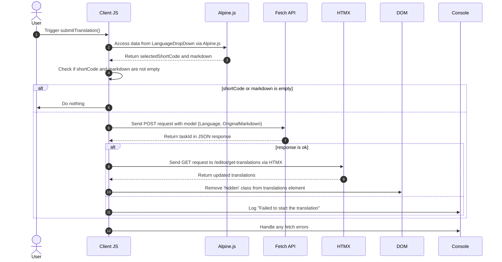

# Background Translations Pt. 3

<datetime class="hidden">2024-08-25T03:20</datetime>
<!--category-- EasyNMT, ASP.NET -->

## Introduction
In previous articles, we have discussed the importance of translation in the context of web applications. We have also explored the use of the EasyNMT library to perform translations in an ASP.NET Core application. In this post I'll cover how I added a background service to the application to allow you to submit translation request~~~~s that are processed in the background.

Again, you can see all the source code for this on my [GitHub](https://github.com/scottgal/mostlylucidweb) page.

### Previous Articles
- [Background Translations Pt. 1](/blog/backgroundtranslationspt1)
- [Background Translations Pt. 2](/blog/backgroundtranslationspt2)

Here we add a little tool which submits backround jobs to the service we detailed in part 2. This tool is a simple form that allows you to submit a translation request to the service. It's then cached and added to a queue giving you information on the status of the translation.

[TOC]


## Translation Submitter
On our Markdown editor page I added some code which contains a little drop down (in `_LanguageDropDown.cshtml`) which allows you to select the language you want to translate to. 

```razor
        @if (Model.IsNew)
                {
                    var translationHidden = Model.TranslationTasks.Any() ? "" : "hidden";
              
                    <p class="text-blue-dark dark:text-blue-light inline-flex  items-center justify-center space-x-2">
                        <partial name="_LanguageDropDown" for="Languages"/>
                        <button class="btn btn-outline btn-sm mt-1" x-on:click="window.mostlylucid.translations.submitTranslation"><i class='bx bx-send'></i>Translate</button>
                    </p>
                    <div id="translations" class="@translationHidden">
                        <partial name="_GetTranslations" model="Model.TranslationTasks" />
                    </div>
                    <div id="translatedcontent" class="hidden">
                        <textarea class="hidden" id="translatedcontentarea"></textarea>
                    </div>
                }
```

### SubmitTranslation

You'll see that this has some Apline.js code which calls into our `window.mostlylucid.translations.submitTranslation` function. This function is defined in our `translations.js` file which is included in our `_Layout.cshtml` file.

```javascript
export function submitTranslation() {
    const languageDropDown = document.getElementById('LanguageDropDown');

    // Access Alpine.js data using __x.$data (Alpine.js internal structure)
    const alpineData = Alpine.$data(languageDropDown);
const shortCode = alpineData.selectedShortCode;
const markdown = simplemde.value();
if (shortCode === '' || markdown === '') return;
    
    // Create the data object that matches your model
    const model = {
        Language: shortCode,
        OriginalMarkdown: markdown
    };

// Perform the fetch request to start the translation using POST
    fetch('/api/translate/start-translation', {
        method: 'POST',
        headers: {
            'Content-Type': 'application/json'  // The content type should be JSON
        },
        body: JSON.stringify(model)  // Send the data object as JSON
    })
        .then(function(response) {
            if (response.ok) {
                // Process the returned task ID
                return response.json();  // Parse the JSON response (assuming the task ID is returned in JSON)
            } else {
                console.error('Failed to start the translation');
            }
        })
        .then(function(taskId) {
            if (taskId) {
                console.log("Task ID:", taskId);

                // Trigger an HTMX request to get the translations after saving
                htmx.ajax('get', "/editor/get-translations", {
                    target: '#translations',  // Update this element with the response
                    swap: 'innerHTML',        // Replace the content inside the target
                }).then(function () {
                    // Remove the hidden class after the content is updated
                    document.getElementById('translations').classList.remove('hidden');
                });
            }
        })
        .catch(function(error) {
            // Handle any errors that occur during the fetch
            console.error('An error occurred:', error);
        });
```

#### Sequence Diagram
This code is described in the following sequence diagram:



Although this looks like a lot of code, it's actually quite simple. 
1. We send a POST request to the server with the language and markdown content. This goes to an endpoint called `start-translation` which is defined in our `TranslationAPI`. This starts off the translation task and adds this task to the Cache for this user.

2. The server responds with a task Id (which we log but don't use)

3. We then send a GET request to the server to get the translations. This is done using HTMX which is a library that allows you to update parts of the page without a full page refresh. This is a very powerful tool and is used in many places in this application.

### The Start Translation Endpoint
This is a WebAPI controller which takes requests containing markdown and a language code. It then sends the request to our background translation server, caches the task agains tthe UserId (contained in a cookie) and returns the task Id to the client.
(I disabled the ValidateAntiForgeryToken attribute for now as I'm not using it)

```csharp
    [HttpPost("start-translation")]
   // [ValidateAntiForgeryToken]
    public async Task<Results<Ok<string>, BadRequest<string>>> StartTranslation([FromBody] MarkdownTranslationModel model)
    {
        if(ModelState.IsValid == false)
        {
            return TypedResults.BadRequest("Invalid model");
        }
        if(!backgroundTranslateService.TranslationServiceUp)
        {
            return TypedResults.BadRequest("Translation service is down");
        }
        // Create a unique identifier for this translation task
        var taskId = Guid.NewGuid().ToString("N");
        var userId = Request.GetUserId(Response);
       
        // Trigger translation and store the associated task
        var translationTask = await backgroundTranslateService.Translate(model);
    
        var translateTask = new TranslateTask(taskId, DateTime.Now,  model.Language, translationTask);
        translateCacheService.AddTask(userId, translateTask);

        // Return the task ID to the client
        return TypedResults.Ok(taskId);
    }

```

### The Get Translations Endpoint
This is requested using HTMX and returns the translations for the current user. This is a simple endpoint which gets the translations from the cache and returns them to the client.

```csharp
    [HttpGet]
    [Route("get-translations")]
    public IActionResult GetTranslations()
    {
        var userId = Request.GetUserId(Response);
        var tasks = translateCacheService.GetTasks(userId);
        var translations = tasks.Select(x=> new TranslateResultTask(x, false)).ToList();
        return PartialView("_GetTranslations", translations);
    }
    
```
### The Get Translations Partial View
This is a simple view which uses HTMX to poll the server every 5 seconds to get the translations for the current user. It displays a table of translations with a link to view the translation.

It also has handling for when all translations are complete to stop the polling (by setting the trigger to `none`). And to display an alternative  message when there are no translations.

I also use the Humanizer library to display the time taken to complete the translation in a human readable format.

This results in this view:


```razor
@using Humanizer
@using Mostlylucid.Helpers
@model List<Mostlylucid.MarkdownTranslator.Models.TranslateResultTask>

@{
    var allCompleted = Model.All(x => x.Completed);
    var noTranslations = Model.Count == 0;
    var trigger = allCompleted ? "none" : "every 5s";
    if (noTranslations)
    {
        <div class="alert alert-info" role="alert">
            No translations have been requested yet.
        </div>
    }
    else
    {
        <div class="translationpoller" hx-controller="Editor" hx-action="GetTranslations" hx-get hx-swap="outerHTML" hx-trigger="@trigger">
            <table class="table">
                <thead>
                <th>
                  
                    @Html.DisplayNameFor(model => model[0].TaskId)
                </th>
                <th>
                    @Html.DisplayNameFor(model => model[0].Completed)
                </th>
                <th >
                    @Html.DisplayNameFor(model => model[0].Language)
                </th>
                <th>
                    @Html.DisplayNameFor(model => model[0].TotalMilliseconds)
                </th>
                </thead>
                @foreach (var item in Model)
                {
                    <tr>
                        <td>  <a href="#" x-on:click.prevent="window.mostlylucid.translations.viewTranslation('@item.TaskId')">View</a></td>
                        <td>@if (item.Completed)
                            {
                                <i class='bx bx-check text-green'></i>
                            }
                            else
                            {
                                <i class='bx bx-loader-alt animate-spin dark:text-white text-black'></i>
                            }
                            </td>
                        <td>
                            <p class="flex items-center">
                                
                                @item.Language.ConvertCodeToLanguage()
                            </p>

                        </td>
                        <td>@(TimeSpan.FromMilliseconds(item.TotalMilliseconds).Humanize())</td>
                    </tr>
                }
            </table>
        </div>
    }
}
```

### The View Translation Function
As you'll see in the above view we call into a little Alping onclick to view the translation. This is a simple function which gets the translation from the server and displays it in a modal dialog.
```razor
 <a href="#" x-on:click.prevent="window.mostlylucid.translations.viewTranslation('@item.TaskId')">View</a>
```

Which calls into this. All it does  is get the populated transaltion from the server and displays it in the page. 

```javascript

export function viewTranslation(taskId) {
    // Construct the URL with the query parameters
    const url = `/api/translate/get-translation/${taskId}`;

    // Fetch call to the API endpoint
    fetch(url, {
        method: 'GET',
        headers: {
            'Accept': 'application/json'  // Indicate that we expect a JSON response
        }
    })
        .then(response => {
            if (!response.ok) {
                throw new Error(`HTTP error! Status: ${response.status}`);
            }
            return response.json();
        })
        .then(data =>

        {
            let translatedContentArea = document.getElementById("translatedcontent")
            translatedContentArea.classList.remove("hidden");
            let textArea = document.getElementById('translatedcontentarea');
            textArea.classList.remove('hidden');
            textArea.value = data.originalMarkdown;
            simplemde.value(data.translatedMarkdown);
        })  // Log the successful response data
        .catch(error => console.error('Error:', error));  // Handle any errors
}

```

### The Get Translation Endpoint
This is similar to the earlier method to get a list of the translations except it gets a single translation with the `OriginalMarkdown` and `TranslatedMarkdown` populated:

```csharp
    [HttpGet]
    [Route("get-translation/{taskId}")]
    public Results<JsonHttpResult<TranslateResultTask>, BadRequest<string>> GetTranslation(string taskId)
    {
        var userId = Request.GetUserId(Response);
        var tasks = translateCacheService.GetTasks(userId);
        var translationTask = tasks.FirstOrDefault(t => t.TaskId == taskId);
        if (translationTask == null) return TypedResults.BadRequest("Task not found");
        var result = new TranslateResultTask(translationTask, true);
        return TypedResults.Json(result);
    }
```

## In Conclusion
The result of all this is that you can now submit a translation request and see the status of the translation in the editor after it's complete. I'll go into further detail on how the translation service works in the next post.

I have more I want to do here including re-hooking up the Render Markdown flow for the translated content etc. But that;'s the fun  of this  site; not everythign is completely polished but it's all real code you can play with as I build it out. 
Again, you can see all the source code for this on my [GitHub](https://github.com/scottgal/mostlylucidweb) page. So please go look at that if you want to see more.