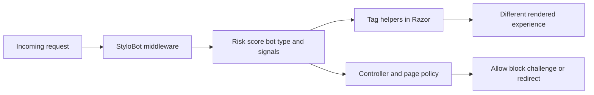
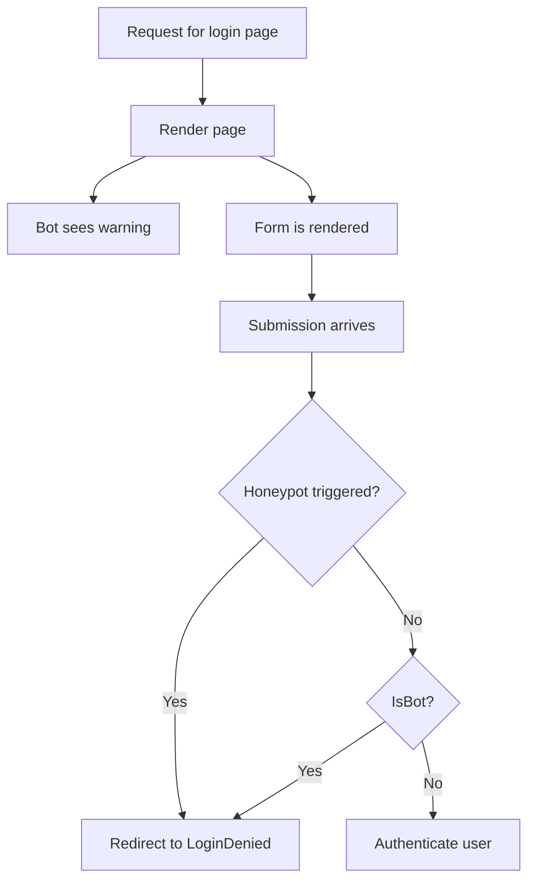
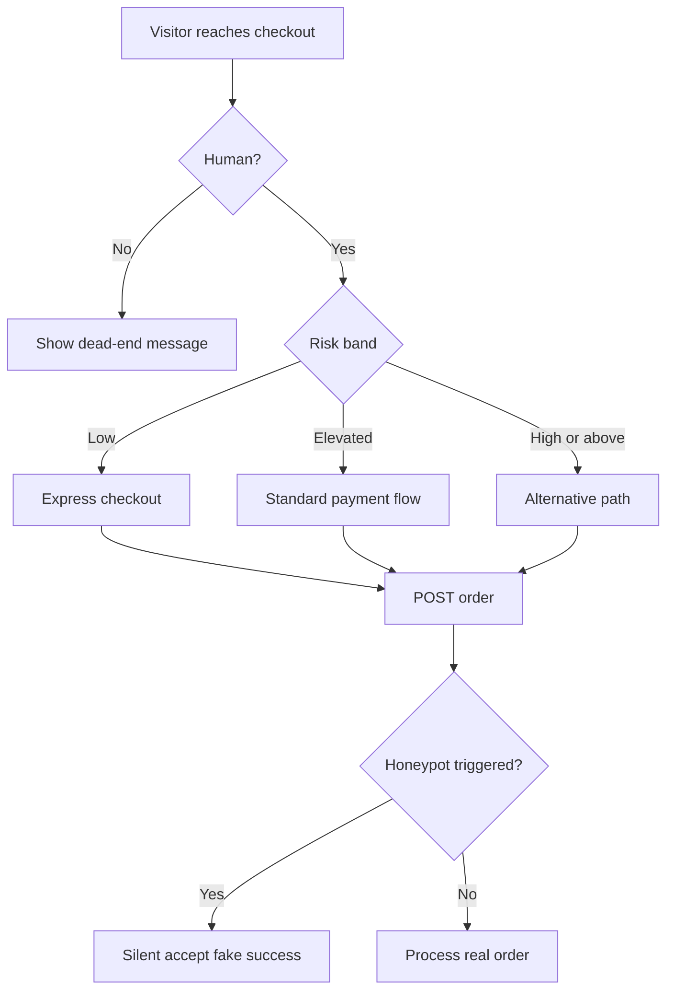

# StyloBot Release Series: Behaviour-Aware ASP.NET UI

*Bot detection should not stop at allow/block. This post shows how StyloBot's classification result becomes application logic in ASP.NET - tag helpers in Razor, action filters and policies in controllers, signal-level gating - so your UI can shape the experience instead of bolting friction on after the fact.*

> ## DRAFT
> This is a working draft in the StyloBot Release Series. Structure, examples, and API details may still change before final release.

> **StyloBot Release Series**
>
> 1. [**Behaviour, Not Identity**](/blog/stylobot-fingerprint) - why StyloBot models clients behaviourally
> 2. **Behaviour-Aware ASP.NET UI** - the server-rendered surface over that detection result
> 3. [**Finding and Fixing Unbounded Growth in Long-Running .NET Services**](/blog/stylobot-release-reliability) - the reliability discipline that keeps the engine boring in production
> 4. [**Behaviour-Aware TypeScript UI**](/blog/typescript-sdk) - Express, Fastify, and browser components
> 5. [**The Sidecar Architecture**](/blog/sidecar-architecture) - how the detection engine connects to non-.NET stacks

StyloBot UI is the ASP.NET surface over StyloBot's detection result. Its job is simple: make bot and risk classification available where web applications actually need it, in Razor views, forms, controllers, and page flows.

<!--category-- ASP.NET, StyloBot, Bot Detection, Security, Architecture -->
<datetime class="hidden">2026-05-02T10:30</datetime>

# Introduction

Most UX systems are blind. They render the same page to everyone, then try to recover later with middleware, CAPTCHAs, or a 403.

This post is the second entry in the StyloBot release series. [Behaviour, Not Identity](/blog/stylobot-fingerprint) covered the model underneath the system. This one covers the ASP.NET surface that turns that model into application behaviour.

Assume detection already exists. Assume the current request already has a classification result attached to it. The interesting question is what your UI can do with that while the page is being built.

That is what StyloBot UI is for. It gives ASP.NET a clean surface over the detection result so Razor views, controllers, and page handlers can use it directly.

So instead of bolting friction on after the fact, you can shape the experience at render time:

- show different content to humans and bots
- hide high-value UI from suspicious sessions
- add friction to risky flows before they become abuse
- keep enforcement in controllers while the page stays context-aware

This article is specifically about that ASP.NET surface: tag helpers, page-level gating, and server-side integration. It follows [Behaviour, Not Identity](/blog/stylobot-fingerprint), which explains the behavioural model underneath it. The next article will cover the JavaScript and client-side surface.

[TOC]

# The ASP.NET Surface

The core idea is simple: detection should not stop at "allow" or "block." In a web app, it should be available to the UI itself.

That means:

- Razor can render different content for humans, bots, and specific bot types
- forms can include layered defences like honeypots as part of the page, not as a separate security system
- controllers can enforce the same detection result the UI already used
- your ASP.NET app can react to what the request is doing, not just who the session claims to be

If you want the detection engine story, that is already covered in [Part 2](/blog/botdetection-part2-signature-pipeline-and-stylobot-architecture) and [Part 3](/blog/botdetection-part3-as-simple-as-possible). This article starts one layer above that: once detection is already there, how do you expose it cleanly to ASP.NET?



## Why This Surface Matters

Without a UI surface, detection stays trapped in infrastructure.

You can log a score. You can maybe block a request. But you cannot easily say:

- show the catalogue but hide the offer
- render the login form differently for high-risk traffic
- let search bots see crawl-friendly metadata without handing over every commercial signal
- treat AI crawlers as a licensing conversation rather than a broken form submission

That is why the surface matters. It turns detection into application logic.

Sometimes the right answer is a block. Often it is something subtler:

- hide discount codes from price scrapers
- remove express checkout from elevated-risk sessions
- serve search metadata without exposing commercial signals
- silently discard newsletter signups from automation
- add friction to suspicious logins without punishing normal users

This is the differentiator in StyloBot UI. The detection engine gives you the verdict; the ASP.NET surface lets you do something useful with it at the page and flow level.

## The storefront example

This article walks through a sample ASP.NET Core MVC storefront that uses StyloBot UI helpers across six pages: the home page, product page, checkout, login, newsletter signup, and a self-diagnostics page.

The sample app is intentionally small: generated products, a few categories, checkout, newsletter, and login. The point is not the commerce logic. The point is showing how bot classification becomes application logic.

Install the packages:

```bash
dotnet add package Mostlylucid.BotDetection
dotnet add package Mostlylucid.BotDetection.UI
```

Then wire StyloBot up in `Program.cs`:

```csharp
builder.Services.AddStyloBot(
    configureDashboard: dashboard =>
    {
        dashboard.BasePath = "/_stylobot";
        dashboard.AllowUnauthenticatedAccess = true; // dev only
    },
    configureDetection: detection =>
    {
        detection.ExcludeLocalIpFromBroadcast = false;
    });

// ...

app.UseStyloBot();
app.MapHub<StyloBotDashboardHub>("/_stylobot/hub");
```

That is enough to start classifying requests and exposing the result to Razor, controllers, and the live dashboard. If you want the bare-minimum integration story, [Part 3 covers that in more detail](/blog/botdetection-part3-as-simple-as-possible).

## A quick example: login as layered defence

The login page is a good micro-example because it shows the whole model in a few lines.



```html
<!-- Layer 1: bots see a deterrent message before the form -->
<sb-bot>
    <div class="alert alert-warning">Automated login attempts are detected and blocked.</div>
</sb-bot>

<form method="post" action="/Account/Login">
    <!-- Layer 2: hidden trap fields - humans leave them blank; bots fill everything -->
    <sb-honeypot prefix="hp" fields="2"></sb-honeypot>

    <input type="email" name="email" />
    <input type="password" name="password" />
    <button type="submit">Sign In</button>
</form>
```

```csharp
// Layer 3: server-side final check before any processing
if (HoneypotValidator.IsTriggered(HttpContext) || HttpContext.IsBot())
    return RedirectToAction("LoginDenied");
```

The bot sees a warning, then trips the honeypot if it submits, then gets rejected server-side if it somehow bypasses the earlier layers. Each layer is small. Together they create defence in depth without a CAPTCHA-first experience for everyone.

The rest of this post expands that idea across a realistic storefront.

---

## The cost of not knowing who is in your shop

The main commercial problem is not "bots" in the abstract. It is that different kinds of automation cause different kinds of damage.

**Price scrapers.** They harvest product names, prices, descriptions, and stock data so competitors can reprice against you in near real time.

**Voucher testers.** They brute-force discount code spaces until they find valid codes, which then get posted to coupon forums and erode margin.

**Credential stuffers.** They replay leaked username-password pairs at scale. Even low hit rates become account takeover events when the volume is high.

**AI training crawlers.** They harvest descriptions, reviews, and editorial copy for model training. That is not the same threat model as a checkout attacker, but it is still extraction.

**Newsletter harvesters.** They probe signup forms to validate email addresses, poison mailing lists, or test for injection weaknesses.

These are not the same problem, so a single block-everything strategy is the wrong abstraction. Behaviour-aware gating lets you respond proportionally.

---

## Page 1: The shop floor

The home page is where many scrapers start. They want the catalogue. You want the catalogue usable for humans and indexable for search, but less commercially valuable to automated harvesting.

*Scenario: a price scraper hits `/`; it sees a neutral catalogue message, no welcome copy, and no category count.*

```html
<!-- Human visitors see the welcome message and category count -->
<sb-human>
    <p class="muted">Welcome! Browse @Model.Count products.</p>
</sb-human>

<!-- Bots see a neutral, non-committal message -->
<sb-bot fallback="hide">
    <p class="muted">Product catalogue.</p>
</sb-bot>

<!-- Search engine crawlers get structured metadata, not price data -->
<sb-gate bot-type="SearchEngine">
    <meta name="description" content="@Model.Count products across @categories categories." />
</sb-gate>

<!-- Verified bots (Googlebot etc.) see a specific indicator -->
<sb-gate bot-type="VerifiedBot">
    <div class="alert alert-info">Verified crawler detected. Serving crawl-optimised view.</div>
</sb-gate>

<!-- High-risk sessions see friction before the buy buttons -->
<sb-gate min-risk="High">
    <div class="alert alert-warning">Additional verification may be required at checkout.</div>
</sb-gate>
```

These are rendering hints, not access controls. The page still works. What changes is the context around it. That makes the page less useful to systematic harvesting without degrading the customer experience.

This is also where crawler differentiation matters. You do want Googlebot indexing products. You may not want every automated client to receive the same commercial presentation as a human shopper. Behaviour-aware rendering lets you separate "indexable" from "valuable."

---

## Page 2: The product page

The product detail page is where commercial intent becomes explicit. It is also where price scrapers and voucher hunters look for the signals they care about.

*Scenario: a price scraper lands on `/Product/Detail/12`; it sees no discount code, no add-to-cart button, and no purchase signal to act on.*

```html
<!-- Exclusive discount - only shown to low-risk, verified human visitors -->
<sb-gate max-risk="Low">
    <div class="alert alert-success">
        Member discount: use code LOYAL10 for 10% off today.
    </div>
</sb-gate>

<!-- Medium-risk visitors get a friction signal before the cart button -->
<sb-gate min-risk="Medium">
    <div class="alert alert-warning">
        We noticed some unusual activity from your network.
        You can still purchase - you may be asked to verify at checkout.
    </div>
</sb-gate>

<!-- Datacenter/VPN visitors lose the buy button -->
<sb-signal signal="ip.is_datacenter" condition="true">
    <p class="muted">Purchase unavailable from datacenter or VPN networks.</p>
</sb-signal>

<!-- Human-only: the add-to-cart button -->
<sb-gate human-only>
    <form method="post" action="/Cart/Add">
        <button type="submit" class="btn btn-success">Add to Cart</button>
    </form>
</sb-gate>

<!-- Detection mini-card for transparency -->
<sb-summary variant="card"></sb-summary>
<sb-confidence display="bar" width="180px"></sb-confidence>
```

Three useful patterns show up here.

**Loyalty targeting.** Good offers should go to good sessions. Showing discounts only to low-risk traffic reduces waste and lowers the chance that scrapers or voucher bots lift the offer.

**Progressive friction.** Medium-risk does not automatically mean "block." Shared networks, privacy browsers, and VPNs all create false positives. A warning often preserves the sale better than hard denial.

**Signal-level gating.** `ip.is_datacenter` is a raw signal, not a risk band. Sometimes the policy you care about is not "how risky is this visitor overall?" but "does this specific property violate a business rule?"

If you want the architecture behind those signals, [Part 2 covers the staged detection pipeline](/blog/botdetection-part2-signature-pipeline-and-stylobot-architecture).

That distinction runs through the rest of the sample: risk bands shape broad UX decisions, while individual signals handle narrower policy rules.

---

## Page 3: Checkout

Checkout is the highest-value target on the site. Fraud automation, card testing, voucher abuse, and scripted retries all converge here.

*Scenario: a voucher-testing bot hits `/Cart/Checkout`; it sees a dead-end message, submits a honeypot-filled form, and gets a silent accept with no retry incentive.*



```html
<!-- Gate the entire checkout form on human-only detection -->
<sb-gate human-only>
    <form method="post" action="/Cart/Order">
        @Html.AntiForgeryToken()

        <!-- Honeypot trap fields - invisible to humans, irresistible to bots -->
        <sb-honeypot prefix="co" fields="2"></sb-honeypot>

        <!-- Express checkout only for trusted visitors -->
        <sb-gate max-risk="Low">
            <button type="submit" name="express" value="true" class="btn btn-success">
                Express Checkout
            </button>
        </sb-gate>

        <!-- Standard checkout available up to elevated risk -->
        <sb-gate max-risk="Elevated">
            <button type="submit" class="btn btn-primary">Proceed to Payment</button>
        </sb-gate>

        <!-- High-risk visitors get an alternative path -->
        <sb-gate min-risk="High">
            <p>Please call us to complete your order: 0800 123 456</p>
        </sb-gate>
    </form>
</sb-gate>

<!-- Bots see a dead end, not an error -->
<sb-bot>
    <p class="muted">Checkout is only available to human visitors.</p>
</sb-bot>
```

And in the controller:

```csharp
[HttpPost]
public IActionResult Order(OrderModel model)
{
    if (HoneypotValidator.IsTriggered(HttpContext))
    {
        // Silent accept - bot thinks the order succeeded
        return RedirectToAction("Confirmed");
    }

    return ProcessOrder(model);
}
```

This page shows three techniques working together.

**Honeypot discard.** If a bot fills hidden fields, you silently accept and drop the request. Error feedback helps attackers iterate; silence wastes their time.

**Risk-tiered CTAs.** Express checkout is a trust benefit, not a default right. Suspicious sessions can still buy, but through a slower path.

**Graceful degradation.** A plain message is often operationally better than a hard error. Bots rarely care about prose; operators and monitoring systems care a lot about 403s.

---

## Page 4: Login

Login is a different kind of high-value page. The goal is not cart abuse but account access, which changes the trade-offs.

*Scenario: a credential-stuffing script hits `/Account/Login`; it never sees the form, fills the honeypot, and gets bounced to `LoginDenied`.*

```html
<!-- High-risk sessions see friction before the form -->
<sb-gate min-risk="High">
    <div class="alert alert-danger">
        High-risk signals detected. Login attempts are logged and may be blocked.
    </div>
</sb-gate>

<!-- Bots see a deterrent message - but the form is still rendered below -->
<sb-bot>
    <div class="alert alert-warning">
        Automated login attempts are detected and blocked.
    </div>
</sb-bot>

<!-- Form is visible to everyone; the honeypot is the second layer -->
<form method="post" action="/Account/Login">
    @Html.AntiForgeryToken()
    <sb-honeypot prefix="hp" fields="2"></sb-honeypot>
    <div class="form-group">
        <label for="email">Email address</label>
        <input type="email" id="email" name="email" autocomplete="email" />
    </div>
    <div class="form-group">
        <label for="password">Password</label>
        <input type="password" id="password" name="password" autocomplete="current-password" />
    </div>
    <button type="submit" class="btn btn-primary">Sign In</button>
</form>
```

The controller provides the final check:

```csharp
[HttpPost]
public IActionResult Login(LoginModel model)
{
    if (HoneypotValidator.IsTriggered(HttpContext))
        return RedirectToAction("LoginDenied");

    if (HttpContext.IsBot())
        return RedirectToAction("LoginDenied");

    return Authenticate(model);
}
```

The key point is cost asymmetry. A false positive at checkout can lose a sale. A false positive at login usually costs a retry. A missed credential-stuffing attack costs an account. That means this endpoint can justify stricter enforcement.

---

## Page 5: Newsletter

Newsletter signup is where AI crawler handling becomes especially interesting, because the right answer is often not "block."

*Scenario: GPTBot hits `/Newsletter/Subscribe`; it sees a data-licensing message instead of a subscription pitch, and its form submission is silently discarded.*

AI crawlers are not trying to buy products or brute-force accounts. They are trying to harvest text. They are often honest about identity, which means you can respond commercially instead of adversarially.

```html
<!-- Human pitch - only visible to real visitors -->
<sb-human>
    <p class="muted">
        Get exclusive deals and discount codes delivered to your inbox.
        Subscribe below - unsubscribe any time.
    </p>
</sb-human>

<!-- AI crawlers get a licensing message, not a block -->
<sb-gate bot-type="AiBot">
    <div class="alert alert-info">
        This email subscription endpoint is for human readers.
        For data licensing enquiries please contact us directly.
    </div>
</sb-gate>

<!-- Other automated clients get a simpler message -->
<sb-bot>
    <sb-gate bot-type="AiBot" negate="true">
        <div class="alert alert-warning">
            Automated subscription attempts are discarded.
        </div>
    </sb-gate>
</sb-bot>

<!-- The form - visible to everyone, processed differently per visitor type -->
<div class="card">
    <form method="post" action="/Newsletter/Subscribe">
        @Html.AntiForgeryToken()
        <sb-honeypot prefix="nl" fields="3"></sb-honeypot>
        <div class="form-group">
            <label for="email">Your email address</label>
            <input type="email" id="email" name="email" autocomplete="email" />
        </div>
        <button type="submit" class="btn btn-success">Subscribe</button>
    </form>
</div>
```

And in the controller:

```csharp
[HttpPost]
public IActionResult Subscribe(string email)
{
    if (HoneypotValidator.IsTriggered(HttpContext) || HttpContext.IsBot())
    {
        // Silent accept: bot thinks it succeeded, no retry incentive
        return RedirectToAction("Thanks", new { real = false });
    }

    _mailingList.Subscribe(email);
    return RedirectToAction("Thanks", new { real = true });
}
```

The `Thanks` view can be identical in both cases. The important part is that the automated client cannot distinguish success from a silent discard.

This is also where bot type matters most. `AiBot` is not just another hostile label. It is a classification that can trigger a business response: "this interface is for humans; talk to us another way."

---

## Page 6: My Detection

The `/Me` page is the developer-facing utility page. It answers the practical integration question: what does StyloBot think this request is, right now?

*Scenario: a developer has just deployed StyloBot and wants to verify that browser sessions score as human and that `curl` scores as bot.*

```html
<!-- Full detection panel: confidence, risk, reasons, contributing detectors -->
<bot-detection-details collapsed="false"></bot-detection-details>

<!-- Individual components for custom layouts -->
<sb-badge variant="full"></sb-badge>
<sb-confidence display="both" width="100%"></sb-confidence>
<sb-risk-pill></sb-risk-pill>
<sb-summary variant="card"></sb-summary>
```

And via the `HttpContext` extension API:

```csharp
ViewBag.IsBot       = HttpContext.IsBot();
ViewBag.IsHuman     = HttpContext.IsHuman();
ViewBag.Probability = HttpContext.GetBotProbability();
ViewBag.RiskBand    = HttpContext.GetRiskBand();
ViewBag.BotType     = HttpContext.GetBotType();
ViewBag.BotName     = HttpContext.GetBotName();
ViewBag.Reasons     = HttpContext.GetDetectionReasons().ToList();
```

To simulate different classifications during development:

```bash
# Simulate a search engine crawler
curl -H "ml-bot-test-mode: googlebot" http://localhost:5200/Me

# Simulate a high-risk scraper
curl -H "ml-bot-test-mode: scraper" http://localhost:5200/Me

# Real browser (Playwright, Chrome, etc.) scores as human
```

Set `EnableTestMode: true` in `appsettings.Development.json` if you want those headers honoured.

---

## The tag helper model

StyloBot UI is small on purpose. The primitives are simple; the combinations are where the flexibility comes from.

| Tag helper | Role | Key attributes |
|---|---|---|
| `<sb-human>` | Render only for humans | `fallback` ("show"/"hide" when unclassified; default: show) |
| `<sb-bot>` | Render only for bots | `fallback` (default: hide) |
| `<sb-gate>` | Multi-condition gate | see below |
| `<sb-signal>` | Single blackboard signal gate | `signal`, `condition`, `value`, `fallback`, `negate` |
| `<sb-honeypot>` | Invisible trap fields | `prefix`, `fields` (1-3; default: 2) |
| `<sb-badge>` | Detection status chip | `variant` ("full"/"compact"/"icon") |
| `<sb-confidence>` | Bot probability bar | `display` ("bar"/"text"/"both"), `width` |
| `<sb-risk-pill>` | Risk band label | none |
| `<sb-summary>` | Compact detection card | `variant` ("inline"/"card") |
| `<bot-detection-details>` | Full detection breakdown | `collapsed` (bool), `view` ("default"/"compact") |

`<sb-gate>` is the general-purpose workhorse:

```html
<sb-gate human-only>...</sb-gate>
<sb-gate bot-only>...</sb-gate>
<sb-gate verified-only>...</sb-gate>
<sb-gate max-risk="Low">...</sb-gate>
<sb-gate min-risk="Medium">...</sb-gate>
<sb-gate bot-type="SearchEngine,VerifiedBot">...</sb-gate>
<sb-gate bot-type="AiBot" negate="true">...</sb-gate>
<sb-gate max-risk="Low" fallback="hide">...</sb-gate>
```

Risk bands in order: `VeryLow`, `Low`, `Elevated`, `Medium`, `High`, `VeryHigh`, `Critical`.

`<sb-signal>` gates directly on raw blackboard signals. The `condition` attribute accepts `exists`, `not-exists`, `true`, `false`, `equals`, `not-equals`, `gt`, `lt`, `gte`, `lte`, `contains`, `any-true`, and `all-true`.

```html
<sb-signal signal="ip.is_datacenter" condition="true">...</sb-signal>
<sb-signal signal="detection.probability" condition="gte" value="0.8">...</sb-signal>
```

The important design choice is that these helpers are about rendering, not blocking. They let your application express policy in the UI without turning every uncertainty into a denial.

### Controller and Razor Page attributes

For server-side enforcement, StyloBot also exposes action filters and page attributes. If the UI layer is "show something different," this layer is "do something different."

**`[BlockBots]`** returns 403 for bot-classified requests, with optional allowlists.

```csharp
[BlockBots]                                                         // block everything
[BlockBots(AllowSearchEngines = true)]                              // let Googlebot through
[BlockBots(AllowSearchEngines = true, AllowSocialMediaBots = true)] // SEO + social previews
[BlockBots(BlockCountries = "CN,RU", BlockVpn = true)]              // geo + network enforcement
```

Allow flags: `AllowVerifiedBots`, `AllowSearchEngines`, `AllowSocialMediaBots`, `AllowMonitoringBots`, `AllowAiBots`, `AllowGoodBots`, `AllowScrapers`, `AllowMaliciousBots`, `AllowTools`.

Network flags: `BlockCountries`, `AllowCountries`, `BlockVpn`, `BlockProxy`, `BlockDatacenter`, `BlockTor`.

**`[RequireHuman]`** is stricter than `[BlockBots]`; only requests classified as human are allowed through.

**`[AllowBots]`** exempts an action from a controller-level `[BlockBots]`.

```csharp
[BlockBots]
public class AccountController : Controller
{
    public IActionResult Login() { }          // blocked

    [AllowBots]
    public IActionResult HealthCheck() { }    // passes through
}
```

**`[BotPolicy("name")]`** applies a named policy, with optional endpoint-level overrides.

```csharp
[BotPolicy("strict")]
[BotPolicy("strict", BlockThreshold = 0.75, MinConfidence = 0.85, ActionPolicy = "throttle-stealth")]
```

**`[BotDetector("names")]`** runs specific detectors inline without defining a full policy.

```csharp
[BotDetector("UserAgent,Header,Ip", BlockThreshold = 0.8)]
```

**`[BotAction("name")]`** overrides the action response without changing the detection policy.

```csharp
[BotPolicy("default")]
[BotAction("challenge-captcha", FallbackAction = "block")]
public IActionResult Checkout() { }
```

**`[BlockIfSignal]`** and **`[RequireSignal]`** gate on individual blackboard signals.

```csharp
[BlockIfSignal("ip.is_datacenter")]
[RequireSignal("geo.country_code", Value = "GB")]
```

**`[SkipBotDetection]`** bypasses detection entirely for health checks and metrics endpoints.

### HttpContext extensions

All classification data is available directly in controllers, Razor Pages, and Minimal APIs:

```csharp
// Classification
bool isBot      = HttpContext.IsBot();
bool isHuman    = HttpContext.IsHuman();
bool isVerified = HttpContext.IsVerifiedBot();
bool isSearch   = HttpContext.IsSearchEngineBot();

// Scores
double prob       = HttpContext.GetBotProbability();   // 0.0 - 1.0
double conf       = HttpContext.GetBotConfidence();
RiskBand risk     = HttpContext.GetRiskBand();         // VeryLow ... Critical
ThreatBand threat = HttpContext.GetThreatBand();       // None ... Critical

// Bot identity
BotType? type = HttpContext.GetBotType();
string?  name = HttpContext.GetBotName();

// Network
bool isDc  = HttpContext.IsDatacenter();
bool isVpn = HttpContext.IsVpn();
string? cc = HttpContext.GetCountryCode();

// Raw signals (blackboard passthrough)
T? val = HttpContext.GetSignal<T>("ip.is_datacenter");

// Recommended action
bool allow   = HttpContext.ShouldAllowRequest();
bool block   = HttpContext.ShouldBlockRequest();
bool captcha = HttpContext.ShouldChallengeRequest();
```

In a Minimal API endpoint:

```csharp
app.MapPost("/api/order", (HttpContext ctx, OrderModel order) =>
{
    if (ctx.IsBot() || ctx.GetRiskBand() >= RiskBand.High)
        return Results.Forbid();

    return Results.Ok(ProcessOrder(order));
});
```

Tag helpers and extension methods read from the same per-request detection result, so there is no second detection pass just because the UI consumes it.

---

## What the dashboard shows

The dashboard at `/_stylobot` is the live operational view:

- **Fingerprints**: distinct visitors by composite fingerprint
- **Bot %**: proportion of bot-classified traffic per endpoint
- **Split bar**: human/bot ratio per endpoint
- **Your Detection panel**: how the current session was classified, including reasons and contributing detectors

The split bars are especially useful in practice. A product page that trends heavily bot-dominant is probably being scraped. A login or checkout endpoint going red is often being tested by automation long before users complain.

If you want the lower-level model behind those fingerprints and behaviour vectors, that is covered in the first post in this release series: [Behaviour, Not Identity](/blog/stylobot-fingerprint).

---

## The one-line case for behaviour-aware UX

Block/allow is a switch. Behaviour-aware UX is a dial.

A switch turns uncertainty into pain: false positives lose customers and false negatives leak value. A dial lets you shape the experience instead. You can hide offers, slow flows, remove high-trust shortcuts, present alternate paths, and reserve hard blocking for the cases that actually justify it.

That is what StyloBot UI is for. Detection becomes available early in the request, then your application decides what that should mean for the page, the flow, and the outcome.

Next in the release series: [**Finding and Fixing Unbounded Growth in Long-Running .NET Services**](/blog/stylobot-release-reliability) - the reliability rework that turned StyloBot's vector similarity layer from a 13 GB LOH timebomb into something you can leave running on a Pi indefinitely. After that: **Behaviour-Aware JavaScript UI**, which takes the same detection result into the browser for client-side adaptation.