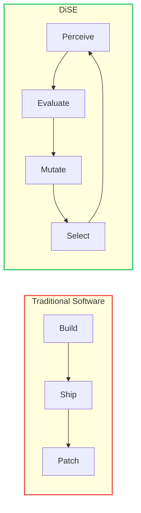
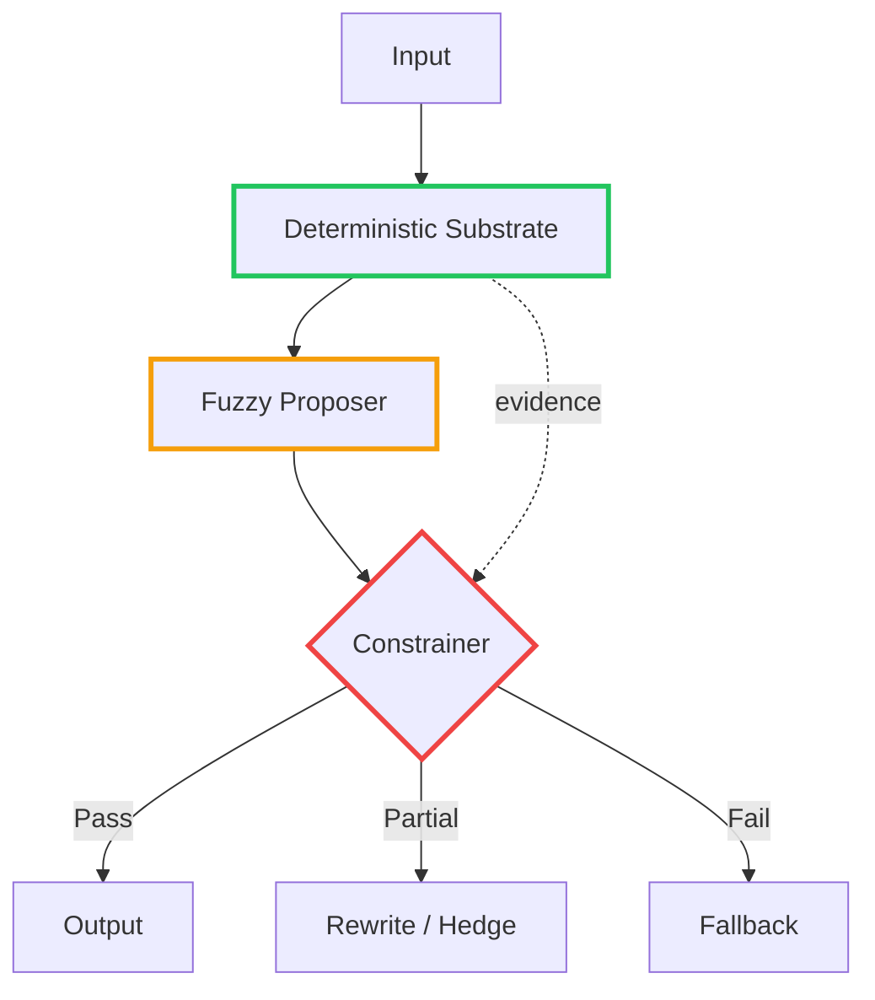
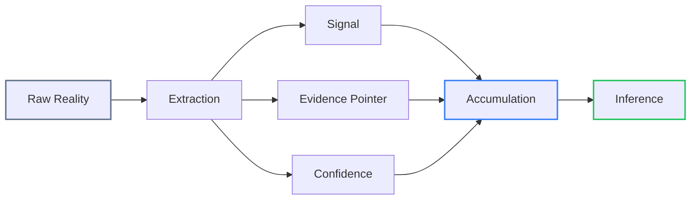
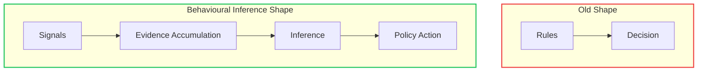
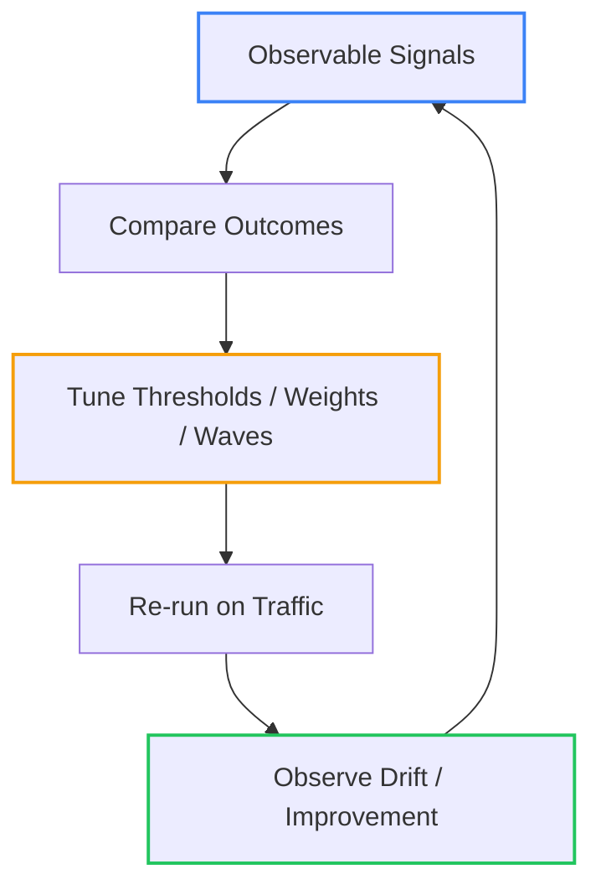
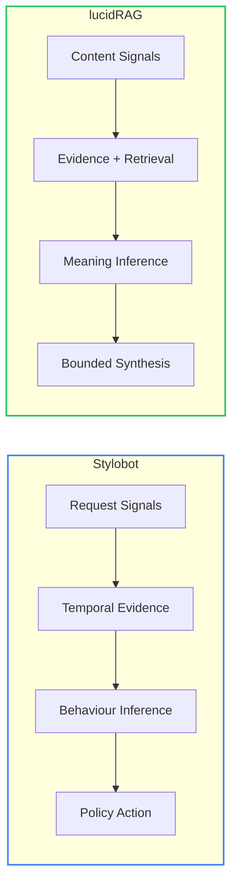
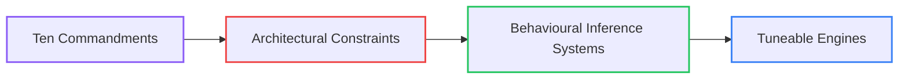
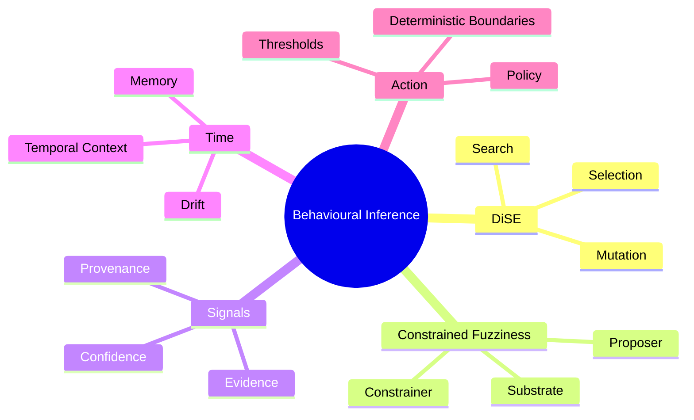
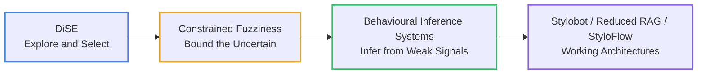

# Behavioural Inference: How I Learned to Stop Worrying and Love Probabilistic Systems

<!--category-- AI, Architecture, DiSE, Signals, Bot Detection, Patterns -->
<datetime class="hidden">2026-03-13T10:30</datetime>

Most software still assumes the world will hand it clean inputs and stable rules.
Production usually does neither.

This post is the through-line behind a bunch of things I've been building: [DiSE](/blog/dise-architecture-overview), [Constrained Fuzziness](/blog/constrained-fuzziness-pattern), [CFMoM](/blog/constrained-mom-mixture-of-models), [Reduced RAG](/blog/reduced-rag), [StyloFlow](/blog/styloflow-signal-driven-workflows), [The Ten Commandments of AI Engineering](/blog/tencommandments), and [Stylobot](/blog/botdetection-part2-signature-pipeline-and-stylobot-architecture).

I didn't get here by starting with a grand theory. I got here by poking at tools I found interesting and trying to work out what they were really doing. Summarisation. Code generation. Retrieval. Extraction. Ranking. Once you stop listening to the marketing layer, most of the useful ones are not doing one magical thing. They are collecting partial evidence, constraining it, and only then turning it into an answer or an action.

After building enough systems like that, I stopped thinking of them as separate tricks and started seeing the same architecture underneath:

- gather weak signals
- keep uncertainty explicit
- accumulate evidence over time
- let deterministic policy own the final action

That is the core of what I mean by a **behavioural inference system**.

It also explains why these architectures work well with code LLMs. Not because the LLM is "the intelligence", but because the system is structured enough to inspect and easy enough to tune.

**Previously in this series:**

- [Cooking with DiSE (Part 4): Building Systems That Learn, Adapt, and Evolve](/blog/dise-architecture-overview)
- [Constrained Fuzziness: A Control System Pattern for Probabilistic Components](/blog/constrained-fuzziness-pattern)
- [Constrained Fuzzy MoM: Signal Contracts Over Agent Chatter](/blog/constrained-mom-mixture-of-models)
- [Constrained Fuzzy Context Dragging](/blog/constrained-fuzzy-context-dragging)
- [Reduced RAG: Stop Stuffing Context Windows and Start Extracting Signals](/blog/reduced-rag)
- [StyloFlow: Constrained Fuzzy Signal-Driven Workflows](/blog/styloflow-signal-driven-workflows)
- [The Ten Commandments of AI Engineering](/blog/tencommandments)
- [StyloBot Part 2: Signature Pipeline and Architecture](/blog/botdetection-part2-signature-pipeline-and-stylobot-architecture)

[TOC]

---

## The Problem: Dynamic Environments, Partial Evidence

Most production systems still reach for one of two bad defaults:

1. Add more rules.
2. Add a bigger model.

Both can work for a while. Both break when the environment shifts.

What many real systems actually have is this:


Examples:

- bot detection
- document extraction
- recommendation systems
- audience segmentation
- fraud scoring
- adaptive workflow routing

In those domains, you rarely get one decisive fact. You get fragments, some useful, some noisy, some actively deceptive.

That is why I keep returning to signals, constraints, and observability.

If you want a system to improve, you need to see what it observed, what it believed, and why it acted. If that stays buried in tangled code paths, tuning becomes guesswork. If it is explicit, you can actually improve it on purpose.

---

## DiSE: Architecture Under Selection Pressure

The important move in [DiSE](/blog/dise-architecture-overview) was not "let an LLM change code."
It was this:

> treat architecture as something that can emerge under selection pressure, not something fully known upfront.

DiSE reframes software from "build, ship, patch" to "perceive, evaluate, mutate, select."



That matters because in many systems you do not know in advance:

- which detectors will matter
- which combinations of evidence will hold up
- which thresholds survive real traffic
- which expensive components are worth running

So the system needs room to explore.

But exploration alone is not enough. You can mutate your way into nonsense as easily as into something useful.

---

## Constrained Fuzziness: Keep the Walls

[Constrained Fuzziness](/blog/constrained-fuzziness-pattern) is the control layer that stops the whole thing turning to mush.

The rule is simple:

> probabilistic components may propose; deterministic systems decide.



DiSE says "explore." Constrained Fuzziness says "inside these boundaries."

Without those boundaries, probabilistic systems do what they always do:

- overclaim
- drift
- hide uncertainty behind fluent output
- become load-bearing in places they should never own

That is why [The Ten Commandments of AI Engineering](/blog/tencommandments) matter. "LLMs shall not own state", "LLMs shall not be sole cause of side-effects", and "Never ask an LLM to decide a derivable boolean" are not style notes. They are operating rules for systems that need to survive production.

The same pattern shows up everywhere:

- in RAG, the model synthesizes but does not own storage or filtering
- in image pipelines, vision models propose captions but computed facts constrain them
- in bot detection, detectors emit evidence but policy owns action
- in workflows, components emit signals but orchestration owns escalation and side effects


Put those two ideas together and you get a practical pattern: infer from weak evidence, but make action legible and controlled.

---

## Signals: The Real Primitive

This is where [Reduced RAG](/blog/reduced-rag), [StyloFlow](/blog/styloflow-signal-driven-workflows), and the signal-contract work in [CFMoM](/blog/constrained-mom-mixture-of-models) all line up.

Once you stop pretending that one model or one rules engine should do everything, the useful design primitive becomes the **signal**.

A good signal is:

- cheap to compute
- composable
- specific enough to matter
- auditable
- useful under uncertainty

Most importantly, a signal is compressed behaviour. It is not the whole world. It is the part you can preserve, compare, and act on later.



Different domains emit different signals:

- bot detection: timing entropy, impossible header combinations, TLS/HTTP mismatches, burst cadence, signature similarity
- document extraction: field proximity, OCR confidence, table regularity, entity density, page layout consistency
- recommendation systems: session drift, dwell patterns, repetition collapse, conversion intent
- workflow systems: retries, latency spikes, cache churn, path divergence, confidence decay

Signals let you move from "the model thinks" to "the system has evidence."

That is the move behind [Reduced RAG](/blog/reduced-rag): extract signals instead of stuffing larger context windows.
It is also the move in [StyloFlow](/blog/styloflow-signal-driven-workflows): coordinate around emitted facts, not opaque component calls.

Once signals are explicit, you can ask better engineering questions:

- which signals actually drive decisions?
- which ones are noisy?
- where are we escalating too early?
- which thresholds are too conservative?
- what patterns correlate with false positives?
- where does a new detector belong?

That is the difference between shipping a feature and tuning a machine.

---

## Behavioural Inference Systems

Traditional systems often look like this:

```text
Rules -> Decisions
```

Behavioural inference systems look more like this:

```text
Signals -> Evidence accumulation -> Behaviour inference -> Deterministic action
```



What do these systems infer?

- intent
- anomaly
- category
- structure
- coordination
- drift

Usually without ever getting a single perfect fact.

Behaviour is often easier to infer than identity. That matters in privacy-preserving systems and adversarial ones. You may not know exactly who something is, but you can often tell what kind of behaviour pattern it belongs to.

That is enough to route, throttle, challenge, cluster, prioritize, or escalate.

It also makes these systems a good fit for code LLMs. They do best when the system gives them:

- explicit boundaries
- observable state transitions
- measurable outputs
- local tuning surfaces
- repeated evaluation loops

A behavioural inference system exposes those things naturally.

---

## Stylobot as a Behavioural Inference System

[Stylobot Part 2](/blog/botdetection-part2-signature-pipeline-and-stylobot-architecture) is probably the clearest concrete example so far.

Stylobot is not just a pile of detectors. It is a behavioural inference stack.


A few things in that pipeline come directly from the earlier work.

### 1. The detector layer is DiSE-shaped

No single detector is assumed to be enough. You have a population of specialised contributors emitting evidence, and over time you learn which ones actually help.

That is not full autonomous evolution, but it is the same instinct: architecture gets refined under pressure.

### 2. The policy surface is constrained fuzziness

Stylobot keeps probability and confidence separate, but action is deterministic:

- `Allow`
- `Throttle`
- `Challenge`
- `Block`

Evidence can be fuzzy. Control surfaces cannot.

### 3. The signature model creates behavioural memory

Instead of reducing a visitor to one IP or one user-agent, Stylobot builds a multi-vector signature and reasons across time.

That is no longer simple classification. It is memory about behaviour.

### 4. Inference and enforcement are separate

High probability with low confidence should not trigger the same response as high probability with high confidence.

The system keeps ambiguity intact until it has enough evidence to justify stronger action.

### 5. Observability makes it tuneable

Stylobot is designed so that you can inspect nearly every meaningful part of the decision path:

- which detectors fired
- which signals were emitted
- what evidence accumulated
- what signature features matched
- why confidence moved
- where the early exit happened
- which policy boundary triggered the action

That makes it a tuneable engine rather than a black box.



That loop is exactly where code LLMs help. Not by replacing the engine, but by accelerating changes to the engine:

- add or refine detectors
- suggest cross-signal checks
- tune thresholds
- restructure wave ordering
- build diagnostics around false positives and misses

That only works because the architecture is observable enough to support tuning in the first place.

---

## Why Code LLMs Matter

The useful shift is not "LLMs can write software now." That line got boring almost immediately.

What matters is that code LLMs make exploration cheaper.

[RAG was published in May 2020](https://arxiv.org/abs/2005.11401). Retrieval, embedding search, signal extraction, and evidence packs are not new ideas. What changed is the cost of iterating on them. It used to be expensive to sketch twenty detector candidates, wire evaluation harnesses, inspect signal coverage, and tune thresholds. Most teams would build one design, ship it, and then live with whatever corners they had cut.

Code LLMs changed the economics of that loop.

They help you prototype:

- detectors
- transforms
- contracts
- evaluators
- ranking schemes
- synthetic tests
- diagnostic views
- tuning harnesses


The LLM does not need to be the decider to be strategically useful. It can just make design-space exploration much cheaper.

But the earlier rules still apply:

- the LLM does not own state
- the LLM does not own side effects
- the LLM does not get to redefine truth
- the deterministic substrate remains the substrate

So yes, code LLMs matter. They matter because they speed up search and tuning, not because they remove the need for architecture.

---

## The Through-Line Across the Other Systems

The same shape keeps showing up.

### Reduced RAG

In [Reduced RAG](/blog/reduced-rag), you extract deterministic signals at ingestion, store evidence separately, and let the LLM synthesize from a bounded evidence pack.

Not "give the model everything and hope." Extract first, constrain the surface, and synthesize from evidence.

### lucidRAG

Where Stylobot infers behaviour from requests over time, `lucidRAG` infers meaning from multimodal evidence: document structure, OCR confidence, entity graphs, ranking signals, source quality, deduplication.

Different substrate. Same shape.



Neither is really an "app." Both are inference engines working over different inputs.

### CFMoM

In [Constrained Fuzzy MoM](/blog/constrained-mom-mixture-of-models), multiple probabilistic components can propose, but they communicate through typed signals and deterministic logic decides what survives.

That is multi-model coordination without surrendering control.

### Context Dragging

In [Constrained Fuzzy Context Dragging](/blog/constrained-fuzzy-context-dragging), the system keeps bounded memory and preserves the parts of context that matter long enough for later interpretation.

Inference needs time. Context dragging makes time available without letting memory grow without bound.

### StyloFlow

In [StyloFlow](/blog/styloflow-signal-driven-workflows), components do not call each other directly. They emit signals, and orchestration reacts to those signals and their confidence.

That is behavioural inference applied to workflow infrastructure.

"Behavioural inference systems" is a better umbrella than "agentic systems" or "LLM apps." It describes the architecture instead of the marketing wrapper.

---

## Design Rules

If I had to compress the whole lineage into a few rules:

1. **Do not confuse fluent output with system knowledge.**
2. **Extract signals early.**
3. **Preserve uncertainty longer than feels comfortable.**
4. **Keep action deterministic even when inference is probabilistic.**
5. **Store evidence pointers, not just summaries.**
6. **Let components propose; never let them self-authorize.**
7. **Treat time as part of the truth.**
8. **Use LLMs to explore design space, not to replace architecture.**
9. **Build something you can tune like an engine, not just configure like an app.**

The normative version of those rules is [The Ten Commandments of AI Engineering](/blog/tencommandments).
This article is the architectural version.





---

## Why This Matters

The AI systems that survive production are usually not giant autonomous blobs.
They are also not endless piles of rules.

They are systems that:

- gather narrow signals
- accumulate evidence over time
- preserve ambiguity honestly
- expose deterministic control surfaces
- stay inspectable enough to evolve

That is a better engineering story than "the model got smarter."

Models will improve. Fine. Architecture still determines whether a system is debuggable, auditable, cheap to run, safe to evolve, and robust under adversarial pressure.

Behavioural inference systems take those constraints seriously.

---

## Closing Thought

The lineage looks obvious in hindsight:



DiSE gave me a way to think about architectural search.
Constrained Fuzziness gave me a way to keep probabilistic components inside clear boundaries.
Behavioural inference systems are what you get when those ideas are forced to survive production.

Stylobot is just the current example.

Once you start seeing systems as evidence accumulators with deterministic action surfaces, a lot of modern software stops looking like "AI features" and starts looking like the same pattern in different domains.
