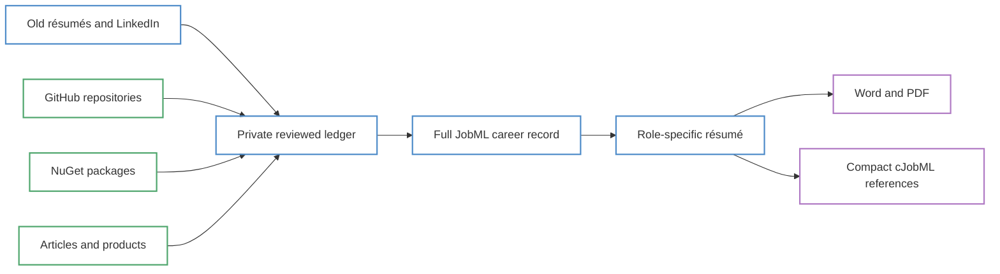
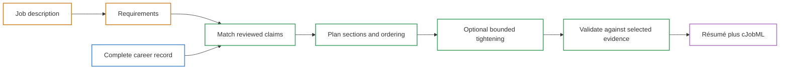

# Compiling a Résumé from a Career Record: cJobML in Practice

<!--category-- AI, LLM, JobML, cJobML, Résumés, ASP.NET Core, RAG, Evidence, Open Formats -->

<datetime class="hidden">2026-09-26T12:00</datetime>

I asked lucidRESUME for an Engineering Lead résumé.

It produced two pages covering six relevant roles, two recent projects and the
skills which mattered to the target. The prose was the prose I had already
reviewed. Twenty-eight inline links connected the statements to eleven compact
references. The public projects retained their repository or product links. The
other references named the exact role in my fuller career transcript.

That sounds rather like an AI résumé generator. It is almost the opposite.

An AI résumé generator starts with a prompt and tries to write a plausible
candidate. This starts with a reviewed career record and removes everything
which does not answer the job description. An optional model can tighten the
selected prose, but it cannot add a role, number, technology or claim which the
selection did not already contain.

The distinction is simple:

> **The job description chooses a view of the evidence. It does not get to
> choose a more convenient person.**

This is part three of my lucidRESUME experiment. [Part one introduces the
evidence ledger, JobML and the scientific-paper model for professional
claims](/blog/the-problem-with-resumes). [Part two uses Chrome's local model to
map unfamiliar job-form questions to a published JobML career
record](/blog/lucidresume-evidence-filler). This part joins the two together with
the practical bit: paste a job description into a small web control and compile
a conventional Word or PDF résumé from the complete record.

> **NOTE:** lucidRESUME remains a research project. This article describes the
> current implementation, not a finished recruitment product.

[](https://github.com/scottgal/lucidRESUME/releases)
[](https://www.nuget.org/packages/Mostlylucid.Avalonia.UITesting)

[TOC]

---

## The Full Record Is Deliberately Too Large

My normal résumé is a dreadful source document because it has been compressed
and rewritten for years. Every edit answers one vacancy while quietly removing
something which may matter to the next one.

The source for this experiment is intentionally excessive. It combines old
résumés, LinkedIn, reviewed role descriptions and a selected set of repositories,
public products and articles from this site. The human transcript is more than
ten pages because it is not intended to be sent to a recruiter. It is the fuller
account from which smaller documents are compiled.

The public-work audit makes the reason obvious. At the time of writing [my GitHub
account](https://github.com/scottgal?tab=repositories) has 47 public, non-fork
repositories. Thirty-one have activity since the start of 2025. [A NuGet search
for Mostlylucid](https://www.nuget.org/packages?q=mostlylucid) returns 175 package
IDs owned by that account. The local article collection contains 113 posts which
directly link to one of my GitHub repositories or Mostlylucid packages.

The audit also caught an important limitation in my supposedly complete source.
Its prose names six GitHub repositories and no individual NuGet package URLs. It
contains the projects I happened to consider important while writing it, not the
full breadth needed for arbitrary future job matching.

Putting all 175 packages in a two-page résumé would be deranged. Leaving their
useful evidence out of the career record would also be wrong.

The ledger therefore needs to store breadth at artefact resolution while the
résumé shows only the small number of artefacts which help answer this job.
Package modules can be grouped under product families such as StyloBot,
LucidRAG, StyloFlow and Ephemeral. The individual package identities remain
searchable without pretending that each is a separate grand project.



There are three different things in that diagram which are easy to conflate:

1. The private application ledger is the working source of truth. It retains
   imports, review decisions, rejected candidates, drift information and derived
   indexes.
2. A JobML `career_record` is the complete portable projection of that ledger. It
   contains the full human transcript, claims, evidence, concepts and optional
   semantic data.
3. A role-specific résumé is a smaller projection. Its final cJobML reference
   section is a compact projection again, intended to fit inside an ordinary
   résumé.

JobML is not synonymous with the ledger, and cJobML is not another authoring
format. Each is a view with a different resolution.

## Breadth Is Evidence, Not Automatic Proficiency

The public projects are useful precisely because they cover more ground than I
would claim as my day job.

For example, [Directed Synthetic Evolution](https://github.com/scottgal/mostlylucid.dse)
and [mostlyucid-nmt](https://github.com/scottgal/mostlyucid-nmt) contain substantial
Python implementations. The latter packages EasyNMT behind production-ready GPU
and CPU Docker variants. DSE explores multi-model program synthesis, evaluation
and RAG-backed reuse.

I would not describe myself as a commercial Python developer on that evidence.
I would say that I conceived and built working Python-heavy research systems,
largely through LLM-assisted development, and can discuss their architecture,
evaluation and product decisions. That is both useful and honest.

The same distinction applies to TypeScript and JavaScript. The Mostlylucid site,
StyloBot, lucidRESUME and the Smart Copy Alt browser extension contain working
front-end or extension code. Those repositories demonstrate cross-stack product
delivery and the ability to use coding models effectively outside my principal
C# stack. They do not magically turn twenty years of .NET experience into twenty
years of TypeScript experience.

The ledger needs enough vocabulary to preserve that difference:

```yaml
observations:
  - repository: mostlylucid.dse
    language: Python
    basis: github-linguist

claims:
  - statement: >
      Conceived and built a Python-heavy experimental system for
      LLM-orchestrated program synthesis and automated evaluation.
    review: accepted
    supported_by:
      - type: repository
        uri: https://github.com/scottgal/mostlylucid.dse
      - type: article
        uri: https://mostlylucid.net/blog/dise-architecture-overview
```

The language is an observation. The project statement is a reviewed claim. The
repository exposes the artefact. The article exposes the reasoning. A separate
claim such as “commercial Python specialist” would require separate evidence.

That is far more useful for matching than a binary `skills: [Python]` entry. A
job compiler can treat it as relevant adjacent evidence, show it to the person,
and avoid pretending it establishes something stronger.

The weblog matters here. It is an old-fashioned public engineering notebook,
not a corporate content funnel. Posts such as [the DSE architecture
overview](/blog/dise-architecture-overview), [the StyloFlow workflow
design](/blog/styloflow-signal-driven-workflows), [the ephemeral execution
library](/blog/ephemeral-execution-library), [the ConsoleImage time-boxed
tool](/blog/timeboxedtool-consoleimage), and [DoomSummarizer's evidence-grounded
research flow](/blog/doomsummarizer-deep-research) provide much higher-resolution
context than a bullet point can carry.

This does not make every article proof that a production deployment succeeded.
It does make the claim inspectable. A reader can see the code, then follow the
design argument rather than taking a compressed sentence on trust.

## A Job Description Is a Query

For the worked example I used a general Engineering Lead target. It asked for a
hands-on .NET lead who still writes production code, owns delivery, makes
architectural decisions, improves CI/CD and observability, mentors engineers and
uses AI-assisted development practically.

That is a query over the record, not a writing prompt.

The compiler detected the requirements, matched them against reviewed concepts
and claims, and selected six of the fourteen parsed roles. It chose recent
Mostlylucid, Mortgage Automator and Zenchef work, then retained earlier Seamcor,
WCOM and H3Space examples where they supplied delivery, platform and leadership
evidence. It selected Stylo.Bot productisation and DSE as the two public projects
which best explained the recent AI work.

The result did not include every interesting thing I have done. Microsoft, the
ASP.NET MVC first release and older performance work remain visible in the
complete transcript. The repository and package audit is the next increase in
resolution: the browser extension and package families should become searchable
evidence without being forced into this projection.

One selection also tested whether the record understood continuity rather than
merely matching words. My source documents named Seamcor Ltd and Rooikat
Investment Ltd as overlapping organisations. The Rooikat contract described
development, deployment and management of the Seamcor application and
architecture. I confirmed that this was the same product, team and delivery
remit, with the contracting entity changed for legal reasons.

The reviewed transcript therefore contains one engagement from December 2022
to May 2024. It preserves both formal titles and both company names, then records
that I recruited eight engineers and led a mixed-seniority team of more than ten
through the product re-architecture. The compiler sees sustained product and
team ownership. It does not manufacture two leadership roles from two legal
entities.

That is the important reversal. Nothing is deleted from the professional history
to make a résumé. A résumé is an ephemeral view which can be rebuilt when the
question changes.



The deterministic path can stop before `T`. In that mode the selected text is
exactly the reviewed source prose. If local LLamaSharp or OpenAI is enabled, the
model receives only the selected passages and performs bounded editing passes.
The validator rejects a pass which introduces an unsupported number, target-job
technology, evidence identity or section.

This is not a claim that a validator can prove arbitrary prose true. It is a much
narrower and more useful guarantee: the editing stage cannot quietly escape the
facts selected by the deterministic stage.

## Evidence Coverage Is Not Job Fit

The CTO experiments exposed an important naming problem. The compiler can
measure how much of a job description retrieves related evidence from the
record. It cannot turn that number into a hiring decision.

For a Toptal CTO advert, the record produced 89 percent semantic evidence
coverage. That sounds excellent until the actual gates are read. The role asked
for substantial prior CTO or VP experience at meaningful scale, an advanced
technical education, foundation-model training from the ground up, and agentic
systems deployed at business scale with measured outcomes. My record has strong
adjacent evidence, but it does not establish those things. The résumé was a good
document for a weak candidacy.

A founding AI-native CTO advert produced 91 percent coverage and a more credible
stretch. The hands-on architecture, product building, hiring, platform recovery
and current AI work were directly relevant. It still did not prove group-level
CTO authority or large consumer AI deployment.

That distinction now appears in the interface and output:

```text
Semantic evidence coverage: 89%
Not an eligibility or job-fit score.
```

Coverage answers whether the ledger contains nearby, evidenced material worth
reading. Eligibility asks whether mandatory conditions are met. Fit involves
scale, judgement, context and a human decision. Combining the three would be
exactly the kind of unsupported inference JobML is meant to prevent.

## What the Reader Sees

The generated document still looks like a résumé. A person sees a short summary,
recent roles, selected projects, skills and education. They do not need to read
YAML or understand JobML.


The difference is the small linked number after a statement:

```markdown
Took technical ownership of Formitable after its acquisition by Zenchef,
inheriting a distributed .NET and Azure platform serving more than 5,000
restaurants across Europe. [[4]](#ref-4)

Continued to lead the same Seamcor product and team when the contracting entity
changed to Rooikat Investment for legal reasons, providing uninterrupted
technical and delivery ownership. [[5]](#ref-5)
```

At the end of the document, cJobML renders a familiar reference list:

```markdown
## References

cJobML 0.1: xref [n] in prose resolves to ref [n].
Full JobML: <https://resume.example/jobml/4f8c...>.

<a id="ref-4"></a>[4] “Complete transcript: Lead Contract Developer,
Zenchef / Formitable.” [Career Transcript]
<https://resume.example/jobml/4f8c...#formitable-role>.

<a id="ref-5"></a>[5] “Complete transcript: Head of Software / Contract Head
of Development, Seamcor / Rooikat.” [Career Transcript]
<https://resume.example/jobml/4f8c...#seamcor-rooikat-role>.

<a id="ref-8"></a>[8] “Stylo.Bot Productisation.” [Project]
<https://stylo.bot/>.
```

Word and PDF display the same `[4]` and `[8]` markers as internal links. The first
click reaches the compact reference. Where a full endpoint is published, the
reference links to the exact role or project in the complete transcript, not
merely the top of a large file.

The distinction between those two examples is intentional. The Formitable link
shows the fuller candidate-maintained account. It is provenance, not an employer
attestation. The Stylo.Bot link reaches a public product. A repository, article,
release or qualification may provide stronger and more independent support. The
format names the evidence class instead of pretending all links prove the same
thing.

cJobML leaves out selectors, quoted passages, fingerprints, review state,
embeddings and concept graphs. Those belong in full JobML. Its job is to remain
small enough to append to an ordinary résumé while retaining one-shot machine
parsing and human navigation.

## The Web Compiler

The web compiler is the deliberately boring product surface for all of this.


It does not ingest LinkedIn, crawl GitHub or reconcile old résumés. The desktop
application performs that slow, private and review-heavy work. The web control
accepts the already-built JobML `career_record`, publishes an immutable revision,
accepts a job description and returns Markdown, Word and PDF projections.

Embedding it in an ASP.NET Core application takes the rather pleasing amount of
code below:

```csharp
builder.Services.AddLucidResumeCompiler(builder.Configuration);

var app = builder.Build();
app.UseAntiforgery();
app.MapLucidResumeCompiler();
app.Run();
```

The important endpoints are equally small:

```text
POST /lucidresume/api/career-record
POST /lucidresume/api/compile
GET  /lucidresume/api/jobml
GET  /lucidresume/api/jobml/{revision}
GET  /lucidresume/api/export/{id}/docx
GET  /lucidresume/api/export/{id}/pdf
```

The current record has a convenient stable URL. Each published revision also has
an immutable URL with an ETag and long-lived cache headers. The compiler places
that revision URL in the generated cJobML, then adds entity fragments to the
individual transcript references.

That makes a generated document reproducible. Its references do not silently
start pointing at next week's edited career record.

The control can run its deterministic selection without a generative model. A
small local model through LLamaSharp can parse or tighten text. OpenAI can provide
a stronger optional editing pass. Provider keys remain server-side. In either
case the evidence selection exists before prose composition and is validated
after it.

## This Is Not an AI Résumé Generator

The products look similar if reduced to “paste job, receive résumé.” Their
failure modes are not similar.

| Generic AI résumé generator | Career-record compiler |
|---|---|
| Treats the old résumé and advert as prompt material | Treats the advert as a query over reviewed claims |
| Model decides what facts and wording would fit | Deterministic selection decides which evidence is available |
| Missing coverage invites plausible completion | Missing coverage remains a gap |
| Rewrites the candidate on every run | Reuses stable claim and evidence identities |
| Output is difficult to trace back | Inline citations reach compact and full-resolution evidence |
| Often optimises for “human-looking” model prose | Starts with human prose and makes model editing optional |
| Keyword density can dominate | Human prose and machine representation have separate jobs |

I am not opposed to model-generated text. lucidRESUME can produce a draft or
sample during an explicit authoring workflow. I can edit it, reject it or accept
it into the human transcript. That is different from allowing generation during
rendering to become new evidence.

The complete transcript can also be summarised. A ten-page role description may
be tightened to three bullets for a particular vacancy. JobML can remain at high
resolution, retain the original evidence and expose a path back to it. The short
prose and detailed machine account do not need to have the same loss function.

The human résumé optimises for comprehension, credibility and narrative. JobML
optimises for explicit structure, retrieval and verification. cJobML optimises
for a compact published bridge between the two.

## Closing the Loop

Part one built the record. This compiler turns it into a role-specific document.
Part two's browser extension consumes the same published record when a recruitment
site asks for the information again.

```text
private evidence ledger
    -> published JobML career record
    -> job-specific résumé plus cJobML
    -> reviewed form answers
```

No stage needs permission to invent a new Scott Galloway.

The immediate work is less glamorous than asking a larger model to write more
confident prose. The full record needs a proper inventory of repositories, NuGet
package families and linked articles. Repository language must remain an
observation rather than a proficiency claim. Package modules need grouping under
their parent products so 175 package IDs do not become 175 fake “projects.”
Article links need to attach to the claims they actually explain.

That detail is the point. If a vacancy asks about Python, TypeScript, browser
extensions, local models, workflow orchestration, document extraction or release
engineering, the compiler should be able to find a real artefact and show exactly
what it establishes. It should also be able to say when that evidence is adjacent,
self-published or insufficient.

The interface remains wonderfully small:

> **Paste the job. Get the right version of you.**

Underneath, it is a career evidence compiler. The résumé is simply its first
useful output.

## Code and Specifications

- [lucidRESUME source](https://github.com/scottgal/lucidRESUME)
- [JobML 0.1 specification](https://github.com/scottgal/lucidRESUME/blob/main/docs/jobml-0.1-specification.md)
- [cJobML 0.1 publication specification](https://github.com/scottgal/lucidRESUME/blob/main/docs/cjobml-0.1-specification.md)
- [JobML web compiler guide](https://github.com/scottgal/lucidRESUME/blob/main/docs/jobml-web-compiler.md)
- [GitHub repository evidence extension](https://github.com/scottgal/lucidRESUME/blob/main/docs/jobml-github-extension-0.1.md)
- [NuGet search for Mostlylucid packages](https://www.nuget.org/packages?q=mostlylucid)
