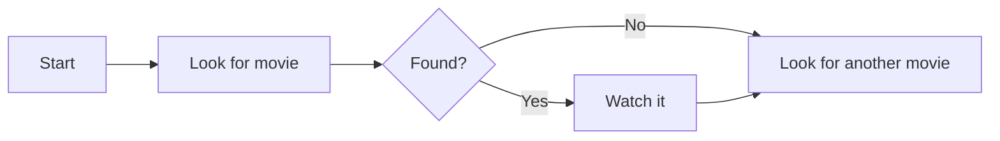
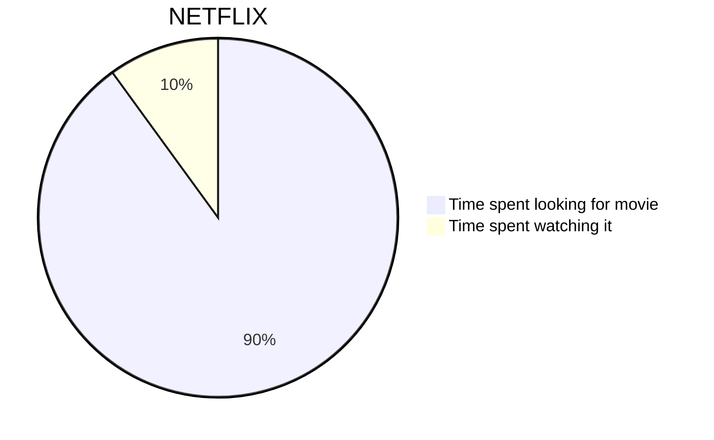
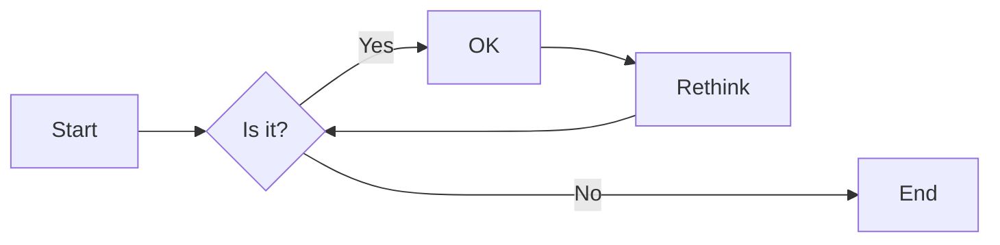
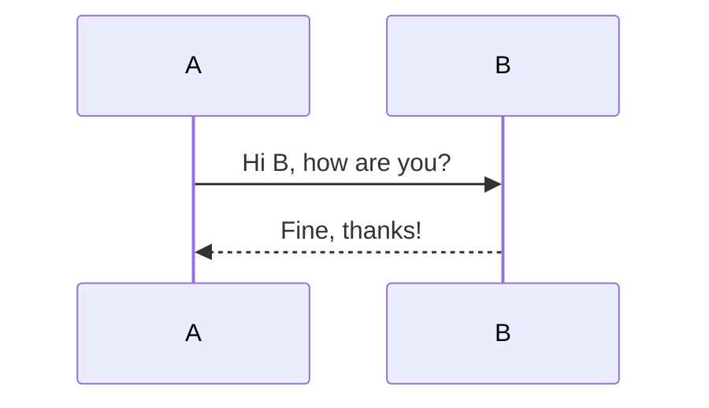
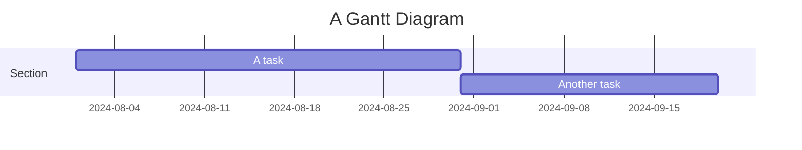
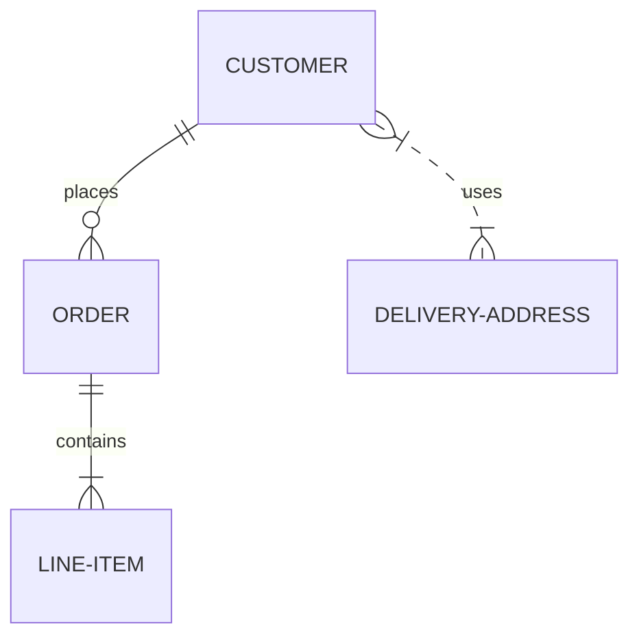
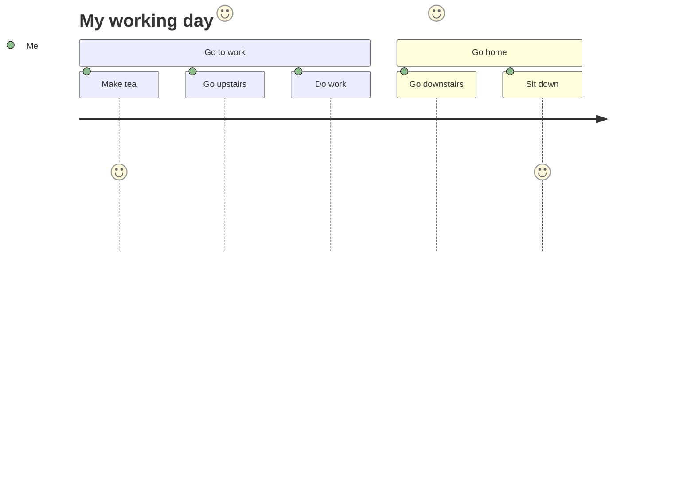

# Adding mermaid.js with htmx

<!--category-- HTMX, Markdown -->

<datetime class="hidden">2024-08-02T20:00</datetime>


## Introduction
Mermaid is a simple diagramming format that takes text-based input and generates diagrams in SVG format. It is a great tool for creating flowcharts, sequence diagrams, Gantt charts, and more. In this tutorial, we will explore how to use Mermaid with htmx to create interactive diagrams that update dynamically without page reloads.
The Mermaid site is [here](https://mermaid.js.org/) and has far more information than I can provide here.

[TOC]

## Markdown and Mermaid
Mermaid diagrams can be included in your markdown files by using the following syntax:

<pre>
# My Markdown Title

</pre>

This allows you to include Mermaid diagrams directly in your markdown files, which will be rendered as SVG images when the file is converted to HTML.


You can also add mermaid diagrams to normal html files by using the following syntax:

```html
<pre class="mermaid">
    graph TD
    A[Start] --> B[Look for movie]
    B --> C{Found?}
    C -->|Yes| D[Watch it]
    C -->|No| E[Look for another movie]
    D --> E
</pre>
```

### Examples of Mermaid diagrams
Mermaid is a powerful tool that lets you build a wide range of diagrams using simple text-based syntax.
Here are some examples of the types of diagrams you can create with Mermaid:

-Pie charts:


-Flowcharts:
Flowcharts can specify direction, e.g. LR (left to right), RL (right to left), TB (top to bottom), BT (bottom to top).



-Sequence diagrams:


-Gantt charts:


-Entity relationship diagrams:


-User journey diagrams:


etc...See this page for more of the MYRIAD of diagrams you can create with Mermaid [here](https://mermaid.js.org/syntax/examples.html)

## Getting started with Mermaid and htmx
First you need to include the Mermaid library in your HTML file. You can do this by adding the following script tag to your document:

```html
<script src="https://cdn.jsdelivr.net/npm/mermaid@10.9.1/dist/mermaid.min.js
"></script>
```

Next in your _Layout.cshtml file you need to add the following script tag to initialize Mermaid (you normally do this at the bottom of the file)

```html
<script>
    document.addEventListener('DOMContentLoaded', function () {
        mermaid.initialize({ startOnLoad: true });
    });
    document.body.addEventListener('htmx:afterSwap', function(evt) {
        mermaid.run();
        
    });

</script>
```

This does two things; 
1. It initializes Mermaid when the page loads; so if you directly navigate to a page with a Mermaid diagram (e.g. [/blog/mermaidandhtmx](/blog/mermaidandhtmx) ) it will render correctly.
2. If you use htmx as in our [previous tutorial](/blog/htmxwithaspnetcore) it will re-render the Mermaid diagram after the page has been updated (the htmx:afterswap event).