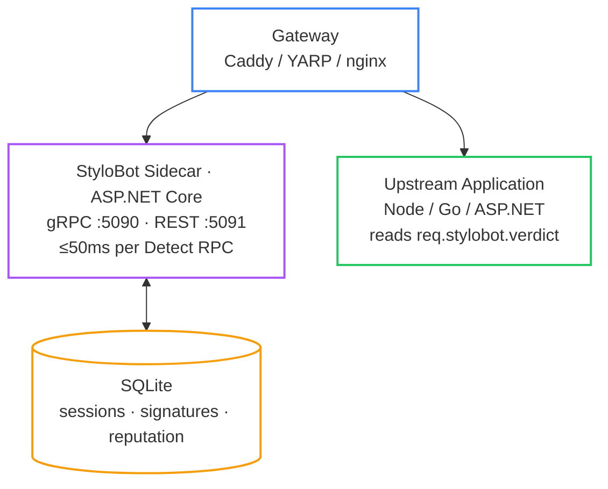
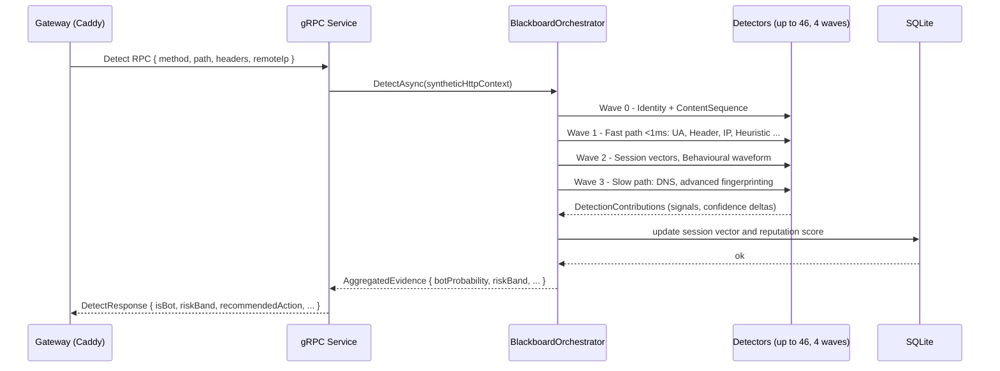
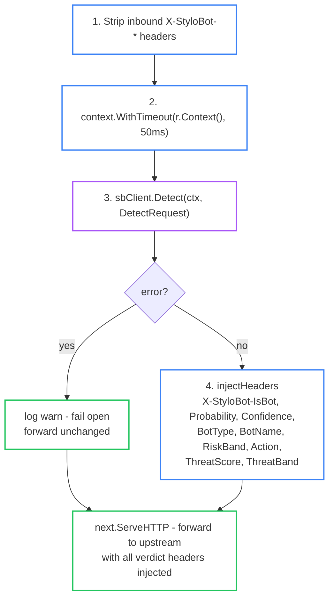
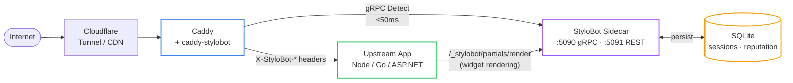

# StyloBot Release Series: The Sidecar Architecture

*StyloBot's detection engine is ASP.NET Core. This post explains how that engine connects to Go gateways, Node.js applications, and any other stack - through a gRPC sidecar, a typed Go SDK, and a Caddy plugin - without any of those consumers needing to know anything about the .NET internals.*

> ## DRAFT
> This is a working draft in the StyloBot Release Series. APIs, ports, and Caddyfile syntax may still change before final release.
>
> **The `github.com/scottgal/stylobot-go` SDK, the `github.com/scottgal/caddy-stylobot` plugin, and the `Mostlylucid.BotDetection.Sidecar` container will be published shortly** - everything below describes the surface they will expose.

> **StyloBot Release Series**
>
> 1. [**Behaviour, Not Identity**](/blog/stylobot-fingerprint) - why StyloBot models clients behaviourally
> 2. [**Behaviour-Aware ASP.NET UI**](/blog/behaviour-aware-ux) - the server-rendered surface for .NET applications
> 3. [**Finding and Fixing Unbounded Growth in Long-Running .NET Services**](/blog/stylobot-release-reliability) - the reliability discipline that keeps the engine boring in production
> 4. [**Behaviour-Aware TypeScript UI**](/blog/typescript-sdk) - Express, Fastify, and browser components
> 5. **The Sidecar Architecture** - this article

<!--category-- Architecture, Go, ASP.NET Core, StyloBot, gRPC -->
<datetime class="hidden">2026-05-13T10:30</datetime>

# Why a sidecar

A reverse proxy is the obvious place to run bot detection: it sits in front of everything, sees every request, and can block before any application code runs. That logic holds right up until you ask what your application should *do differently* based on who is making the request. A gateway that blocks outright is a gate; what most applications actually need is a verdict they can act on in multiple ways at once - throttle the API, personalise the UI, exclude traffic from analytics, add a friction step at checkout. A gate cannot do any of that. A verdict pipeline can.

The sidecar pattern separates the two concerns. The gateway stays fast and stateless. The sidecar maintains the session state, reputation scores, and behavioural models that make detection accurate. The two communicate over the local network - same host or same Pod - so the round-trip is microseconds to single-digit milliseconds, not the 50-200ms of a remote API call. That latency budget is what makes per-request detection practical at all.

This is not a novel pattern. [Envoy Proxy](https://www.envoyproxy.io/) does exactly this for service-mesh concerns (mTLS, retries, circuit breaking); [Dapr](https://dapr.io/) does it for state and pub/sub; the [OpenTelemetry Collector](https://opentelemetry.io/docs/collector/) does it for telemetry. Linkerd, Consul Connect, and AWS App Mesh all follow the same model. The pattern keeps appearing because it solves a real problem: you want complex stateful behaviour that crosses language boundaries without reimplementing it in every language.

[TOC]

## Why not just embed it as a library?

The alternative is compiling detection directly into the gateway. For Go that means a pure-Go reimplementation or a CGo binding to a C library. For Node it means running detection in-process alongside the application.

Neither is realistic for an engine of this complexity. StyloBot has 46 detectors organised across four execution **waves** (later waves fire only when earlier signals warrant it - a credential-stuffing attempt triggers different detectors than a Googlebot crawl). It maintains per-session **Markov chain vectors** in a 129-dimensional space - a Markov chain is just a probability model over "given the last thing this session did, what comes next?", and 129 dimensions captures enough page-transition shape to tell humans and bots apart. It runs **Leiden community detection** over those vectors - a graph-clustering algorithm that groups sessions behaving alike, which is how StyloBot spots a bot network even when individual sessions look fine. And it persists all of this to SQLite between requests. That state needs an independent lifecycle - it cannot restart with the Node process or get torn down when the gateway reloads its config.

A sidecar lets each component do what it is good at:



The gateway calls the sidecar, injects the result as HTTP headers, and optionally blocks. The upstream application reads the headers and acts on the verdict. The sidecar persists state between requests. The detection pipeline runs inside the single gRPC call and its result propagates as nine HTTP headers.

# The sidecar

`Mostlylucid.BotDetection.Sidecar` is a minimal ASP.NET Core process. It has no UI, no static file serving, and no routing beyond the gRPC and REST endpoints. It starts the full detection engine and exposes two ports:

- **:5090** - HTTP/2 for gRPC clients (gateways, Go proxies, the Node gRPC client)
- **:5091** - HTTP/1.1 for REST clients, re-exporting `/api/v1/*` endpoints

## gRPC

[gRPC](https://grpc.io/) is a high-performance remote procedure call framework developed at Google. It uses [Protocol Buffers](https://protobuf.dev/) (protobuf) as its wire format - a compact binary encoding that is faster to serialise and smaller on the wire than JSON. gRPC runs over HTTP/2, which means it gets multiplexing (multiple requests over one TCP connection) for free.

The interface is defined in a `.proto` file. From that file, code generators produce typed client and server stubs in any supported language. StyloBot publishes `.proto` files so any language with a gRPC implementation can call the sidecar - Go, Node, Python, Rust, Java, and many others.

## The gRPC interface

The service has three RPCs:

```protobuf
service DetectionService {
  rpc Detect(DetectRequest)             returns (DetectResponse);
  rpc DetectBatch(DetectBatchRequest)   returns (DetectBatchResponse);
  rpc RenderWidget(RenderWidgetRequest) returns (RenderWidgetResponse);
}
```

**`Detect`** is the per-request hot path. Pass it method, path, headers, remote IP, and optional TLS fingerprint data. It runs the wave pipeline - only the detectors that the request's signals warrant - updates the session vector, scores against the reputation store, and returns a verdict.

**`DetectBatch`** runs multiple requests sequentially. Used for log replay and offline analysis, not per-request gateway use.

**`RenderWidget`** accepts a Liquid template string, an optional verdict, and a key-value map of additional variables, then renders the template server-side and returns HTML. This is how non-.NET callers produce bot-aware HTML without standing up a separate render process; details in the [RenderWidget section below](#renderwidget-liquid-templates-over-grpc).

## What happens inside a Detect call

A quick glossary before the diagram, since these names will appear:

- **Blackboard**: a per-request key-value bag (e.g. `request.ip.is_datacenter`, `detection.useragent.confidence`). Detectors write signals to it; later detectors in the same wave read them. Lives only for the duration of one request. Raw PII (IP, UA string) stays in the request context and never lands on the blackboard.
- **Synthetic HttpContext**: a stand-in `HttpContext` the gRPC service builds from the proto request fields. The detection engine was designed for ASP.NET middleware and expects to read from `HttpContext`; synthesising one lets the same engine run unchanged inside a gRPC call.
- **DetectionContributions** / **AggregatedEvidence**: detector outputs (signal writes + confidence deltas) and their merged result.



The entire pipeline runs inside the single gRPC call - there is no async work after the response returns.

# The Go SDK

Gateway code in Go cannot import the ASP.NET sidecar. What it can do is call it over gRPC. The Go SDK (`github.com/scottgal/stylobot-go`) provides a typed interface that hides the generated protobuf types from callers entirely.

### Why the SDK hides protobuf types

Protobuf-generated code is verbose and has an unusual API. Enums are represented as integers. Strings come as raw proto enum names (`RISK_BAND_HIGH`, not `"High"`). Field names are camelCase in some generators and snake_case in others. Exposing proto types in your public API means your callers have to understand all of this.

The SDK translates once at the boundary - proto enums to canonical strings, proto structs to plain Go structs - and callers never see it.

```go
// the only interface you depend on - no proto imports required
type Client interface {
    Detect(ctx context.Context, req DetectRequest) (*Verdict, error)
    DetectBatch(ctx context.Context, reqs []DetectRequest) ([]*Verdict, error)
    RenderWidget(ctx context.Context, req RenderRequest) (*RenderResponse, error)
    Close() error
}
```

`DetectRequest` and `Verdict` are plain Go structs:

```go
type DetectRequest struct {
    Method   string
    Path     string
    Headers  map[string]string
    RemoteIP string
    Protocol string  // "http" or "https"; defaults to "https" if empty
    TLS      *TLSInfo
}

type Verdict struct {
    IsBot             bool
    BotProbability    float32
    Confidence        float32
    BotType           string   // "AiBot", "Scraper", "GoodBot", ...
    BotName           string
    RiskBand          string   // "VeryLow", "Low", "Elevated", "Medium", "High", "VeryHigh"
    RecommendedAction string   // "Allow", "Throttle", "Challenge", "Block"
    ThreatScore       float32
    ThreatBand        string
    ProcessingTimeMs  float32
    DetectorsRun      int32
    Reasons           []Reason
}
```

Creating a client and running detection:

```go
import (
    stylobot "github.com/scottgal/stylobot-go"
    "context"
    "time"
)

client, err := stylobot.NewClient(
    "localhost:5090",
    stylobot.WithTimeout(50 * time.Millisecond),
    stylobot.WithAPIKey(os.Getenv("SB_API_KEY")),
)
if err != nil {
    log.Fatal(err)
}
defer client.Close()

verdict, err := client.Detect(ctx, stylobot.DetectRequest{
    Method:   r.Method,
    Path:     r.URL.RequestURI(),
    RemoteIP: r.RemoteAddr,
    Headers:  extractHeaders(r),
    Protocol: "https",
})
if err != nil {
    // fail open - log and continue
    log.Printf("stylobot detect failed: %v", err)
    return next(w, r)
}

if verdict.RecommendedAction == "Block" {
    http.Error(w, "Forbidden", http.StatusForbidden)
    return
}
```

### Lazy connection and startup safety

`grpc.NewClient` creates a client channel but does not establish a TCP connection immediately. The connection happens on the first RPC call. This means your gateway process starts successfully even if the sidecar has not started yet. The first request after startup may fail (and should be handled with fail-open), but every subsequent request works normally once the sidecar is running.

This is different from HTTP clients, where you typically connect on creation. The [gRPC Go documentation](https://pkg.go.dev/google.golang.org/grpc#NewClient) covers the lifecycle in detail.

### Timeout interaction

`WithTimeout` on `NewClient` sets a default per-call deadline applied inside each `Detect` call. If your calling code (or middleware such as the Caddy plugin) already derives a deadline-bounded context from the incoming request, the SDK applies whichever deadline expires first. When the Caddy plugin is in use, the plugin owns the 50ms deadline; you can omit `WithTimeout` from `NewClient` and let the plugin control it. For standalone use (a handler calling the SDK directly), set it on `NewClient` as shown above.

# The Caddy plugin

[Caddy](https://caddyserver.com/) is a Go-based web server and reverse proxy with automatic HTTPS. Its plugin system is compile-time: you use [xcaddy](https://github.com/caddyserver/xcaddy) to build a custom Caddy binary that includes your plugins, producing a single self-contained binary with no runtime dependency on shared libraries. This is different from nginx's dynamic module system (`.so` files loaded at runtime). The StyloBot plugin (`github.com/scottgal/caddy-stylobot`) registers a middleware handler that calls the Go SDK on every request.

The Caddyfile configuration:

```caddy
{
    order stylobot before respond
}

:80 {
    stylobot {
        endpoint localhost:5090   # gRPC host:port of the sidecar
        timeout   50ms            # per-request deadline; fails open on expiry
        # on_block 503            # optional: change the block status code (default: 403)
    }
    reverse_proxy upstream:3000
}
```

The plugin injects nine verdict headers onto every forwarded request:

| Header | Source field |
|---|---|
| `X-StyloBot-IsBot` | `isBot` (bool) |
| `X-StyloBot-Probability` | `botProbability` (0.0-1.0) |
| `X-StyloBot-Confidence` | `confidence` (0.0-1.0) |
| `X-StyloBot-BotType` | e.g. `AiBot`, `Scraper`, `GoodBot` |
| `X-StyloBot-BotName` | e.g. `GPTBot`, `Googlebot` |
| `X-StyloBot-RiskBand` | `VeryLow` ... `VeryHigh` |
| `X-StyloBot-Action` | `Allow` / `Throttle` / `Challenge` / `Block` |
| `X-StyloBot-ThreatScore` | numeric |
| `X-StyloBot-ThreatBand` | `None` ... `Critical` |

Requests where `isBot=true` and `Action=Block` are stopped at the gateway with a 403 and never reach the upstream. Everything else - including bots with a `Throttle` or `Challenge` recommendation - is forwarded with all nine headers intact. That is the intended split: the gateway handles hard blocks; the upstream handles nuance.

`on_block` changes the status code used when the gateway blocks (default: 403). Set `on_block 503` to suppress retry logic in scrapers that treat 403 as retryable.

## What the middleware does on every request



**Step 1 - strip inbound headers.** A client that knows the `X-StyloBot-*` header names could self-inject a favourable verdict and have it survive the fail-open path. Stripping them first means the verdict the upstream sees always came from the sidecar.

**Step 2 - context deadline.** The timeout is derived from `r.Context()` using `context.WithTimeout` (which takes a relative duration; `context.WithDeadline` takes an absolute time - they are equivalent). Deriving from `r.Context()` rather than `context.Background()` is the key point: if the client disconnects before the gRPC call completes, the cancellation propagates through and the sidecar stops processing early.

**Steps 3–4** - detect and inject. The nine verdict fields become nine `X-StyloBot-*` headers. Headers are set before the block check, so the upstream reads them via `styloBotMiddleware({ mode: 'headers' })` for all non-blocked requests. Requests where `isBot=true` and `recommendedAction=Block` are returned as 403 at the gateway; everything else forwards with the full verdict headers attached.

The implementation:

```go
// from sdk/caddy/stylobot.go
func (s *StyloBot) ServeHTTP(w http.ResponseWriter, r *http.Request, next caddyhttp.Handler) error {
    for _, name := range stylobotHeaders {
        r.Header.Del(name)
    }

    ctx, cancel := context.WithTimeout(r.Context(), s.timeout)
    defer cancel()

    verdict, err := s.sbClient.Detect(ctx, sb.DetectRequest{
        Method:   r.Method,
        Path:     r.URL.RequestURI(),
        RemoteIP: ExtractIP(r),
        Protocol: r.Proto,
        Headers:  ExtractHeaders(r),
    })
    if err != nil {
        s.logger.Warn("stylobot detect failed, failing open", zap.Error(err))
        return next.ServeHTTP(w, r)
    }

    injectHeaders(r, verdict)

    if verdict.IsBot && s.OnBlock > 0 && verdict.RecommendedAction == "Block" {
        http.Error(w, "Forbidden", s.OnBlock)
        return nil
    }
    return next.ServeHTTP(w, r)
}
```

## Building with xcaddy

Caddy plugins must be compiled into the binary using [xcaddy](https://github.com/caddyserver/xcaddy). The Dockerfile in the integration tests shows the pattern:

```dockerfile
# from tests/integration/caddy-sidecar/Dockerfile
FROM caddy:2-builder AS builder

WORKDIR /build
COPY sdk/caddy/ caddy-plugin/
COPY sdk/go/    go/

WORKDIR /build/caddy-plugin

RUN xcaddy build \
    --with github.com/scottgal/caddy-stylobot=/build/caddy-plugin \
    --with github.com/scottgal/stylobot-go=/build/go

FROM caddy:2
COPY --from=builder /build/caddy-plugin/caddy /usr/bin/caddy
COPY tests/integration/caddy-sidecar/Caddyfile /etc/caddy/Caddyfile
```

### The xcaddy replace directive

The plugin's `go.mod` contains:

```
replace github.com/scottgal/stylobot-go => ../go
```

This tells the Go toolchain "when you see `stylobot-go`, use the local directory instead of fetching from the module proxy." It works for `go build` and `go test` in the plugin directory.

xcaddy creates a fresh temporary Go module for its build. That module does not inherit `replace` directives from the plugin's `go.mod`. Without the second `--with` argument, xcaddy would try to download `stylobot-go` from `pkg.go.dev` (where it is not yet published) and fail.

The `--with module=path` argument is xcaddy's native equivalent of a `replace` directive: it maps a module path to a local directory at build time. Both local modules must be named explicitly.

# RenderWidget: Liquid templates over gRPC

`RenderWidget` is a gRPC RPC on the sidecar that accepts a Liquid template string, renders it with the detection context, and returns HTML. This lets any caller - Go proxy, Node SSR layer, batch pipeline - produce bot-aware HTML without running a separate render process.

### Liquid templates

[Liquid](https://shopify.github.io/liquid/) is a templating language created by Shopify, used by Shopify themes, Jekyll, GitHub Pages, and many other systems. Its key properties: safe to run with user-supplied templates (no arbitrary code execution), simple enough for non-developers to write, and widely understood. StyloBot uses [Fluid.Core](https://github.com/sebastienros/fluid) - a high-performance .NET implementation of Liquid - to render templates server-side.

The sidecar implementation:

```csharp
// from src/Mostlylucid.BotDetection.Sidecar/Services/DetectionGrpcService.cs
private static readonly FluidParser Parser = new();  // static - shared, compiled templates cached

public override async Task<Proto.RenderWidgetResponse> RenderWidget(
    Proto.RenderWidgetRequest request, ServerCallContext context)
{
    if (!Parser.TryParse(request.Template, out var template, out var error))
        return new Proto.RenderWidgetResponse { Success = false, Error = error };

    var ctx = new TemplateContext();
    if (request.Verdict is { } v)
    {
        ctx.SetValue("isBot",             v.IsBot);
        ctx.SetValue("botProbability",    (double)v.BotProbability);
        ctx.SetValue("botType",           v.BotType);
        ctx.SetValue("botName",           v.BotName);
        ctx.SetValue("riskBand",          v.RiskBand.ToString());
        ctx.SetValue("recommendedAction", v.RecommendedAction.ToString());
        ctx.SetValue("threatScore",       (double)v.ThreatScore);
        ctx.SetValue("threatBand",        v.ThreatBand.ToString());
    }
    foreach (var kv in request.Vars)
        ctx.SetValue(kv.Key, kv.Value);

    var html = await template.RenderAsync(ctx);
    return new Proto.RenderWidgetResponse { Html = html, Success = true };
}
```

Fluid.Core maintains an internal compiled template cache - repeated renders of the same template string skip re-parsing. The `FluidParser` is static and shared across all gRPC calls.

The Node `StyloBotGrpcClient.renderWidget()` example and the full template variable reference are in the [TypeScript SDK article](/blog/typescript-sdk).

Calling it from Go:

```go
rendered, err := client.RenderWidget(ctx, stylobot.RenderRequest{
    Template: `<p class="warning">Bot: {{ botType }}</p>`,
    Verdict:  verdict,
    Vars:     map[string]string{"locale": "en-GB"},
})
if err == nil && rendered.Success {
    fmt.Fprint(w, rendered.HTML)
}
```

The template syntax is identical whether you call `RenderWidget` from Go, Node, or use `<sb-widget>` in the browser - the same Liquid engine, the same variable names, the same rendering path.

# Production layout



The upstream application calls the sidecar directly for widget rendering, bypassing the gateway. Widget rendering needs the full verdict context and happens after the request has already passed gateway detection, so there is no detection duplication.

## Fail-open at every layer

Caddy plugin, Node middleware, and Go SDK all fail open: a sidecar timeout or error becomes a warning log and a permissive empty verdict, not a 5xx. The 50ms Caddy deadline is a cold-start safety margin; the steady-state cost on a warm connection is 1–5ms.

The trade-off this encodes: blocking legitimate traffic because detection is unavailable is worse than missing bot traffic during a sidecar outage.

---

The release series continues over the next few weeks - more posts on detection internals, deployment patterns, observability, and the commercial topology are still to come. The arc so far:

- [Behaviour, Not Identity](/blog/stylobot-fingerprint) - why detection has to be behavioural, not identity-based
- [Behaviour-Aware ASP.NET UI](/blog/behaviour-aware-ux) - turning the verdict into Razor / controller policy
- [Finding and Fixing Unbounded Growth in Long-Running .NET Services](/blog/stylobot-release-reliability) - the reliability discipline that keeps the engine boring under sustained traffic
- [Behaviour-Aware TypeScript UI](/blog/typescript-sdk) - the same verdict surfaced in Express, Fastify, and the browser
- **The Sidecar Architecture** - this article: how the engine plugs into any stack via gRPC, the Go SDK, and the Caddy plugin

Source for the implementation: [github.com/scottgal/stylobot](https://github.com/scottgal/stylobot).