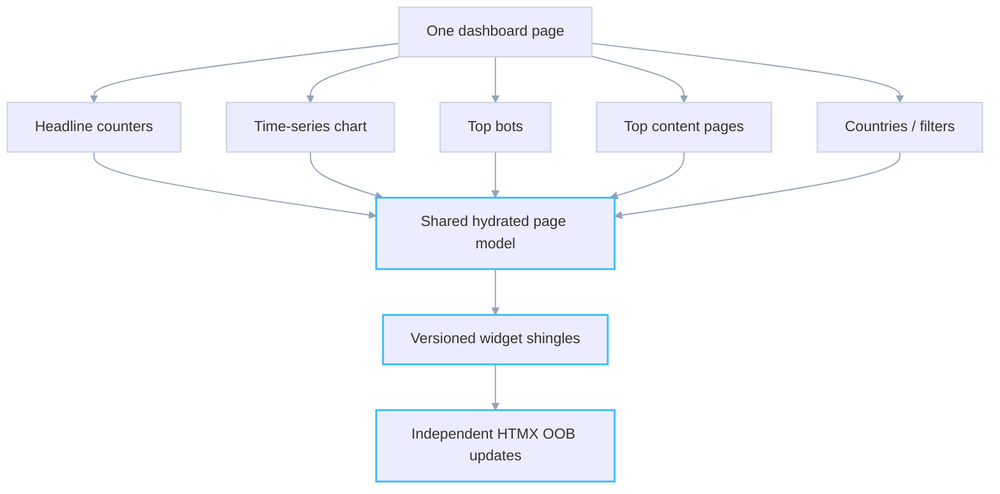
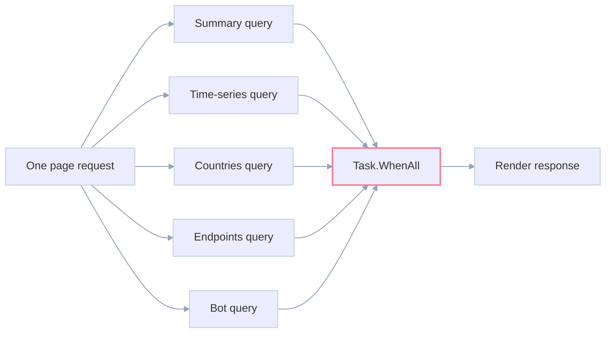
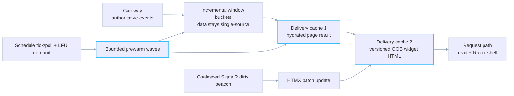
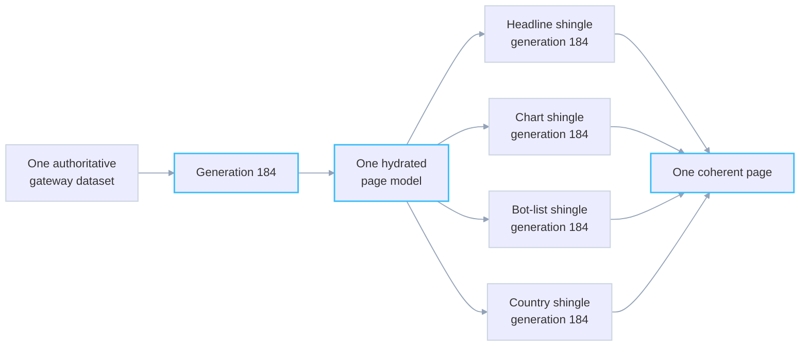
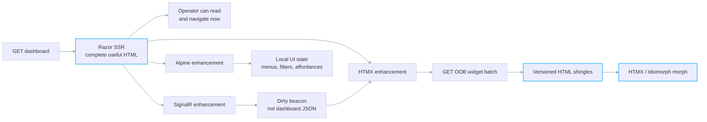
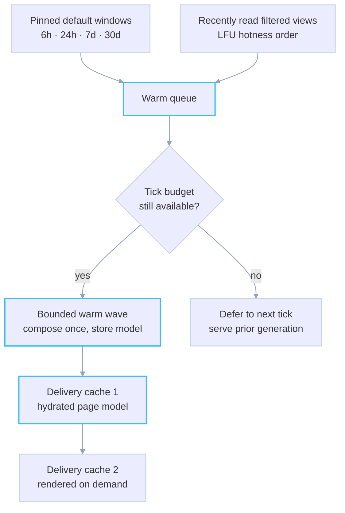

# Signal Shingle: a novel architecture for high-performance ASP.NET multi-widget sites
<!-- category -- AI,Architecture,ASP.NET,Performance,Patterns,StyloBot -->
<datetime class="hidden">2026-07-24T12:00</datetime>

*Part of the Stylo.Bot release series. [Behaviour-Aware ASP.NET UI](/blog/behaviour-aware-ux) covers the server-rendered dashboard surface; [Finding and Fixing Unbounded Growth](/blog/stylobot-release-reliability) covers the reliability discipline behind bounded state; [Learning to Get Faster](/blog/stylobot-release-learning) covers the earlier adaptive-cache work.*

**How do you deliver fast responses for complex dashboards without going crazy? You stop rendering them on the request path.**

[TOC]

---

## The problem: per-request fan-out

A dashboard is a deceptively expensive kind of page. It looks like one URL, but it is really a composition engine wearing a page-shaped coat.


> **Coming soon in Stylo.Bot**
>
> Signal Shingle is the upcoming dashboard architecture. The deployed dashboard above is the current surface. Its multi-widget shape is the problem this design solves.

The operator sees one dashboard; the server sees slow-moving aggregates, live lists and expensive windowed views.



The familiar ASP.NET implementation has every widget fetch its own data, starts those calls in parallel, then waits for all of them before rendering the page.



It looks fast with one person and a small dataset: around ten independent calls overlap, so the page takes roughly as long as its slowest widget rather than their sum. The arithmetic changes when the page becomes popular.

On the [Stylo.Bot](https://stylo.bot) dashboard, one normal page load meant around ten parallel calls across the website/gateway boundary. The 30-day view could scan more than a million rows. A single quiet load was already multi-second. Under concurrent traffic, the p95 went past seven seconds because every visitor was waiting for, and starting, around ten expensive operations.

Parallelism is useful. Per-request fan-out is the problem. At five concurrent viewers, around ten calls becomes around fifty competing calls. At fifty viewers it becomes around five hundred. The database connection pool sees an expanding storm of independently expensive work. Requests slow down, hold connections longer, and slow the next requests further.

> Parallel fan-out makes a single request look quicker by multiplying the pressure that destroys the system under load.

This is the wrong scaling curve for a dashboard. A dashboard is a shared observation surface. It should get cheaper as more people look at the same thing, not more expensive.

| Normal multi-widget dashboard | Signal Shingle dashboard |
|---|---|
| Each request starts its own data fan-out | Requests read a ready projection |
| Each widget can age and fail independently | Widgets derive from one generation-stamped model |
| More viewers create more database work | More viewers share warmed models and shingles |
| Load slows the response itself | Load stretches refresh cadence while responses stay fast |

For Stylo.Bot, the dashboard is most valuable during a bot surge or an incident, precisely when the data path is under pressure. The architecture therefore optimises for stability first: a fast, coherent snapshot with an explicit age is more useful than a theoretically fresher page that is slow, partial or unavailable.

---

## The solution: Signal Shingle

Signal Shingle treats each dashboard widget as a pre-rendered, self-contained page fragment. Its identity is the data it represents and how it is rendered: widget, row, window, filters and display parameters. Refresh cadence is deliberately not part of that identity.

Its fingerprint is simply `widget + normalised parameters + data-surface generation`. A country update should not invalidate a live-visitors card; a changed filter should not make every other widget cold. A new generation only re-keys the affected shingle.

These fragments live in a bounded LFU cache. Warm reads keep watched widgets resident; one-off filter combinations lose naturally.

[SignalR](https://learn.microsoft.com/en-us/aspnet/core/signalr/introduction?view=aspnetcore-9.0) says a surface changed; the client asks for the affected widget batch; [HTMX](https://htmx.org/docs/) applies the returned [out-of-band fragments](https://htmx.org/docs/#oob_swaps) with [Idiomorph](https://htmx.org/extensions/idiomorph/). The signal carries a dirty hint, never a copy of the dashboard data.

In the pattern, **signal** means “consider refreshing”; **shingle** is the independently addressable result.

The architecture separates the response contract from refresh work. The response is static-like: a fast, coherent snapshot from cache. The dynamic side is a separate, budgeted process that refreshes and delivers changed fragments. Load can slow refresh without slowing the page response.

Render-side shingles alone are insufficient. If every miss triggers a fresh database scan, the expensive work remains. Signal Shingle uses a two-level cache with one deliberately narrow hand-off between them.



---

## Data projection and delivery caches

The distinction is between a composed **model** and its rendered **widget delivery units**. Neither cache becomes an authority for detection data.

### Data projection: incremental buckets

The gateway owns the data. It holds a bounded, in-memory LFU projection of incremental, windowed buckets with 30-day sliding retention: a working set, not a second datastore.

Use fine buckets for six-hour and 24-hour charts, hourly rollups for long windows. The point is that a requested window merges buckets rather than re-reading raw events.

```text
last 24 hours  → merge 288 five-minute buckets
last 30 days   → merge 720 hourly buckets

not

last 30 days   → scan and aggregate 1,000,000+ event rows again
```

New observations update the newest bucket. The historical part is not re-scanned because a page was loaded. The gateway remains the only writer and the only place that decides what a detection means.

### Delivery cache 1: the hydrated content model

Upstream, the website caches hydrated dashboard models, keyed by normalised widget set, window, filters and generation. It bridges authoritative data and rendering.

Caching a model rather than full HTML keeps CSRF values, authentication chrome, feature flags and nonces on the request-rendered shell where they belong.

On a cold key, return a clear warming state rather than synchronously recomputing. Only the tick materializer earns a new page result. Later reads serve the latest successful generation, even while a newer one is in flight.

### Delivery cache 2: the shingle render cache

The dashboard is deliberately split: the gateway owns data; the website owns Razor and the browser relationship. Delivery cache 2 serves tiny updates locally without becoming a competing data store; it holds only versioned HTML derived from the gateway-backed page model.

Once a page model exists, a widget can be rendered as an OOB element and held in the bounded LFU shingle cache with a safety TTL. A warm shingle bypasses both composition and Razor rendering; a miss reads the already-warm page result where possible, renders only that widget, adds `hx-swap-oob="morph"`, and stores the result under its fingerprint.

The batch endpoint partitions widgets into warm fingerprints and misses, composes the supported misses once, then returns OOB HTML. A summary or countries change re-keys only that surface.

This is not redundant caching. Delivery cache 1 answers “what is the coherent dashboard model?” Delivery cache 2 answers “what DOM island can this browser receive?” The first makes composition shareable; the second makes partial updates nearly free.

---

## Cache boundary: why this is not response caching

Response caching is worth comparing directly. A normal response cache stores an opaque HTTP answer; independently cached widgets develop independent expiry and failure modes. The page can load quickly while no longer describing one coherent state. On an operational dashboard, a count that disagrees with the rows beneath it makes the operator investigate ghosts.

The familiar caching patterns are all useful. They simply protect different boundaries:

| Pattern | What it stores | Best fit | Why it is insufficient by itself here |
|---|---|---|---|
| [HTTP response cache](https://learn.microsoft.com/en-us/aspnet/core/performance/caching/middleware?view=aspnetcore-9.0) | An HTTP response, normally keyed by URL and request-vary rules | Public GET endpoints and CDN-friendly content | It knows nothing about the dashboard's internal widgets or whether their data agrees. |
| [ASP.NET output cache](https://learn.microsoft.com/en-us/aspnet/core/performance/caching/output?view=aspnetcore-9.0) | Generated server output, with explicit vary and eviction policy | Expensive pages with a small, stable request-key space | It can cache the page quickly, but it is still an opaque page result rather than a coordinated live projection. |
| Donut-hole / fragment cache | A cached shell with dynamic holes, or independently cached fragments | Pages whose chrome is stable and whose small dynamic regions are genuinely independent | It makes each hole its own cache lifecycle; that is exactly how a dashboard can become internally inconsistent. |
| Signal Shingle | One hydrated, generation-stamped page model plus versioned widget delivery fragments | A dashboard whose parts must update independently **and** continue to describe one state | The cache boundary is the composed projection; shingles are derived from it, not competing stores. |

Level-2 shingles *are* an output cache, deliberately small and fragment-shaped. The difference is that fragments do not decide data reality independently. The content model is composed first, under one generation; every shingle is a rendering of that model's slice.



When data changes, the affected composition receives a new generation. A browser may briefly see the prior one while an update is in flight, but that age is explicit and bounded. It is never a set of separately-owned caches making contradictory claims about “now”.

**One authority, one composed generation, many reusable delivery fragments.**

---

## SSR first, progressive enhancement second

Signal Shingle is not a JSON API with a client-side dashboard painted over the top. The Stylo.Bot dashboard is [Razor](https://learn.microsoft.com/en-us/aspnet/core/mvc/views/razor?view=aspnetcore-9.0) SSR first: meaningful counters, charts, tables, links and navigation before JavaScript runs. HTMX, SignalR and [Alpine](https://alpinejs.dev/start-here) then enhance that page rather than replace it.



> **The browser stack**
>
> [Razor](https://learn.microsoft.com/en-us/aspnet/core/mvc/views/razor?view=aspnetcore-9.0) renders the page on the server. [HTMX](https://htmx.org/docs/) requests and swaps HTML islands. [SignalR](https://learn.microsoft.com/en-us/aspnet/core/signalr/introduction?view=aspnetcore-9.0) carries small change beacons. [Alpine](https://alpinejs.dev/start-here) owns local interaction state. [Idiomorph](https://htmx.org/extensions/idiomorph/) updates an island while preserving stable DOM nodes such as focus and hover state.

Remove any one of them and the SSR page remains useful; add all three and it gains live, low-churn updates.

### Why this is not a client-rendered dashboard

The primary reason is simple: the dashboard must be useful to every client without requiring JavaScript. A browser with scripts disabled, a slow connection, an assistive client, an automation tool or a crawler still receives meaningful HTML, links, tables and controls. JavaScript improves the experience; it is not the admission ticket.

A client-rendered dashboard is a good fit when rich local application state is the product. It would leave this dashboard dependent on JavaScript before it can show data. It would also either recreate composition logic in the browser or make the browser coordinate widget APIs, turning it into another stateful participant in freshness, retries, errors and consistency.

| Client-rendered dashboard | Signal Shingle dashboard |
|---|---|
| Browser fetches JSON and owns rendered view state | Server composes the model and renders HTML; browser enhances it |
| Client reconciles independent responses, loading states and stale data | Server stamps one coherent generation before delivery |
| First useful content depends on JavaScript and API completion | First useful content is SSR HTML; live updates arrive later |
| Best when rich local application state is the product | Best when the dashboard is a shared operational projection |

The design keeps the dashboard universal by default: gateway data and composition on the server, page rendering on the website, and optional short-lived interaction state in the browser.

---

## Refresh is a scheduled job, not an accidental side effect of traffic

Refresh happens outside the page request. This is a hard boundary: a cold read returns a warming result, while only the tick materializer composes. The page request is a read of a coherent projection, never an excuse to begin expensive data work.

The coordinator queues pinned and recently-read envelopes, then warms them in bounded waves with a page-count and wall-clock budget. Within a wave it batches compatible work; a measured cost budget can stop later waves entirely. This is not `Task.WhenAll` wearing a new name.

The concurrency limit is part of correctness: the refresh loop gets a known capacity budget, never an unbounded set of connections. A fully warm request does no composition or Razor rendering at all.

**Orchestrated, not a storm.** That is the operational rule.

### Prewarming is coverage, not wishful caching

A cache cannot protect the first request if it only warms *after* that request arrives. So the materializer has two jobs. **Pinned defaults** keep the real 6h, 24h, 7d and 30d window choices warm. **Demand-gated envelopes** cover filters people actually use, ranked by access count and recency. Only a genuine request keeps one live.



Prewarming must match the real product surface. If the UI offers four normal windows and the warmer knows one, three quarters of the expected first-click path are still cold.

---

## LFU is not merely eviction: it is the demand signal

LFU is more than eviction here. Access is the demand signal: it decides what remains resident, which due work refreshes first, and what can safely disappear. That makes unbounded filter space manageable. A country filter watched all day stays warm; a filter tried once ages out. No separate “popular dashboard” table is needed.

---

## Stability under pressure

Traditional live dashboards respond to more traffic by doing more work, then become least useful at the point operators most need them. Signal Shingle reverses that relationship. The refresh controller measures refresh cost against a budget; expensive cycles stretch effective intervals, cheap ones contract toward the requested cadence.

```text
refresh cost <= budget  → preserve requested cadence
refresh cost >  budget  → lengthen effective cadence
cost settles            → cautiously shorten it again
```

This is a closed loop on the protected resource, not a guess from raw RPS. Under load the system moves toward a static snapshot instead of creating more database work to maintain an impossible promise of liveness. Stylo.Bot therefore becomes calmer as the incident gets louder.

> Load makes the dashboard do less work, not more. That is why the pattern degrades instead of collapses.

“Static” is not failure. It is the last known coherent projection, bounded by a freshness policy and labelled honestly.

### Static and dynamic by design

The separation above gives the dashboard a fast response contract and a separate budgeted refresh process. Scheduler-driven due checks, optional SignalR acceleration for live widgets and reconnect resync keep the dynamic side current. The response remains quick even when the snapshot becomes older, and the age remains visible.

So the system can slide continuously between two useful modes:

```text
quiet / cheap refreshes       → dynamic dashboard, short effective cadences
busy / expensive refreshes    → static-like snapshot, longer declared cadences
```

That is adaptive scaling built into the architecture, not a panic switch added after the pool fails.

---

## Freshness belongs to the widget: one non-negotiable invariant

Not every widget deserves the same freshness. A trend graph or endpoint ranking can be minutes or an hour behind; a list of recent visitors or current scores needs a tighter cadence. The cadence lives with the widget's freshness class.

| Class | Typical widgets | Base cadence | Why |
|---|---|---:|---|
| Aggregate | summary, trends, countries, endpoints | minutes to an hour | The signal changes slowly enough that stability is more valuable than churn. |
| Live | recent visitors, sessions, names, scores, threats | around a minute | The operator is looking for current movement. |

Two visibly identical widgets can ask for different cadences. Putting cadence into the cache key duplicates data; accepting the first cadence can leave a later consumer stale.

The invariant is simple:

> A shared cache entry must never serve staler than any of its active consumers requested.

Formally:

```text
effective cadence(entry) = MIN(requested cadence of every active consumer)
```

Cadence is a per-consumer *floor*, not part of the signature. If one consumer asks for 60 seconds and another for five minutes, one shared entry refreshes every 60 seconds. When the fast consumer leaves, recompute the minimum; when no consumers remain, stop scheduling and let LFU reclaim it.

An active consumer is a short-lived, renewable demand lease created by a real request. Continued reads renew it; expiry is departure. The scheduler only includes live leases when it calculates the minimum cadence.

---

## Honest chrome and consistency rules

An adaptive system should be honest about its adaptation. Widget chrome shows the current effective cadence: “updating every 60s”, “updating every 5m”, “data as of 10:42”.

There are a few rules needed to keep a projection honest:

- **Generation stamps.** Each chunk/shingle records the data generation it was built from. The beacon and response generation stamps are compared, so an older update cannot overwrite a newer view.
- **Coalesced signals.** A busy detector may produce many events per second. The signal path batches them into one dirty beacon and one refresh decision rather than firehosing the browser or the refresh loop.
- **Resync on reconnect.** A reconnect is not treated as proof that nothing happened. A due-check closes the missed-pulse gap deterministically.
- **Bounded TTL fallback.** A retained chunk is not allowed to become immortal. Once it exceeds the class-specific staleness bound and cannot refresh, it becomes cold/warming rather than silently lying forever.
- **No content leakage.** Live shingles may contain names, fingerprints or scores. Their contents stay in memory, are not logged, and any diagnostics redact them by default.

The goal is not instant consistency. It is a projection whose age and generation are bounded, observable and never accidental.

---

## Benefits and trade-offs

The benefits are structural: stable request latency, one coherent page generation, shared work for popular views, and useful SSR without JavaScript. Under pressure, the system serves an honest older projection instead of turning every page view into more database pressure.

The costs are real. This architecture adds a scheduler, cache keys, generation tracking, demand leases and observability that a normal controller does not need. A cold filtered view may show a warming state before it becomes live. Operators must choose acceptable freshness bounds rather than pretend every surface needs real-time data. Each website replica also needs its own bounded cache and refresh signal; cache contents are deliberately local, not a new shared authority.

It is a poor fit for a write-heavy, deeply personalised application where every response is unique, or for a surface that truly requires every user to see every change immediately. It is a strong fit for shared, read-heavy operational dashboards where fast, coherent observation matters more than pretending every number is instantaneous.

Signal Shingle composes familiar ASP.NET pieces: an LFU, SignalR, batched composition, Razor, HTMX and a scheduler with a real concurrency budget. The gateway stays authoritative; the website serves a projection; the browser receives small versioned fragments.

The dashboard remains fast because observation no longer causes computation.
