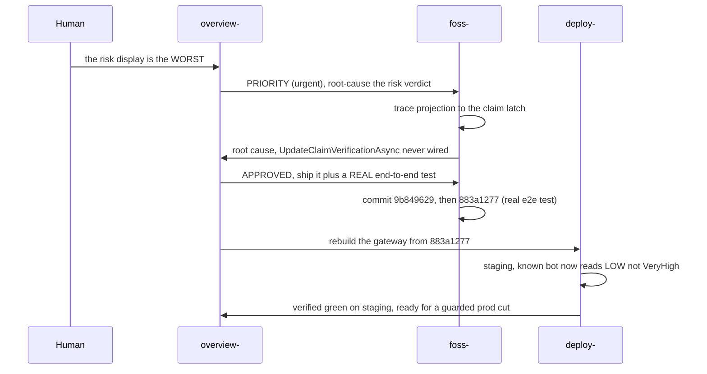

# The StyloAgent Workflow: How I Build and Manage Large (and HUGE) Systems Using Code LLMs (Part 2)
<!-- category -- AI,Architecture,LLM,Agents,StyloAgent,Patterns -->
<datetime class="hidden">2026-07-18T16:05</datetime>

**Part 1 was the shape of the thing. This part is what it does.**

A model only earns its keep under real work : dropping the fleet on a codebase it has never seen, pushing one change across repositories, and keeping a decision trail that survives a restart. This half of the piece is that work, and it ends with a full example pulled straight off the bus.

*Continues from [Part 1](https://www.mostlylucid.net/blog/styloagent-workflow), which covered the core problem (architectural drift), why more context does not fix it, and the StyloAgent model.*

[TOC]

---

## Understanding Existing Systems

Drop the fleet on a system it has never seen, and watch what happens. That is roughly how StyloAgent started on Stylo.Bot : the engine's core logic lived in the sibling FOSS repository, and nobody in the fleet understood it yet.

`overview-` went exploring. It ran read-only exploration passes over the FOSS core and traced the real pipeline : a scoped orchestrator that owns a per-request signal sink, feeding a singleton detection engine that runs wave-ordered detector atoms, producing a ledger, then a signature and a risk verdict with three axes derived at read time.

Then it wrote that understanding down as `architecture.md` : a code-grounded C4 component diagram where every component is coloured by its owning agent. The diagram doubles as the ownership map. **Grey means no owner yet**, and grey is a signal : it showed that several commercial services had no specialist, and that the commercial backend was being held by `overview-` alone.

That is the part repo-summary tools miss. The output is not a one-off summary that goes stale the moment it is written. It is a maintained document. As specialists report back, `overview-` folds their findings into the spec, then the architecture, then the roster. Understanding emerges, ownership emerges, and both keep getting more accurate instead of decaying. The map is alive because the people who own the territory keep correcting it.

---

## Working Across Multiple Repositories

Repo-centric tooling treats the repository as the unit of the world. StyloAgent treats it as an implementation detail. **Specialists own domains, not folders**, and a domain crosses repos.

The two Stylo.Bot repos register as one workspace. `foss-` owns detection wherever it lives, and it lives in both, joined by a seam : the FOSS engine defines `IFingerprintStore`, the commercial layer swaps in a Postgres implementation through DI. The known-bots fix rode that seam. It was a FOSS commit, but detection ships inside the commercial gateway image, so `deploy-` rebuilt the gateway, staging confirmed the bot now read low, and it stayed correct against the commercial Postgres store because that store sits behind the same seam the FOSS test exercised in SQLite. One change, two repositories, three specialists, held together by whoever owns the seam. My own packages work the same way : touch `Mostlylucid.Ephemeral` and you have changed a contract every product depends on.

Here is the part I like most. I keep four repos in flight at once, each with a specialist that holds only its own context. Ask one agent to hold four repos at the same time and it randomises its context : the auth details bleed into the detection reasoning, the deploy constraints blur the persistence rules, and every answer gets a little worse. Separate specialists keep the contexts apart, so four active repos is four focused agents, not one confused one. No code LLM I have used does that on its own.

---

## The Architecture Never Sleeps

The quiet benefit shows up when nobody is coding. In a normal workflow, the moment you close the session the understanding is gone : it lived in a context window and the window is closed.

Here it persists on disk. Each specialist's knowledge sits in its saved context. The architecture, the spec, and the roster sit in `overview-`'s living documents. These files are the durable form, and they survive every restart. There is no daemon holding state in memory that a crash would erase.

That means architectural intent outlives any individual run. When `overview-` comes back after a compaction event, it reads a checkpoint that starts with the current state and the hard lessons of the last session, and it is oriented in one read. When `foss-` comes back, it knows commit `9b849629` shipped and that one face of the risk issue is still open. **Long-term memory is not a feature bolted onto the side. It is intrinsic**, because the act of stopping work is the act of writing down what the work was.

---

## Every Decision Has Provenance

The message bus does more than route work. Because the specialists coordinate through it, and every message lands in the channel, the reasoning behind each decision is captured as it happens. Not written up afterwards in a doc nobody updates. Captured in the moment, in the words the specialists actually used.

> The conversation is the documentation.


Here is a real sequence from this fleet, pulled straight off the bus. It starts with `overview-` routing the risk issue to `foss-`, marked urgent :

```
From: overview-   Priority: urgent
# PRIORITY: the RISK display+correctness on the dashboard (human: this is the WORST)
Known bots showing VeryHigh ... known-good bots should latch friendly/Verified.
Report root cause + fix.
```

`foss-` investigated and came back with the root cause : the verified-claim latch was never wired. `overview-` approved and added two conditions, both engineering decisions worth keeping :

```
From: overview-   Priority: normal
# APPROVED - ship it (TDD). No DB op = perfect; add a REAL test of the wired flow
1. ADD A REAL TEST that exercises the ACTUAL wired flow end-to-end ... NOT one that
   manually calls UpdateClaimVerificationAsync. That's the exact false-confidence gap
   that hid this.
2. The CF / real-client-IP caveat is real ... if the gateway sees CF egress, the latch
   never fires.
```

Both notes are provenance. The first records that a previous test faked the flow and hid the bug, so this time the test must drive the real path. The second records a cross-boundary risk and hands it to `deploy-`. `foss-` shipped commit `9b849629`, then replaced the shallow test with a real end-to-end one in `883a1277`, and `overview-` closed the loop :

```
From: overview-   Priority: low
# 883a1277 real E2E test = exactly right; told deploy- to build it.
... drives the actual orchestrator + real store + real projection, no manual call ...
that fully closes the false-confidence gap that hid this.
```

Six months from now, when someone asks why the claim latch is wired where it is, the answer is not lost. It is on the bus, in order, with the commit SHAs attached. The decision has provenance because the decision was a conversation, and the conversation was saved.

---

## Why This Reduced My Workload

This did not make me write code faster. The models were already fast. It cut cognitive load, which was the real cost.

**I stopped being the integration bus.** Before StyloAgent, I was the only component that understood how the detection engine, the gateway build, the Postgres store, and the deploy pipeline fit together, so every cross-cutting change routed through my head. I held the constraints. I remembered the seams. I re-explained the architecture to whichever agent I was talking to. That work read as just knowing my own system, and it was a tax the whole time.

Now the reconstruction happens once and is written down :

| Before | After |
|--------|-------|
| Re-explain the one-DB seam every session | Encoded as an invariant the specialists honour |
| Context-switch across four domains to land one change | Route the change; each specialist carries its own context |
| Remember what shipped last session | The saved context remembers for me |

What is left is the part worth doing : deciding what to build, and letting the owners build it.

---

## Where This Could Go

These are ideas, not promises. The workflow works today for one engineer and one fleet. The directions it points are more speculative :

- **Cross-machine specialists.** A fleet could span machines, with a specialist running wherever its domain's system runs.
- **Team collaboration.** Several engineers sharing one fleet, each routing work to the same persistent specialists, so the architectural memory is shared rather than trapped in one person's setup.
- **Remote expertise.** A specialist that owns a domain reachable by people who do not own it, the way you ask the payments person a question without becoming the payments person.
- **Shared specialist packs.** A detection specialist or a Kubernetes specialist handed to another team as a starting point rather than built from nothing.
- **Organisation-wide architectural memory.** Accumulated understanding held by specialists that persist across people leaving and joining, so the knowledge does not walk out the door when the engineer who held it does.

That last one is far off, and I am not claiming it.

---

## A weird use case, and no contributions

My use case is weird. I am one person running what amounts to an engineering organisation of agents across a constellation of my own products and packages, so I can hold four repos in flight without my own head being the bottleneck. Most people do not have that problem. I am not pitching this as a workflow everyone should adopt. It solved mine.

For the same reason, I do not accept contributions. Fork it, make it your own, take it somewhere I would never think to. The releases are here if you want to start from a build rather than source :

[](https://github.com/scottgal/styloagent/releases)

---

## Conclusion

The fix was not a coding agent with a bigger memory. It was a change in shape : from one agent that tries to know everything, to many specialists that each own something and talk to each other. Ownership is persistent, the reasoning lives on the bus, and the architecture no longer lives only in my head.

That is the whole trick. Not a smarter model, a team : specialists who keep their domains, an architect who keeps them coherent, and a record of every decision that outlasts the session it was made in. It holds the architecture so I do not have to.

---

## Appendix : The Workflow in Practice

Here is the known-bots risk fix, start to finish, as it actually moved through the fleet. Every commit and message below is real.

1. **Overview receives the request.** I told the fleet the worst thing on the dashboard was the risk display. `overview-` framed it as one investigation with two faces : risk not shown, and risk wrong when shown.
2. **Overview routes to the specialist.** An urgent message to `foss-`, the detection engine owner, with the guardrail that any production fingerprint-DB re-derive needs staging first and an explicit human go.
3. **The specialist investigates.** `foss-` traced it to the claim latch and found the real cause : `UpdateClaimVerificationAsync` had zero callers in production. It also noticed the existing test faked the call, which is why the gap stayed hidden.
4. **Discussion occurs.** `overview-` approved under TDD and added two conditions on the bus : add a real end-to-end test, and confirm the CF real-client-IP caveat with `deploy-`.
5. **The code agent implements.** `foss-` wired the latch at the orchestrator seam. Commit `9b849629`. No production DB operation needed; it self-heals as bots re-crawl.
6. **Tests run.** The first test proved the store was called. `foss-` then added a real end-to-end test driving the actual orchestrator, real store, and real projection. Commit `883a1277`.
7. **Documentation updates.** None separately. The root cause, the two conditions, and the commit SHAs are all on the bus in order.
8. **The specialist dehydrates.** `foss-` writes its saved context : `9b849629` shipped, `883a1277` landed, one face still open, guardrails carried forward.
9. **Knowledge is retained.** The fix rode into a gateway rebuild owned by `deploy-`, verified on staging, and became eligible for a guarded, digest-pinned production cut. When the next question about the claim latch comes, it lands on `foss-`, which already owns the answer.

The whole loop, as it moved across the bus :



Nobody wrote that sequence up after the fact. It is the actual order of messages on the bus, and it is the documentation.

---

## Related Articles

- [The StyloAgent Workflow (Part 1)](https://www.mostlylucid.net/blog/styloagent-workflow) - the core problem and the StyloAgent model, the first half of this piece.
- [Why LLMs Fail as Sensors](https://www.mostlylucid.net/blog/llms-fail-as-sensors) - the category error of using a probabilistic synthesizer as a boundary device.
- [MCP Is a Transport, Not an Architecture](https://www.mostlylucid.net/blog/mcp-is-a-transport-not-an-architecture) - why the architecture lives above the protocol, not inside it.
- [Stylo.Bot: How Bots Got Smarter (Part 2)](https://www.mostlylucid.net/blog/botdetection-part2-signature-pipeline-and-stylobot-architecture) - the detection engine this fleet builds and runs.
- [The Sidecar Architecture](https://www.mostlylucid.net/blog/sidecar-architecture) - how the Stylo.Bot engine connects to any stack.
