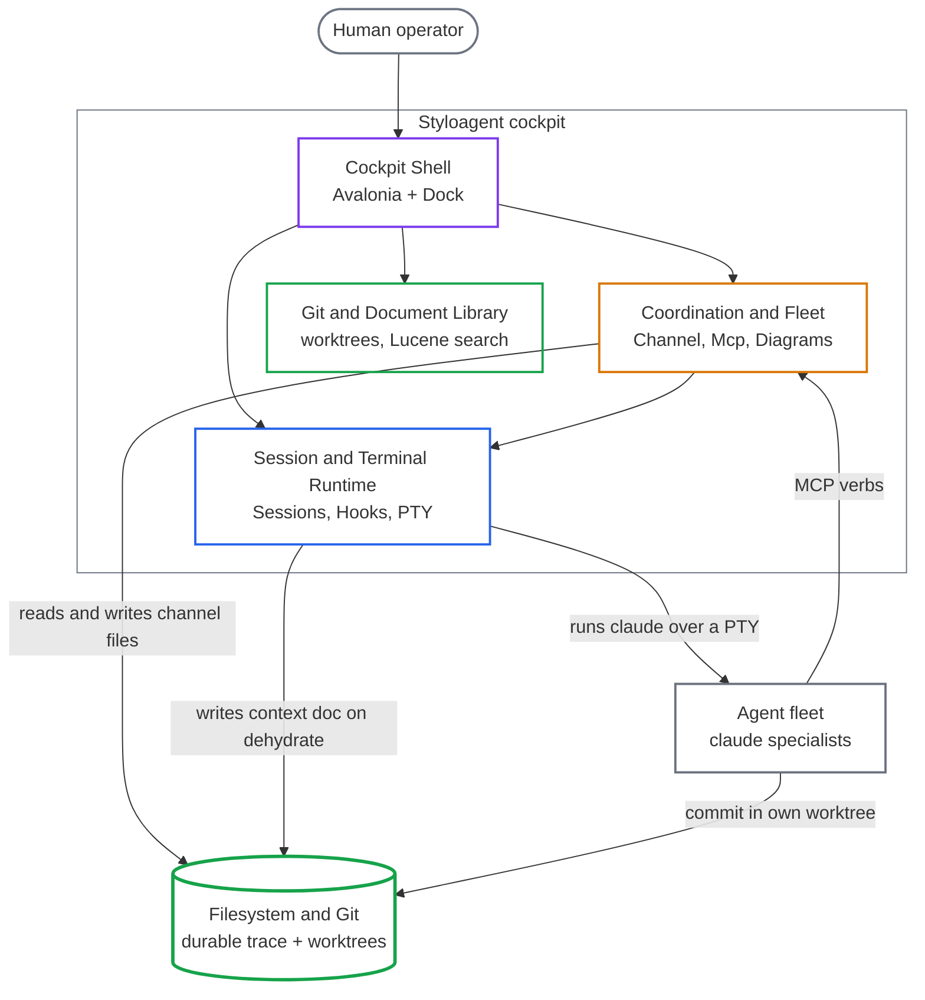
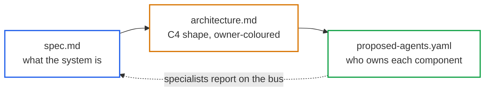
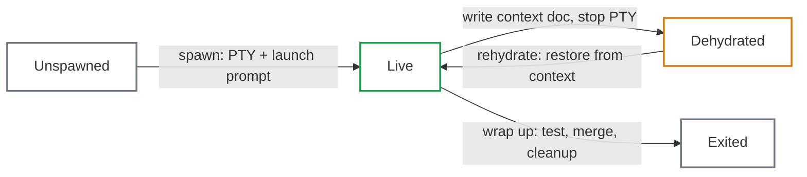

# The StyloAgent Workflow: How I Build and Manage Large (and HUGE) Systems Using Code LLMs (Part 1)
<!-- category -- AI,Architecture,LLM,Agents,StyloAgent,Patterns -->
<datetime class="hidden">2026-07-18T16:00</datetime>

*This is Part 1 of two : the problem and the StyloAgent model. [Part 2 : The Workflow in Practice](https://www.mostlylucid.net/blog/styloagent-workflow-part2) applies it.*

**Code generation stopped being the problem a while ago.** The models write good code. They follow the conventions in the file they are editing, and if you point them at a failing test they usually fix it. That part works.

The part that does not work is memory.

> The bottleneck is no longer "can the model write the code?" It is "does the thing writing the code remember why the system is the way it is?"

Every fresh session starts knowing nothing about the system it is about to change. It rediscovers that [Stylo.Bot](https://stylo.bot) is two repositories, that the risk band on the dashboard is derived at read time and never cached, that there is exactly one database connection factory and a SQLite store must never shadow-write alongside Postgres. None of that is in the file being edited. It lives in the architecture, and the architecture lived in my head.

This is about the workflow I built to stop paying that cost. I call it StyloAgent, and it is the fleet that builds and runs Stylo.Bot today.

[](https://github.com/scottgal/styloagent/releases)

[TOC]

---

## The core problem: architectural drift

Stylo.Bot's detection engine is not a plain ASP.NET CRUD app. It runs on an Ephemeral, signals-and-atoms architecture : atoms hold state, signals announce, a scoped `SignalSink` per request is the blackboard, a single `ScheduleCoordinator` emits tick cadence signals instead of a pile of background services, classification is nearest-centroid with drift rather than rules, and verdicts are derived fresh at read instead of cached. That shape is the whole point of the product. It is what lets it learn from observed behaviour instead of matching a static list.

A code LLM does not want to build that. It wants to build the thing it has seen a million times in its training data : plain CRUD. Ask a fresh agent to add a feature and it reaches, every time, for the ASP.NET reflex :

| The ASP.NET reflex (plain CRUD) | Stylo.Bot's intended pattern (Ephemeral) |
|---|---|
| A `BackgroundService` per periodic job | One `ScheduleCoordinator` emitting tick signals |
| A `ConcurrentDictionary` used as a store | Atoms hold state; no in-memory persistence |
| A `switch` mapping a string to a category | Nearest-centroid classification, drift, Leiden |
| Cache the computed value for locality | Derive it fresh at read (compute-at-read) |
| A bare `DbContext` in middleware | State lives in the engine, read over a seam |
| An `ILogger` to inspect what happened | Signals announce; the SignalSink is the blackboard |

Every cell on the left is textbook ASP.NET and correct in a normal app. Every cell on the left is wrong for Stylo.Bot. The repo has a `CLAUDE.md` that says so, explicitly : centroids not rules, no background services use the ScheduleCoordinator, no in-memory stores, no caches favour freshness over locality, signals and atoms not ASP.NET norms.

It did not hold. `CLAUDE.md` loads fresh into every session, and every session it competes with the model's priors and loses. The model regresses to the mean of its training data, which is CRUD.

**This cost weeks of rework.** Not one dramatic outage, a slow bleed : a `BackgroundService` reverted to a coordinator tick, a `ConcurrentDictionary` that had quietly become a parasitic store deleted, a `switch` statement swapped back for a centroid lookup, session after session after session. The bug was never the point. The drift was the point. A per-repo instructions file is retrieval, and retrieval was not enough : the agent had the rules in front of it, did not understand why the Ephemeral shape mattered, and eroded it anyway.

Not "the agent can't code" but "the agent can't hold the architecture." No bigger instruction file fixed it. Giving the architecture an owner did.

---

## The scale of the thing

Scale did not cause the drift. It multiplied it.

Stylo.Bot is not a toy. It is a bot-detection platform : a FOSS detection engine that fronts web apps through a YARP gateway, plus a commercial layer with fleet management, a live config editor, Postgres and pgvector persistence, commercial LLM providers, a reporting engine, membership and per-domain licensing, and a Kubernetes operator.

Counted honestly:

- Two main repositories for Stylo.Bot : the FOSS detection engine and the commercial layer.
- Around twenty-five projects inside the commercial repo alone.
- A host of my own NuGet packages the products share : [`Mostlylucid.Ephemeral`](https://github.com/scottgal/mostlylucid.ephemeral) (the substrate), [`StyloExtract`](https://github.com/scottgal/styloextract), [`StyloFlow`](https://github.com/scottgal/styloflow), [`StyloIssues`](https://github.com/scottgal/styloissues), [lucidVIEW](https://github.com/scottgal/lucidview).
- Infrastructure : Helm charts, a microk8s cluster, a secret store, a container registry.
- A marketing site that runs the checkout and embeds the real dashboard.

Every one of those is a surface the drift can leak into, and a fresh agent has to hold the same Ephemeral discipline on all of them. A change to a single detection seam ripples into the gateway, the commercial plugin, the dashboard projection, and the deploy pipeline. Writing the change was never the hard part. Holding the architecture steady while making it, everywhere it lands, session after session, was.

---

## The Myth of the Single Super-Agent

The industry keeps reaching for the same answer : give the agent more context. Bigger windows. Million-token prompts. RAG to pull in the right files. MCP to reach live systems. Memory layers that summarise past sessions and replay them.

**All of that improves retrieval. None of it improves understanding.**

Retrieval finds the relevant file. Understanding knows why the file is the way it is, what invariant it protects, and what breaks two repositories away if you change it. A bigger window lets an agent read more at once. It does not let the agent remember what it concluded last Tuesday.

That re-derivation is the real cost. Watch a cold agent start on Stylo.Bot :

1. It greps for the detection pipeline.
2. It reads the orchestrator.
3. It works out that the verdict has three axes and is composed, not stored.
4. It notices the commercial plugin replaces FOSS seams through dependency injection.

Thirty minutes later it knows enough to make a one-line change. Then the session ends and all of it evaporates. The next session pays the same thirty minutes. A larger context window makes each rediscovery cheaper. It does not make the rediscovery unnecessary.

A smarter search is the wrong fix. The search itself has to stop happening.

---

## How Humans Actually Build Software

No single engineer understands an entire enterprise system. Nobody at a real company holds payments, auth, the data pipeline, and the frontend in their head at full resolution at once. That is not a failing. It is how large systems are built.

Teams decompose the system into domains and put a specialist on each one. The payments person owns payments. They know the history, the sharp edges, the decision from two years ago that looks wrong until you remember the migration it was protecting.

**Ownership matters more than encyclopedic knowledge.** The specialist does not need to know everything. They need to know their domain deeply, and know who to ask about the rest.

What keeps a decomposed system coherent is communication. The payments person talks to the auth person before changing the token format. A pull request crosses a boundary and the owner of that boundary weighs in. The architecture stays consistent not because one person holds all of it, but because the people who hold pieces of it talk to each other.

This works. It is how every real team operates. Coding agents get run the opposite way, a way no engineering team ever would.

---

## My Problem Was Different

The drift would be a nuisance in one small app. Across the systems I own it is corrosive, because they are not one system. They are separate products, in separate repositories, that dogfood each other through packages I also own.

The substrate is `Mostlylucid.Ephemeral`, my own NuGet package : the execution primitives and dataflow the detection engine is built on. Stylo.Bot pulls in more of my packages on top of it : `StyloExtract` for layout-fingerprint matching, `StyloFlow` for signal-driven workflows and licensing, `StyloIssues` for the feedback UX on the marketing site. StyloAgent, the fleet in this article, is built from my packages too : lucidVIEW renders its documents, and [`Mostlylucid.Avalonia.UITesting`](https://github.com/scottgal/lucidRESUME) generates its screenshots. I build the products with the tool, and I build the tool from the products.

That is real dogfooding, and it is what makes drift dangerous. A fresh agent that regresses an Ephemeral primitive back to a `BackgroundService` or a `ConcurrentDictionary` is not denting one app. It is eroding a package every one of those products stands on. The drift ships in one repository and surfaces in a product two repositories away, where the agent that wrote it never looks.

**One drifted primitive. Every product built on it.**

Coding was never the hard part at this scale. Holding the architecture against constant regression was, everywhere it could leak.

---

## Ownership, Not Context

Context is the wrong axis. The cost scales with the number of sessions, not the size of the window, so a bigger window loses to a longer-lived project every time. The axis that works is ownership :

> The problem is not "how do I give one agent more context?" It is "how do I give many specialists persistent ownership?"

Load knowledge into a window and it dies with the window. Give it to a specialist and it carries forward. The detection specialist does not reload the detection architecture each session. It already owns it, and it starts from what it worked out last time, because last time it wrote that down as itself and not as a summary for someone else.

A session then pays to extend the system, not to re-derive it. That is a new hire every morning versus a team where people keep their jobs.

---

## The StyloAgent Model

StyloAgent turns that structure into running processes. The parts :

- **Overview** : the architect and coordinator (`overview-`). It holds the three living documents (spec, architecture, roster), arbitrates scope disputes, and routes incoming work. It does not do the domain work itself.
- **Specialists** : domain owners. `foss-` owns the detection engine. `deploy-` owns the build-to-staging-to-production pipeline. `mae-` owns membership and ecommerce. `dash-` and `edit-` own the dashboard read and write paths. `prod-` owns platform security. `test-` owns the suite. Each owns files, not tasks.
- **The message bus** : a git-backed, file-drop channel with `inbox`, `outbox`, `archive`, and `saved-context`. Messages carry a priority and surface at an agent's turn boundary.
- **Rehydration and dehydration** : every agent keeps a living context document. It dehydrates when it stops and rehydrates when it wakes.
- **Workspaces** : the FOSS repo and the commercial repo register as one workspace. The architecture exists above both.
- **Communication** : one hard rule. Stay in your lane. Hit a blocker in a file you do not own, and you stop and message `overview-` rather than colliding with the owner.


### What it actually is

StyloAgent is a desktop cockpit, built in .NET 10 and Avalonia. Each specialist is a real `claude` process running over a PTY, with its own terminal in the cockpit, its own git worktree, and its own context document. The cockpit hosts the MCP server the agents call and the hook socket that reports their state. The product itself is built by four owners, and the architecture doubles as the ownership map :



**MCP is the core.** The cockpit hosts an MCP server, and everything a specialist does to coordinate is an MCP tool call against it, not a convention or a file it hopes another agent reads. The verb set is the coordination layer :

- `send_message` / `check_inbox` : route work and pull it, priority-resolved.
- `spawn_agent` : an owner splits off a new specialist under it.
- `claim` / `heartbeat` / `release` : serialise access to a shared environment (an SSH host, a deploy target) so two agents do not collide.
- `dehydrate_agent` / `rehydrate_agent` : park a specialist and restore it.
- `wrap_up` : test, merge, and clean up a finished branch.
- `report_issue`, `architecture_impact`, `agent_color`, `list_fleet` : file a blocker, preview a design change before it lands, keep the roster and the C4 on one colour scheme.

The file-drop channel underneath is the durable trace of what was said, not the mechanism. The mechanism is the MCP server delivering to a live agent at its turn boundary. Git worktrees give each specialist an isolated tree to commit in, but the MCP layer is what makes them a fleet instead of a set of processes that happen to share a folder.


### How the bus actually delivers

`send_message` writes a durable markdown file into the channel and also delivers in-process. A `ChannelDeliveryCoordinator` watches for new files, keeps a seen set so each message is delivered exactly once, routes it to the live recipients, and hands the actual push to a delivery service.

How hard a message interrupts is not a free-for-all. A message carries a priority, and the runtime resolves that priority into a delivery mode. This is the real `DeliveryMode` enum, an interruption ladder :

```csharp
public enum DeliveryMode
{
    Interrupt,       // send ESC to break the current turn, inject immediately
    NextPrompt,      // queue; inject when the agent next reaches idle
    Poll,            // not pushed; the agent checks on its own cadence
    Convenient,      // surfaced in the Bus HUD only
    Informational,   // never actioned or injected; shown as info
}
```

Delivery is idle-gated and at-least-once, and the acknowledgement is an observed side-effect, not a promise. An urgent message breaks into the current turn. A normal one waits for the next idle prompt so it does not corrupt an agent mid-thought.

### How ownership is enforced

Staying in your lane is not an honour system. The architecture has a machine-readable projection, `ownership.yaml`, and an `OwnershipMap` resolves any repo-relative path to the agent prefix that owns it, most-specific glob winning :

```csharp
// most-specific glob wins, so a session- carve-out inside cockpit-'s
// src/Styloagent.App/** beats the broad glob
public string? OwnerOf(string? path) { /* ... */ }
```

A PreToolUse gate consumes that resolver and stops an agent from writing a file another agent owns, with sensible exemptions : `overview-` can cross boundaries because it arbitrates, unowned files are shared, build output and tests are exempt. The map is the same data that colours the C4 diagram. The picture of who owns what and the enforcement of who owns what are one source, never two drifting copies.

### The living-docs loop

`overview-` does not freelance. Its system prompt puts it on rails : work top-down in three layers, and do not skip ahead.



Spec first : what the system is, agreed with the human before anything else. Then shape : a single C4 component diagram where each component is coloured by its intended owner. Then fleet : one proposed agent per top-level component, sharing its component's colour. As specialists learn the real system and report on the bus, `overview-` folds their findings back into the spec, re-derives the shape, and adjusts the fleet. The three documents stay a live projection of the design instead of decaying into fiction.

---

## Specialists Instead of Tasks

Most agent tools create workers. Describe a task, a worker spins up, does it, disappears. The next task gets a new worker with no memory of the last one. Expertise never accumulates because there is nothing for it to accumulate in.

StyloAgent creates experts. `foss-` is not a worker that touched the detection engine once. It is the detection engine's owner, and it stays the owner across every session. That difference is not cosmetic. It is why the fleet caught a bug a task-based worker would have missed.


Known bots were showing up on the dashboard scored as very high risk. The obvious move, the one a fresh worker makes, is to redeploy the projection that derives the risk band and assume the fix takes. `foss-` did not do that, because `foss-` knew the projection already existed and knew where to look underneath it. It found that the risk band pins to friendly only when a fingerprint is stored with a verified claim status, and that the method which sets that status, `UpdateClaimVerificationAsync`, had **zero callers in production**. Written and never wired. Every fingerprint stayed unverified forever, so every known bot read as very high risk, and redeploying the projection could never have fixed it.

That diagnosis came from accumulated ownership. `foss-` had already mapped the orchestrator, the verdict composer, and the claim latch in earlier sessions. The bug was invisible to a search and obvious to an owner.

StyloAgent proves this on itself. The tool is built by its own fleet : `cockpit-` owns the Avalonia shell, `bus-` owns coordination and delivery, `session-` owns the PTYs and the spawn state machine, `repo-` owns git and the document library. Standing owners, not one-shot tasks. The hard lessons they learn get written into their context so they never relearn them. A real fragment from `session-`'s own context document :

```
## HARD-WON DISCIPLINE (enforced this session, confirmed by overview-)
- Commit by explicit pathspec, atomically, in ONE command. The shared tree has ONE git
  index. A bare `git commit` after `git add` lets ANOTHER agent's concurrent commit sweep
  your staged files (it happened: my clipboard work landed mis-attributed in cockpit-'s 5e54207).
```

A task-based worker hits that collision, and the next worker hits it again, because nothing carries the lesson forward. `session-` hit it once, understood why, and encoded the fix as part of who it is. That is the difference between running a task and being an expert.

---

## Rehydration Instead of Rediscovery

A cold session begins with a ritual : search the codebase, summarise what you find, reconstruct the architecture, try to remember what happened last time. It can eat the first half of a session.

Rehydration removes the ritual. The sequence becomes : wake the specialist, restore its state, continue.

The state lives in one file per specialist. This is the actual saved context for `foss-`, lightly trimmed :

```
# foss- saved context

## Repo state
- Branch: main. My fix commit: 9b849629 (NOT pushed) - the known-bots-VeryHigh fix.

## DONE this session
- known-bots-VeryHigh fix (9b849629) - overview APPROVED, shipped:
  ROOT: UpdateClaimVerificationAsync had ZERO prod callers (never wired). Every fp
  stayed 'unverified' -> known bots read VeryHigh. Redeploying #115 could never fix it.

## NEXT (open, in priority order)
1. overview follow-up: add a REAL end-to-end test through the REAL store, not a double.
2. RISK display Face 1 (still OPEN): risk band missing from dashboard LIST rows.

## Guardrails
- ANY prod fingerprint-DB op = staging-first + express human go.
- CF-IP caveat: if the gateway verifies the bot against CF egress not the real client IP,
  the latch never sets -> still VeryHigh.
```

A fresh `foss-` reads that and is immediately current. It knows the last commit, why it exists, what is still open, and which guardrails constrain the next move. No rediscovery, because the specialist wrote this for its own future self. One rule is strict : it never contains a secret value, only a pointer to where a credential lives.

This is a real state machine, not a metaphor. An agent session moves through four states : `Unspawned`, `Live`, `Dehydrated`, `Exited`.



Dehydrating writes the context document and releases the PTY, so a parked specialist costs nothing while it sleeps. Rehydrating restores it and it is Live again, current from the first turn. Wrapping up is the clean exit : the cockpit runs the project's tests, merges the worktree to main, and removes it, or on a failure keeps the worktree and files an issue for triage. None of this depends on a context window staying warm. The memory lives on disk, and the state machine reads it back.

---

## Continue to Part 2

That is the problem and the model. [Part 2 : The Workflow in Practice](https://www.mostlylucid.net/blog/styloagent-workflow-part2) puts it to work : dropping the fleet on an unfamiliar system, working across repositories, why every decision has provenance, and a full worked example pulled straight off the bus.

---

## Related Articles

- [Why LLMs Fail as Sensors](https://www.mostlylucid.net/blog/llms-fail-as-sensors) - the category error of using a probabilistic synthesizer as a boundary device.
- [MCP Is a Transport, Not an Architecture](https://www.mostlylucid.net/blog/mcp-is-a-transport-not-an-architecture) - why the architecture lives above the protocol, not inside it.
- [Stylo.Bot: How Bots Got Smarter (Part 2)](https://www.mostlylucid.net/blog/botdetection-part2-signature-pipeline-and-stylobot-architecture) - the detection engine this fleet builds and runs.
