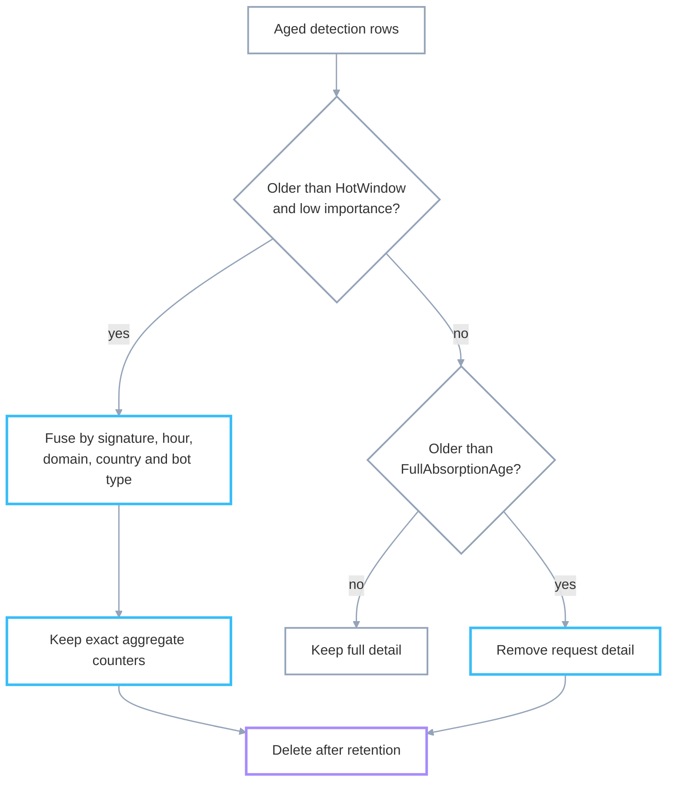

# StyloBot Release Series: The Compression Property
<!-- category -- Architecture,StyloBot,Bot Detection,ASP.NET,Performance -->
<datetime class="hidden">2026-09-10T12:00</datetime>

*The same four-part shape keeps appearing across StyloBot: establish a base, retain the useful delta, measure drift, and consolidate when the evidence warrants it. Compression is not a component; it is a property of the whole system.*

[](https://www.stylobot.net)

The behavioural model starts in [Behaviour, Not Identity](/blog/stylobot-fingerprint). The cache and learning model is in [Learning to Get Faster](/blog/stylobot-release-learning), while [Signal Shingle](/blog/signal-shingle-architecture) covers the dashboard in detail. The source is on [GitHub](https://github.com/scottgal/stylobot).

[TOC]

---

## The recurring shape

A conventional system often stores detailed events first and adds a roll-up job later. StyloBot has roll-up behaviour at several different levels, but no single component owns the idea of compression.

The pattern has four parts:

- **Base**: the stable summary that later observations are compared with.
- **Delta**: the part of a new observation that the base does not already describe.
- **Drift**: a measured change from the base.
- **Consolidation**: replacing or refreshing the base once enough evidence has accumulated.

The names change at each layer, but the job does not:

| Surface | Base | Delta | Drift | Consolidation |
|---|---|---|---|---|
| Fingerprint | archetype and `RootCentroid` | `DeltaFromArchetype` | novelty distance and surface changes | absorption and cluster root re-seating |
| Persistence | current in-memory or durable row | mutations since the last pass | age and importance | coalesced write or row fusion |
| Dashboard | last materialised page | changed widget shingle | a data-change cursor | off-thread re-materialisation |
| Multiple nodes | shared durable reputation | each node's local observations | a cold or stale local view | write-behind and read-through |

This matters because observations are unbounded. A long-running service cannot keep every request in memory or at full detail forever. Summary state is bounded by the number of actors, not the number of requests.

The summary still has to move. If it changes on every request, it is not a useful reference. If it never changes, real behavioural drift disappears into stale history. StyloBot aims for the middle: stable enough to recognise an actor, but able to move when the evidence does. I called that *metastability* in [Behaviour, Not Identity](/blog/stylobot-fingerprint).

## Detection: reduce observations to a moving shape

StyloBot represents behaviour as a vector: an ordered list of numbers describing features such as timing and request shape. An **archetype** is a known reference vector. A **centroid** is the average position of a set of observations. If those terms are new, the vector model is introduced visually in [Behaviour, Not Identity](/blog/stylobot-fingerprint).

The `Fingerprint` record carries both a reference and a compact difference from it:

```csharp
public float[]? RootCentroid       { get; init; }
public float[]? DeltaFromArchetype { get; init; }
public string?  DeltaArchetypeId   { get; init; }
public int      DeltaCount         { get; init; }
public int      NoveltyCount       { get; init; }
```

`RootCentroid` is the longer-lived reference used for drift. At ordinary allocation it starts from the nearest archetype centroid, then a clustering pass can replace it with a community mean. The delta fields answer a different question: where do this fingerprint's recent, ordinary observations sit relative to their nearest archetype?

### Measuring novelty

`IdentityDeltaMath.FoldObservation` resolves the nearest archetype for each observation. It then measures the distance between the observation and that archetype.

This is a [Mahalanobis distance](https://www.itl.nist.gov/div898/software/dataplot/refman2/auxillar/matrdist.htm), which scales each dimension by its expected variance. In plain English, movement on a normally stable feature counts more than the same movement on a noisy feature. That is more useful here than treating every dimension as equally reliable.

The code then separates ordinary movement from novelty:

```csharp
if (distance < options.MahalanobisNoveltyThreshold)
{
    var existing = newDeltaFromArchetype;
    var count = newDeltaCount;
    var updated = new float[vec.Length];

    for (var i = 0; i < vec.Length; i++)
    {
        var residual = vec[i] - anchor.Archetype.Centroid[i];
        updated[i] = existing is not null && existing.Length == vec.Length && count > 0
            ? (existing[i] * count + residual) / (count + 1)
            : residual;
    }

    newDeltaFromArchetype = updated;
    newDeltaCount = count + 1;
}
else
{
    newNoveltyCount = fp.NoveltyCount + 1;
}
```

An observation inside the threshold is folded into a running mean. The system keeps one vector and one count instead of retaining every contributing vector. An observation outside the threshold does not distort that mean. It increments `NoveltyCount` instead.

That distinction is important. The delta describes normal movement inside a known catchment. Novelty says the catchment itself may be wrong.

### The centroid is another compression

The fingerprint's own centroid is updated separately in `FingerprintAbsorptionService`:

```csharp
newCentroid[i] =
    (obs.Centroid[i] * maturity + obs.Vector[i]) / (maturity + 1);
```

This is a running average. `CentroidMaturity` records how many observations contributed to it, so the state remains one vector plus a count however many observations arrive.

It is closely related to the EWMA update used elsewhere in StyloBot: both move an existing summary towards a new observation. The difference is the step size. This centroid uses `1 / (maturity + 1)`, which gets smaller over time and gives every observation equal weight in the final mean. An EWMA usually keeps a fixed step size, which gives recent observations more influence and lets older evidence fade. [Learning to Get Faster](/blog/stylobot-release-learning#ewma-how-the-system-forgets) develops that distinction with the actual `Ewma.Update` code.

The fold does not run inline with each request. The first `ObservationAppended` signal opens a per-fingerprint window, currently 250 ms by default. When that fixed window closes, the service folds whatever accumulated inside it. A `Tick5m` backstop catches work missed because of an exception, a restart, or a late row. This follows the signal-driven scheduling model described in [Ephemeral Signals](/blog/ephemeral-signals).

### A bounded write, not a free write

The durability check compares the in-memory counters with the last persisted counters:

```csharp
public static bool DeltaAdvancedPastWatermark(
    int deltaCount, int noveltyCount,
    int persistedDeltaCount, int persistedNoveltyCount)
    => deltaCount != persistedDeltaCount ||
       noveltyCount != persistedNoveltyCount;
```

A confirmatory observation still advances `DeltaCount`, so it can cause a durable update. The saving is the form of that update. If a fingerprint changes many times between sampler passes, the pass writes its latest fixed-width delta and counters once. It does not append the same number of event rows.

### Surface drift

A second, seven-dimension summary handles surface changes such as country, ASN and user-agent family. At absorption time, `DetectSurfaceDimDriftAsync` compares those dimensions with the established baseline. On change it folds their magnitudes into a fixed-width `DriftMagnitudes` vector and promotes the latest values to the new baseline.

`DriftFrequency` uses the [EWMA model from the learning system](/blog/stylobot-release-learning#ewma-how-the-system-forgets). Recent changes count more heavily than old ones, so it provides a compact estimate of how often the fingerprint is changing without keeping a history list. The [NIST explanation](https://www.itl.nist.gov/div898/handbook/pmc/section3/pmc324.htm) gives the general statistical form.

### What is live today

The delta and novelty path is behind `DeltaNoveltyOptions.Enabled`, which defaults to `false`. When disabled, the delta fields remain null or zero and the earlier centroid behaviour continues unchanged.

There is also an important boundary between implemented data and intended behaviour. `NoveltyCount` is recorded and persisted, but no running clustering path reads it yet. Comments describe it as input to a future consolidation decision; the current `BotClusterService` does not consume it.

What does run is the cluster pass. It groups the signature window using [Leiden community detection](https://www.nature.com/articles/s41598-019-41695-z), with label propagation available as a fallback, then calls `ReseatRootCentroidsAsync` for suitable clusters. The base really is replaced on a schedule, but today that decision comes from the cluster snapshot rather than `NoveltyCount`.

## Persistence: save the current shape

A **write-behind store** updates memory immediately, then persists in the background. This keeps database latency off the request path. An **LFU**, or least-frequently-used cache, bounds memory by evicting cold entries before hot ones. [Learning LRUs](/blog/learning-lrus-when-capacity-makes-systems-better) goes deeper into why a bounded cache can improve a learning system.

StyloBot's reusable `WriteBehindLfuStore<TKey, TValue, TWriteOp>` supports two drain modes. The default replays queued operations. Stores that opt into behavioural sampling take a more compressed route:

```csharp
if (UseBehaviouralSampleDrain)
{
    // A hot key that mutates N times this cycle persists once, not N times.
    _dirtyKeys[key] = 0;
}
else
{
    _writeQueue.Writer.TryWrite(op);
}
```

In sample mode, a mutation only marks the key dirty. The drainer later reads the key's current value, ranks dirty entries by significance, and upserts a bounded batch. A key changed 1,000 times during the interval appears once in that batch. The SQLite signature, session and intent centroid stores opt into this mode.

The durable row is the base. In-memory mutations are the deltas. The drainer consolidates them.

### Folding the detections table

The dashboard's SQLite `detections` table applies the same idea to historical rows. It uses one row shape for raw events and summaries. A summary row is marked `fused = 1`.

Each detection gets an importance score once, when written. Bot probability, threat score and any enforcement action contribute to that score. The fold then works in two passes:



Low-importance rows older than the two-hour default hot window are grouped by signature, hour, domain, country and bot type. The surviving summary keeps exact counters for hits, bot hits, response bytes and processing time. The absorbed rows are deleted.

Rows that must remain individually auditable, such as enforcement and high-threat rows, do not fuse. Once they pass the 48-hour default full-absorption age, their request detail is nulled but their aggregate fields remain. Retention eventually deletes both kinds of row.

The read path understands the summary marker. Count queries use `hit_count` for fused rows, while drill-down queries exclude fused rows because they no longer represent individual requests. This preserves aggregate counts while allowing old request detail to disappear.

In the FOSS SQLite lane this fold is opt-in: `TemporalStore.CompressionEnabled` defaults to `false`. If it stays off, rows retain full detail until normal retention deletes them.

## Dashboard: materialise the base, update the pieces

**Materialisation** means computing a view before a request needs it. Instead of rebuilding a dashboard page for each reader, `DashboardMaterializerCoordinator` prepares a page model off the request thread and stores it in `DashboardContentCache`.

The request path is deliberately unable to compose on a cold miss:

```csharp
if (_atom.TryGet(key, out var existing))
{
    if (!existing!.IsWarming)
        RecordWarm(key.Envelope, tick, key.Window);
    return Task.FromResult(existing!);
}

return Task.FromResult(DashboardPageResult.Warming);
```

A cold reader gets an honest warming result. A reader whose latest generation is still being prepared gets the last successfully warmed snapshot. One **single-flight** task is shared by concurrent attempts to warm the same envelope, which prevents duplicate composition work.

The materialiser does not rebuild everything on every clock tick. It watches change cursors for the relevant data surfaces. A moved cursor makes the envelope due; the refresh interval acts as a maximum staleness bound when no cursor moves.

The page model is the base. `DashboardWidgetShingleCache` holds the smaller rendered pieces. Each shingle key includes the widget, its filters and a data-change version. When one widget's data changes, that widget gets a new key and a new fragment. The server can return just those fragments using [HTMX out-of-band swaps](https://htmx.org/docs/#oob_swaps), which replace matching elements elsewhere on the page.

This is the representation-layer version of the same compression property: reuse the complete page that is still valid, then send only the pieces whose version changed. [Signal Shingle](/blog/signal-shingle-architecture) covers the full rendering architecture.

The dashboard also avoids storing duplicate verdict state. `SignatureAggregateCache` keeps request counts and projection data, but verdict scalars are resolved from the canonical fingerprint path through `ResolvedVerdict`. The page reads through to the source instead of maintaining another independently changing copy.

## Multiple nodes: converge through durable state

Two processes cannot share an in-memory centroid or cache entry. Each node has its own hot view, so the durable tier becomes the meeting point.

The FOSS deployment docs describe replicas sharing a persistent reputation store, allowing a fingerprint learned by one replica to be recognised by another. The [Sidecar Architecture](/blog/sidecar-architecture) shows the wider deployment shape.

This is convergence, not a consensus protocol. A node writes its local observations to durable state and reads through on a cold miss. Nodes become consistent as they revisit that common base.

Signature families are related, but their scope is smaller. `SignatureConvergenceService` evaluates the families held by the node's in-process `SignatureCoordinator`. It is not a cross-node family protocol.

Within that local scope, a family has a canonical signature chosen from the member with the most requests, with first-seen time breaking ties. Merge scoring combines temporal overlap, timing similarity, path entropy, request rate and bot-probability agreement. A bot-classified signature cannot merge with a human-classified one.

Splitting supplies the drift path. If a member's average bot probability diverges far enough from the family mean, it is removed. A five-minute cooldown prevents the same pair from immediately merging again:

```csharp
_splitCooldowns[cooldownKey] = DateTime.UtcNow.AddMinutes(5);
```

That delay is **hysteresis**: the reverse transition is made harder than the forward transition so small fluctuations do not make the system chatter between two states. The reputation state machine uses the same idea with different promotion and demotion thresholds, as described in [Learning to Get Faster](/blog/stylobot-release-learning).

## What the pattern costs

Compression moves cost and uncertainty around. It does not remove them.

A base takes time to become useful. New fingerprints need observations, new dashboard envelopes can briefly show warming, and shared stores still need time to propagate a node's latest state.

A base can also be wrong. Recovery paths are therefore part of the design: recent evidence receives more weight, novel observations stay out of the ordinary delta, divergent family members can split, and materialised pages have a bounded refresh interval.

The pattern is not universal. A deeply personalised, write-heavy surface may have no shared stable base worth preserving. It works here because bot detection is a stream of repeated observations about slowly moving actors, and the dashboard is a read-heavy view over that state.

## The one-sentence version

Compression is how StyloBot keeps state: agree on a base, retain the useful difference, measure movement, and replace the base only when enough evidence has arrived.

---

> **StyloBot Release Series**
>
> 1. [**Behaviour, Not Identity**](/blog/stylobot-fingerprint): why StyloBot models clients behaviourally
> 2. [**Behaviour-Aware ASP.NET UI**](/blog/behaviour-aware-ux): the server-rendered surface over that detection result
> 3. [**Finding and Fixing Unbounded Growth in Long-Running .NET Services**](/blog/stylobot-release-reliability): keeping the engine bounded in production
> 4. [**Behaviour-Aware TypeScript UI**](/blog/typescript-sdk): Express, Fastify, and browser components
> 5. [**The Sidecar Architecture**](/blog/sidecar-architecture): connecting the detector to non-.NET stacks
> 6. [**Learning to Get Faster**](/blog/stylobot-release-learning): four-tier memory and adaptive learning
> 7. [**Testing the Thing That Won't Sit Still**](/blog/stylobot-release-nondeterministic-testing): testing a non-deterministic detector
> 8. [**StyloExtract**](/blog/stylobot-release-styloextract): a local-learning HTML to Markdown converter
> 9. **The Compression Property**: base, delta, drift, consolidate

## Related articles

- [Behaviour, Not Identity](/blog/stylobot-fingerprint) explains the behavioural vector and fingerprint model.
- [Learning to Get Faster](/blog/stylobot-release-learning) covers adaptive memory, verdict caching and hysteresis.
- [Learning LRUs](/blog/learning-lrus-when-capacity-makes-systems-better) explains why bounded retention can improve a learning system.
- [Signal Shingle](/blog/signal-shingle-architecture) develops the dashboard materialisation and widget-shingle architecture.
- [The Sidecar Architecture](/blog/sidecar-architecture) shows how the engine is deployed beside non-.NET applications.
- [Finding and Fixing Unbounded Growth](/blog/stylobot-release-reliability) covers the reliability work behind bounded long-running state.
