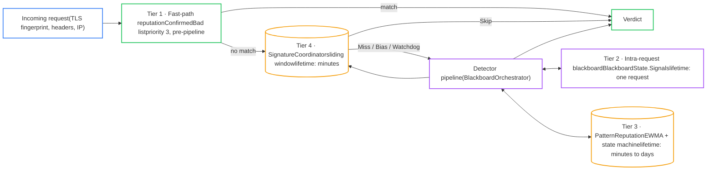
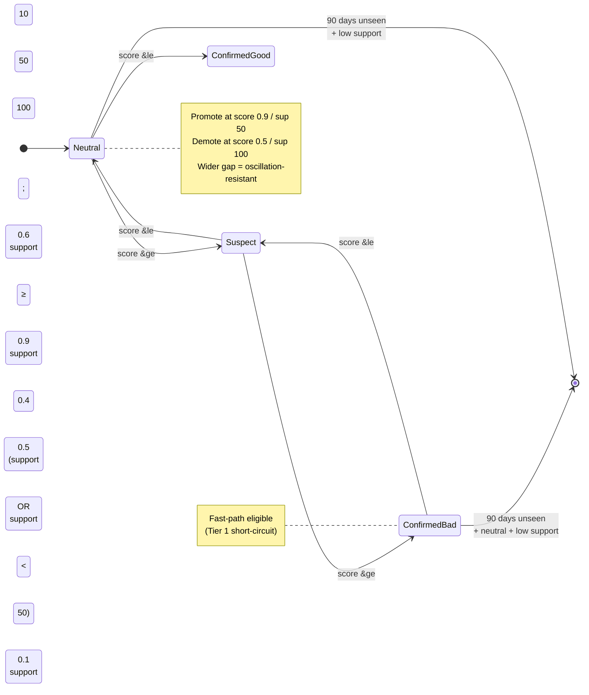
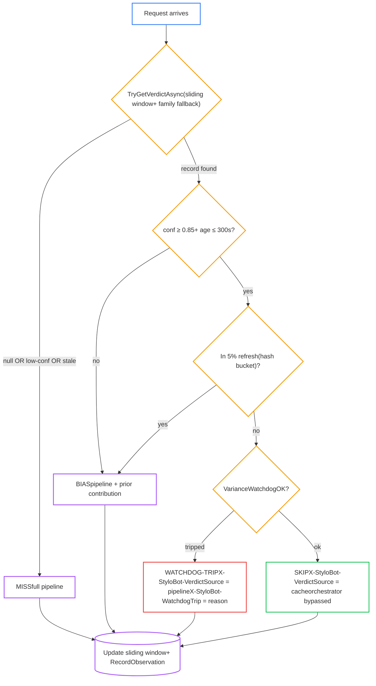
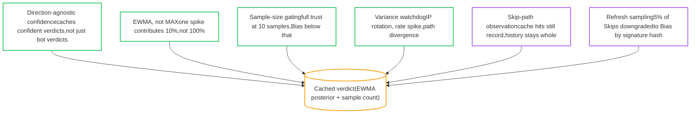

# StyloBot Release Series: Learning to Get Faster

*Heads up: this one is for the nerds. It's a deep technical dive into StyloBot's adaptive learning system (EWMA updates, hysteresis thresholds, verdict caching, variance watchdogs), with real code from `Mostlylucid.BotDetection` and pointers to the equivalent machine-learning constructs so ML readers have an entry point. If you want the elevator pitch, read the earlier release posts. If you want to know how the four-tier memory turns repeat traffic into sub-millisecond decisions while still recovering from false positives, read on.*

> ## DRAFT
> This is a working draft in the StyloBot Release Series. Numbers, knobs, and naming may still change before final release.

> **StyloBot Release Series**
>
> 1. [**Behaviour, Not Identity**](/blog/stylobot-fingerprint) - why StyloBot models clients behaviourally
> 2. [**Behaviour-Aware ASP.NET UI**](/blog/behaviour-aware-ux) - the server-rendered surface over that detection result
> 3. [**Finding and Fixing Unbounded Growth in Long-Running .NET Services**](/blog/stylobot-release-reliability) - the reliability discipline that keeps the engine boring in production
> 4. [**Behaviour-Aware TypeScript UI**](/blog/typescript-sdk) - Express, Fastify, and browser components
> 5. [**The Sidecar Architecture**](/blog/sidecar-architecture) - how the detection engine connects to non-.NET stacks
> 6. **Learning to Get Faster** - the adaptive learning system, four-tier memory, and the verdict cache

<!--category-- ASP.NET, StyloBot, Bot Detection, Performance, Machine Learning -->
<datetime class="hidden">2026-05-13T11:00</datetime>

The behavioural model is in [Behaviour, Not Identity](/blog/stylobot-fingerprint); the reliability discipline in [Finding and Fixing Unbounded Growth](/blog/stylobot-release-reliability); source at [github.com/scottgal/stylobot](https://github.com/scottgal/stylobot).

[TOC]

---

## Why StyloBot bothers with this

StyloBot's whole job is telling humans from bots, and the way it does that at the most basic level is by building a picture of what an average bot looks like and what an average human looks like. Not fixed rules, not a regex over User-Agent strings: behavioural centroids in a 130+ dimensional vector space, one per cluster of clients that move alike. Every observation either confirms an existing centroid or nudges its location. The better those centroids get, the more accurately a new visitor can be placed against one of them, and the cheaper that placement becomes. **Accuracy improves first; latency improves as a consequence.** (The clustering side of this is covered in [Behaviour, Not Identity](/blog/stylobot-fingerprint); this post is about what happens with the centroids once you have them.)

That mechanism is also what makes StyloBot deployable in stupidly different places: a personal blog at 50 requests/minute, a marketing site that bursts during product launches, an SPA where most traffic is API calls, an e-commerce checkout where one false positive on a paying customer is real lost money, a content portal where 70% of traffic is automated but the 30% of humans still need a clean path through. The same engine ends up with different centroids on different sites because it sees different traffic; the way it builds them is the same everywhere.

A detector that runs the full pipeline on every request is thorough but uneconomic. A detector that blindly caches verdicts is fast but brittle. StyloBot sits between those two: the cache is the common case, the full pipeline is the recovery path.

For context against the more familiar names in this space:

| | Placement | Typical per-request cost | What you get back |
|---|---|---|---|
| Cloudflare Bot Management | Edge (their CDN) | Sub-millisecond at edge | Block / challenge / allow before your origin sees it |
| CHEQ / DataDome | Server-side API callout | ~50-150 ms (network round-trip) | JSON verdict from their service |
| StyloBot | In-process or local gRPC sidecar | **~10-50 µs** warmed via Skip, **400-900 µs** for a full fast-path pipeline run | Typed verdict (`BotProbability`, `Confidence`, `RiskBand`, `ThreatScore`) directly in your handler |

The edge products are great at "block before origin"; what they cannot do is hand your application a per-request probability and let your checkout page decide what to do with it. The API products do that, but you pay a network hop per request. StyloBot is the case where the verdict is in-process, the network hop doesn't exist, and the warm path is faster than either by an order of magnitude.

The lever that makes the cache safe is **policy-per-surface**. The verdict cache is governed by a `SignatureCacheOptions` record that's set per-policy, so an admin endpoint can demand 0.95 confidence and a 60-second freshness window while a content path accepts 0.7 confidence over an hour. Same code, different knobs, no fork. That's what makes the same engine deployable as an [ASP.NET middleware](/blog/behaviour-aware-ux), as a [gRPC sidecar](/blog/sidecar-architecture), or in-process behind a Caddy plugin.

The rest of this post is the machinery that makes the cache safe: EWMA updates, hysteresis thresholds, verdict caching, refresh sampling, and variance watchdogs. The headline number is latency. The actual design problem is learning without making old mistakes permanent.

## The metastable fingerprint

Everything below anchors to "the fingerprint", so it's worth being precise about what that means here. In StyloBot a fingerprint is not a single field. It's a position in the 130+ dimensional behavioural vector space from [Behaviour, Not Identity](/blog/stylobot-fingerprint), drawing on TLS, header order, timing, path sequence, JS behaviour, and the signals coming out of all 50 detectors. A rotated IP barely moves it. A rotated User-Agent barely moves it. What moves it is *behavioural* change: a different path sequence, a different cadence, a new way of failing checks.

That makes the fingerprint **metastable**: stable enough that an actor stays recognisable across short-term identity churn, evolving enough that genuine behavioural change shows up as movement of the point. Not a fixed identity, not random noise. A slowly-moving signature with structure.

This is the property the whole learning system rests on. If fingerprints were noisy (every request landed somewhere random) EWMA averaging would sharpen nothing and the cache would always be wrong. If they were rigid (the position never moved) there would be no drift to track and the watchdog would have nothing to watch for. Metastability is exactly what makes both ends work: sustained observations can refine a centroid because the underlying signal is stable enough to sharpen, *and* drift can be detected because real change shows up as movement against an otherwise stable background.

The structural argument for why this property holds (humans noisy but consistent in structure, bots consistent but wrong in structure) is the load-bearing claim from [**Behaviour, Not Identity**](/blog/stylobot-fingerprint), and if any of the geometry here is unclear that's the article to read first. Everything that follows in this post is what you can do *once* that claim is in hand.

## The thesis: detection should get better and cheaper the more you see

Every observation does two things: it sharpens the centroid this fingerprint belongs to (accuracy), and it raises the system's confidence that this fingerprint behaves like that centroid (placement, which enables speed). The hard part of an adaptive detector is doing both without letting old mistakes become permanent.

A bot detector is asked the same expensive question millions of times a day: *is this actor still behaving like the thing we already learned it was?* For the vast majority of those requests, the system already has an opinion. It saw the same TLS fingerprint, the same header order, the same User-Agent rotation pattern, the same IP neighbourhood ten minutes ago, and concluded `bot, 0.93`. There's no point running the full detector pipeline on the same actor again unless something about that actor has visibly changed.

StyloBot's learning system is built around that idea. The pipeline runs in full when it has to, and every full pipeline run is what *builds and refines the centroids* in the first place. When the pipeline doesn't run, the previous placement is reused under controlled conditions, the request is served in microseconds, and serving it still feeds the long-running memory so the centroids stay current.

> **ML aside.** This is **adaptive computation** in neural networks (e.g. [early-exit networks](https://arxiv.org/abs/1709.01686), Mixture-of-Experts gating): cheap classifier first, expensive classifier only when the cheap one's confidence is low. The detector pipeline is the expensive inference path; the per-fingerprint cache is the cheap "did we already learn this?" path.

## Four tiers of memory

Learning in StyloBot is layered so each tier corresponds to a different lifetime:

1. **Fast-path reputation (instant).** A short list of patterns classified as `ConfirmedBad` in the `PatternReputation` store. A request matching one of these aborts the pipeline at priority 3 before any other detector runs. Entry requires score ≥ 0.9 and support ≥ 50 (more on those numbers below).
2. **Intra-request blackboard (per-request, milliseconds).** Detectors write signals to a shared `BlackboardState.Signals` sink during the request; later detectors read those signals. This isn't long-term memory; it's how the 49 detectors coordinate within one request without each having to recompute features the others already extracted.
3. **Inter-request reputation (minutes to days).** Pattern-level memory: `InMemoryPatternReputationCache` tracks per-pattern bot scores with online EWMA updates and time decay. Each pattern carries a `ReputationState` (`Neutral` → `Suspect` → `ConfirmedBad`, plus `ConfirmedGood`, `ManuallyBlocked`, `ManuallyAllowed`) with asymmetric promotion and demotion thresholds.
4. **Per-fingerprint verdict cache (minutes).** Per-actor memory: the live sliding window in `SignatureCoordinator` carries each observed fingerprint's running posterior, sample count, last-seen time, latest risk band, and latest threat score. `SignatureVerdictGate.DecideAsync` reads this on every request.

Tier 1 short-circuits the pipeline. Tier 2 coordinates within it. Tier 3 is the long memory that survives across days. Tier 4 is the short memory that lets repeat traffic skip the pipeline entirely.



## EWMA: how the system forgets

Every numeric memory in the system uses the same update rule, in `Helpers/Ewma.cs`:

```csharp
public static class Ewma
{
    /// <summary>new = (1 - alpha) * previous + alpha * observation</summary>
    public static double Update(double previous, double observation, double alpha)
        => (1.0 - alpha) * previous + alpha * observation;
}
```

That's the whole thing. `alpha` is the weight on the new observation; `1 - alpha` is the inertia of the past. Higher alpha = faster reaction to the latest observation; alpha = 0 freezes; alpha = 1 replaces.

Pattern reputation uses it directly. From `PatternReputationUpdater.ApplyEvidence`:

```csharp
// EMA update: alpha clamped to [0,1] preserves EMA semantics (alpha > 1 inverts
// the old score contribution).
var alpha = Math.Min(_options.LearningRate * evidenceWeight, 1.0);
var newScore = Ewma.Update(decayed.BotScore, label, alpha);
```

`LearningRate` defaults to 0.1, so a single observation moves the score by 10% of the gap to that observation. The other 90% is whatever this pattern did historically.

> **ML aside.** EWMA = the classic [exponential moving average](https://en.wikipedia.org/wiki/Moving_average#Exponential_moving_average) that shows up in [Adam](https://arxiv.org/abs/1412.6980) (the `β₁`, `β₂` momentum and variance accumulators), in [Polyak averaging](https://en.wikipedia.org/wiki/Stochastic_approximation), in BatchNorm running mean/variance, in [TD(0) value updates](https://en.wikipedia.org/wiki/Temporal_difference_learning) (`V ← V + α(r + γV' - V)`). `α = 0.1` here is in the same range you'd see for momentum buffers: slow enough that one bad observation can't move the running value, fast enough that the running value tracks sustained change.

We picked this update over the obvious-but-wrong alternative of storing the maximum probability ever observed. A max-of-history store would let a single 0.95 spike pin a pattern at 0.95 forever, no matter how it behaved afterwards. The EWMA store has the opposite property: a 0.95 spike followed by hundreds of benign observations decays smoothly back toward benign. False positives are recoverable.

The decay extends to the patterns themselves. `ReputationOptions` (defaults from the code):

```csharp
public double ScoreDecayTauHours { get; set; } = 3;             // generic
public double SupportDecayTauHours { get; set; } = 6;
public double ConfirmedBadScoreDecayTauHours { get; set; } = 12; // ConfirmedBad
public double ConfirmedBadSupportDecayTauHours { get; set; } = 24;
public int GcEligibleDays { get; set; } = 90;
```

A pattern that hasn't been seen in a day has shed most of its support; one that hasn't been seen in 90 days and is back in `Neutral` is garbage-collected. `ConfirmedBad` patterns get a longer tau (they earned their status through strong evidence and shouldn't lose it on a single quiet hour). Memory that doesn't decay drifts away from reality.

> **ML aside.** The score-decay-toward-prior step is first-order mean-reversion (the [Ornstein–Uhlenbeck](https://en.wikipedia.org/wiki/Ornstein%E2%80%93Uhlenbeck_process) shape): with no new evidence, the score pulls back toward the prior at rate `1/τ`.

Hysteresis is built into the state machine. The actual thresholds from `ReputationOptions`:

| Transition | Score threshold | Support threshold |
|---|---|---|
| `Neutral → Suspect` | ≥ 0.6 | ≥ 10 |
| `Suspect → ConfirmedBad` | ≥ 0.9 | ≥ 50 |
| `Suspect → Neutral` | ≤ 0.4 | (or support drops) |
| `ConfirmedBad → Suspect` | ≤ 0.5 | ≥ 100 (or support decays under 50) |
| `Neutral → ConfirmedGood` | ≤ 0.1 | ≥ 100 |



The 0.4-point gap between the promote threshold (0.9) and demote threshold (0.5) for `ConfirmedBad` is deliberate: it's an oscillation-suppression band. Anything that flips between 0.6 and 0.8 stays a `Suspect`; only sustained evidence in one direction crosses the boundary.

> **ML aside.** This is a [Schmitt trigger](https://en.wikipedia.org/wiki/Schmitt_trigger): wider-than-symmetric thresholds for state transitions. The ML analogue is the discrete-decision wrapper around any continuous classifier where you don't want labels flipping every batch: think of the way ensemble votes are usually compared with a margin requirement, or how alert systems debounce ("only page if condition holds for N minutes"). It's also why operating points in a precision-recall curve are tuned per-direction.

## The verdict cache: speed you have to earn

The per-fingerprint sliding window is the layer the request hot path now consults directly. `SignatureVerdictGate.DecideAsync` is the entire decision and it's small:

```csharp
public async Task<GateDecision> DecideAsync(
    string? signature, SignatureCacheOptions options, CancellationToken ct = default)
{
    if (!options.Enabled || string.IsNullOrEmpty(signature))
        return new GateDecision(GateAction.Miss, null);

    var verdict = await _coordinator.TryGetVerdictAsync(signature, ct);
    if (verdict is null)
        return new GateDecision(GateAction.Miss, null);

    if (verdict.Confidence < options.BiasMinConfidence)
        return new GateDecision(GateAction.Miss, verdict);          // too noisy

    var ageSeconds = (DateTime.UtcNow - verdict.LastSeenUtc).TotalSeconds;

    var skipEligible =
        verdict.Confidence >= options.SkipMinConfidence
        && ageSeconds <= options.SkipMaxAgeSeconds;

    if (skipEligible && !ShouldRefresh(signature, options.SkipSamplingRate))
        return new GateDecision(GateAction.Skip, verdict);          // cache hit

    var biasEligible = ageSeconds <= options.BiasMaxAgeSeconds;
    return new GateDecision(biasEligible ? GateAction.Bias : GateAction.Miss, verdict);
}
```

The per-policy thresholds from `SignatureCacheOptions` (defaults shown):

```csharp
public double SkipMinConfidence { get; init; } = 0.85;
public int    SkipMaxAgeSeconds { get; init; } = 300;        // 5 min
public double BiasMinConfidence { get; init; } = 0.30;
public int    BiasMaxAgeSeconds { get; init; } = 86_400;     // 24 h
public double SkipSamplingRate  { get; init; } = 0.05;       // 5 %
```

Confidence itself is derived in `SignatureCoordinator.TryGetVerdictAsync` from sample size, with full confidence at 10 observations and a linear ramp below:

```csharp
var confidence = Math.Min(1.0, behavior.RequestCount / 10.0);
```

So `SkipMinConfidence = 0.85` means a fingerprint needs ~9 observations in the current window before it can be Skip-eligible. Below that, the gate prefers Bias.

The four actions:

- **Miss.** No usable record for this fingerprint, or one older than `BiasMaxAgeSeconds`. The full detector pipeline runs. The result feeds the sliding window for next time.
- **Bias.** A record exists with moderate confidence, or it's slightly stale. The pipeline runs, but the cached verdict is injected as a Wave-0 prior contribution. The posterior is pulled toward the prior in proportion to prior confidence and a linear age decay.
- **Skip.** The record is recent and confident enough that the pipeline contribution would be marginal. The cached verdict is enforced; the orchestrator is skipped. The request is served in microseconds.
- **Watchdog-trip.** Skip-eligible cache hit, but the variance watchdog detected something atypical. The cached verdict is invalidated for this request; the pipeline runs fresh.



The middleware emits `X-StyloBot-VerdictSource` (`cache` or `pipeline`) and `X-StyloBot-WatchdogTrip` (reason string when applicable) on the response so operators can see live which path each request took.

Skip is what happens when there is nothing new to learn. Once a fingerprint has been seen with enough confidence in either direction (the gate is direction-agnostic, so sure-human and sure-bot are equally eligible), every subsequent request costs only the gate lookup, an observation record, and the policy enforcement. On the benchmark box (M5 MacBook Air, 32 GB) that's ~10-50 µs, versus 400-900 µs for a full fast-path pipeline pass; Skip is roughly an order of magnitude faster than the cheap full pass and many orders faster than anything that involves a network hop.

## The verdict cache as a contribution, not a decision

Before getting into the recovery mechanics, the framing that makes them coherent: the cached verdict is not a stored answer the system blindly reuses. On the Bias path it's injected as a Wave-0 *contribution*, weighted by confidence and age. `FingerprintPriorContributor.ContributeAsync` is the entire mechanic:

```csharp
var horizon = AgeDecayHorizon;                                 // default 86,400s
var decay = horizon > 0.0 ? Math.Max(0.0, 1.0 - age / horizon) : 1.0;
var effectiveWeight = conf * WeightMultiplier * decay;

if (effectiveWeight <= 0.0) return _emptyResult;

var delta = 2.0 * (prob - 0.5);   // map [0,1] probability to [-1,+1] confidence delta

var contribution = new DetectionContribution
{
    DetectorName = DetectorName,
    Category = DetectorName,
    ConfidenceDelta = delta,
    Weight = effectiveWeight,
    Reason = $"Cached fingerprint verdict (prob={prob:F2}, conf={conf:F2}, age={age:F0}s)"
};
```

A 30-second-old verdict with confidence 0.9 anchors the posterior strongly (effective weight ≈ 0.9 × 1.0 × 0.9997 ≈ 0.90). A 23-hour-old verdict with confidence 0.4 barely touches it (≈ 0.4 × 1.0 × 0.042 ≈ 0.017). A 24-hour-old verdict has zero effective weight.

> **ML aside.** This is genuinely **Bayesian**: prior (cached verdict) × likelihood (this request's evidence) → posterior. The `decay = 1 - age/horizon` term plays the same role as a forgetting factor in [recursive Bayesian estimation](https://en.wikipedia.org/wiki/Recursive_Bayesian_estimation); old priors lose strength so the likelihood dominates as the prior ages. It's also why the dashboard shows `RequestContributionDelta` (the change this request made to the running posterior) rather than the raw per-request probability: on cached verdicts, the per-request probability is mostly the prior speaking, and `delta` is the part that's actually new information.

## How false positives don't compound

Up to this point the system sounds dangerously cache-heavy, so this section is the important one: how the design assumes cached verdicts are eventually wrong, and how cheaply it notices and recovers when they are. Six independent mechanisms layer on top of each other so any single one being defeated still leaves five between the cache and a permanent false verdict:



**Direction-agnostic confidence.** `SkipMinConfidence` is checked against `verdict.Confidence`, not against `verdict.BotProbability`. A sure-bot verdict and a sure-human verdict are equally eligible to Skip. That's the difference between "we cache bot verdicts" (a system biased toward false positives) and "we cache *confident* verdicts" (a system biased toward whichever way the evidence pointed).

**EWMA, not MAX.** A single high-probability observation moves the running score by `α = 0.1` of the gap to that observation. A genuine attacker accumulates evidence quickly because *every* observation is hostile. A legitimate visitor who happened to look like a scraper for one request decays back toward benign on subsequent observations.

**Sample-size gating.** `confidence = min(1, request_count / 10)`. Below ~9 observations, even a strong posterior is held to Bias rather than Skip. The decision to fully trust the cache is gated on the EWMA being meaningful.

> **ML aside.** This is a **shrinkage prior**: until enough evidence has accumulated, the posterior doesn't get to act with confidence. Same reason [UCB bandits](https://en.wikipedia.org/wiki/Multi-armed_bandit#Upper_Confidence_Bound) include a sample-count term: small `n`, wide confidence interval, don't yet exploit.

**Variance watchdog.** Even with a confident, fresh cached verdict, Skip can be vetoed per request. `VarianceWatchdog.Check` runs three independent tests against `VarianceWatchdogOptions` (defaults):

```csharp
public int    IpRotationWindowSeconds { get; init; } = 300;   // same fingerprint, new /24
public double RateSpikeMultiplier     { get; init; } = 10.0;  // last minute vs rolling 5
public bool   CheckPathCentroid       { get; init; } = true;  // never-seen path family
```

The path-divergence check needs at least 3 distinct path families on record before it can fire, so warm-up requests don't trip themselves:

```csharp
if (options.CheckPathCentroid && hist.PathFamilyCount >= PathFamilyBaseline)
{
    var family = PathFamily(ctx.Request.Path.Value);
    if (family is not null && !ContainsFamily(hist, family))
        return new WatchdogResult(true, $"path-divergence:{family}");
}
```

Any one trip and the pipeline runs fresh; the response carries `X-StyloBot-WatchdogTrip: ip-rotation:1.2.3.0->5.6.7.0` (or whatever fired) so operators see the reason.

> **ML aside.** The watchdog is **concept-drift detection** for one fingerprint. The classical analogues are [ADWIN](https://www.cs.upc.edu/~gavalda/papers/adwin06.pdf), [Page–Hinkley](https://en.wikipedia.org/wiki/CUSUM), and [DDM](https://link.springer.com/chapter/10.1007/978-3-540-28645-5_29); all of these detect that an online stream's distribution has shifted enough that the existing model is no longer trustworthy. The three checks here are domain-specific drift signals: network identity drift (IP), volume drift (rate), behavioural drift (path centroid).

**Skip-path observation.** Even when the gate Skips the pipeline, the middleware still records the request:

```csharp
_watchdog.RecordObservation(precomputedSig, clientIp, pathStr);
_ = _signatureCoordinator.NotifyObservationAsync(
    precomputedSig, pathStr, v.BotProbability, context.RequestAborted);
```

The fact that detection was skipped doesn't create a hole in the per-fingerprint history; clustering, drift detection, and the dashboard's per-fingerprint stats see every request whether or not the pipeline ran.

**Refresh sampling.** `ShouldRefresh` deterministically downgrades a configurable fraction of Skip-eligible requests to Bias so the pipeline runs and refreshes the live record. The signature hash decides which requests get refreshed (`DeterministicBucket.ShouldFire`), so retries from the same client land identically; over time every fingerprint gets a periodic full re-evaluation.

> **ML aside.** This is a deterministic version of **ε-greedy exploration** from reinforcement learning: most of the time exploit the current policy (Skip), some of the time pay the cost of exploring (Bias) so the model stays calibrated. Determinism by hash makes it idempotent, which matters when the same client retries.

**Entity-family fallback.** When a fingerprint rotates and its new identity has no cached verdict of its own, the gate falls through to the family's canonical signature (the [Leiden cluster anchor](/blog/stylobot-fingerprint) from the behavioural model). From `TryGetVerdictAsync`:

```csharp
if (!_signatureCache.TryGet(signatureId, out var atom) || atom == null)
{
    if (!_signatureToFamily.TryGetValue(signatureId, out var familyId) ||
        !_families.TryGetValue(familyId, out var family) ||
        ...
        !_signatureCache.TryGet(family.CanonicalSignature, out atom) || atom == null)
    {
        return null;
    }
}
```

A bot that's been merged into a family because its behavioural vector matched a known sibling inherits the sibling's verdict instead of starting from scratch, but only if the family anchor is itself still in the sliding window. Cold family anchors evict naturally; split events drop the family mapping. There is no separate invalidation channel because the sliding window's TTL is the invalidation channel.

## What this looks like at runtime

Numbers below are from the M5 MacBook Air (32 GB) benchmark setup. The live pipeline distribution settles into a pattern like:

| Path / mode | Per-request cost | What runs |
|---|---|---|
| Verdict-cache hit (Skip) | **~10-50 µs** | Signature lookup, then bypass; no detectors |
| Fast path, warm, single client | **400-600 µs** | All 19 fast-path detectors + blackboard + SQLite write |
| Fast path, cold (first hit) | **~900 µs** | First-touch allocations + full pipeline |
| Fast path, 60 VU contention | **50 ms p50 / 134 ms p99** | Detection unchanged; the latency is request queueing |
| Slow path (ProjectHoneypot DNS lookup) | **~100 ms** | One DNS round-trip; only on signal trigger |
| LLM escalation (Ollama, local) | **1-5 s** | Off by default; never on the request thread |

The whole live spectrum on a single client is microseconds for Skip, sub-millisecond for a full fast-path pipeline pass, and ~100 ms only when a detector explicitly reaches out to a remote signal source. The 50 ms / 134 ms numbers are not detection cost; they're what shows up at p50/p99 when 60 virtual users are contending for the same handler, and they would look the same with detection disabled.

Where does the fast-path budget actually go? Summed CPU work for a full fast-path pass is roughly 15-25 µs across all 19 detectors; the remaining ~400-600 µs of wall time is orchestration, signal-sink writes, the SQLite append, and the ASP.NET response pipeline. Individual detector cost (BenchmarkDotNet, same hardware):

| Tier | Range | Examples |
|---|---|---|
| Trivial (< 200 ns) | 33-200 ns | CookieBehavior 33 ns, HeaderCorrelation 50 ns, Http2Fingerprint 120 ns, Inconsistency 135 ns, TransportProtocol 145 ns |
| Cheap (< 1 µs) | 200 ns-1 µs | FastPathReputation 308 ns, Header 496 ns, Ip 537 ns, AiScraper 572 ns, UserAgent (Googlebot) 829 ns |
| Moderate (1-5 µs) | 1.3-4.3 µs | CacheBehavior 1.3 µs, Haxxor 1.3 µs, Behavioral 1.4 µs, Intent 2.3 µs, Heuristic 3.4-4.3 µs |

That's why Skip is so valuable: the detectors themselves cost ~25 µs of CPU, but the surrounding orchestration cost is ~20× that. Skip skips both.

The CLI dashboard reads the response headers directly, so cache vs pipeline vs watchdog-trip is visible per row. The Top Fingerprints sidebar shows each fingerprint's EWMA-smoothed posterior (the stable verdict), not whichever way the most recent request happened to swing. Per-request score is information about the request; the actor's score moves slowly on purpose.

## Why it's built this way

The whole system is one mechanism with two consequences. The mechanism is: every observation either sharpens a centroid or moves a fingerprint relative to one. The first consequence is that the engine gets *better* at telling bots from humans the more traffic it sees; the second is that, once a fingerprint is confidently placed, the full pipeline has nothing left to do for it.

Skip is what happens when there is nothing new to learn. Bias is what happens when the pipeline should run but the prior is still informative. Miss is the cold-start. The watchdog is the safety net for when the cache is wrong.

The EWMA update for every memory, the asymmetric hysteresis in the state machine, the sample-size gate on confidence, the deterministic refresh sampling, the path-family memory, and the family-canonical fallback all exist for the same reason. Each one is a place the system can be wrong about a fingerprint and still recover, on its own, without an operator stepping in.

The latency number is the easy headline. Accuracy improving with traffic is the actual product. A detector that learns also has to un-learn; the rest is knobs.