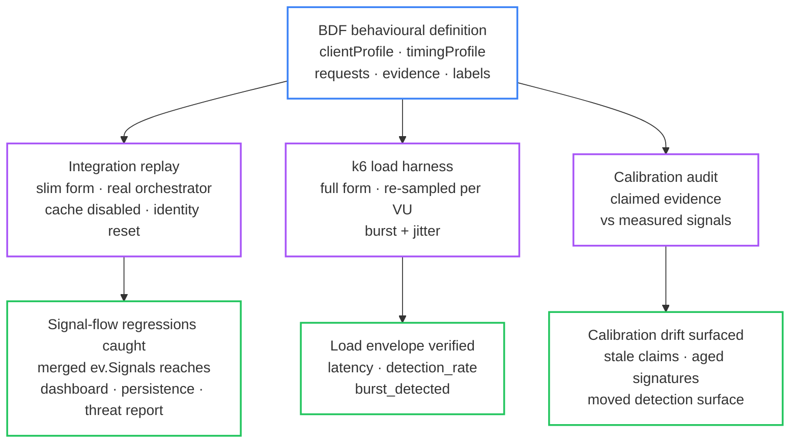
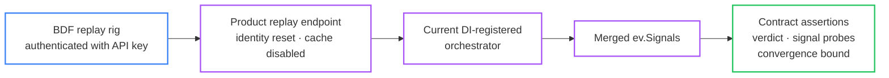

# StyloBot Release Series: Testing the Thing That Won't Sit Still

*How do you test a detector whose answer is supposed to change as it learns? This post is about BDF, the Behavioural Definition Format that makes StyloBot testable: one file defines a class of traffic, then drives regression replay, load generation, and a calibration audit.*

[](https://www.stylobot.net)

> **StyloBot Release Series**
>
> 1. [**Behaviour, Not Identity**](/blog/stylobot-fingerprint): why StyloBot models clients behaviourally
> 2. [**Behaviour-Aware ASP.NET UI**](/blog/behaviour-aware-ux): the server-rendered surface over that detection result
> 3. [**Finding and Fixing Unbounded Growth in Long-Running .NET Services**](/blog/stylobot-release-reliability): the reliability discipline that keeps the engine boring in production
> 4. [**Behaviour-Aware TypeScript UI**](/blog/typescript-sdk): Express, Fastify, and browser components
> 5. [**The Sidecar Architecture**](/blog/sidecar-architecture): how the detection engine connects to non-.NET stacks
> 6. [**Learning to Get Faster**](/blog/stylobot-release-learning): the adaptive learning system, four-tier memory, and the verdict cache
> 7. **Testing the Thing That Won't Sit Still**: the verification discipline: one BDF file drives regression, load, and calibration
> 8. [**StyloExtract - a local learning HTML to Markdown converter**](/blog/stylobot-release-styloextract): the HTML→Markdown layer that pairs with the detector, the walker bug lucidVIEW caught, and the dogfood loop that made it honest

<!--category-- ASP.NET, StyloBot, Bot Detection, Testing, Architecture -->
<datetime class="hidden">2026-06-01T10:30</datetime>

The reliability discipline is in [Finding and Fixing Unbounded Growth](/blog/stylobot-release-reliability); the adaptive learning system in [Learning to Get Faster](/blog/stylobot-release-learning); source at [github.com/scottgal/stylobot](https://github.com/scottgal/stylobot).

[TOC]

---

## How do you test something that learns?

That is the uncomfortable question behind StyloBot, and it is not rhetorical.

A conventional test pins a function in place: input X returns output Y. That works when the thing under test is stable. StyloBot is deliberately not stable at that level. It accumulates behavioural evidence: a single request's verdict depends on the request itself, the fingerprint's drift from its learned archetype anchor, session behaviour, and whether the system has already seen enough to skip straight to the fast path. Each fingerprint starts pinned to the nearest archetype (its prior); as new observations land it moves, and the movement itself is the signal. The metastable fingerprint matcher resolves a noisy vector to a stable identity through a two-pass match whose Pass 2 can revise Pass 1's allocation. (The archetype-anchor model, the drift surface, and the metastable fingerprint are covered in [Learning to Get Faster](/blog/stylobot-release-learning).)

The verdict for request 20, then, is not a function of request 20. It is a function of requests 1 through 20. So the test target is not a request at all. It is the behaviour of the system over a sequence of them.

That rules out `Assert.Equal`. The question a test can ask is no longer "does request X return verdict Y?" It becomes "given this class of behaviour, does the system converge to the right answer, for the right reasons, within a bounded number of steps?" That is the question BDF exists to answer.

The closest .NET analogues are [Verify](https://github.com/VerifyTests/Verify) and [FsCheck](https://github.com/fscheck/FsCheck), but BDF is neither. Verify approves an artefact, then fails the build on any exact diff. FsCheck asserts properties over randomly generated inputs. BDF sits between them: the approved artefact is a behavioural definition, but the pass condition is probabilistic. Not "did the output match this snapshot?" but "did this distribution converge to the expected side of the boundary, with the right signals present?"

## One behavioural definition, three verification systems

The trick that makes this tractable: a BDF file is not a test case. It is an *executable behavioural contract*, a definition of how a class of client behaves. Written once, that one file is consumed three ways:

1. **Replayed** through the integration rig, one request at a time against the real orchestrator, to catch signal-flow regressions the unit suite cannot see.
2. **Re-sampled** under [k6](https://k6.io/), many concurrent virtual users drawing fresh timing from the same definition, to generate realistic load.
3. **Audited** against the signals a real run actually measured, to catch calibration drift.



Regression, load, and calibration are usually three test systems with three sources of truth that drift apart. Here they are three readings of one file. The rest of this post is each reading in turn.

## Why unit tests miss the failure class

The first version of this work had hundreds of per-detector unit tests with mock contexts and canned headers. They were fast, deterministic, and blind to the failure class I cared about.

The orchestrator merges contributions into a single `ev.Signals` dictionary that downstream consumers (dashboard, persistence, narrative builder, threat report) read from. A refactor that drops `primary_signature` from the merged surface fails no per-detector unit test: the detector still ran, the contribution still carried the signal, it just stopped reaching anyone who needed it. The dashboard's fingerprint table goes blank. Persistence skips the row. The unit suite stays green because none of it goes near the merge.

This is not a hypothetical. The [signal-contracts document](https://github.com/scottgal/stylobot/blob/main/docs/architecture/signal-contracts.md) records exactly this regression: a change that stopped merging signals "survived for six days in production despite 1957 passing unit tests" because "the unit tests asserted on probability and contribution counts. Probability still computed. The breakage was in display surfaces fed by `evidence.Signals`."

The integration test at [`BdfReplayTests.Integration.cs`](https://github.com/scottgal/stylobot/blob/main/src/Mostlylucid.BotDetection.Orchestration.Tests/Integration/BdfReplayTests.Integration.cs) is direct about why it exists:

> This rig exists because the failure class it catches (downstream consumers of `ev.Signals` degrading silently when the orchestrator stops merging signals) does not fail any unit test.

The orchestrator is not a function; it is a pipeline whose value is whatever comes out of the merge after every contributor has run. The only way to assert on that is to run a real request through a real orchestrator and probe the merged surface. Mocking the merge defeats the test.

## BDF: a behavioural definition, not a scripted test

A BDF (Behavioural Definition Format) file describes how a *class* of client behaves, not a fixed playback of one. The interesting parts of the schema are statistical: a client profile that captures distributional identity, a timing profile that defines a burst-with-jitter sampling rule rather than fixed delays, an evidence array of weighted predicates over behavioural signals, and a confidence prior. Here is a real signature ([`bot-signatures/python-requests-bdf.json`](https://github.com/scottgal/stylobot/blob/main/bot-signatures/python-requests-bdf.json)):

```json
{
  "scenarioName": "python-requests-bdf",
  "scenario": "A bot/scraper using python-requests/2.31.0 with specific behavior patterns.",
  "confidence": 0.85,

  "clientProfile": {
    "userAgent": "python-requests/2.31.0",
    "cookieMode": "none",
    "headerCompleteness": "minimal",
    "clientHintsPresent": false,
    "robotsConsulted": false
  },

  "timingProfile": {
    "burstRequests": 10,
    "delayAfterMs":      { "min":   20, "max":   150 },
    "pauseAfterBurstMs": { "min":  500, "max":  2000 }
  },

  "requests": [
    { "method": "GET",  "path": "/",                "expectedStatusAny": [200,301,302], "expectedOutcome": "indexing", "successCondition": "any 2xx" },
    { "method": "HEAD", "path": "/admin",           "expectedStatusAny": [200,403],     "expectedOutcome": "indexing", "successCondition": "any 2xx" },
    { "method": "GET",  "path": "/api/data?page=1", "expectedStatusAny": [200,403],     "expectedOutcome": "indexing", "successCondition": "any 2xx" },
    { "method": "GET",  "path": "/api/data?page=2", "expectedStatusAny": [200,403],     "expectedOutcome": "indexing", "successCondition": "any 2xx" },
    { "method": "GET",  "path": "/api/data?page=3", "expectedStatusAny": [403,404],     "expectedOutcome": "indexing", "successCondition": "any 4xx" }
  ],

  "labels": ["Scraper", "RobotsIgnore"],

  "evidence": [
    { "signal": "interval_ms_p95", "op": "<", "value": 200,           "weight": 0.35 },
    { "signal": "requestInterval", "op": "<", "value": "burst <150ms", "weight": 0.70 }
  ],

  "patterns":  { "requestInterval": "burst <150ms" },
  "reasoning": "The bot/scraper uses python-requests/2.31.0 to access various endpoints, including the root path and admin pages, while also enumerating API paths and testing different HTTP methods."
}
```

Most of the surface is statistical, and most of it is what makes BDF a *definition* rather than a test script. (The full field-by-field schema is [`docs/bdf-v2-schema.json`](https://github.com/scottgal/stylobot/blob/main/docs/bdf-v2-schema.json).)

**`confidence` is a prior, not an assertion.** 0.85 says "this should land high-confidence bot when the system is healthy". The rig does not check the matured score equals 0.85; it checks the verdict lands on the bot side of the boundary. The prior is the band the signature's author (LLM or human) thinks the system should reach. Drift here is a calibration story, not a unit-test failure.

**`clientProfile` is a category of client.** `cookieMode: none` is a *category* of behaviour (no cookie jar, every request starts fresh), not a specific header. `headerCompleteness: minimal` says "a request from this client carries only what curl-class libraries set", a fact about the population of requests this client emits, not a fixed header list. The k6 converter materialises these into header bundles at run time; the BDF stores the *kind* of client.

**`timingProfile` is a sampling rule.** `burstRequests: 10` plus `delayAfterMs: {min: 20, max: 150}` plus `pauseAfterBurstMs: {min: 500, max: 2000}` defines a generator: ten requests with uniform-random gaps in 20 to 150ms, then a uniform-random pause of 500 to 2000ms, repeat. The same BDF replayed twice produces two different request streams with the same statistical distribution. That is the actual behaviour StyloBot's periodicity detector and session-vector compactor are trying to recognise; a fixed delay vector would test a different distribution entirely.

**`evidence` is a weighted predicate over signals.** Each entry is a claim of the form `signal OP value, weight w`. `{signal: "interval_ms_p95", op: "<", value: 200, weight: 0.35}` says "the p95 inter-request interval for this scenario should be under 200ms, and this is worth 0.35 of the verdict". The BDF asserts at the statistical level: not "request 7 returned bot=true", but "the population this client generates should produce an interval distribution whose p95 falls below 200ms". A scenario whose evidence claims diverge from what the running system measures is a signature that has drifted out of calibration.

**`labels` are taxonomy.** `[Scraper, RobotsIgnore]` is the class the scenario was generated for. Labels drive scenario selection in the load harness (run only `Scraper` scenarios, exclude `RobotsIgnore`) without anyone writing a regex over scenario names.

**`requests` describe what the client does, not what should happen next.** `expectedStatusAny: [200, 403]` tolerates either a successful fetch or an outright block, because both are valid productions of a hostile path probe. `expectedOutcome: indexing` is the *client's intent* (enumerate API pages), not the server's response. `successCondition: "any 4xx"` on `/api/data?page=3` is the client's heuristic for "did this work": a scraper that gets 4xx on the third page is succeeding at its enumeration job (it has discovered the cliff). The BDF captures the asymmetry between what the client is trying to do and what the system is supposed to do about it.

### A BDF and a centroid: the same idea, inverted

The word *definition* is load-bearing, and it connects BDF to the concept at the centre of StyloBot's detector. The engine classifies traffic against behavioural **centroids**: reference points in the 130+ dimensional space from [Behaviour, Not Identity](/blog/stylobot-fingerprint), each a learned anchor for a class of client that moves alike.

A BDF describes the same thing (a class of client) with the role inverted. The centroid is the **recogniser**: it asks "does this request look like that class?" A BDF is the **generator**: it answers "produce a request stream from that class." Same behaviour, opposite direction, which is exactly what makes a BDF replayable and a centroid not.

The engine's [`SignatureToBdfMapper`](https://github.com/scottgal/stylobot/blob/main/src/Mostlylucid.BotDetection/Behavioral/SignatureToBdfMapper.cs) bridges the two: it takes a behavioural signature captured from real traffic and writes it back out as a BDF you can read and replay. An LLM does the same job from the other end, turning a description of an attacker into a new one. That gives a loop: observed traffic becomes a signature, the signature becomes a BDF, and the BDF can replay the behaviour that produced it.

So the [`bot-signatures/`](https://github.com/scottgal/stylobot/tree/main/bot-signatures) corpus is not only a test fixture; it is a library of behavioural definitions, one file per class of client StyloBot reasons about. The signatures there were generated by a model (`ministral-3:3b`, per the directory's README) given prompts that describe a client family hitting a set of endpoints, and the same surface is open to a human author. Write a BDF for a new scraper family and you have a behavioural definition, a regression scenario, and a load-test entry in one file.

A slimmed-down replay form lives under [`test-suites/{bots,humans,adversarial}/*.bdf.json`](https://github.com/scottgal/stylobot/tree/main/test-suites) keeping only `requests[].method/path/headers/delayAfter` plus a soft `expectedDetection`. That subset is what the integration rig posts to the replay endpoint, which has no way to synthesise distributional behaviour from a single replay (no concurrent VUs, loopback only, so TLS/TCP fingerprint dimensions degrade by construction). The richer form drives the load harness, where concurrent VUs can actually realise the timing distribution.

## The replay endpoint runs through the real orchestrator

The integration rig posts each scenario to `POST /bot-detection/bdf-replay/replay`, an endpoint that lives in the product ([`BdfReplayEndpoints.cs`](https://github.com/scottgal/stylobot/blob/main/src/Mostlylucid.BotDetection/Endpoints/BdfReplayEndpoints.cs)), not in the test project. That placement is load-bearing: the endpoint resolves `IDetectionOrchestrator` from DI and runs through whichever orchestrator is currently registered, under `DetectionPolicy.Default`. The previous version hardcoded a specific orchestrator and masked regressions in the alternative (Ephemeral) path; rewiring to honour DI fixed that.

Because the endpoint lives in the product, it is gated like a product surface. `BdfReplay` is off by default; when enabled, calls require a valid `X-BdfReplay-Api-Key` header and pass a per-IP rate limit, so the replay route is not a detection bypass left lying around. The rig authenticates with that key. The point is to exercise the real path.



One deliberate policy override: the per-signature verdict cache is disabled for replay.

```csharp
var replayPolicy = Policies.DetectionPolicy.Default with
{
    SignatureCache = Policies.DetectionPolicy.Default.SignatureCache with { Enabled = false }
};
```

The cache's Skip path bypasses the matcher entirely once a primary signature has a confident cached verdict. In production that is exactly what you want (it is the whole point of [Learning to Get Faster](/blog/stylobot-release-learning)); for a rig measuring detection accuracy and signal flow it hides the per-request behaviour the rig is trying to assert on. Replay turns it off and every request runs the full waveform.

Scenarios are also isolated from each other. Every scenario gets a unique synthetic IP derived from a deterministic xxHash of its name (a `192.0.x.y` address from the RFC 5737 TEST-NET range), so subnet-level reputation never bleeds between scenarios. And the rig calls `POST /bot-detection/bdf-replay/reset-identity` before each scenario to truncate the fingerprint store; without that, scenario N inherits the fingerprints scenarios 1..N-1 created and the per-scenario stability assertions become ordering-dependent.

## Asserting on a non-deterministic surface

The rig makes three assertions on each scenario. Each one is a template for testing systems like this.

**Matured verdict, not per-request verdict.** Bot scenarios assert `last.Actual.IsBot` is true; human scenarios assert the *majority* of requests classified as human. Asserting on every individual request would couple the test to the drift trajectory away from the archetype anchor; relaxing to "settled at the end" tests the actual contract.

```csharp
// Some heuristics legitimately escalate on outlier rates; assert majority human, not all.
var humanCount = response.Results.Count(r => r.Actual is { IsBot: false });
var botCount = response.Results.Count - humanCount;
Assert.True(humanCount >= botCount,
    $"{response.ScenarioName}: {botCount}/{response.Results.Count} requests classified as bot, " +
    $"expected majority human. Last verdict: {last.Actual!.RiskBand} prob={last.Actual.BotProbability:F2}");
```

**Named signal probes, not signal counts.** Signal flow is probed per key, not by total. A count assertion is brittle: a new detector that emits a new signal masks the loss of a critical existing one (count stays the same; missing-key identity is invisible). A per-key probe names the consumer that breaks, in the failure message.

```csharp
Assert.True(probes.TryGetValue(SignalKeys.PrimarySignature, out var hasSig) && hasSig,
    $"{scenarioName}: {SignalKeys.PrimarySignature} missing from ev.Signals — " +
    "RequestPersistenceService skips persistence, dashboard fingerprint table goes blank");
```

The failure message is the test's spec. Three months later you do not have to remember why the signal mattered; the assertion tells you.

**Bounded convergence, not exact equality.** The metastable fingerprint matcher resolves a noisy vector to a stable identity. Vector composition includes session dimensions (path entropy, session age) that drift per request, so the two-pass match can occasionally fall outside its loose band and allocate. Asserting on a single fingerprint id across all requests would be wrong; asserting "no holes, and convergence to no more than `ceil(N/2)` distinct fingerprints" is the actual contract.

```csharp
var distinctFps = withFingerprints
    .Select(r => r.Actual!.IdentityFingerprintId!)
    .Distinct(StringComparer.OrdinalIgnoreCase)
    .Count();
var allowed = Math.Max(1, (int)Math.Ceiling(response.Results.Count / 2.0));
Assert.True(distinctFps <= allowed,
    $"{scenarioName}: {distinctFps} distinct fingerprints across {response.Results.Count} requests " +
    $"(allowed {allowed}). The matcher isn't converging — every request is allocating new, suggesting " +
    "vector composition is unstable or LooseThreshold is unreachable.");
```

`ceil(N/2)` is not magic. It encodes a policy: the first request always allocates; subsequent requests should mostly match via L1 confirm or Pass 2. Occasional allocation under high path variance is acceptable; allocation on *every* request is a regression. The bound is loose enough to absorb the noise the matcher is designed to absorb, tight enough to catch the failure mode where it stops converging at all.

All three patterns share a property: they assert on the contract the behaviour is supposed to satisfy, not on the specific numbers the current implementation happens to produce. When the implementation changes, the test still holds if the contract still holds. That is what makes a non-deterministic test stable.

## Load: the same corpus under pressure

A BDF file is just JSON. The integration rig consumes the slim form. The load harness consumes the full statistical form: [`scripts/convert-bdf-to-k6-v2.csx`](https://github.com/scottgal/stylobot/blob/main/scripts/convert-bdf-to-k6-v2.csx) reads a directory of signatures and emits a k6 script that *re-samples* each signature's distribution per VU per iteration.

Re-samples is doing real work in that sentence. The k6 script is not replaying a captured trace; it is realising the `clientProfile` and `timingProfile` as a live generator. Every VU iteration picks a signature, builds headers from its `headerCompleteness` and `clientHintsPresent` flags, attaches a cookie jar matching its `cookieMode`, fetches `robots.txt` if `robotsConsulted` is true, then draws fresh per-request delays from `delayAfterMs.min..max` and a fresh inter-burst pause from `pauseAfterBurstMs.min..max`. Two VUs running the same signature emit two different request streams with the same statistical distribution, which is exactly what the detection pipeline is supposed to recognise as one *kind* of client.

```javascript
// Main test function - each VU picks random scenario and replays with burst/jitter.
// Multiple VUs running concurrently provide natural request interleaving.
export default function() {
    const sig = signatures[Math.floor(Math.random() * signatures.length)];
    // ... robots.txt, cookie jar, header bundle built from sig.clientProfile ...

    for (let i = 0; i < sig.requests.length; i++) {
        const req = sig.requests[i];
        const url = `${TARGET_URL}${req.path}`;
        const headers = buildHeaders(req.headers || {}, sig.clientProfile);
        const res = http.request(req.method, url, null, params);

        if (sig.timingProfile) {
            if (requestCount < sig.timingProfile.burstRequests) {
                sleep(randomBetween(
                    sig.timingProfile.delayAfterMs.min / 1000,
                    sig.timingProfile.delayAfterMs.max / 1000));
            } else {
                sleep(randomBetween(
                    sig.timingProfile.pauseAfterBurstMs.min / 1000,
                    sig.timingProfile.pauseAfterBurstMs.max / 1000));
                requestCount = 0;
                burstRate.add(1);
            }
        }
    }
}
```

The headline property: **the corpus you test for correctness is the corpus you stress for performance**. There is no "integration tests pass but production traffic doesn't look like the integration tests". The scenario files *are* the traffic generator. When a customer reports a missed bot family, you add one BDF and it joins both the regression suite and the load test. No translation, no second source of truth, no drift.

The k6 metrics speak the same language as the BDF surface:

| k6 metric | What it measures |
|---|---|
| `bot_scenarios` / `human_scenarios` | Counters per scenario class |
| `detection_rate` | Fraction of bot-class scenarios flagged at the edge |
| `interval_ms` | Inter-request gap trend; checks the timing profile holds under load |
| `sensitive_path_rate` | Fraction of requests hitting `/admin`, `/api`, dotfiles |
| `burst_detected` | Burst boundary hits derived from the timing profile |
| `http_req_duration` | Standard latency histogram for p95/p99 thresholds |

Thresholds on these become an executable spec for the load envelope:

```javascript
thresholds: {
    http_req_duration: ['p(95)<1000'],
    http_req_failed: ['rate<0.1'],
    'detection_rate': ['rate>0.3'],
},
```

A refactor that regresses detection accuracy under load (the verdict cache watchdog skipping requests it shouldn't) trips `detection_rate`. A refactor that introduces a slow path under contention trips `http_req_duration p95`. Same source data, two regressions caught.

## Calibration: the third use of the same file

At this point the BDF has already done two jobs: it has checked the orchestrator's signal contract under replay, and generated realistic load under k6. The third use is the one I find most interesting, because here the BDF is checked against *itself*.

Each evidence entry is a claim of the form `signal OP value, weight w`. Once a signature has been replayed (under loopback or k6), the system has produced a measured distribution for the same signals. The `interval_ms_p95 < 200` claim is checkable against the measured p95. `cookie_count >= 2` is checkable against the cookie count the request actually carried. `header_count >= 8` is checkable against the headers that landed. (The signals that can appear in `evidence` are enumerated in the [BDF v2 schema](https://github.com/scottgal/stylobot/blob/main/docs/bdf-v2-schema.json): `interval_ms_p95`, `interval_ms_p50`, `sensitive_path_rate`, `error_rate`, `burst_detected`, `header_count`, `cookie_count`.)

When measured diverges from claimed, the signature has drifted out of calibration. Either it was overspecified for the system it was authored against, or the system has moved underneath it. Both are useful: the first says re-generate the signature from observation; the second says a refactor moved the detection surface in a way no functional test would catch.

The `python-requests-bdf.json` shown earlier is a small live example of why the audit is needed at all. Its second evidence row carries a string `value` (`"burst <150ms"`) where the schema requires a number, and the `requestInterval` signal it names is not in the evidence enum at all. A model wrote that row, and no unit test rejects it. Only a measured run comparing claimed evidence against observed signals surfaces a claim that was never checkable in the first place.

This turns the BDF from a regression artefact into a calibration artefact. The signatures under `bot-signatures/` were LLM-generated against an earlier version of the detector pipeline; their evidence claims encode what *that* version thought distinguished each client family. Re-running calibration today tells you which claims still hold and which have aged out, the same way an archetype anchor that nothing has drifted near for weeks ceases to be a useful prior. The corpus self-audits.

## Six rules for testing non-deterministic systems

Non-deterministic systems do not require non-deterministic tests; they require differently *built* ones. The patterns that work for StyloBot generalise:

1. **Define the input as a distribution, not a trace.** A `timingProfile` with min/max gaps is a generator; a captured request trace is one draw from it. Test against the trace and you test the draw, not the distribution. Same logic for the client profile (cookie mode and header completeness describe a population, not a fixed header list).
2. **Express the contract as weighted predicates.** The `evidence` array is the closest thing the system has to a unit-test assertion, and the predicates are over distributional signals (`interval_ms_p95 < 200`), not point values. Predicates with weights compose; equality assertions don't.
3. **Assert on the destination, not the path.** For systems whose state is a fingerprint drifting from an archetype prior, per-step assertions couple to implementation; matured-state assertions couple to contract.
4. **Probe the merged surface, not the components.** The failure class mocks cannot catch is the one where components are individually correct but composition drops something. Run the full pipeline; probe per key; name the consumer in the failure.
5. **Bound the convergence, do not fix it.** A matcher that resolves noisy input to a stable identity will occasionally allocate. The assertion is "stays under the bound", chosen from the policy, not from the observed numbers.
6. **Share the input format across rig, load, and calibration.** When the scenario is an executable behavioural contract rather than a script, the same file drives a regression rig, a perf harness, and a calibration audit. The corpus does not split.

## Where this fits in the release series

[Finding and Fixing Unbounded Growth](/blog/stylobot-release-reliability) bounded the memory; [Learning to Get Faster](/blog/stylobot-release-learning) made repeat detection cheap. This is the third leg: verifying a system whose output won't sit still.

The method is one corpus. The same BDF signatures drive regression, load, and calibration, so test maintenance collapses into corpus maintenance. A new signature is something an LLM can help draft from a description of an attacker.

So this is the answer to "how can you possibly test something like StyloBot?" You do not freeze it. You define a class of traffic, run the real system against it, and check three things: that the verdict still converges, that the signals its consumers depend on still arrive, and that the evidence the definition claims still matches what the run measures. The test is not a pin. It is a loop.

---

*The BDF replay rig lives at [`BdfReplayTests.Integration.cs`](https://github.com/scottgal/stylobot/blob/main/src/Mostlylucid.BotDetection.Orchestration.Tests/Integration/BdfReplayTests.Integration.cs). Slim replay scenarios are under [`test-suites/{bots,humans,adversarial}/*.bdf.json`](https://github.com/scottgal/stylobot/tree/main/test-suites); the full statistical signatures (with `clientProfile`, `timingProfile`, `evidence`) are under [`bot-signatures/*.json`](https://github.com/scottgal/stylobot/tree/main/bot-signatures). The k6 converter is [`scripts/convert-bdf-to-k6-v2.csx`](https://github.com/scottgal/stylobot/blob/main/scripts/convert-bdf-to-k6-v2.csx). The replay endpoint that both rigs use is [`BdfReplayEndpoints.cs`](https://github.com/scottgal/stylobot/blob/main/src/Mostlylucid.BotDetection/Endpoints/BdfReplayEndpoints.cs). The signal contract these tests defend is documented in [`docs/architecture/signal-contracts.md`](https://github.com/scottgal/stylobot/blob/main/docs/architecture/signal-contracts.md). All source at [github.com/scottgal/stylobot](https://github.com/scottgal/stylobot). Live engine, dashboard, and commercial controls at [stylobot.net](https://www.stylobot.net).*
