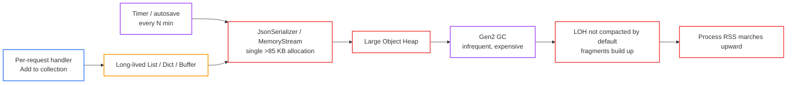
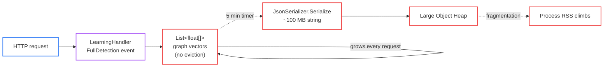
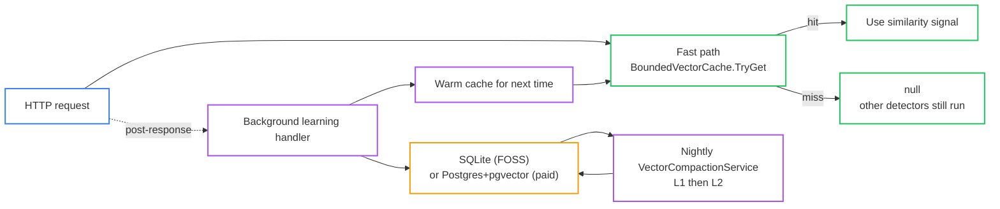

# StyloBot Release Series: Finding and Fixing Unbounded Growth in Long-Running .NET Services

*Long-running services tend to slowly drift toward unbounded memory. Here's how I find that drift, how I think about fixing it without papering over it, and a worked example from StyloBot's vector similarity layer that took it from 13 GB on the Large Object Heap to under 6 MB.*

> ## DRAFT
> This is a working draft in the StyloBot Release Series. Numbers, knobs, and naming may still change before final release.

> **StyloBot Release Series**
>
> 1. [**Behaviour, Not Identity**](/blog/stylobot-fingerprint) - why StyloBot models clients behaviourally
> 2. [**Behaviour-Aware ASP.NET UI**](/blog/behaviour-aware-ux) - the server-rendered surface over that detection result
> 3. **Finding and Fixing Unbounded Growth in Long-Running .NET Services** - the reliability discipline (worked example: StyloBot)
> 4. [**Behaviour-Aware TypeScript UI**](/blog/typescript-sdk) - Express, Fastify, and browser components
> 5. [**The Sidecar Architecture**](/blog/sidecar-architecture) - how the detection engine connects to non-.NET stacks

<!--category-- ASP.NET, StyloBot, Bot Detection, Performance, Architecture -->
<datetime class="hidden">2026-05-09T10:30</datetime>

The worked example is the StyloBot vector layer, but the discipline isn't StyloBot-specific. Any long-running .NET service that accumulates state from traffic eventually grows a class of bug you can't catch in tests or short load runs - it only shows up after days of real traffic. This post is the playbook I use for finding it.

The behavioural model is in [Behaviour, Not Identity](/blog/stylobot-fingerprint); the ASP.NET surface in [Behaviour-Aware ASP.NET UI](/blog/behaviour-aware-ux); source at [github.com/scottgal/stylobot](https://github.com/scottgal/stylobot).

[TOC]

---

## The class of problem

Long-running services accumulate. Every cache, every learning store, every "we'll just keep the last N requests" buffer is a tiny accumulator. Each one looks fine on its own. Together, on a process that's been up for a week, they form a memory shape no test ever reproduces:

- works fine in dev, CI, and the first day in production
- gradually drifts toward OOM, then either crashes or starts paging

You catch this by *deliberately looking for it*, on a process that's been running long enough for the shape to emerge.

## Step 1: Periodic reliability reviews (the act of looking)

The first piece of the discipline isn't technical. It's the calendar entry.

Every few releases, I stop adding features and just look at the running system under realistic traffic, asking *does any of this look wrong?* No specific bug, no goal - just looking. Running systems lie quietly; they don't fail loudly until they fail catastrophically. If you only look when something breaks, you've already lost.

The most recent review caught the bug this post is about: the `Mostlylucid.BotDetection.Demo` process sitting at a 20 GB resident set under synthetic test traffic. That's the kind of number that should not survive thirty seconds of attention.

**Rule:** put a recurring slot on the calendar to read your own metrics. Not to fix anything. Just to look.

## Step 2: Let counters surprise you

The right tool for "is something wrong?" on a .NET process is [`dotnet-counters`](https://learn.microsoft.com/en-us/dotnet/core/diagnostics/dotnet-counters). It's free, it's already installed, and it tells you the truth about what your process is doing right now.

A few commands later on the StyloBot demo:

```
dotnet.gc.last_collection.heap.size[loh]   13,393,217,096 bytes (13.4 GB)
dotnet.gc.heap.total_allocated              97 MB/sec
dotnet.exceptions[SqliteException]          4/sec
```

That's enough to know what's wrong without reading any code yet. The [Large Object Heap](https://learn.microsoft.com/en-us/dotnet/standard/garbage-collection/large-object-heap) was at 13.4 GB and growing at nearly 100 MB/sec. Something was allocating enormous objects continuously, and the Gen2 GC couldn't keep up with them.

### A quick refresher on the LOH (because every .NET dev hits this eventually)

The Large Object Heap is one of the most common surprises the first time you profile a long-running .NET service. It's worth recapping because almost everyone meets it the hard way:

- The GC has three generations (Gen0, Gen1, Gen2) for normal short-lived objects. Most allocations live and die in Gen0, which is cheap to collect.
- **Anything larger than 85 KB doesn't go in those generations.** It goes straight onto the **Large Object Heap**.
- The LOH is only collected during a **Gen2 GC**, which is the most expensive collection .NET does. Gen2 happens infrequently, and the runtime tries hard to avoid it.
- Worse, by default the LOH is **not compacted** when it is collected - it just frees the slots. So even after a Gen2, the LOH gets fragmented: you have free space, but it's in the wrong-sized holes for the next allocation. New large objects extend the heap rather than reuse it.
- Net effect: keep allocating large objects at a steady rate, and your process's memory footprint marches upward whether or not the objects are still referenced. It looks like a leak even when it isn't one.

The biggest sources of accidental LOH growth in real .NET services, in my experience:

| Source | Why it ends up on the LOH |
|---|---|
| `JsonSerializer.Serialize(obj)` returning a `string` | A 100 MB object becomes a 200 MB UTF-16 string, all in one allocation |
| `MemoryStream` you let grow unbounded | Internal buffer doubles past 85 KB and stays on the LOH |
| `byte[] buf = new byte[n]` for big `n` | Direct LOH allocation; very common in file/network reads |
| `List<T>` that grows past ~10 K reference-typed items | Backing array crosses 85 KB and lands on the LOH |
| `string.Concat` / `StringBuilder` over big text | Final `ToString()` is a single huge allocation |
| `XmlSerializer` / `DataContractSerializer` of large graphs | Same shape as the JSON case |

If you only remember one rule of thumb: **be suspicious of any code path that produces a single contiguous big object on a timer or per request.** That's the shape that wrecks long-running services, and it's exactly the shape we're about to find in StyloBot:



Tools that help diagnose it:

- [`dotnet-counters`](https://learn.microsoft.com/en-us/dotnet/core/diagnostics/dotnet-counters) for live numbers (the LOH gauge above).
- [`dotnet-gcdump`](https://learn.microsoft.com/en-us/dotnet/core/diagnostics/dotnet-gcdump) and [`dotnet-dump`](https://learn.microsoft.com/en-us/dotnet/core/diagnostics/dotnet-dump) for snapshots you can open in Visual Studio or PerfView.
- [PerfView](https://github.com/microsoft/perfview) itself for tracing allocations down to a stack.
- **JetBrains CLI profilers** - what I actually used for this rework. Now packaged as proper .NET global tools, so headless / remote / CI runtime profiling needs no Rider GUI:
  - [`JetBrains.dotMemory.GlobalTools`](https://www.jetbrains.com/help/dotmemory/Command-Line_Profiler.html) - attach, take a memory snapshot, open the `.dmw` workspace later to see which retained roots are holding the LOH allocations.
  - [`JetBrains.dotTrace.GlobalTools`](https://www.jetbrains.com/help/profiler/Performance_Profiling__Profiling_Using_the_Command_Line.html) - same shape for sampling / tracing / timeline data. Use this when you need a stack rather than a counter (e.g. "what is that timer actually doing?").

  ```bash
  dotnet tool install -g JetBrains.dotMemory.GlobalTools
  dotnet tool install -g JetBrains.dotTrace.GlobalTools

  dotMemory get-snapshot <pid> --save-to-dir=./snapshots
  dotTrace attach <pid> --profiling-type=Sampling --timeout=60s --save-to=./trace.dtp
  ```

  Division of labour for this rework: `dotnet-counters` told me the LOH was the problem; the dotMemory snapshot told me the autosave timer was the cause.

There are escape hatches if you genuinely need them - `GCSettings.LargeObjectHeapCompactionMode = CompactOnce` forces a one-off LOH compaction, and [`RecyclableMemoryStream`](https://github.com/microsoft/Microsoft.IO.RecyclableMemoryStream) from Microsoft pools buffers to avoid the allocation in the first place - but they're plasters. The real fix is almost always to stop producing the giant object in the first place.

### Back to the diagnosis

So whenever you see steady LOH growth in a long-running service, the question is almost always the same: *what's allocating very large objects, on what cadence, and why?* The shape of the answer (timer? request handler? serializer? buffer pool?) tells you where to look in code.

The exceptions counter mattered too. `4/sec` of `SqliteException` is low enough to not show up in logs anyone reads, but high enough to tell you a code path is silently retrying. That's the kind of clue periodic review picks up that incident response never does.

**Rule:** when something looks wrong, confirm with `dotnet-counters` before guessing. The numbers will narrow the search radius by an order of magnitude.

## Step 3: The wrong-abstraction smell (worked example: HNSW for caching)

This is where the discipline gets interesting, because the temptation - always - is to *patch* the symptom rather than question the abstraction.

> ### Quick vocab (for the next few sections)
>
> - **Vector**: a fixed-size array of floats - e.g. `float[64]`. Each slot is a measured property of the request (header count, timing, IP family, etc.). Two requests that "feel similar" produce vectors that are close to each other in 64-dimensional space. Don't overthink it - it's just a `float[]`.
> - **Vector similarity**: usually [cosine similarity](https://en.wikipedia.org/wiki/Cosine_similarity) - the cosine of the angle between two vectors. Closer to 1.0 = more similar. The actual maths is a dot product divided by two norms; one method call.
> - **Approximate nearest neighbour (ANN)**: "given this vector, find the closest N out of millions, fast". Brute-force comparison is O(N) per query. ANN algorithms get sub-millisecond results at the cost of occasionally missing the *true* closest match.
> - **HNSW**: one of those ANN algorithms. It builds a layered graph where the top layer has a few well-connected nodes and lower layers fill in detail. You enter at the top and zoom in. Excellent for indexing a large, *stable* set of vectors. Not designed for "every request adds one and old ones go away" - the relevant point of this whole post.
> - **Centroid**: the average of a group of vectors - one vector that summarises the cluster. If you have 10,000 vectors that all look broadly similar, you can throw them away and keep one centroid; the centroid is a lossy but compact substitute. Compaction strategies use this to turn a lot of raw history into a little summary history.

For StyloBot, the LOH growth led to three classes that were structurally identical: in-process [HNSW](https://en.wikipedia.org/wiki/Hierarchical_navigable_small_world_graphs) (Hierarchical Navigable Small World) graphs ([original Malkov & Yashunin paper](https://arxiv.org/abs/1603.09320)) used for similarity search over signature, session, and intent vectors. Each had a field like:

```csharp
private readonly List<float[]> _graphVectors = new();
```

Each was fed by a learning handler that subscribed to `LearningEventType.FullDetection`, which fires on **every HTTP request**. Every request added a vector. Every request. There was no eviction.

And every five minutes, an autosave timer serialized the entire graph to JSON and wrote it to disk:

```csharp
private readonly TimeSpan AutoSaveInterval = TimeSpan.FromMinutes(5);
```

At demo scale, `signatures.vectors.json` was 104 MB. In production: `intent.meta.json` at 70 MB, `intent.vectors.json` at 51 MB. JSON serialization creates a contiguous string in memory at 100+ MB. That string goes straight to the LOH. Three indices, every five minutes, continuously growing.



Now: the easy fix is to add a cap. `MaxVectors = 10_000`, LRU eviction, ship it. It would have worked - numbers would come down, dashboard would look fine. It would also have been wrong.

HNSW is excellent technology and I use it deliberately elsewhere ([Self-Hosted Vector Databases with Qdrant](/blog/self-hosted-vector-databases-qdrant), [RAG Hybrid Search and Indexing](/blog/rag-hybrid-search-and-indexing), [Minimum Viable GraphRAG](/blog/graphrag-minimum-viable-implementation)). [Pinecone](https://www.pinecone.io/learn/series/faiss/hnsw/), [Weaviate](https://weaviate.io/developers/weaviate/concepts/vector-index#hnsw-index), [pgvector](https://github.com/pgvector/pgvector#hnsw), and [Qdrant](https://qdrant.tech/documentation/concepts/indexing/#vector-index) all use it internally. But it's an index of a corpus, not a cache - and what StyloBot actually needed was a cache: *"for each active fingerprint, keep a small window of recent behavioural vectors so detection can compare the current request against past behaviour from similar ones."* Bot fingerprints repeat (stay hot); human fingerprints don't (evict). The earlier [As Simple As Possible](/blog/botdetection-part3-as-simple-as-possible) post listed the in-process HNSW index as a feature - this post is the follow-up admitting where that was the wrong fit.

There's a quick test for the smell: if you imagine slapping a hard cap on the structure, is the result still semantically the thing you wanted? A capped HNSW with constant churn isn't an index, it's a bad cache wearing an index's clothes.

**Rule:** when you see unbounded growth, the question is not *"how do we cap this structure?"* but *"is this the right structure for what we're doing?"* The first hides the symptom. The second hears what it's telling you.

## Step 4: Pick the right shape, not just a cap

Once you've named the wrong abstraction, the replacement usually writes itself. For StyloBot it was two layers:

**Hot layer:** a bounded `BoundedVectorCache<TEntry>` - a thin wrapper around [`ConcurrentDictionary`](https://learn.microsoft.com/en-us/dotnet/api/system.collections.concurrent.concurrentdictionary-2) with access-frequency priority eviction. The retention scorer gives bot-classified entries a 2x survival weight, so the cache self-organises around the traffic pattern:

```csharp
retentionScorer: (_, entry) => entry.WasBot ? 2.0 : 1.0
```

**Persistent layer (FOSS):** three new SQLite tables (`signature_centroids`, `session_centroids`, `intent_centroids`) storing compressed centroids from a nightly `VectorCompactionService`. Vectors stored as raw float32 blobs using [`MemoryMarshal.AsBytes`](https://learn.microsoft.com/en-us/dotnet/api/system.runtime.interopservices.memorymarshal.asbytes):

```csharp
internal static byte[] PackFloats(float[] v) =>
    MemoryMarshal.AsBytes(v.AsSpan()).ToArray();
```

Compact binary serialization. No 100+ MB JSON strings. No LOH.

> **Storage tier note.** SQLite is the FOSS / single-binary backend - the right call for "drop the exe on a Pi and walk away." Commercial StyloBot uses PostgreSQL with [pgvector](https://github.com/pgvector/pgvector), giving you proper indexed similarity search (HNSW/IVFFlat *inside the database* - on a stable corpus, where HNSW belongs), horizontal scale, and shared state across a fleet. Same architectural rule, different backend. [sqlite-vss](https://github.com/asg017/sqlite-vss) is a stepping stone if you outgrow SQLite but want to stay single-binary; the cleaner upgrade is the Postgres tier.

Similarity search on the FOSS persistent layer is brute-force cosine over all rows, accelerated with SIMD ([`System.Numerics.Tensors.TensorPrimitives`](https://learn.microsoft.com/en-us/dotnet/api/system.numerics.tensors.tensorprimitives)). At compacted-centroid scale (hundreds to a few thousand rows), a full scan takes ~1-2 ms on a Pi4. That's fine: this only runs in background handlers, never on the detection fast path.

A note on **L1/L2 compaction**, since "compaction" is doing real work in this section. The compaction service runs nightly and reduces history in two passes:

- **L1**: take all the raw vectors written today, group the ones that are very similar, and replace each group with one centroid (the average). Cheap; happens often; modest size reduction (e.g. ~10x).
- **L2**: take L1 centroids that are themselves similar across days/weeks and merge them again. Aggressive; happens less often; large size reduction (another ~10x). What survives L2 is the long-term shape of the traffic, not the transient noise.

This is the same pattern LSM-tree storage engines (RocksDB, LevelDB, Cassandra) use for SSTables - level 0 holds recent fine-grained data; lower levels hold compacted, summarised data. Borrowing it works because the access pattern is the same: most reads hit recent data; a small fraction of reads need the long tail; nothing benefits from keeping every raw row forever.



The general shape - **bounded hot cache for the steady state + compact persistent store for history + a periodic compactor between them** - shows up over and over in long-running learning systems. It's worth keeping in your toolkit. When somebody reaches for HNSW or pgvector for a workload that's actually a cache, this is the cheaper, simpler thing they should have reached for instead.

**Rule:** prefer the simplest data structure that fits the *runtime pattern*, not the one that fits the dataset's size on paper.

## Step 5: Make the fast path tolerate misses

A subtle one, because it's about restraint rather than addition.

If the slow-fix path involves a database lookup, the temptation is to make the fast path block on it. Don't. The detection fast path in StyloBot is synchronous, and the similarity check is a non-blocking dictionary lookup:

```csharp
if (!_cache.TryGet(signatureId, out var entry))
    return null; // no signal this request - other 48 detectors still run
```

A miss means *no similarity signal this request*. The other detectors still run. A background handler queries SQLite after the request completes and warms the cache for next time; the fast path never blocks on a database query.

This is where most caching goes wrong: people build a cache, make the fallback synchronous "for correctness", and the miss path becomes a 50ms p99 spike. The cache was meant to make things faster; instead it made the worst case worse.

**Rule:** if you can't tolerate a miss, you don't have a cache - you have a fancy queue.

## Step 6: Audit *every* accumulator, not just the loud one

Once you've found one unbounded structure, assume there are others. The loud one is just the one that broke first.

The audit is mechanical. For each long-lived dictionary, list, or set: *what bounds its size, who decides when entries leave, and what's the worst case under hostile traffic?* If you can't answer all three in one sentence, it's a leak. (Same discipline as the [Ephemeral Signals](/blog/ephemeral-signals) model: anything that accumulates must decay, evict, or compact.)

For StyloBot, most accumulators were already well-bounded:

- `EphemeralPatternReputationCache`: hard cap at 10,000 entries with background decay and LRU eviction
- `BehavioralPatternAnalyzer`: IMemoryCache with per-identity limits (50 paths, 100 timings, 15-min TTL)
- `DriftDetectionHandler`: 10,000 patterns × 50 samples, TTL-pruned
- `SessionEscalationService`: 35-minute TTL with timer-driven eviction

One needed attention beyond the HNSW classes: `MarkovTracker._cohortBaselines`. The [Markov chain](https://en.wikipedia.org/wiki/Markov_chain) tracker maintains per-cohort baseline transition matrices (separate from per-signature chains, which already had LRU eviction at `MaxTrackedSignatures`). The cohort baselines - one per traffic cohort like "datacenter-new" or "residential-returning" - had no eviction at all. The fix: evict the coldest cohorts (fewest total transitions) when the dictionary exceeds `SelfMaintenanceOptions.MarkovCohortSize`.

**Rule:** every singleton collection answers three questions or it's a bug: what bounds it, what evicts it, what's its worst-case shape.

## Step 7: Make every bound configurable

The next failure mode after "no bound" is "bound that's wrong for this hardware". Hard-coding `MaxEntries = 10_000` is fine until somebody runs your service on a Pi4, or in a container with 256 MB.

For StyloBot, every limit landed under a single `SelfMaintenanceOptions` block in `appsettings.json`. The defaults work for a standard server. For constrained hardware there's a `LowMemory` static preset:

```csharp
public static SelfMaintenanceOptions LowMemory => new()
{
    SignatureCacheSize  = 1_000,
    SessionCacheSize    = 500,
    IntentCacheSize     = 300,
    MarkovCohortSize    = 2_000,
    CacheSlidingExpiration = TimeSpan.FromHours(1),
};
```

```csharp
builder.Services.AddBotDetection(opts =>
{
    opts.SelfMaintenance = SelfMaintenanceOptions.LowMemory;
});
```

Or via `appsettings.json` for environment-specific tuning:

```json
{
  "BotDetection": {
    "SelfMaintenance": {
      "SignatureCacheSize": 1000,
      "SessionCacheSize": 500,
      "IntentCacheSize": 300,
      "CentroidRetentionDays": 14
    }
  }
}
```

The deeper point: a bound that's set in one place is something operators can reason about. A bound that's smeared across fifteen `const int` declarations is something nobody can reason about. Centralising the knobs is half of being self-maintaining.

**Rule:** every bound the operator might want to change for their hardware lives in one config block, not scattered across the codebase.

## What "fixed" looks like

For StyloBot specifically (FOSS build, LowMemory preset):

| Component | Before | After |
|---|---|---|
| Signature HNSW index | Unbounded LOH | ~256 KB hot cache |
| Session HNSW index | Unbounded LOH | ~258 KB hot cache |
| Intent HNSW index | Unbounded LOH | ~43 KB hot cache |
| JSON autosave buffers | 100-500 MB LOH every 5 min | 0 |
| Markov cohort baselines | Unbounded | ~1 MB (2K cap) |
| Total vector layer | **13+ GB LOH** | **<6 MB** |

The detection model is unchanged. What changed is *where similarity evidence lives* and *when it's allowed to affect the fast path*. Centroids survive restarts in SQLite (FOSS) or Postgres+pgvector (paid); nightly compaction still produces L1/L2; none of it requires unbounded memory.

On a Pi4 with the LowMemory preset, the FOSS build sits under 500 MB RSS after warmup, indefinitely. Paid Postgres-backed deployments inherit the same hot-cache discipline - the persistent layer just scales horizontally instead of living next to the process. Either way: predictable steady-state envelope, reached after warmup, regardless of uptime or traffic.

## The general lesson

Adding a cap bounds memory without changing the architecture. The wrong abstraction stays wrong; the symptom just gets quieter. The next person to touch the system inherits a structure that almost works - which is worse than one that obviously doesn't.

The pattern that recurs in long-running learning systems:

- **Cap the hot path** - bounded, in-memory, designed to tolerate misses, eviction policy aligned with the workload
- **Compress the history** - compact binary persistent store, periodically compacted, accessed off the request thread
- **Audit everything else** - every accumulator answers what bounds it, what evicts it, what's the worst case
- **Centralise the knobs** - one config block, not fifteen `const`s
- **Schedule the looking** - the bug only exists in the running system

Fix the shape, not the symptom.

---

## Further reading

**StyloBot release series**

- [Behaviour, Not Identity](/blog/stylobot-fingerprint) - the behavioural model and Leiden clustering this layer is the memory for
- [Behaviour-Aware ASP.NET UI](/blog/behaviour-aware-ux) - the surface that consumes detection verdicts in Razor
- [Bot Detection Part 2: Signature Pipeline and StyloBot Architecture](/blog/botdetection-part2-signature-pipeline-and-stylobot-architecture) - the original detection-engine architecture post
- [Bot Detection Part 3: As Simple As Possible](/blog/botdetection-part3-as-simple-as-possible) - the two-line drop-in (where the in-process HNSW index was first introduced)

**HNSW and vector search in this blog**

- [Self-Hosted Vector Databases with Qdrant](/blog/self-hosted-vector-databases-qdrant) - HNSW deep dive: graph layers, `M`, `ef_construct`, tuning
- [RAG Hybrid Search and Indexing](/blog/rag-hybrid-search-and-indexing) - HNSW as the dense half of a hybrid retrieval pipeline
- [Minimum Viable GraphRAG](/blog/graphrag-minimum-viable-implementation) - DuckDB VSS HNSW gotcha (`array_cosine_distance` vs `array_cosine_similarity`)
- [Semantic Search with ONNX and Qdrant](/blog/semantic-search-with-onnx-and-qdrant) - HNSW configuration via the Qdrant .NET client
- [GraphRAG: Why Vector Search Breaks Down at the Corpus Level](/blog/graphrag-knowledge-graphs-for-rag) - why pure ANN isn't enough at scale

**External references**

- [HNSW (Wikipedia)](https://en.wikipedia.org/wiki/Hierarchical_navigable_small_world_graphs)
- [Malkov & Yashunin, *Efficient and robust approximate nearest neighbor search using Hierarchical Navigable Small World graphs*](https://arxiv.org/abs/1603.09320) - the original 2016 paper
- [Pinecone: Faiss / HNSW explainer](https://www.pinecone.io/learn/series/faiss/hnsw/)
- [Qdrant indexing concepts](https://qdrant.tech/documentation/concepts/indexing/#vector-index)
- [.NET Large Object Heap docs](https://learn.microsoft.com/en-us/dotnet/standard/garbage-collection/large-object-heap)
- [`dotnet-counters` reference](https://learn.microsoft.com/en-us/dotnet/core/diagnostics/dotnet-counters) - the tool that surfaced the LOH in the first place
- [JetBrains dotMemory command-line profiler](https://www.jetbrains.com/help/dotmemory/Command-Line_Profiler.html) - the CLI / global-tool memory profiler used for this rework
- [JetBrains dotTrace command-line profiler](https://www.jetbrains.com/help/profiler/Performance_Profiling__Profiling_Using_the_Command_Line.html) - same shape for performance / timeline profiling
- [sqlite-vss](https://github.com/asg017/sqlite-vss) - SQLite + Faiss, if and when the persistent layer outgrows brute force

Source for the implementation: [github.com/scottgal/stylobot](https://github.com/scottgal/stylobot).
