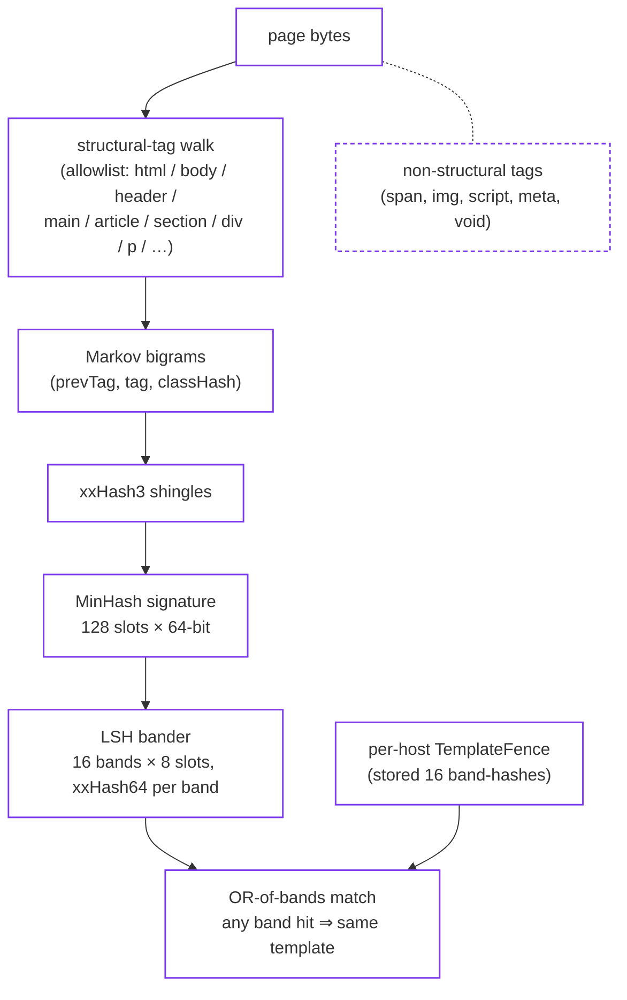
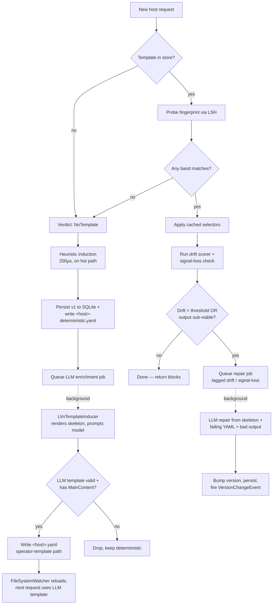

# StyloBot Release Series: LLM Template Induction in StyloExtract - Learn Once, Extract DeteCRITICrministically

*Part one of a two-part deep-dive on per-host template induction in StyloExtract. Covers what a template is, the three inducer modes (heuristic, LLM, repair), and how the MinHash fingerprint makes a learned template survive the small DOM churn every real site produces. Part two covers the streaming fence scanner.*

[](https://www.stylobot.net)

[](https://www.nuget.org/packages/Mostlylucid.StyloExtract.Html)
[](https://www.nuget.org/packages/Mostlylucid.StyloExtract.Llm.LlamaSharp)
[](https://www.nuget.org/packages/Mostlylucid.StyloExtract.Streaming)
[](https://github.com/scottgal/lucidview)

> **StyloBot Release Series**
>
> 1. [**Behaviour, Not Identity**](/blog/stylobot-fingerprint)
> 2. [**Behaviour-Aware ASP.NET UI**](/blog/behaviour-aware-ux)
> 3. [**Finding and Fixing Unbounded Growth in Long-Running .NET Services**](/blog/stylobot-release-reliability)
> 4. [**Behaviour-Aware TypeScript UI**](/blog/typescript-sdk)
> 5. [**The Sidecar Architecture**](/blog/sidecar-architecture)
> 6. [**Learning to Get Faster**](/blog/stylobot-release-learning)
> 7. [**Testing the Thing That Won't Sit Still**](/blog/stylobot-release-nondeterministic-testing)
> 8. [**StyloExtract - a local learning HTML to Markdown converter**](/blog/stylobot-release-styloextract): the walker bug lucidVIEW caught and the dogfood loop that made it honest
> 9. **LLM Template Induction in StyloExtract - Learn Once, Extract Deterministically** (this post)

<!--category-- Architecture, StyloBot, StyloExtract, LLM, lucidVIEW -->
<datetime class="hidden">2026-06-27T15:00</datetime>

[TOC]

---

## 1. Learn once, apply forever

[Part 8](/blog/stylobot-release-styloextract) walked through the static extraction pipeline and noted in passing that per-host fingerprinting via MinHash + LSH is what makes the system fast enough to use. That fingerprint is the subject of this post. So is the *thing it identifies*: a per-host **template** that the inducer learns once and the apply path uses for every subsequent visit. The LLM re-enters the loop only when the template stops fitting.

Three inducers ship today: heuristic, LLM, and a repair mode that takes a failing template plus the page that broke it and asks the model to fix the rules in place. All three converge on the same on-disk shape, which an operator can open in a text editor and hand-edit. The fingerprint exists so the apply path can find the right template per request in microseconds rather than re-classifying the page from scratch every time.

Source: [github.com/scottgal/styloextract](https://github.com/scottgal/styloextract). The lucidVIEW FULL edition that runs both backends in-process for dogfooding is at [github.com/scottgal/lucidview](https://github.com/scottgal/lucidview) (see `docs/full-edition.md`).

## 2. What a template is

A template in StyloExtract is a per-host learned answer to one question: *given the DOM of a page on this host, which subtrees are the content, which are chrome, which are navigation, which are boilerplate?*

The answer is a small set of `(role, selector, confidence)` tuples. Concretely, in the abstractions package ([`LearnedExtractor.cs`](https://github.com/scottgal/styloextract/blob/main/src/StyloExtract.Abstractions/LearnedExtractor.cs)):

```csharp
public sealed record LearnedExtractor
{
    public required Guid TemplateId { get; init; }
    public required int Version { get; init; }
    public required IReadOnlyList<BlockRule> Rules { get; init; }
    public required ExtractorCentroidState Centroid { get; init; }
}
```

`Rules` is the load-bearing field — each `BlockRule` carries a `BlockRole` (from a closed enum: `MainContent`, `Title`, `PrimaryNavigation`, `Footer`, `RepeatedItem`, etc.) and one or more CSS selectors that pick the matching elements out of the live DOM. `Centroid` is a small statistical state used by the drift scorer; `Version` increments every time the template is refit. There's an exact-twin shape for hand-authored templates called [`OperatorTemplate`](https://github.com/scottgal/styloextract/blob/main/src/StyloExtract.Abstractions/OperatorTemplate.cs) — same fields, surfaced as YAML, hot-overrides whatever the inducer learned.

Templates live in two places:

- **The SQLite store.** `SqliteTemplateIndex` (in [`StyloExtract.Templates`](https://github.com/scottgal/styloextract/tree/main/src/StyloExtract.Templates)) is the authoritative source. One row per `(template_id, host_hash, version)`. The `extractor_blob` column carries a System.Text.Json serialisation of the `LearnedExtractor`; a `template_lsh_band_index` table indexes the fingerprint for sub-millisecond probe at request time. Hostnames are HMAC-hashed before insert — `HostHasher` — so a templates DB stolen off disk doesn't reveal which sites the operator has been crawling.
- **YAML side-files.** Every time the deterministic inducer writes a new template, a copy goes through [`DeterministicTemplateYamlSink`](https://github.com/scottgal/styloextract/blob/main/src/StyloExtract.Core/OperatorTemplates/DeterministicTemplateYamlSink.cs) and lands as `<host>-deterministic.yaml` next to the SQLite file. LLM-induced templates land as `<host>.yaml` via the same emitter. The YAML files are auditable, diffable, hand-editable; they're never the source of truth at request time, but they ARE the thing an operator opens when they want to know what the inducer chose.

Here's a real one, captured by lucidVIEW FULL's dogfood loop the last time I pointed it at `www.bbc.co.uk`:

```yaml
host: www.bbc.co.uk
description: Deterministic heuristic-induced template, version 1,
             6 rule(s), captured 2026-06-27 11:40:11Z.
rules:
  - role: Title
    selectors:
      - body > div > div > div > div > div > main > div > h1
    confidence: 0.95
  - role: PrimaryNavigation
    selectors:
      - body > div > div > div > div > div > header > div > nav
    confidence: 0.9
  - role: Boilerplate
    selectors:
      - body > div > div > div > div > div > header > section > div > div > div
    confidence: 0.3
  - role: MainContent
    selectors:
      - body > div > div > div > div > div > main
    confidence: 0.92
  - role: SecondaryNavigation
    selectors:
      - body > div > div > div > div > div > footer > div > div > div > div > div > ul
    confidence: 0.85
  - role: SecondaryNavigation
    selectors:
      - body > div > div > div > div > div > footer > div > div > div > ul
    confidence: 0.85
```

Read it like a small contract:

- The page's `<h1>` is the **Title** — distinct from `Heading`, because consumers downstream (sitemap builders, RAG ingestion, lucidVIEW's outline view) want to ask "what is THIS page about" without pulling the whole body.
- The element at `body > div > div > div > div > div > main` is the **MainContent**, confidence 0.92. That's where the article lives. The walker (the same v1.7.1 GFM walker from part 8) gets pointed at this subtree only.
- Two **SecondaryNavigation** selectors in the footer — BBC ships two `<ul>` blocks down there and the deterministic inducer picked both with the same confidence.
- A low-confidence (0.3) **Boilerplate** rule for a header sub-region. The applicator will keep this OUT of the markdown output under the `RagFull` profile.

This template is *deterministic-induced*: it came from the heuristic classifier, not from an LLM. The selector depth (six `<div>`s before `<main>`) encodes BBC's design-system wrapping. A simpler site like Wikipedia produces a shallower chain. The template shape carries the chrome density of the host.

Notice what the template does NOT carry:

- No XPath, no `:nth-child(N)`, no positional indexing. Selectors are structural child chains: tag-based paths through the DOM, without sibling indexes, so they survive small re-orderings.
- No class names. Tailwind, CSS-modules and design-system class hashes change at every build; binding to them is a guaranteed re-fit on every deploy. The inducer prefers tag-and-structure selectors and the LLM prompt explicitly tells it to drop hash-shaped class tokens.
- No text content. The template knows where the article body LIVES; it doesn't memorise what it says. Wikipedia's `MainContent` rule is the same selector whether the article is about anteaters or Avalonia.

That's a template. It's small: typically 3 to 6 rules, each one or two selectors, a confidence number, total payload under 1 KB. It's specific to one host. And it took the heuristic classifier ~200 µs to produce.

The interesting question is: how do you get one without the heuristic? And how do you stop having to redo this every time the site's DOM moves a div?

## 3. How induction works

**Induction** is "infer the template from one or more pages of an unknown site, without a labelled corpus." StyloExtract ships three inducers — heuristic, LLM, repair — and a single rule binds them all: **a hand-authored operator template always wins.** If `weirdhost.com.yaml` sits in the templates dir, no inducer touches it.

The LLM pipeline is short and the order matters.

```
clean DOM
  → skeleton
  → prompt
  → YAML operator template
  → selector validation against live DOM
  → persisted template / reject
```

### Heuristic induction

The default and the cheapest. Lives in [`StyloExtract.Heuristics`](https://github.com/scottgal/styloextract/tree/main/src/StyloExtract.Heuristics). Walks the segmented blocks, scores each one against ~45 features (tag identity, child-count, text-length, link-density, ARIA role hints, class-name pattern matches against an embedded `framework-content` JSON), picks non-overlapping winners per role, builds a structural path first, then generalises it back into CSS selectors via `XPathBuilder` + `CssSelectorGeneralizer`, hands the result to `ExtractorInducer.Induce(...)`. No model, no IO. Pure C#. Single-allocation per page.

The output is a `LearnedExtractor` straight away; the on-disk artefact is the `<host>-deterministic.yaml` you saw above.

Runs on the gateway hot path. ~200 µs for a medium page; cheap enough to do once per never-before-seen host as long as the result then gets reused.

Where the heuristic falls down is documented in part 8: any site whose body region doesn't carry `<main>` / `<article>` / `[role=main]` and doesn't use a class-name the heuristic recognises gets demoted-to-Boilerplate. Shopify themes, Notion marketing pages, Tailwind-component-library SPAs. The heuristic gives you nothing on those pages and the YAML side-file shows it — the `MainContent` rule is missing, period.

### LLM induction

The new piece. Lives in [`StyloExtract.Core/Llm`](https://github.com/scottgal/styloextract/tree/main/src/StyloExtract.Core/Llm) plus one of two backend packages — [`StyloExtract.Llm.Ollama`](https://github.com/scottgal/styloextract/tree/main/src/StyloExtract.Llm.Ollama) (remote, talks to an Ollama daemon) or [`StyloExtract.Llm.LlamaSharp`](https://github.com/scottgal/styloextract/tree/main/src/StyloExtract.Llm.LlamaSharp) (in-process, loads a GGUF model via LLamaSharp). The orchestrator is [`LlmTemplateInducer`](https://github.com/scottgal/styloextract/blob/main/src/StyloExtract.Core/Llm/LlmTemplateInducer.cs) and it composes four small parts:

1. [`DomSkeletonRenderer`](https://github.com/scottgal/styloextract/blob/main/src/StyloExtract.Core/Skeleton/DomSkeletonRenderer.cs) walks the cleaned DOM and writes a slim tree-with-exemplars representation. Tags, recognisable class tokens, child counts, link density, ARIA labels, a ≤120-char text excerpt per element, grouped repeats collapsed to "… 30 repeated `<li>` children (3 exemplars below)". Median page renders to 1-4 KB; worst case 12 KB. Hash-looking class tokens (Tailwind JIT, CSS-modules) get dropped because they're noise to a model trying to reason about structure.
2. [`LlmInducerPrompts`](https://github.com/scottgal/styloextract/blob/main/src/StyloExtract.Core/Llm/LlmInducerPrompts.cs) builds a one-shot prompt. System message enumerates the closed `BlockRole` set, gives one worked example, tells the model to emit a single fenced YAML block matching the operator-template schema, and lists negative patterns (language pickers, filter panels, pagination strips, cookie banners) it must NOT classify as `MainContent`.
3. The `ILlmTextProvider` (one implementation per backend) sends `(system, user)` and waits.
4. `LlmTemplateInducer.InduceFromSkeletonAsync(...)` extracts the YAML fence from the response, parses it with `YamlOperatorTemplateLoader`, then — crucially — runs every emitted selector against the live AngleSharp document and drops any that match zero elements. If `MainContent` has no surviving selectors after validation, the whole template is rejected.

Always slow-path. Per-call latency is "tens of seconds, depending on model"; in the gateway shape it runs inside the [`TemplateEnrichmentCoordinator`](https://github.com/scottgal/styloextract/blob/main/src/StyloExtract.Core/TemplateEnrichment/TemplateEnrichmentCoordinator.cs) background service, which drains a queue at a configurable QPS cap (default 100ms minimum interval between calls), writes results as `<host>.yaml` into the operator-template root, and lets the FileSystemWatcher in `YamlFileOperatorTemplateStore` pick them up. Next request to that host hits the hard-override path with the LLM template.

The result is richer than the heuristic on messy pages. The LLM can read `aria-label="article body"`, see that a `<div>` with three text excerpts that look like prose is more likely the content than its 14-child grid-class sibling, and emit a tighter selector. It can also do the opposite — hallucinate a selector that doesn't exist on the page — which is exactly why the post-parse validator runs.

The default local model in my dogfood setup is `qwen3.5:4b`. lucidVIEW FULL lazy-downloads its GGUF on first use (~2.5 GB) under `AppPaths.ModelCacheDir`.

### Repair (refit-via-LLM)

The third inducer mode. Same `LlmTemplateInducer` class, different entry-point: [`RepairFromSkeletonAsync(skeleton, host, existingTemplateYaml, badMarkdownSample)`](https://github.com/scottgal/styloextract/blob/main/src/StyloExtract.Core/Llm/LlmTemplateInducer.cs#L171). The prompt is different — `SystemRepair` tells the model "you are FIXING a template that produced bad output, not inducing from scratch", attaches the failing template's YAML and (optionally) a snippet of the empty/wrong markdown it produced, and asks for a corrected version with the version field bumped.

Repair triggers from one of two signals:

- **Drift threshold exceeded.** The standard `RefitOrchestrator` in [`StyloExtract.Templates`](https://github.com/scottgal/styloextract/blob/main/src/StyloExtract.Templates/RefitOrchestrator.cs) maintains an EWMA of per-application drift scores and queues a repair job when the accumulated score crosses `DriftRefitThreshold`.
- **Signal-loss bug-out.** When the cached applicator produces output below `MinViableExtractText`, `LayoutExtractor` forces a refit on THIS page immediately, tagged `reason: "signal-loss"`. The version-change event distinguishes "site evolves" (drift) from "site redesigned" (signal-loss) so monitoring can react differently.

Repair is cheaper than full induction in expectation because the model already has a near-correct template. Most repairs change one or two selectors, not all six.

## 4. Why the template survives DOM churn

Everything in §3 assumes a learned template gets reused on the next request to the same host. Real-world DOMs drift between requests: an extra wrapping `<div>`, a `<section>` re-ordered above its sibling, regenerated class names, an injected cookie banner, an A/B variant. Exact-selector matching breaks on any of those. Tag-set-only matching gives no signal because every page contains divs and paragraphs.

The fingerprint has to be stable across small DOM diffs and unstable across large ones. MinHash + LSH over structural-tag bigrams does exactly that.

The fingerprint isn't over the DOM tree directly. It's over a *sequence of structural-tag transitions* derived from a single linear walk of the bytes. From [`StructuralTagAllowlist.cs`](https://github.com/scottgal/styloextract/blob/main/src/StyloExtract.Streaming/StructuralTagAllowlist.cs):

```csharp
private static readonly string[] s_names =
{
    "html", "body", "head",
    "header", "footer", "nav", "aside",
    "section", "article", "main", "div",
    "p", "ul", "ol", "li",
    "h1", "h2", "h3", "h4", "h5", "h6",
    "table", "tbody", "thead", "tr",
};
```

Anything not in that list — `<span>`, ``, `<script>`, `<meta>`, `<link>`, `<style>`, every inline tag, every void element — skips the sketch entirely. Page chrome that the layout doesn't care about doesn't contribute noise. A 4KB Tailwind utility-class blob that emits 200 `<span>`s in a hot-toast container doesn't shift the fingerprint at all.

Each shingle is a Markov bigram of consecutive transitions: `(prevTagHash, currentTagHash, currentClassHash)`. From [`TemplateFence.cs`](https://github.com/scottgal/styloextract/blob/main/src/StyloExtract.Streaming/TemplateFence.cs):

```csharp
private static ulong ShingleHash(ulong prevTagHash, ulong tagHash, ulong classHash)
{
    Span<byte> buf = stackalloc byte[24];
    BitConverter.TryWriteBytes(buf, prevTagHash);
    BitConverter.TryWriteBytes(buf[8..], tagHash);
    BitConverter.TryWriteBytes(buf[16..], classHash);
    return XxHash3.HashToUInt64(buf);
}
```

Order matters. `[main, h1]` and `[h1, main]` produce different shingles.

Each shingle hash is fed into a `MinHashSketcher(128)`. For each of 128 independent seeds, the sketch keeps the *minimum* hash value seen across all shingles. The rate at which two signatures share values in corresponding slots approximates the Jaccard similarity of the underlying shingle sets.

A 128-element similarity comparison every probe is too expensive, so the standard banded-LSH trick splits the signature into bands and hashes each band to a single ulong. From [`RollingSketch.cs`](https://github.com/scottgal/styloextract/blob/main/src/StyloExtract.Streaming/RollingSketch.cs):

```csharp
public readonly bool Matches(in TemplateFence fence)
{
    Span<ulong> bands = stackalloc ulong[16];
    ComputeBands(_signature, bands);
    var fenceBands = fence.LshBands;
    var n = Math.Min(bands.Length, fenceBands.Length);
    for (int i = 0; i < n; i++)
        if (bands[i] == fenceBands[i]) return true;
    return false;
}
```

Sixteen bands, eight signature slots per band, hashed with xxHash64. **Any single band matching = the templates are considered the same.** That's the OR-of-bands rule: the more bands, the higher the chance that *some* band survives a small perturbation. 16×8 is the sweet spot for real-world web HTML: tolerates an A/B variant or a sibling re-order without ever matching across unrelated hosts in the test corpus.

The full fingerprint stack, as a layer diagram:



The dashed lane on the left is what *doesn't* contribute. Page chrome that flips between requests (Tailwind utility blobs, hot-toast containers, A/B-injected `<div>`s with new class hashes every deploy) has nothing in the allowlist, so its bytes never reach the sketch. That's the "stable across small DOM diffs" half of the contract.

"Drift" is per-extraction-profile, not per-page. In `RagFull` the bands that matter cover the MainContent + Title subtrees; in `Sitemap` it's nav + title + breadcrumb; in `AgentNavigation` it's the nav cluster. Churn outside the extracted subtrees flips shingles that don't enter the relevant fingerprint at all — header redesigned, footer restructured, sidebar swapped, A/B banner injected — the template stays valid. Drift inside the extracted subtree flips shingles that do, the relevant bands stop matching, re-induction fires.

Add one wrapper div around the article body, flip a handful of in-subtree shingles, most bands still survive. Replace the main-content's structural transitions wholesale, the bands stop matching. Small in-subtree DOM churn reuses the template; large in-subtree movement forces re-induction.

The fingerprint isn't perfect. A site that re-orders entire major sections will look like a different template and trigger re-induction even when the content itself is identical; the right answer there is an operator template. The LSH bander has a non-zero false-positive rate. Two unrelated hosts can collide on one band hash, but the next step is selector-application, and if the cached applicator's output is below `MinViableExtractText` the signal-loss bug-out kicks in and a fresh induction runs. The false positive becomes a wasted probe and a refit, not a wrong answer.

The reuse key is what makes the LLM cost survivable. A single induction call (tens of seconds, not microseconds) amortises across every subsequent request to the same host for as long as the fingerprint holds. Sites that hold their structural shape for weeks are the common case, and the LLM gets called once per host per redesign, not once per request.

## 5. The lifecycle

The full lifecycle of a host's template, from never-seen to refit:



A few things worth pointing out:

- **First-visit cost is paid once.** The heuristic runs on the hot path because the LLM is too slow; the LLM's output replaces the heuristic's asynchronously, off the hot path, *if* it's better. If the LLM call fails or returns a template the validator rejects, the deterministic template stays in place. The system never regresses.
- **Operator templates are the override switch, always.** [`TemplateEnrichmentCoordinator.ProcessJobAsync`](https://github.com/scottgal/styloextract/blob/main/src/StyloExtract.Core/TemplateEnrichment/TemplateEnrichmentCoordinator.cs#L98) checks for a hand-authored template before invoking the LLM:

  ```csharp
  if (job.Kind == EnrichmentJobKind.Induce &&
      _operatorTemplateStore is not null &&
      _operatorTemplateStore.TryGet(job.Host, out _))
  {
      _logger?.LogDebug(
          "skipping enrichment for {Host}: hand-authored operator template exists",
          job.Host);
      return;
  }
  ```

  Same applies at request time — the hard-override path runs before any learned-template probe.

- **Version events are observable.** Every refit publishes a `VersionChangeEvent` via `ITemplateVersionEventSink`. The CLI has a streaming subscriber so you can run a host through the gateway and watch the inducer learn:

  ```bash
  stylo-extract template monitor --host www.example.com
  # ... waits, then on a refit ...
  # [drift] www.example.com v3 -> v4 (Δ rule: MainContent selector
  #         "body > div > main" -> "main#post-list")
  ```

- **Repair is targeted, not from-scratch.** The repair prompt carries the failing YAML so the model can preserve what was working and replace just the broken selectors. In the dogfood loop, this matters: most refits don't redraw the whole template, they swap one selector.

## 6. What runs on the hot path

What fires when:

| Situation | Verdict | What runs | Latency |
|---|---|---|---|
| First-ever request to host | `NoTemplate` | Heuristic induction → persist v1 → queue LLM enrichment | 200 µs hot + tens-of-seconds background |
| Subsequent request, fingerprint matches | Probe hit | Cached applicator → drift scorer | ~30 µs hot |
| Subsequent request, fingerprint doesn't match | `NoTemplate` | Heuristic re-induction (new version) | 200 µs hot |
| Cached template applied, drift EWMA > threshold | Probe hit + drift | Background repair job queued | 30 µs hot + repair background |
| Cached template applied, output sub-viable | Probe hit + signal-loss | **Forced** repair this page, `signal-loss` tag | 30 µs hot + repair on this request OR background per config |
| Hand-authored YAML exists | Hard override | Operator template applicator only | ~30 µs hot, no learning at all |

The LLM never sits on the hot path. The hot path is selectors against a parsed DOM, plus a fingerprint probe and a drift score. Everything model-shaped is queued.

lucidVIEW FULL is the dogfood edition that runs the LLM inducer in-process via LLamaSharp. The Lean release (the one we ship) keeps the static heuristic pipeline only; FULL is debug-only, lives on my desktop, exists to put load on the LLM path and surface bugs through the same loop part 8 described. The state directory on macOS is `~/Library/Application Support/lucidVIEW-FULL`. After opening a few pages over the dogfood week, it looks like:

```
~/Library/Application Support/lucidVIEW-FULL/
├── streaming-templates.db           SQLite, streaming templates
├── streaming-templates.db.alpha20-backup
├── styloextract-templates.db        SQLite, layout templates + LSH index
├── templates/
│   ├── en.wikipedia.org-deterministic.yaml
│   ├── www.bbc.co.uk-deterministic.yaml
│   └── www.mostlylucid.net-deterministic.yaml
├── models/                           GGUF cache (qwen3.5:4b lazy-downloaded)
├── extractions/                      per-URL captured payloads (dev tracing)
├── last-extraction.md                last rendered output, for inspection
└── settings.json
```

The streaming templates DB is its own thing (the fence sketches deferred to the next post). The layout templates DB is the `LearnedExtractor`-blob store from §2. Both write SQLite + YAML side-files so the same audit story works regardless of which path produced the template. The on-disk JSON in the SQLite `extractor_blob` column is not a second template format; it is the same in-memory `LearnedExtractor` persisted for fast request-time loading. The YAML emitter walks the same in-memory shape and produces the human-readable form.

Open a brand-new site in lucidVIEW FULL, watch the status-bar pipeline indicator, then `ls templates/` — a new `-deterministic.yaml` appeared. Restart the app, give it a few seconds, and (with the LLM inducer enabled) a `<host>.yaml` shows up next to it. That's the enrichment coordinator draining its queue.

## 7. What we trust

The honest summary:

- **Heuristic templates are trustworthy for SSR sites with semantic HTML.** Wikipedia, GitHub, BBC article URLs, government sites, well-formed blogs. The heuristic finds `<main>` or `[role=main]` and the selectors land. No LLM needed.
- **LLM templates are trustworthy for messy sites *when the validator survives*.** The validator dropping zero-match selectors is doing real work; what reaches the cache is a template whose selectors all hit at least one element on at least one observed page. That's not a guarantee of *correctness* — the LLM can still pick the language-picker container as MainContent — but it's a strong floor against hallucinated selectors.
- **Repair is trustworthy when the trigger signal was honest.** Signal-loss bug-out gives the LLM a known-broken state to fix; drift-triggered repair is fuzzier because EWMA-drift can also indicate normal variability across different pages on the same host.
- **Operator templates always win.** If you're running StyloExtract in production and a host matters, write the YAML. The system was designed assuming hand-authored overrides are the floor and inducers are the polish on top.

The MinHash fingerprint is the joinery that makes the whole pile reusable rather than constantly re-learning. Without it, every request to a known host would have to re-classify the page from scratch. With it, the system converges on a stable template per host within the first few visits, holds that template across normal site evolution, and only re-pays the LLM cost when the structural shape genuinely moves.

## Next: Streaming Fence Scanner

Everything above runs inside an in-process or background extraction pipeline: parse the page, classify the blocks, learn or apply the template, emit Markdown. That's the right shape for a desktop reader (lucidVIEW), for an AOT CLI (`stylo-extract`), or for any consumer happy to buffer the response first.

The gateway shape is different. A YARP middleware that wants to decide while the upstream HTTP response body is in flight whether to swap HTML for Markdown cannot afford to buffer multi-megabyte pages just to find out the verdict is "no template, pass through". It needs the answer chunk-by-chunk, matched against the same MinHash fingerprint machinery from §4, and ideally without allocating on the hot path at all.

`Mostlylucid.StyloExtract.Streaming` is the answer. The design constraint that drove every line of it is zero allocation in the per-chunk scan. A `ref struct` scanner over a `ref struct` HTML tokenizer that walks each chunk in place, drops complete-tag bytes immediately, and retains only the partial tag straddling a chunk boundary in a small (4 KiB-capped) reusable buffer. A three-tripwire FSM matching IdentityClaim hashes (prefix, content-start, content-end) against per-event hash data. Auto-induction on first visit via a local heuristic that picks the same three tripwires from a one-shot AngleSharp parse, with LLM escalation when the local heuristic cannot find them. Auto-refit on drift via [`StreamingRefitOrchestrator`](https://github.com/scottgal/styloextract/blob/main/src/StyloExtract.Streaming/StreamingRefitOrchestrator.cs). A version chain per host with self-healing on algorithm bumps via SQLite `PRAGMA user_version`.

Peak buffered memory ratio of 0.08% on real responses: 154 bytes held while scanning a 199,506-byte mostlylucid.net page. Bytes get parsed inline, complete-tag bytes drop immediately, and only the partial tag straddling a chunk boundary holds any memory at all. Hard cap is 4 KiB; a single tag larger than that throws rather than silently dropping bytes.

Part two is that build-out: the `ref struct` discipline, the incremental tokenizer's compact-on-emit contract, the three-tripwire state machine, depth-aware capture, the chunk-boundary semantics, the auto-induction lifecycle, the alpha.24 tag-prefilter that cut per-scan allocs ~25-30x, and the regression suite that pins the memory bound.

---

*StyloExtract source: [github.com/scottgal/styloextract](https://github.com/scottgal/styloextract). LLM inducer: [`src/StyloExtract.Core/Llm/`](https://github.com/scottgal/styloextract/tree/main/src/StyloExtract.Core/Llm). Backends: [`StyloExtract.Llm.LlamaSharp`](https://github.com/scottgal/styloextract/tree/main/src/StyloExtract.Llm.LlamaSharp), [`StyloExtract.Llm.Ollama`](https://github.com/scottgal/styloextract/tree/main/src/StyloExtract.Llm.Ollama). Streaming fences: [`src/StyloExtract.Streaming/`](https://github.com/scottgal/styloextract/tree/main/src/StyloExtract.Streaming). lucidVIEW FULL dogfood edition: [`docs/full-edition.md`](https://github.com/scottgal/lucidview/blob/main/docs/full-edition.md). The deterministic YAML side-files shown in this post are real captures from `~/Library/Application Support/lucidVIEW-FULL/templates/` after a dogfood pass over BBC, Wikipedia and mostlylucid.net.*