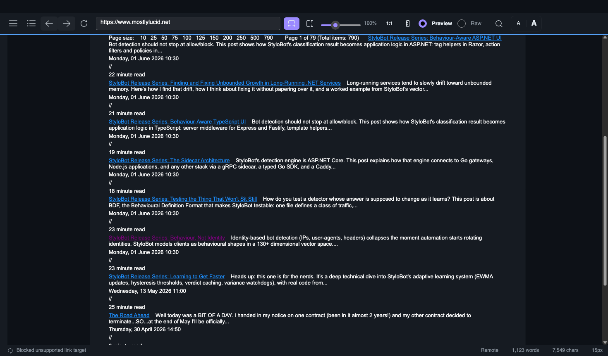
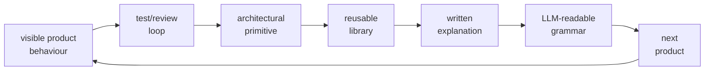
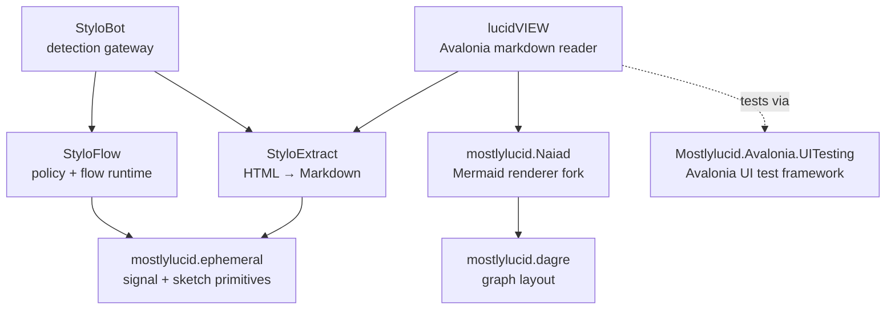
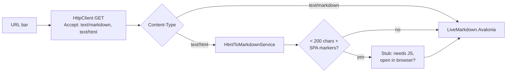
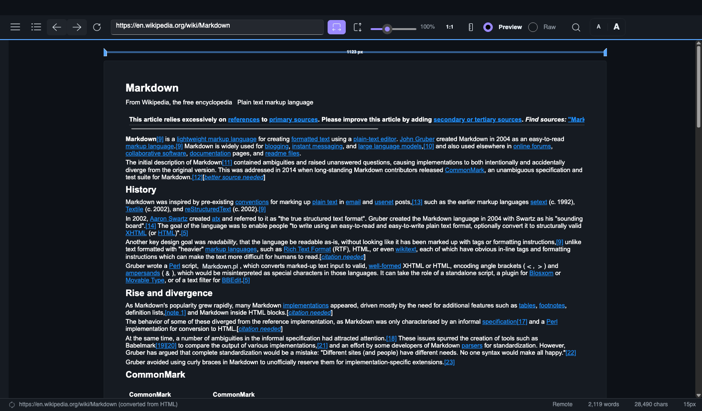
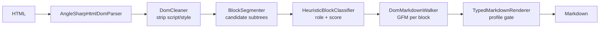
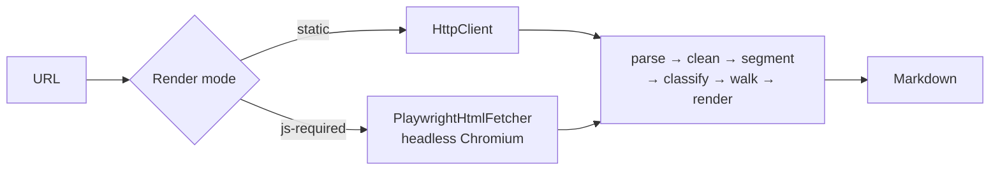

# StyloBot Release Series: StyloExtract - a local learning HTML to Markdown converter

*StyloBot v8 lets a site give AI crawlers a controlled Markdown view of its pages at its own local edge, without ceding the gateway to a CDN. This piece is about the extractor that does the conversion (StyloExtract): the walker bug [lucidVIEW](https://github.com/scottgal/lucidview) caught, and the dogfood loop that made it honest.*

[](https://www.stylobot.net)

[](https://www.nuget.org/packages/Mostlylucid.StyloExtract.Html)
[](https://www.nuget.org/packages/Mostlylucid.Avalonia.UITesting)
[](https://www.stylobot.net)
[](https://github.com/scottgal/lucidview)
[](https://www.nuget.org/packages/Mostlylucid.Naiad)

> **StyloBot Release Series**
>
> 1. [**Behaviour, Not Identity**](/blog/stylobot-fingerprint): why StyloBot models clients behaviourally
> 2. [**Behaviour-Aware ASP.NET UI**](/blog/behaviour-aware-ux): the server-rendered surface over that detection result
> 3. [**Finding and Fixing Unbounded Growth in Long-Running .NET Services**](/blog/stylobot-release-reliability): the reliability discipline that keeps the engine boring in production
> 4. [**Behaviour-Aware TypeScript UI**](/blog/typescript-sdk): Express, Fastify, and browser components
> 5. [**The Sidecar Architecture**](/blog/sidecar-architecture): how the detection engine connects to non-.NET stacks
> 6. [**Learning to Get Faster**](/blog/stylobot-release-learning): the adaptive learning system, four-tier memory, and the verdict cache
> 7. [**Testing the Thing That Won't Sit Still**](/blog/stylobot-release-nondeterministic-testing): the verification discipline: one BDF file drives regression, load, and calibration
> 8. **StyloExtract - a local learning HTML to Markdown converter**: the HTML→Markdown layer that pairs with the detector, the walker bug lucidVIEW caught, and the dogfood loop that made it honest

<!--category-- Architecture, StyloBot, StyloExtract, Markdown, lucidVIEW -->
<datetime class="hidden">2026-06-23T18:00</datetime>

The detector that decides which requests get Markdown is in [Behaviour, Not Identity](/blog/stylobot-fingerprint); the policy-dispatch middleware that fires the `extract-markdown` action is the same `DetectionPolicyMiddleware` covered in [The Sidecar Architecture](/blog/sidecar-architecture); the reliability discipline that keeps the gateway from leaking memory while it does this is in [Finding and Fixing Unbounded Growth](/blog/stylobot-release-reliability). Source: [github.com/scottgal/styloextract](https://github.com/scottgal/styloextract) and the consumer that surfaced the v1.7.1 bug at [github.com/scottgal/lucidview](https://github.com/scottgal/lucidview).

[TOC]

---

## What StyloBot v8 adds

When an AI crawler hits a path the operator has marked Markdown-eligible, the gateway swaps the response: the crawler receives GFM rendered from the upstream page body, with none of the chrome, none of the JavaScript, none of the cookie banners. The upstream site stays untouched. Every other request (human, search engine, regular API client) continues to receive the original HTML.

The shape is the obvious one once the classifier is in place: classify the request as a crawler (StyloBot already does this), pull the page through a content-extraction layer, project to Markdown, return that instead of the HTML. The detector pipeline classifying `BotType.AiBot` with the same fast-path latency as every other verdict is v7 work. The `DetectionPolicyMiddleware` in 7.x that dispatches named action policies by verdict is v7 work. The missing piece, and what v8 adds, is the extractor itself.

Cloudflare ships an edge-side version of a similar feature, which is fine if you own the edge. A self-hosted StyloBot operator doesn't, and that puts three constraints on the implementation Cloudflare doesn't have:

1. **The site is upstream of the StyloBot gateway.** Cloudflare can serve markdown because they ARE the edge. A StyloBot gateway sits in front of upstream origins it doesn't control, proxying with [YARP](https://microsoft.github.io/reverse-proxy/). The content has to be extracted on the gateway hop, not at the origin and not at some SaaS round-trip. The upstream site stays untouched.
2. **Local. No Python, no Node, no separate service.** The gateway is a single [AOT](https://learn.microsoft.com/en-us/dotnet/core/deploying/native-aot/)-published binary. Adding a Python sidecar for HTML to Markdown defeats the deployment shape.
3. **Fast enough to sit on the hot path.** If "serve Markdown to AI crawlers" adds 200ms per request, the operator turns it off. The budget is sub-15ms p99 on a cache hit, which is what the existing detection middleware lives within.

Wiring an `extract-markdown` policy to "AiBot at /docs/\*" is a config line: a small adapter pack (`Mostlylucid.BotDetection.StyloExtract`) and six lines of JSON. An operator drops the package in, adds the rule, and AI crawlers start receiving Markdown for the same URLs that still serve HTML to humans.

StyloExtract has three escape levels, in order of cost:

1. **Static extraction.** The default path. Parse, clean, classify, walk, render. Runs on the gateway hot path with no extra dependencies. Handles every SSR site.
2. **Playwright rendering.** Optional package. Drives a headless Chromium for SPAs whose visible content is hydrated client-side after page load. Same downstream pipeline; just different fetcher.
3. **Operator templates.** Manual escape hatch. One YAML file per hostile host, pinning the MainContent selector. Hot-reloaded.

The static path is the one that lives on the hot path. The other two exist because real-world HTML is broken in two distinct ways: some pages need a browser to render, and some pages don't follow any structure at all.

## What "extract Markdown" actually means

If you read the spec at face value, "convert HTML to Markdown" is a solved problem. There are dozens of libraries. Reality is they all degrade on real pages because they take the document as flat content and the page as scoping.

Real-world web pages are 80-95% boilerplate. The article you actually want lives inside two or three wrapping `<div>`s out of two or three hundred. A naive HTML-to-Markdown library converts everything: every nav link, every cookie banner phrase, every footer, every related-post sidebar, every share button, every modal that's hidden by CSS but present in the DOM. The crawler asked for the article; you handed it an entire 50KB Markdown file with the article buried somewhere on line 412.

So the extractor has to do two jobs:

1. **Identify the body.** Which subtree of the parsed DOM contains the actual content, and which subtrees are chrome?
2. **Render the body.** Once you've isolated it, project that subtree to Markdown that preserves the structure a downstream reader (human or LLM) cares about: heading hierarchy, inline links, lists, tables, code blocks, images.

Identification is the harder one. There's a whole field of academic literature on it - it's called *web content extraction* and the established benchmark is [WCXB](https://github.com/scrapinghub/article-extraction-benchmark). The state of the art when I started reading was a Python tool called [Trafilatura](https://trafilatura.readthedocs.io/). I ported the load-bearing ideas to .NET and added a layer Trafilatura doesn't have: per-host *template learning* via structural fingerprinting.

The shape is:

```
parse HTML → clean → fingerprint the structure → does this fingerprint
  match a template I've seen on this host before?
    yes → apply the cached extractor → render
    no  → run the heuristic classifier → induce a fresh extractor →
          cache it under this host's fingerprint → render
```

The first time the gateway sees a page from a host, it pays the full heuristic-classifier cost (~200µs for a medium page). Every subsequent page from that host whose structural fingerprint matches gets the cached extractor instead, which is a handful of CSS-selector queries (~30µs). Same-host pages with the same template - which is most of a site - go through the fast path. Pages with novel layouts trigger a refit.

A cached extractor for a host is concretely this YAML (BBC News, captured from the lucidVIEW FULL dogfood loop):

```yaml
host: www.bbc.co.uk
rules:
  - role: Title
    selectors: [body > div > div > div > div > div > main > div > h1]
    confidence: 0.95
  - role: MainContent
    selectors: [body > div > div > div > div > div > main]
    confidence: 0.92
  - role: PrimaryNavigation
    selectors: [body > div > div > div > div > div > header > div > nav]
    confidence: 0.9
  - role: SecondaryNavigation
    selectors: [body > div > div > div > div > div > footer > div > div > div > ul]
    confidence: 0.85
```

Each rule pairs a role (from a closed enum: `MainContent`, `Title`, `PrimaryNavigation`, `SecondaryNavigation`, `Boilerplate`, etc.) with one or more CSS selectors. The ~30µs hot-path cost is the runtime asking AngleSharp to evaluate these selectors against the parsed document and handing the matched subtrees to the walker. Six `<div>`s before `<main>` is BBC's design-system depth showing through; a flatter site like Wikipedia produces a shorter chain.

What the template does NOT carry is as important as what it does: no class names (Tailwind / CSS-modules hashes change every deploy), no `:nth-child(N)`, no positional anchors, no text content. Only structural child chains, so a template survives an A/B variant or a sibling re-order without refitting. The cached extractor is small (3-6 rules, typically under 1 KB) and host-specific, and it's the same on-disk shape whether the heuristic classifier produced it, an operator hand-authored it, or (part 9 of this series) an LLM induced it.

The fingerprint is a [MinHash](https://en.wikipedia.org/wiki/MinHash) sketch over a normalised DOM-path representation, with an [LSH](https://en.wikipedia.org/wiki/Locality-sensitive_hashing) bander on top for sub-millisecond probe. The match math doesn't matter for this article; what matters is that it makes the per-host learning cheap enough to run on every request.

## The walker

The render side is where the dogfooding loop made me earn it.

The first version of StyloExtract emitted Markdown by walking the classified blocks and projecting `element.TextContent.Trim()` into the output. Every block became a paragraph. Every heading became `# text` regardless of whether it was H1 or H4. Anchors collapsed to bare text. Lists lost their bullets. Code blocks lost their fences. Tables flattened to comma-separated runs.

This is technically "Markdown." It's also useless. The AI crawler asks for Markdown to *avoid parsing chrome*, and we hand it a wall of paragraphs where the only signal is occasional plain-text noun phrases. The whole point of serving Markdown is that the structure carries information. Strip the structure and you've just given the crawler a slightly smaller bag of strings.

So the next version of StyloExtract walks the DOM of each classified content block and emits real [GFM](https://github.github.com/gfm/):

- `<h1>` through `<h6>` become 1 through 6 `#` characters
- `<a href>` becomes `[text](href)`
- `<em>` and `<strong>` keep their emphasis
- `<code>` stays backticked, `<pre>` becomes a fenced block with `language-x` carried across
- `<ul>` and `<ol>` emit real bullet and numbered lists
- `<blockquote>` prefixes each line with `> ` (and the multi-paragraph quote gets the `> body\n>\n> body` convention)
- `<table>` is reconstructed via a [WHATWG slot-grid algorithm](https://html.spec.whatwg.org/multipage/tables.html) with proper colspan / rowspan / caption / alignment handling, falling back to raw HTML when the source is too complex for GFM to express (multi-row thead, nested tables, block content in a cell)
- Images render as `` whether they're inline in prose or standalone in `<figure>`

The walker is one StringBuilder per block, an internal scratch buffer reused across cells / list items, and a single pass over the DOM. After tuning (the first cut was 304µs / 191KB for a table-heavy page) it sits at ~70µs / 165KB worst case. The render share of the full extraction pipeline went from 25-55% to 5-11%.

The walker is also the part that broke first.

## The dogfood loop

lucidVIEW is a cross-platform Avalonia desktop Markdown viewer I built well before StyloExtract existed. The original purpose was to dogfood [Mostlylucid.Naiad](https://www.nuget.org/packages/Mostlylucid.Naiad), the embedded Mermaid renderer fork that ships inside it: open a `.md` file, render it natively with Mermaid support, get on with the day. When StyloExtract shipped, lucidVIEW grew an "Open Web Page" command (Ctrl+Shift+W): paste a URL, the app fetches it in-process, hands the HTML to StyloExtract, and renders whatever Markdown comes back. No server, no embedded browser, no Chromium. The full extraction-and-render path lives inside the same single-file exe.

What lucidVIEW gave me was a dogfooding loop with teeth. The other StyloBot release-series articles talk about the dashboard as the dogfooding surface; that's true at the protocol layer. But the dashboard is reading data the detection engine produces and rendering it to *me*. I'm in the loop. I'll forgive a lot of weird-looking output as long as the underlying counters are right.

lucidVIEW renders Markdown to a downstream reader (me, but reading content). It's the same shape as the AI crawler use case: someone consuming my output as the *substance*, not as instrumentation. When the output is wrong, you see it immediately. There's no abstraction layer between "the extractor produced X" and "I am reading X."

So I open lucidVIEW pointing at my own blog index. The cards render. Then I scroll. Every blog-card link past the first is rendered as `[Post title](/blog/post)` - the literal bracket text - instead of as a styled clickable link.

The unit-test suite is green. The fixture I'd written for "anchor inside indented HTML" passes. The output contains the string `[Post title](/blog/post)`. The Markdown is wrong anyway.

## The bug class no test would have caught

The blog index is built with Tailwind. Tailwind output is indented for readability: each wrapper div sits two spaces further in than its parent. By the time you reach the actual anchor for a blog-card link, the source HTML looks like:

```html
<section class="...">
    <div class="container...">
        <div class="grid...">
            <div class="card...">
                <a href="/blog/post-a">Post title</a>
                ...
```

The walker's text-handling helper, `AppendEscapedInline`, collapses runs of whitespace to a single space. Inside one call it does this correctly: the function maintains a `prevWs` flag that suppresses successive whitespace emits. Between calls, the flag resets. So when the walker visits successive text-node-of-whitespace siblings - which is exactly what indented HTML produces between empty inline elements - each call emits one collapsed leading space at line-start.

Four wrappers of indentation, four text-node-whitespace siblings, four collapsed spaces. [CommonMark](https://commonmark.org/)'s indented-code-block rule fires at four spaces. The walker's `[Post title](/blog/post)` lands on a line that starts with four spaces. [Markdig](https://github.com/xoofx/markdig) parses the entire line as a code block. The bracket text renders as literal text. The link is dead.

The unit test passes because the test asserts the string `[Post title](/blog/post)` appears somewhere in the output. It does. It's just inside a code block now.

The fix is two lines: at line-start, prime `prevWs = true` so the *first* leading whitespace from each text node gets skipped instead of emitted. Leading whitespace inside indented HTML never reaches the output. Inner-paragraph runs still collapse to single spaces.

The interesting thing is what the test *should* have asserted. Surface-text `.Contains()` checks the *characters* are present. They were. They were just in the wrong CommonMark block type. What I needed was a *structural* assertion: parse the walker's output with a real CommonMark parser and assert paragraphs are paragraphs, links are links, no spurious code blocks. Markdig's AST gives you that for free. So the bug fix landed with a regression test, and the regression test landed with a lint harness: a small helper that takes any walker output, parses it with Markdig, and asserts:

- Zero indented code blocks unless a fenced block was the source
- Every link in the source HTML survives as a real `LinkInline` in the AST
- The fenced-block count matches the declared expectation

To prove the lint had teeth, I reverted the original fix and ran the lint suite. Exactly one test failed - the one that uses the four-nested-wrapper shape. Restore the fix, all pass.

That single check now runs over every walker test in the suite. Future regressions of the same class get caught structurally, not by string matching. Which means I'll find them in CI instead of in lucidVIEW.



## What dogfooding actually demands

There's a phase in every product where the unit tests are green and the demo works and the operator has set the right config flags and you ship a release and a day later a user opens an issue saying "this doesn't work on real content." Every product hits this. The honest answer is that the test fixtures and the demo content are sterile in a way real content isn't.

The dogfooding loop is the cheapest way out of this trap. The phrase "dogfooding" gets used loosely; in this case it means something specific. lucidVIEW is a *separate product*, with separate users, that *happens to consume StyloExtract's output as its product surface*. If lucidVIEW shows broken Markdown, lucidVIEW's users complain about lucidVIEW. The complaint surfaces in a separate issue tracker, with a separate triage queue, against a separate version. From StyloExtract's perspective this is an external user filing a bug.

That separation matters. If lucidVIEW were a StyloExtract test fixture, I'd have written it with sterile content because I know what the extractor likes. Because lucidVIEW exists in its own world, it points at my actual blog, which uses Tailwind, which produces the indented HTML shape that triggers the bug class. The bug surfaced in five minutes of using the product as a user.

A lot of the v1.7.x releases trace back to this loop. The structured-walker output (v1.7.0) shipped because lucidVIEW's first version was unreadable when StyloExtract was emitting flat paragraphs. The leading-whitespace fix (v1.7.1) shipped because the post-walker version was visibly broken on Tailwind sites. The output-quality lint harness shipped because I wanted the next bug class to be CI-caught.

The pattern's not new. The contribution of this article is naming it: build a *consumer product* in parallel with your *infrastructure product*, and consume your own infrastructure through the consumer. The bug rate at the infrastructure layer drops by the amount the consumer surfaces. The bug *class* coverage at the infrastructure layer expands by everything the consumer notices that you didn't think to write a test for.

## Closed loops across the stack

StyloExtract / lucidVIEW is one instance of a pattern I run across every project. The loop is:



A bug surfaces in a product. The fix becomes a structural assertion (the test/review loop). The assertion turns into a primitive that other things can use. The primitive becomes a library. The library gets written about. The writing builds an LLM-readable grammar around the codebase. The grammar makes the next product faster to build. The next product surfaces new bugs in the libraries it depends on. The loop closes.

The dependency graph that this produces, across the projects I run, looks like:



[`Mostlylucid.Avalonia.UITesting`](https://www.nuget.org/packages/Mostlylucid.Avalonia.UITesting) is the bit that makes the lucidVIEW side of the loop reproducible. It is the Avalonia UI test harness lucidVIEW uses for drag, click, scroll, screenshot, and script playback; every lucidVIEW screenshot in this article was captured by it. With the desktop side automated, every fix to StyloExtract that lucidVIEW exposes can be replayed and verified without re-opening the app and clicking through by hand. (`Mostlylucid.StyloExtract.Playwright` is unrelated to the test loop; it is the JS-rendering input fetcher, covered in its own section below.)

The trade is real. The graph is self-referential, and that has a cost. A bug in `mostlylucid.ephemeral` ripples up through StyloExtract and StyloFlow into StyloBot and lucidVIEW. The mitigation is time-boxed releases (no feature creep, the version ships when the scope it claims ships) and that every layer has its own test suite. The benefit is that I can work across all of them in a week and the cost of context-switching between them stays low, because every layer has the same shape: a primitive, a library, an explanation, a consumer.

It also means writing this article isn't a side-effect of shipping StyloExtract. The writing IS one of the stages. Externalising the design into prose closes the loop that started with "blog cards render wrong in lucidVIEW" and ends with "the next consumer of StyloExtract has a structural lint helper and a documented walker contract."

This works for me because closing loops is how I think. The *workflow* probably doesn't generalise. The *local Markdown Mode* it produces does.

## How lucidVIEW wires it in



Four package references and one service:

```csharp
public sealed class HtmlToMarkdownService
{
    private readonly IHtmlDomParser _parser = new AngleSharpHtmlDomParser();
    private readonly IDomCleaner _cleaner = new DomCleaner();
    private readonly IBlockSegmenter _segmenter = new BlockSegmenter();
    private readonly IBlockClassifier _classifier =
        HeuristicBlockClassifier.LoadFromEmbeddedResources();
    private readonly IMarkdownRenderer _renderer = new TypedMarkdownRenderer();

    public string Convert(string html, Uri? sourceUri = null)
    {
        var doc = _parser.Parse(html, sourceUri);
        _cleaner.Clean(doc);
        var blocks = _classifier.Classify(_segmenter.Segment(doc));
        return _renderer.Render(blocks, ExtractionProfile.RagFull);
    }
}
```

That's it. A status-bar icon shows which path ran (direct MD / converted / SPA stub) so when something looks wrong the user can point at the right layer.



## The pipeline, by stage



Parser + cleaner are [AngleSharp](https://anglesharp.github.io/) wrappers. The interesting code starts at segmentation.

**Segmenter.** Walk the body, sink any semantic tag (`main`/`article`/`section`/`h1`-`h6`/`ul`/`pre`/...) plus any `<div>`/`<section>` that's text-heavy or has many children. Everything else is too small to be content:

```csharp
public IReadOnlyList<IElement> Segment(IDocument document)
{
    if (document.Body is null) return Array.Empty<IElement>();
    var result = new List<IElement>();
    Walk(document.Body, result);
    return result;
}

private static void Walk(IElement element, List<IElement> sink)
{
    if (SemanticTags.Contains(element.TagName))   sink.Add(element);
    else if (IsBlockyDiv(element))                sink.Add(element);
    foreach (var child in element.Children) Walk(child, sink);
}
```

**Classifier.** Score every candidate, pick non-overlapping winners, tag with a `BlockRole` (MainContent, Heading, Navigation, Boilerplate, RepeatedItem, ...). Each chosen block gets its DOM walked into structured Markdown:

```csharp
foreach (var element in selected)
{
    var role = ClassifyRole(element);
    yield return new ExtractedBlock
    {
        Role     = role,
        Text     = element.TextContent.Trim(),
        Markdown = ShouldRenderMarkdown(role) ? DomMarkdownWalker.Render(element) : "",
        Links    = ExtractLinks(element),
        XPath    = XPathBuilder.For(element),
        // ...
    };
}
```

**Walker.** One StringBuilder, one DOM pass. The `<a>` case is where the v1.7.1 bug lived:

```csharp
case "a":
    var href = el.GetAttribute("href") ?? "";
    if (href.Length == 0) { WriteInlineChildren(dest, el); return; }
    dest.Append('[');
    WriteInlineChildren(dest, el);
    dest.Append("](").Append(href).Append(')');
    return;
```

(The fix wasn't here. It was in `AppendEscapedInline`, which fed leading whitespace into `dest` before this case ever ran. Four spaces ahead of `[` makes CommonMark parse the line as a code block.)

**Renderer.** Gate by profile. `RagFull` keeps article-context (Breadcrumb, RelatedLinks) and drops chrome (Footer, Header, CookieBanner, Nav). `MainContentOnly` keeps just the body. `AgentNavigation` keeps only nav (for crawl-link discovery):

```csharp
return p switch
{
    ExtractionProfile.RagFull => b.Role is not (BlockRole.Footer or BlockRole.Header
        or BlockRole.Advertisement or BlockRole.CookieBanner or BlockRole.Boilerplate
        or BlockRole.Unknown or BlockRole.PrimaryNavigation or BlockRole.SecondaryNavigation),
    ExtractionProfile.MainContentOnly => b.Role is BlockRole.MainContent or BlockRole.Article
        or BlockRole.Heading or BlockRole.Summary or BlockRole.Table or BlockRole.CodeBlock
        or BlockRole.RepeatedItem,
    ExtractionProfile.AgentNavigation => b.Role is BlockRole.PrimaryNavigation
        or BlockRole.SecondaryNavigation or BlockRole.Breadcrumb or BlockRole.Form,
    _ => true
};
```

## Playwright for JS-rendered pages

StyloExtract's heuristic operates on the static HTML the server returned. That's fine for SSR sites (Wikipedia, GitHub, most news article URLs). It breaks on SPA shells where the visible content is hydrated client-side from a JSON blob: `__NEXT_DATA__`, `__NUXT__`, `__APOLLO_STATE__`. The static HTML there is meta tags + a skeleton, and there is no body for the classifier to find.

`Mostlylucid.StyloExtract.Playwright` plugs in upstream of the pipeline. It implements `IRenderedHtmlFetcher`, drives a headless Chromium via [Playwright](https://playwright.dev/), waits for hydration, and returns the post-JS HTML to the rest of the extractor:

```csharp
public async Task<RenderedHtmlResult> FetchAsync(
    Uri uri, RenderOptions? options = null, CancellationToken cancellationToken = default)
{
    var page = await _context.NewPageAsync();
    await page.GotoAsync(uri.ToString(), new PageGotoOptions
    {
        WaitUntil = WaitUntilState.NetworkIdle,
        Timeout = options?.NavigationTimeoutMs ?? 15000,
    });
    var html = await page.ContentAsync();
    await page.CloseAsync();
    return new RenderedHtmlResult { Html = html, FinalUrl = page.Url };
}
```

Same parser, cleaner, segmenter, classifier, walker, renderer downstream. The only difference is that the input HTML now contains the hydrated DOM that the JS produced.



This is the right answer when an operator runs StyloExtract server-side and a headless browser is a reasonable dependency. The CLI ships two binaries for exactly this split: `stylo-extract` (AOT, ~12MB, static-only) and `stylo-extract-playwright` (~120MB once Playwright's browser pack lands, JS-capable).

**lucidVIEW does not use it.** lucidVIEW is a markdown reader; its identity is "no Chromium, no browser engine, no 200MB of dependencies for one feature." Bundling Playwright would put a headless browser inside an app whose pitch is the absence of one. The SPA stub described below is the correct response from lucidVIEW's perspective: tell the user the page needs a browser, hand it off to theirs. A server-side StyloBot operator has no such constraint and benefits from running both binaries side-by-side.

## Other things dogfooding surfaced

Four non-bugs that shaped lucidVIEW's failure-mode handling:

- **The spec that drove v1.7.0.** First build emitted flat paragraphs (`element.TextContent.Trim()` per block). Wikipedia was unreadable, blog cards lost every anchor. Instead of "make it better" I wrote [`docs/styloextract-markdown-spec.md`](https://github.com/scottgal/lucidview/blob/main/docs/styloextract-markdown-spec.md) enumerating what was missing: heading levels, inline runs, lists, GFM tables, block images, with four reproducer URLs. The structured-walker work in v1.7.0 implements that spec.
- **SPA pages.** `bbc.com/news` is Next.js: static HTML is meta tags + a `__NEXT_DATA__` JSON blob hydrated by JS. StyloExtract correctly returns ~1 char because there's no body. lucidVIEW now sniffs for known framework markers (`__NEXT_DATA__`, `__NUXT__`, `__APOLLO_STATE__`, `data-reactroot`, `ng-version=`, `__REMIX_DATA__`) and, on sparse output + marker, renders a stub: *"This page uses {framework}; lucidVIEW does not run JavaScript. Open in browser?"* BBC's article URLs (`/news/articles/<id>`) serve real `<main>` and convert cleanly. Homepage / article asymmetry, not a converter failure.

  
- **Semantic-free pages.** `example.com` has no `<main>`, no `<article>`. Heuristic correctly returns nothing. Same stub flow catches it.
- **Correct-but-useless emit.** My blog's category filter is `<select><option>`. The walker finds no `<a href>`, emits the option text as one paragraph: *"All .NET (41) 404s (1) ACP (1) AI (69)..."* Correct (options aren't links) but visually awful. A future walker pass could detect `<select>` and emit a definition list or `[42 categories]` summary.

Plus one guardrail that came out of resisting the obvious shortcut. When extraction is sparse the temptation is "fall back to Jina Reader / r.jina.ai / Trafilatura." lucidVIEW doesn't. Routing user URLs through a third-party reader makes the reader a privacy leak; every URL the user visits flows through some other operator's logs. The fallback chain stays local: direct markdown, then HTML through StyloExtract, then a metadata stub from `<meta>` / `og:` tags, then "open in browser?" Every step feeds *StyloExtract* a different fetch from the same origin, or synthesises from data we already have. The answer to "this didn't convert" is never "use a different converter."

## The arbitrary-site coverage gap

What the dogfood loop is good at finding is broken output on well-formed pages. What it's not good at is missing output on weird-formed pages.

I have a smoke-runner now that fetches a dozen real-world sites and dumps the extractor's output. On the structurally cooperative half - news (BBC, Guardian), Wikipedia, GitHub repo READMEs, Ghost.org's changelog, Hacker News - the heuristic classifier finds the main content cleanly and the walker produces readable Markdown. Ten to thirty kilobytes of clean prose per page.

On the other half - Allbirds (Shopify), Notion's marketing page, anything built with a custom Tailwind component library - the classifier finds *nothing*. Zero MainContent blocks. Every candidate gets demoted to Boilerplate because the page doesn't use `<main>` or `<article>` and the class names don't match any of the patterns in the framework-content hints JSON.

Adding more entries to that JSON file is the obvious move. It's also whack-a-mole. Every theme shop ships new class names. Every release of Shopify changes them. Curating a list of every CMS theme's class-naming conventions is a full-time job and the list is stale the day you publish it.

The real fix is a trained model. Per-element features (tag identity, class-name hash buckets, text-length, link-density, sibling shape, ancestor presence) into a small gradient-boosted classifier, trained on the [WCXB](https://github.com/scrapinghub/article-extraction-benchmark) labeled corpus, exported to [ONNX](https://onnx.ai/), called from .NET via [`Microsoft.ML.OnnxRuntime`](https://onnxruntime.ai/). A 45-feature vector per candidate, ~10µs of inference per element, ~5MB model file, AOT-clean. The model augments the heuristic - it doesn't replace it - by promoting elements the heuristic dropped when its own confidence is high.

The design for this is committed in the StyloExtract repo (`docs/ml-classifier-v2-design.md`). The implementation isn't done. The thing it's blocked on isn't engineering effort; it's the operator question of "ship a 25MB ONNX Runtime native binary into the gateway's deployment, or keep ML as a separate optional pack the operator opts into?" The optional-pack answer is the right one for a FOSS pack ecosystem, but it means the model isn't on by default, which means most operators won't get it, which means the heuristic carries most of the production load anyway.

In the interim, what operators get is the *manual* escape hatch: operator-authored YAML templates, one file per host, parsed AOT-clean, hot-overriding the induction pipeline for that host. An operator notices that `weird-shopify-tenant.com` produces empty Markdown, writes a five-line YAML file that says "for this host, MainContent is `.product-description-body`", drops it in `config/templates/`, and the runtime picks it up via FileSystemWatcher within seconds. The CLI has `template add/list/show/remove/test`. The REST surface has `GET/PUT/DELETE/POST` for the same. Automated security review caught path traversal and SSRF in the REST endpoints during PR review and those got fixed; the regression suite for both lives in the test project now.

Operator templates are the floor. The ML model is the ceiling. The fact that there's a gap in between is honest - the heuristic is the load-bearing path today, and it'll stay load-bearing until the model is trained and benchmarked against the WCXB F1 bar. That work isn't done.

**Part 2 of this series is the ML build-out.** Heuristic + per-host templates handles the well-behaved long tail and the operator-flagged edges; the trained classifier handles the genuinely messy HTML (Shopify themes, Notion marketing pages, Tailwind component libraries with no semantic anchors) where there is no `<main>`, no `<article>`, no consistent class-name signal, and no obvious place for the heuristic to latch on. v2 is the answer to "what about the pages that don't follow any structure at all."

## Where it ships

StyloExtract is on NuGet as a set of related packages: Abstractions, Heuristics, Fingerprint, Core, Markdown, AspNetCore. The CLI ships as `stylo-extract` (AOT, ~12MB single binary) and `stylo-extract-playwright` (with headless-browser fallback for JS-rendered SPAs). The current version is 1.7.1.

The StyloBot integration ships as `Mostlylucid.BotDetection.StyloExtract`. Adding it to a gateway is two lines of `Program.cs` and one rule in `appsettings.json`:

```jsonc
{
  "BotDetection": {
    "DetectionPolicies": {
      "Rules": [
        {
          "Name": "ai-bot-docs-markdown",
          "Path": "/docs/*",
          "Types": ["AiBot"],
          "Confidence": ">= 0.85",
          "Action": "extract-markdown"
        }
      ]
    }
  },
  "StyloExtract": {
    "Actions": {
      "extract-markdown": {
        "Profile": "RagFull",
        "Cache": {
          "Mode": "Override",
          "MaxAge": 3600,
          "VaryByBotType": true
        }
      }
    }
  }
}
```

What this says: any request the detector classifies as AI Bot, with confidence at least 0.85, hitting a path under `/docs/*`, gets its response body transformed from HTML to Markdown by StyloExtract before being returned. The same gateway continues to serve HTML to every other request. Worth being explicit here: StyloBot's classifier is behavioural, not a user-agent string match. It catches the honest AI bots that announce themselves *and* the sneaky ones that don't (see [Behaviour, Not Identity](/blog/stylobot-fingerprint) for how). Either flavour gets the same answer: a lightweight Markdown rendition instead of full HTML, CSS, and JavaScript that was only going to be scraped anyway. The site author keeps serving HTML to humans without writing a separate Markdown site, and stops paying full-page render cost for traffic that doesn't need it.

That's the local Markdown Mode. It doesn't depend on Cloudflare. It doesn't cost per request. It runs on the same gateway box you already have. The classifier is StyloBot. The extractor is StyloExtract. The whole thing fits in an AOT-published binary you can deploy with `docker run` and leave alone.

## What's actually new here

What Cloudflare ships is a bundle: the classifier (theirs is proprietary), the extractor (likely a fork of Trafilatura or similar), the rule-evaluation surface (their dashboard), and the edge-runtime substrate (their global network). They sell it as a unit because it ONLY makes sense as a unit at their position in the stack.

The same capability, decomposed for a self-hosted gateway, is four separate things that compose:

1. A classifier that runs locally and decides "this is an AI crawler." StyloBot.
2. An extractor that runs locally and converts HTML to readable Markdown. StyloExtract.
3. A rule-evaluation surface that maps verdicts to actions. The `DetectionPolicyMiddleware` in StyloBot 7.x.
4. The substrate they all run on. Whatever box your YARP gateway is on.

Cloudflare owns all four. A self-hosted operator owns at most three (the substrate is theirs, the rest is FOSS). The trade is the obvious one: lose the global-network advantages, gain the operator-controls-everything-and-pays-nothing-per-request advantages.

The reason this article exists is that the second and third pieces of that decomposition - the extractor and the rule surface - didn't have a coherent local story when I started. They do now. The walker is what made the output actually usable. The dogfood loop with lucidVIEW is what made the walker actually correct. The operator-template surface is what makes the long tail tractable while the ML feature is built.

Part 2 covers the ML classifier for the messy-HTML tail. It ships when there's something to show.

---

*StyloExtract source: `github.com/scottgal/styloextract`. The StyloBot integration pack lives in the stylobot repo as `Mostlylucid.BotDetection.StyloExtract`. lucidVIEW source: `github.com/scottgal/lucidview`. The CommonMark output-quality lint helper that closed the v1.7.1 bug loop is in `tests/StyloExtract.Heuristics.Tests/MarkdownOutputLint.cs`.*
