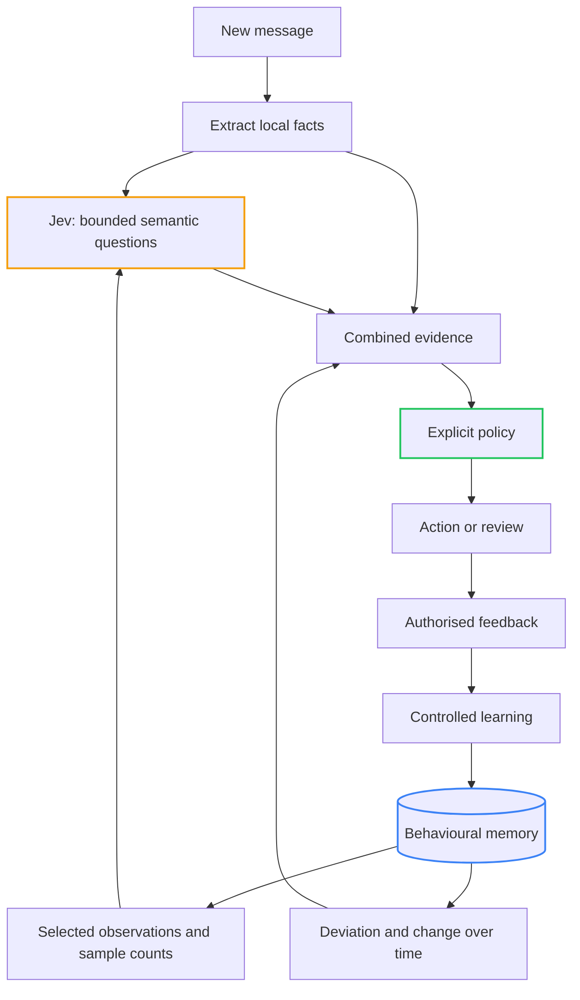

# On The Jev Bandwagon: Building a Behavioural Bidirectional Spam Blocking Proxy with Jev & .NET Core

<!-- category -- AI,Architecture,Behavioural Inference,Jev,StyloMail,.NET,Patterns -->
<datetime class="hidden">2026-09-22T22:00</datetime>

Yes, I'm getting on the Jev bandwagon. I wanted to see how far I could get using it to build a behavioural spam-blocking proxy in .NET Core. Something that looks at mail in both directions: what arrives in your inbox, and what leaves an account that might have been compromised.

**StyloMail is research material for me to experiment with.** I'm building enough of the idea to run it, change it and find out whether it is worth pursuing. This is a time-boxed investigation, with working software as the thing I can ask questions of.

I also recently built an outgoing spam system for a customer, using **Azure Service Bus and an interceptor pattern**. So outgoing spam is a problem I've been working on already. StyloMail gives me a separate experiment in how Jev could simplify the behavioural inference side of it.

I've been building variations of the same idea for a while now. [Bot detection](/blog/stylobot-fingerprint), [customer intelligence](/blog/zero-pii-customer-intelligence-part1), [document processing](/blog/reduced-rag). Different inputs, different actions, but a recognisable shape underneath: collect partial evidence, remember the useful parts, infer what is happening, and apply explicit policy.

I wrote about that through-line in [Behavioural Inference: How I Learned to Stop Worrying and Love Probabilistic Systems](/blog/behavioural-inference-systems-blog).

StyloMail brings together two approaches I've been working with. [Large language models (LLMs)](https://developers.google.com/machine-learning/glossary#large-language-model) are models trained on language that can generate text and interpret content. Systems like Stylo.Bot accumulate evidence from observed behaviour. Jev changes part of that arrangement. I want to work out how much.

The question is:

> How simple can we make a behavioural inference system when semantic judgement is available as a small, typed function call?

By *semantic*, I mean concerned with meaning: recognising that two differently worded messages ask for the same thing. By *typed*, I mean the application knows the allowed form of the answer, much as it knows whether a C# method returns a `bool`, an enum or a number.

I'm using [Jev, from TypeSafe](https://docs.typesafe.ai/introduction), to explore that. Jev takes *state*-the message and contextual data we supply-and typed questions, then returns structured judgements. That gives me a rather useful component to put inside the architecture.

Email is the test case. It has ambiguous language, changing relationships, legitimate urgency, malicious urgency, and accounts that behave perfectly normally right up until somebody else takes control of them.

Plenty to get wrong, then.

[TOC]

---

## Start with the behaviour

Consider this email:

> Please use the updated account details for this month's payment. I need this processed today.

It introduces payment details. It applies some time pressure. It may be a completely ordinary message from a supplier.

Now imagine it came from an established contact, in an ongoing exchange about precisely that payment. Then imagine the same text arriving from an account that has suddenly started writing to dozens of unfamiliar people.

The text has stayed the same. The evidence around it has changed.

This is what I mean by behavioural inference. We observe fragments of activity and use their relationships, history and movement to infer what might be happening. We can then choose an appropriate response while preserving some uncertainty about the cause.

In [Stylo.Bot's behavioural model](/blog/stylobot-fingerprint), the useful evidence comes from the shape of a client's activity across many signals. An IP address or a convincing browser identity tells only part of that story. Email has a similar problem: a compromised account can authenticate successfully. Its behaviour may still have changed dramatically.

We don't need to claim we have read the sender's mind. We need enough evidence to decide whether this particular request deserves more scrutiny.

## Why Jev rather than a normal LLM?

A general-purpose LLM can already [classify](https://developers.google.com/machine-learning/glossary#classification-model) an email: predict which category it belongs to. Give it the message, specify some categories, ask for a result. Modern LLM APIs also support [schema-constrained output](https://platform.claude.com/docs/en/build-with-claude/structured-outputs), where generation is restricted to a specified structure and allowed values. So this comparison needs to get past “sometimes the JSON is broken”. We can constrain that shape already.

Jev makes a different trade-off. TypeSafe describes a model built around typed probabilistic decisions-answers that preserve how likely the alternatives are-with outputs produced in parallel and training aimed at calibrated judgements. That's the design described in its [launch article](https://typesafe.ai/blog/introducing-system-one-models-and-jev). It gives up general string generation to specialise in a narrower job.

A little machine learning (ML) terminology helps here. [Training](https://developers.google.com/machine-learning/glossary#training) adjusts a model using examples; [inference](https://developers.google.com/machine-learning/glossary#inference) uses the trained model on a new input. Calling Jev performs inference. It doesn't train a new model for each email.

[Calibration](https://scikit-learn.org/stable/modules/calibration.html) asks whether the probabilities match observed outcomes. Among many questions answered with roughly `0.8`, about 80% should really have a “yes” answer if those predictions are well calibrated. That is something to measure across examples, not a guarantee about one message.

For this experiment, that's an appealing trade. I need a judgement about a specific property of the message. I don't need a paragraph about it on every call.

The API gives that job three forms:

- [Choice](https://docs.typesafe.ai/primitives/choice) selects from options you define, such as “receipt”, “sales enquiry” or “personal message”.
- [Score](https://docs.typesafe.ai/primitives/score) evaluates against descriptions of ordered levels, such as “no urgency”, “some urgency” and “strong urgency”. Those descriptions are the *rubric*: you define what the scale means.
- [Noul](https://docs.typesafe.ai/primitives/noul) gives the probability that a yes/no statement is true, such as “this message asks for credentials”.

Several questions can share the same state and run in parallel. [TypeSafe's introduction](https://docs.typesafe.ai/introduction) describes the contract.

There are two separate benefits to investigate here. One is practical: whether a specialised model makes these judgements quickly and cheaply enough to use routinely. The other is architectural: its natural interface encourages small questions whose answers the application composes itself.

You can apply that architecture with a general LLM too. Jev makes it the expected way to use the model. Whether it answers more questions correctly, gives better-calibrated probabilities, and costs less for our particular mail workload still needs measurement.

And a guaranteed output shape is only a guarantee about shape. The model can return a perfectly valid answer to the wrong interpretation of a message. Type safety does not establish truth.

## How this differs from Stylo.Bot

[Stylo.Bot](/blog/stylobot-fingerprint) already does behavioural inference. Its detectors contribute *signals*: individual observations about protocol characteristics, timing, navigation and consistency. In that [behavioural model](/blog/stylobot-fingerprint), “shape” means the combination of values. Two clients may send at the same rate but visit pages in very different sequences. Comparing the combination tells us more than comparing the rate alone.

That is a whole system. Jev is a model we can use inside one.

Stylo.Bot also has an optional [LLM enrichment path](/blog/stylobot-fingerprint): an additional model assessment when the existing signals disagree or the activity doesn't resemble familiar patterns. So the distinction isn't “Stylo.Bot has rules, Jev has AI”. Much of Stylo.Bot's value comes from the relationships between observations, the memory it retains, and how it learns which patterns matter.

For mail, a substantial part of the observation problem is linguistic. “Use our replacement bank details” and “future remittances should go to this account” may express the same behaviour. A change in TLS characteristics can be measured directly; a request to quietly bypass an approval process needs interpretation.

This is where I'm trying Jev. It supplies **named semantic dimensions** that can sit alongside directly measured signals. A [feature](https://developers.google.com/machine-learning/glossary#feature) is a value used as an input to a prediction. A [feature vector](https://developers.google.com/machine-learning/glossary#feature-vector) collects those values in a consistent order; each position is a *dimension*. Think of a small record with fields for payment redirection, urgency and credential requests. Each field has a defined meaning.

Jev's answers become features for the surrounding system. A small set of questions can take on work that would otherwise require hand-written rules for recognising language, a classifier trained specifically for the task, or a general LLM classification call.

| Part of the system | What Jev replaces or complements |
|---|---|
| Semantic classification | Can replace a general LLM call or some custom recognisers with bounded questions. |
| Direct observation | Complements measured facts such as recipient counts, link targets and timing. |
| Behavioural representation | Adds dimensions with meanings we chose, such as credential requests or payment redirection. |
| Memory and comparison | Supplies evidence for profiles; the application still retains history and computes change. |
| Learning and action | Supplies judgements; the application still controls trusted updates and policy. |

Twelve semantic questions are not a drop-in replacement for Stylo.Bot's detector population or the patterns it learns from combinations of observations. They observe different properties in a different domain. The experiment is whether they let me build the mail version with less custom semantic machinery while keeping the useful behavioural architecture.

In a Stylo.Bot-shaped system, a Jev call could be another contributor, or replace a suitable classification task in the LLM enrichment path. That is a possible integration, not a claim that I've replaced Stylo.Bot's inference engine with Jev.

## Why bidirectional matters

Inbound mail asks whether an incoming request fits the sender, relationship and content we can observe. Outbound mail lets us ask whether one of our own accounts has started behaving differently.

An employee account might authenticate correctly while sending an unusual kind of request to an expanding set of recipients. The authentication is real. So is the change in behaviour.

That makes the two directions useful tests of the same idea. The semantic questions can be similar, but the history, available evidence and consequences of intervention differ. A known internal sender doesn't make every outgoing message safe; an unfamiliar external sender doesn't make every incoming message abusive.

The spam-blocking proxy gives the research something concrete to run and inspect. The wider question is how cheaply we can characterise communication, remember its shape, and recognise a meaningful departure.

## A probability of what, exactly?

Suppose our question is:

> Does this message attempt to introduce or change payment destination details?

A Noul answer of `0.95` means the model assigns a high probability to “yes”. It does **not** mean there is a 95% chance of fraud. A legitimate account-change notification ought to get a high answer too.

Likewise, `0.5` means the model gives yes and no similar probability. It is not a measure of how severe the request is. Noul has no separate confidence field. [Its documentation](https://docs.typesafe.ai/primitives/noul) is explicit about both points.

That sounds like a small distinction until somebody names the variable `fraudScore`.

We need to preserve what was actually asked. Otherwise, a useful semantic judgement quietly becomes a much stronger claim somewhere downstream.

StyloMail currently asks twelve such questions. They cover things like solicitation, credential requests, payment redirection, claimed authority, urgency, secrecy, sensitive information, links and attachments, as well as transactional character and conversational continuity.

They describe properties that may coexist. A payment request can be urgent and transactional and entirely legitimate. Keeping those properties separate gives the behavioural system something richer to compare over time.

## What the Jev call looks like in real C#

Here are the relevant pieces from StyloMail. These are excerpts from the application, with source links pinned to the version shown. They use its existing types and surrounding methods; they aren't a separate copy-and-paste console application.

### Define what the question means

The payment question is an entry in the application's [semantic dimension definitions](https://github.com/scottgal/stylomail/blob/916aaa936eab706b4623d97efc63af8c898a3bde/src/StyloMail.Core/SemanticDimension.cs#L65-L68). Inside that entry, these fields supply its identifier, question and criteria:

```csharp
Id = "semantic.payment_redirection",
Instructions = "Does this message attempt to introduce or change payment destination details?",
CriteriaTrue = "Supplies or changes bank account, routing, invoice or payment destination details.",
CriteriaFalse = "No introduction or change of payment destination.",
```

The ID lets our code associate an answer with a dimension. The meaning lives in `Instructions` and the descriptions of yes and no. Changing those descriptions changes what we are measuring, even if the C# property names stay the same.

The adapter's [actual question-building method](https://github.com/scottgal/stylomail/blob/916aaa936eab706b4623d97efc63af8c898a3bde/src/StyloMail.Jev/JevSemanticMailClassifier.cs#L193-L211) turns those definitions into the provider's request shape:

```csharp
private static Dictionary<string, JevQuestion> BuildQuestions(IEnumerable<SemanticDimension> dimensions)
{
    var questions = new Dictionary<string, JevQuestion>(StringComparer.Ordinal);
    foreach (var dimension in dimensions)
    {
        questions[dimension.Id] = new JevQuestion
        {
            Type = NoulType,
            Instructions = dimension.Instructions,
            Criteria = new JevNoulCriteria
            {
                True = dimension.CriteriaTrue,
                False = dimension.CriteriaFalse,
            },
        };
    }

    return questions;
}
```

`NoulType` is the constant `"noul"`. Each dictionary entry asks its own yes/no question. The [request records](https://github.com/scottgal/stylomail/blob/916aaa936eab706b4623d97efc63af8c898a3bde/src/StyloMail.Jev/JevContracts.cs) use `JsonPropertyName` attributes to map C# names such as `Instructions` to JSON names such as `instructions`.

### Put the questions beside the state

In [`ClassifyAsync`](https://github.com/scottgal/stylomail/blob/916aaa936eab706b4623d97efc63af8c898a3bde/src/StyloMail.Jev/JevSemanticMailClassifier.cs#L118-L125), we build one request:

```csharp
var state = BuildState(input.Message, input.TaggedContext, input.Profile);
var questions = BuildQuestions(askable);
var request = new JevRequest
{
    State = state,
    Model = _options.Model,
    Questions = questions,
};
```

`askable` contains the questions for which the required input exists. A conversational-continuity question is left out when there is no conversation to compare against.

`BuildState` supplies the parsed message plus selected context, including the sender profile. The message is data being judged; the question definitions are owned by our code. All the questions travel in one request.

### Send it using HttpClient

The adapter uses ordinary .NET HTTP and JSON APIs. [This is the request construction](https://github.com/scottgal/stylomail/blob/916aaa936eab706b4623d97efc63af8c898a3bde/src/StyloMail.Jev/JevSemanticMailClassifier.cs#L380-L386):

```csharp
using var httpRequest = new HttpRequestMessage(HttpMethod.Post, _options.Endpoint)
{
    Content = JsonContent.Create(request, options: JsonOptions),
};
// Set per request rather than on the shared HttpClient so the credential is not
// captured by a client instance that outlives this configuration.
httpRequest.Headers.Authorization = new AuthenticationHeaderValue("Bearer", _options.ApiKey);
```

The [options in this version](https://github.com/scottgal/stylomail/blob/916aaa936eab706b4623d97efc63af8c898a3bde/src/StyloMail.Jev/JevOptions.cs) default to `https://api.typesafe.ai/v1/systemone` and pin `jev-1.13.0`. The host loads the API key from `TYPESAFE_API_KEY`; the sample refers to the configured value rather than embedding a credential. Pinning the model helps keep the experiment comparable when the provider releases a new version.

Inside the existing retry loop, [the send itself](https://github.com/scottgal/stylomail/blob/916aaa936eab706b4623d97efc63af8c898a3bde/src/StyloMail.Jev/JevSemanticMailClassifier.cs#L391-L393) is:

```csharp
response = await _http
    .SendAsync(httpRequest, HttpCompletionOption.ResponseHeadersRead, timeout.Token)
    .ConfigureAwait(false);
```

Here `timeout` is a linked cancellation source: it lets either the caller or our configured deadline cancel the HTTP operation. On success, [the response is read into the application's `JevResponse` record](https://github.com/scottgal/stylomail/blob/916aaa936eab706b4623d97efc63af8c898a3bde/src/StyloMail.Jev/JevSemanticMailClassifier.cs#L404-L409):

```csharp
if (response.IsSuccessStatusCode)
{
    return await response.Content
        .ReadFromJsonAsync<JevResponse>(JsonOptions, cancellationToken)
        .ConfigureAwait(false);
}
```

The enclosing method also handles failures and retries. Those branches are omitted from these excerpts; they remain part of the linked implementation. The interesting point is how little special machinery the model interface requires: our state and questions go in as JSON, and answers come back under the question IDs.

### What a response looks like

The adapter tests use a message with subject `Invoice attached` and this body:

> Please confirm your password to view the invoice.

Their [`SuccessBody` fixture](https://github.com/scottgal/stylomail/blob/916aaa936eab706b4623d97efc63af8c898a3bde/tests/StyloMail.Jev.Tests/JevSemanticMailClassifierTests.cs#L308) supplies the following response shape. **This is mocked test data, not a live Jev prediction.** Shown here are three answer entries from that fixture; the other entries are omitted for space:

```json
{
  "model": "jev-1.13.0",
  "answers": {
    "semantic.credential_request": {
      "type": "noul",
      "noul": 0.93
    },
    "semantic.payment_redirection": {
      "type": "noul",
      "noul": 0.11
    },
    "semantic.urgency_pressure": {
      "type": "noul",
      "noul": 0.11
    }
  },
  "usage": {
    "input_tokens": 296,
    "output_tokens": 20
  }
}
```

The fixture deliberately assigns `0.93` to the credential question and `0.11` to every other dimension. Its job is to exercise our adapter, not measure whether Jev understands this email. The `usage` numbers are fixture values too. They represent counts of [tokens](https://developers.google.com/machine-learning/glossary#token), the chunks of text a model processes, which need not correspond to whole words.

The keys in `answers` match our question IDs. Each `noul` is the probability for that particular question, and `model` identifies the version that answered. Notice the absence of a separate `confidence` property.

The real [mapping test](https://github.com/scottgal/stylomail/blob/916aaa936eab706b4623d97efc63af8c898a3bde/tests/StyloMail.Jev.Tests/JevSemanticMailClassifierTests.cs#L36) checks the result like this:

```csharp
Assert.Equal(EvidenceAvailability.Available, credential.Availability);
Assert.Equal(0.93, credential.Value);
Assert.Equal(EvidenceOrigin.Semantic, credential.Origin);

// The API returns no confidence for Noul. Every mapped answer must leave it null rather
// than default it, which would fabricate certainty the provider never expressed.
Assert.Null(credential.Confidence);
```

That is a useful boundary test: the number survives, its source stays semantic, and the application invents no extra confidence. It verifies our plumbing; evaluating the model requires separate examples with independently checked answers.

### Keep the answer as evidence

The [answer-mapping loop](https://github.com/scottgal/stylomail/blob/916aaa936eab706b4623d97efc63af8c898a3bde/src/StyloMail.Jev/JevSemanticMailClassifier.cs#L452-L476) is where the earlier distinctions become code:

```csharp
foreach (var dimension in askable)
{
    if (answers is null
        || !answers.TryGetValue(dimension.Id, out var answer)
        || answer.Noul is not { } probability)
    {
        evidence.Add(UnavailableEvidence(dimension, EvidenceAvailability.Unavailable, observedAt, modelVersion));
        continue;
    }

    evidence.Add(new Evidence
    {
        SignalId = dimension.Id,
        Origin = EvidenceOrigin.Semantic,
        Availability = EvidenceAvailability.Available,
        Value = probability,
        // Noul carries no confidence field at all. Left null deliberately: defaulting it
        // would fabricate a certainty the provider never expressed.
        Confidence = null,
        SampleSupport = null,
        SourceVersion = modelVersion,
        ObservedAt = observedAt,
        ObservedScope = "message",
    });
}
```

If an answer is missing, it becomes `Unavailable`, not `0`. If it exists, its Noul value becomes a semantic observation with the model version and observation time attached. `SampleSupport` remains empty because one model answer doesn't tell us how many historical examples support a behavioural comparison.

And there is no `Block` or `Allow` in that result. This code records what the model contributed. Policy still has to decide what it justifies.

### What the live experiment returned

There is also a separate [recorded live run on a synthetic phishing message](https://github.com/scottgal/stylomail/blob/916aaa936eab706b4623d97efc63af8c898a3bde/.styloagent/spec.md#L253). The project notes record these Jev values; this table reports those observations, rather than presenting the mock response above as a provider capture:

| Question | Recorded Noul value |
|---|---:|
| `credential_request` | 0.99 |
| `urgency_pressure` | 0.99 |
| `link_lure` | 0.99 |
| `sensitive_data_request` | 0.98 |
| `threat_reward_inducement` | 0.98 |
| `identity_authority_claim` | 0.76 |
| `secrecy_bypass` | 0.23 |
| `transactional_character` | 0.11 |
| `payment_redirection` | 0.09 |
| `unsolicited_solicitation` | 0.07 |
| `attachment_lure` | 0.03 |

The adapter recorded eleven available dimensions and one `NotApplicable`: conversational continuity, because there was no conversation supplied. All eleven Noul answers left the separate confidence field empty.

This is a more interesting shape than a single “spam” label. The sample strongly registered requests for credentials and click-through action, but barely registered payment redirection or an attachment lure. We have different observations to work with. One synthetic example still tells us very little about false alarms or performance across real mail; that's what the wider experiment needs to establish.

## Meaning becomes something we can compare

The useful transformation is from varied language into a small set of comparable semantic dimensions.

“Please use our replacement bank details” and “future remittances should go to the following account” look different as strings. They may express the same relevant behaviour. A narrow semantic question gives us a way to recognise that relationship without enumerating every phrasing.

Those answers can join the signals we computed directly:

| Evidence | What it contributes |
|---|---|
| Message content | What is being requested or claimed? |
| Sending pattern | How much activity is there, and how is it changing? |
| Recipient history | Is this a familiar relationship or a new audience? |
| Trusted baseline | A reference built from accepted history: what does established behaviour look like? |
| Coverage and support | Which expected signals are available, and how many observations back the comparison? |

This is close to the idea behind [Reduced RAG](/blog/reduced-rag): reduce the input into useful evidence before asking later stages to reason over it. [RAG, or retrieval-augmented generation](/blog/rag-primer), retrieves relevant material to give a model context for an answer. I'm borrowing the reduction principle here; StyloMail doesn't need a document-search system to count recipients or retain a sender's recent activity.

The deterministic parts stay computed: given the same inputs, the code produces the same result. Semantic interpretation gets a bounded job of its own.

We deliberately discard information in this reduction. Twelve questions cannot preserve everything about an email. They preserve the distinctions we think matter for this experiment. Choosing those distinctions is part of the work, and testing them may tell us to choose differently.

That's a much more manageable question than “does the AI understand email?”

## Time adds something a classifier cannot supply on its own

A semantic assessment describes a message at a particular moment. Behaviour emerges across moments.

An accounts team sends payment messages. A monitoring service sends bursts of alerts. A sales team approaches new recipients. Those activities make sense in their own histories.

The interesting change is often a departure from that history: a new kind of request, an expanding audience, a rate that is rising unusually quickly, or several of those together.

StyloMail keeps behavioural profiles with limits on how much history they retain. It compares recent activity with a trusted baseline: a reference for established behaviour, built from observations we have accepted as trustworthy. The [learning discussion for Stylo.Bot](/blog/stylobot-release-learning) explores the same need to remember useful history without treating every new observation as truth.

A *time window* is the period being examined, such as the last hour. An [exponentially weighted moving average (EWMA)](https://www.itl.nist.gov/div898/handbook/pmc/section4/pmc43.htm) smooths measurements by giving progressively less influence to older observations. It helps us follow a trend without letting every small fluctuation dominate.

For the [behavioural comparisons](/blog/stylobot-release-learning), three questions matter:

| Term | Plain-English question | Illustrative example |
|---|---|---|
| Drift | How far is recent behaviour from the trusted baseline? | An account usually contacts a small, familiar group; it is now addressing a much wider audience. |
| Velocity | How quickly is the behaviour changing? | Its sending rate is rising across successive, equally spaced observations. |
| Acceleration | Is that change speeding up? | The rate rises by 10, then by 30, rather than by the same amount each time. |

These describe movement in the measurements. “Drift” here does not automatically mean the underlying model has become inaccurate. A sudden departure and a gradual transition can land in the same place while telling rather different stories.

You don't need a model to calculate those quantities. You do need enough observations, comparable windows, and a way to admit when the comparison is unsupported.

And each extra quantity has to help. Acceleration sounds clever; if a simple rate catches the same cases with fewer false alarms, the simpler system wins. That is part of what I want to test.

## Context goes back into the judgement

There are two useful directions here. Semantic judgements help describe behaviour over time. Behavioural context can also help interpret the next message.



The context supplied to Jev is a description with explicit size limits, assembled by code: observations, counts, time windows, available baselines and how much evidence supports them. We can explain that a sender's audience has expanded without supplying their entire communication history.

The connection is visible in [the actual profile encoding](https://github.com/scottgal/stylomail/blob/916aaa936eab706b4623d97efc63af8c898a3bde/src/StyloMail.Jev/JevSemanticMailClassifier.cs#L253-L258). These entries sit inside the `sender_behaviour` object sent to Jev:

```csharp
["distinct_recipients_last_hour"] = profile.DistinctRecipientsLastHour,
["distinct_recipients_last_30_days"] = profile.DistinctRecipientsLast30Days,
["recipients_novel_to_sender"] = profile.RecipientsNovelToSender,
["messages_last_hour"] = profile.MessagesLastHour,
["messages_last_24_hours"] = profile.MessagesLast24Hours,
["baseline_messages_per_hour"] = profile.BaselineMessagesPerHour,
```

Those values come from the application's profile. Jev is given observations about recent recipients and sending activity; it isn't asked to reconstruct them from a pile of old emails. A missing baseline remains `null`, so an account we cannot yet compare is not presented as an account whose normal sending rate is zero.

This connects directly to [Constrained Fuzzy Context Dragging](/blog/constrained-fuzzy-context-dragging): my name for letting a model suggest what matters while code controls what gets carried forward into later judgements. The important question is what deserves to survive. Engineering owns that selection.

There is a trap here. If the context says “this account is suspicious”, and the model then finds the message suspicious, how much new information did we obtain?

Very little, potentially. We may just have asked the model to agree with us.

So the context should describe observations and how well they are supported, leaving the judgement open. Even then, the semantic and behavioural evidence share inputs.

[Statistical independence](https://online.stat.psu.edu/stat414/Lesson05) means knowing one outcome doesn't change the probability of another. Running two questions separately does not establish that. “Act now or lose access” might trigger both urgency and threat judgements because both come from the same sentence. Counting those as two independent confirmations can exaggerate how much evidence we have.

## Learning needs a boundary too

Once memory affects future interpretation, learning becomes a consequential decision. Here, [learning](/blog/stylobot-release-learning) means updating the application's profiles and trusted statistics. We are not retraining Jev or changing its internal [parameters](https://developers.google.com/machine-learning/glossary#parameter), the values adjusted during model training.

Imagine an account starts sending abusive messages. If every observation immediately teaches the baseline what is normal, sustained abuse eventually becomes normal. The system gets more comfortable as the attack continues.

We need two kinds of memory: what has happened, and what has earned trust.

StyloMail keeps that distinction explicit. Observed activity can accumulate while promotion into the trusted baseline requires authorised feedback or an explicitly permitted rule, with a record of where that judgement came from and why we trust it. That record is its *provenance*. Delivery alone and “nobody complained” are insufficient.

The mechanism matters beyond email. A recommender can trap someone in a preference inferred from one accidental click. A fraud system can learn from its own mistaken approvals. A workflow can interpret repeated failure as the expected process.

The feedback loop needs evidence about outcomes. Repeating our own predictions does not create that evidence.

This is the time dimension of [Constrained Fuzziness](/blog/constrained-fuzziness-pattern): probabilistic components may propose, while explicit code limits what they can cause. Those limits apply both to actions now and to what gets remembered for later.

## Small interfaces still need honest uncertainty

There is a third answer alongside a high or low probability: we did not obtain a usable judgement.

The provider might be unavailable. The content might be encrypted. A conversational-continuity question might lack any conversation to compare against. A new sender might have no meaningful baseline yet.

Those are gaps in evidence. Filling them with zero makes the system look reassuring precisely when it knows least.

StyloMail tracks availability separately and carries *coverage*-how much of the expected evidence is present-into policy. It combines available signals using configured weights: some signals have more influence than others. The result is a *risk index*, a number for comparing against the cut-offs that trigger different actions, not a calibrated probability of fraud. A small number based on almost no evidence deserves different treatment from a small number supported by a complete assessment.

The same applies to explanations. We can show which observations and judgements contributed to an action. That is an inspectable decision path. It does not give us access to the model's internal reasoning or prove that its interpretation was correct.

This is why I keep returning to explicit signals in the [behavioural inference article](/blog/behavioural-inference-systems-blog). The system needs to retain enough structure for us to disagree with it usefully.

## So where does the decision live?

In code that we can inspect and test. By [policy](/blog/constrained-fuzziness-pattern), I mean the application's explicit rules for choosing an action from the evidence-not another model trained to choose for us.

Jev contributes semantic evidence. The behavioural layer contributes historical and temporal evidence. Policy decides what action that combination justifies.

For the payment example, the response might be to pause for review. We can have enough evidence to justify checking a request without claiming to have proved account compromise. That distinction lets the system act proportionately under uncertainty.

The costs of being wrong belong in that policy. Interrupting a legitimate payment and missing a malicious one have different consequences. A model's probability cannot choose those trade-offs for us.

Deterministic policy does not make a bad judgement good. It makes the consequence explicit, bounded and testable. Given recorded evidence and the same policy, we can reproduce the action and ask whether the policy was appropriate.

## Research software: the AI-augmented Agile spike

I need software that helps me find out whether an idea is any good. Reading documentation and sketching an architecture can take me some of the way. Running the idea gives me different questions: what is awkward, what fails, which assumptions survive, and which bits I can remove.

That's why I build these **time-boxed tools**. Try an idea, get something working, rapidly iterate, then decide whether it deserves more time. The time box is a limit on how long I spend buying understanding. It isn't a promise to turn the result into a product.

An Agile spike gives an investigation a bounded amount of time so the team can resolve uncertainty. AI-assisted development stretches what I can fit inside that boundary. Where I might previously have evaluated a library or built a tiny integration, I can now build enough of a whole idea to play with: inputs, state, decisions, feedback and a way to inspect what happened.

That is the **AI-augmented Agile spike** I'm interested in. The output is understanding, and sometimes a useful tool comes with it.

There are two different uses of AI in this story. A code-writing LLM helps me build and revise the experiment, as I've discussed in [the StyloAgent workflow](/blog/styloagent-workflow). Jev is a component being evaluated *inside* the experiment. Faster construction lets me try more variations; it doesn't establish that any of them work well.

Research software still needs care. If missing data becomes a reassuring score, or a test quietly uses the wrong history, I learn the wrong lesson. I need enough correctness and observability to trust the experiment: a way to see its inputs, intermediate results and decisions. The rest of the work has to justify itself against the question I'm investigating.

StyloMail is that kind of software. There is a mail system around the inference loop because I want to explore the idea in context. Transport, durable storage and delivery still involve substantial engineering. Their presence doesn't turn this into a product announcement.

## What would make it worth pursuing?

The simplification I'm testing is specific: use Jev for the semantic classification work, keep directly measured signals in ordinary code, and retain the memory and comparison that make the system behavioural.

We have a small question set, bounded memory, ordinary calculations of change over time, a controlled learning path and explicit policy. Each piece gives us a place to measure something. We can change a question, remove a dimension, shorten a window, or compare behaviour with and without semantic context.

The underlying model is sophisticated and currently accessed through a hosted service. A small interface does not mean the total system is computationally trivial. The claim I'm testing concerns how much machinery *we* need to build around semantic judgement to get useful behaviour.

A useful comparison needs several versions: local behavioural evidence alone; the same pipeline with a general LLM answering the semantic questions; Jev with message content alone; and Jev with bounded behavioural context. Compare [false positives](https://developers.google.com/machine-learning/glossary#false-positive-fp), legitimate mail flagged as abuse, and [false negatives](https://developers.google.com/machine-learning/glossary#false-negative-fn), abusive mail missed. Measure response time and cost on the same examples too. That separates the benefit of semantic judgement from the benefit of history, and both from the choice of model.

Then test the awkward cases: legitimate changes; new accounts with no useful history yet; missing evidence; and feedback that teaches the baseline to accept abusive activity. Those are where a tidy architecture has to earn its keep.

At the end of the time box, I want enough evidence to choose: pursue the idea, change its direction, keep one useful component, or put it down. Discovering that the extra machinery buys very little is a useful research result too. A working loop gives me something to test; it doesn't oblige me to keep building it.

What makes Jev interesting to me is how naturally its interface fits this line of work. Meaning becomes a bounded contribution the rest of the system can accumulate, compare and challenge. Memory adds continuity. Policy gives uncertainty a controlled consequence.

That's what I'm on the Jev bandwagon to find out. Build the idea, play with it, measure what changes, and decide whether the next chunk of time is worth spending.

[StyloMail source](https://github.com/scottgal/stylomail)
