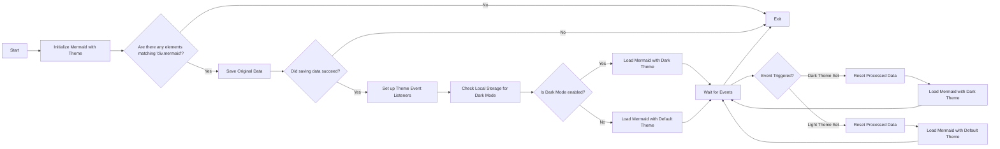

# Switching Themes for Mermaid (Updated)

<!--category-- Mermaid, Markdown, Javascript -->

<datetime class="hidden">2024-08-29T05:00</datetime>
## Introduction
I use Mermaid.js to create the dope diagrams you see in a few posts. Like the one below. 
However something that annoyed me is that it wasn't reactive to switching themes (dark/light) and there seemed to be very poor information out there on achieving this.

This is the result of a few hours of digging and trying to figure out how to do this.

You can find the source for mdeswitcher here:
[mdeswitcher.js](https://github.com/scottgal/mostlylucidweb/blob/main/Mostlylucid/src/js/mdeswitch.js).

**<span style="color:green"> NOTE: I have updated this substantially.</span>**

[TOC]

## The Diagram



## The Problem
The issue is that you need to initialize Mermaid to set the theme, and you can't change it after that. HOWEVER if you want to reinitialise it on an already created diagram; it can't redo the diagram as the data isn't stored in the DOM.

## The Solution
So after MUCH digging and trying to figure out how to do this, I found a solution in [this GitHub issue post](https://github.com/mermaid-js/mermaid/issues/1945) 

However it still had a few issues, so I had to modify it a bit to get it to work.

### Themes
This site is based on a Tailwind theme which came with a pretty terrible theme switcher. 

You'll see that this is does various stuff around switching the theme, setting the theme for what is stored in local storage , changing a couple of stylesheers for simplemde & highlight.js and then applying the theme.

```javascript
export  function globalSetup() {
    const lightStylesheet = document.getElementById('light-mode');
    const darkStylesheet = document.getElementById('dark-mode');
    const simpleMdeDarkStylesheet = document.getElementById('simplemde-dark');
    const simpleMdeLightStylesheet = document.getElementById('simplemde-light');
    return {
        isMobileMenuOpen: false,
        isDarkMode: false,
        // Function to initialize the theme based on localStorage or system preference
        themeInit() {
            if (
                localStorage.theme === "dark" ||
                (!("theme" in localStorage) &&
                    window.matchMedia("(prefers-color-scheme: dark)").matches)
            ) {
                localStorage.theme = "dark";
                document.documentElement.classList.add("dark");
                document.documentElement.classList.remove("light");
                this.isDarkMode = true;
              
                this.applyTheme(); // Apply dark theme stylesheets
            } else {
                localStorage.theme = "base";
                document.documentElement.classList.remove("dark");
                document.documentElement.classList.add("light");
                this.isDarkMode = false;
                this.applyTheme(); // Apply light theme stylesheets
            }
        },

        // Function to switch the theme and update the stylesheets accordingly
        themeSwitch() {
            if (localStorage.theme === "dark") {
                localStorage.theme = "light";
                document.body.dispatchEvent(new CustomEvent('light-theme-set'));
                document.documentElement.classList.remove("dark");
                document.documentElement.classList.add("light");
                this.isDarkMode = false;
            } else {
                localStorage.theme = "dark";
                document.body.dispatchEvent(new CustomEvent('dark-theme-set'));
                document.documentElement.classList.add("dark");
                document.documentElement.classList.remove("light");
                this.isDarkMode = true;
            }
            this.applyTheme(); // Apply the theme stylesheets after switching
        },

        // Function to apply the appropriate stylesheets based on isDarkMode
        applyTheme() {
         
            if (this.isDarkMode) {
                // Enable dark mode stylesheets
                lightStylesheet.disabled = true;
                darkStylesheet.disabled = false;
                simpleMdeLightStylesheet.disabled = true;
                simpleMdeDarkStylesheet.disabled = false;
            } else {
                // Enable light mode stylesheets
                lightStylesheet.disabled = false;
                darkStylesheet.disabled = true;
                simpleMdeLightStylesheet.disabled = false;
                simpleMdeDarkStylesheet.disabled = true;
            }
        }
    };
}
```

## Setup
The main additions for the Mermaid theme switcher are the following:

```javascript
  document.body.dispatchEvent(new CustomEvent('dark-theme-set'));
    document.body.dispatchEvent(new CustomEvent('light-theme-set'));
```

These two events are used in our ThemeSwitcher component to reinitialize the Mermaid diagrams.

### OnLoad / htmx:afterSwap
In my `main.js` file I setup the theme switcher. I also import the `mdeswitch` file which contains the code for switching themes.

```javascript
//Important: Memraid will ALWAYS intialize on window.onload, so we need to make sure we disable this behaviour:
import mermaid from "mermaid";

window.mermaid=mermaid;
mermaid.initialize({startOnLoad:false});

window.mermaidinit = function() {
    mermaid.initialize({ startOnLoad: false });
    try {
        window.initMermaid().then(r => console.log('Mermaid initialized'));
    } catch (e) {
        console.error('Failed to initialize Mermaid:', e);
    }

}

document.body.addEventListener('htmx:afterSwap', function(evt) {
    mermaidinit();
    //This should be called after the mermaid diagrams have been rendered.
    hljs.highlightAll();
});

window.onload = function(ev) {
    if(document.readyState === 'complete') {
        mermaidinit();
        hljs.highlightAll();
    }
};
```

## MDESwtich
This is the file that contains the code for switching the themes for Mermaid.
(The horrible [diagram above](#the-diagram) shows the sequence of events that happen when the theme is switched)


```javascript
(function(window) {
    'use strict';

    const elementCode = 'div.mermaid';

    const loadMermaid = async (theme) => {

        mermaid.initialize({startOnLoad: false, theme: theme });
        console.log("Loading mermaid with theme:", theme);
        await mermaid.run({
            querySelector: elementCode,
        });
    };

    const saveOriginalData = async () => {
        try {
            console.log("Saving original data");
            const elements = document.querySelectorAll(elementCode);
            const count = elements.length;

            if (count === 0) return;

            const promises = Array.from(elements).map((element) => {
                if (element.getAttribute('data-processed') != null) {
                    console.log("Element already processed");
                    return;
                }
                element.setAttribute('data-original-code', element.innerHTML);
            });

            await Promise.all(promises);
        } catch (error) {
            console.error(error);
            throw error;
        }
    };

    const resetProcessed = async () => {
        try {
            console.log("Resetting processed data");
            const elements = document.querySelectorAll(elementCode);
            const count = elements.length;

            if (count === 0) return;

            const promises = Array.from(elements).map((element) => {
                if (element.getAttribute('data-original-code') != null) {
                    element.removeAttribute('data-processed');
                    element.innerHTML = element.getAttribute('data-original-code');
                }
                else {
                    console.log("Element already reset");
                }
            });

            await Promise.all(promises);
        } catch (error) {
            console.error(error);
            throw error;
        }
    };

    window.initMermaid = async () => {
        const mermaidElements = document.querySelectorAll(elementCode);
        if (mermaidElements.length === 0) return;

        try {
            await saveOriginalData();
        } catch (error) {
            console.error("Error saving original data:", error);
            return; // Early exit if saveOriginalData fails
        }

        const handleDarkThemeSet = async () => {
            try {
                await resetProcessed();
                await loadMermaid('dark');
                console.log("Dark theme set");
            } catch (error) {
                console.error("Error during dark theme set:", error);
            }
        };

        const handleLightThemeSet = async () => {
            try {
                await resetProcessed();
                await loadMermaid('default');
                console.log("Light theme set");
            } catch (error) {
                console.error("Error during light theme set:", error);
            }
        };
        document.body.removeEventListener('dark-theme-set', handleDarkThemeSet);
        document.body.removeEventListener('light-theme-set', handleLightThemeSet);
        document.body.addEventListener('dark-theme-set', handleDarkThemeSet);
        document.body.addEventListener('light-theme-set', handleLightThemeSet);

        const isDarkMode = localStorage.theme === 'dark';
        await loadMermaid(isDarkMode ? 'dark' : 'default').then(r => console.log('Initial load complete'));


    };

})(window);
```
Going kinda bottom to top here.
1. `init` - function is the main function that is called when the page is loaded.

It first saves the original content of the Mermaid diagrams; this was an issue in the version I copied it from, they used 'innerHTML' which didn't work for me as some diagrams rely on newlines which that strips.

It then adds two event listeners for the `dark-theme-set` and `light-theme-set` events. When these events are fired it resets the processed data and then reinitializes the Mermaid diagrams with the new theme.

It then checks the local storage for the theme and initializes the Mermaid diagrams with the appropriate theme.
```javascript
let isDarkMode = localStorage.theme === 'dark';
        if(isDarkMode) {
            loadMermaid('dark');
         }
         else{
             loadMermaid('default')
         }
```

### Save Original Data
The key to this whole thing is storing then restoring the content contained in the rendered `<div class="mermaid"><div>` which contain the mermaid markup from our posts. 

You'll see this just sets up a Promise that loops through all the elements and stores the original content in a `data-original-code` attribute.

```javascript
    const saveOriginalData = async () => {
    try {
        console.log("Saving original data");
        const elements = document.querySelectorAll(elementCode);
        const count = elements.length;

        if (count === 0) return;

        const promises = Array.from(elements).map((element) => {
            if (element.getAttribute('data-processed') != null) {
                console.log("Element already processed");
                return;
            }
            element.setAttribute('data-original-code', element.innerHTML);
        });

        await Promise.all(promises);
    } catch (error) {
        console.error(error);
        throw error;
    }
};
```
`resetProcessed` is the same except in reverse where it takes the markup from the `data-original-code` attribute and sets it back to the element.


### Init
Now we have all this data we can reinitialize mermaid to apply our new theme and rerender the SVG diagram into our HTML output.

```javascript
    const elementCode = 'div.mermaid';

const loadMermaid = async (theme) => {

    mermaid.initialize({startOnLoad: false, theme: theme });
    console.log("Loading mermaid with theme:", theme);
    await mermaid.run({
        querySelector: elementCode,
    });
};
```

## In Conclusion
This was a bit of a pain to figure out, but I'm glad I did. I hope this helps someone else out there who is trying to do the same thing. 