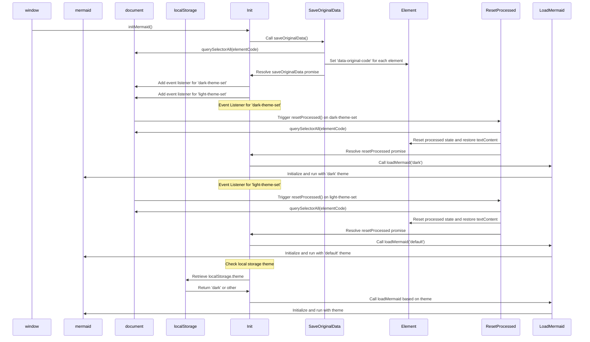

# Switching Themes for Mermaid

<!--category-- Mermaid, Markdown, Javascript -->

<datetime class="hidden">2024-08-26T20:36</datetime>
## Introduction
I use Mermaid.js to create the dope diagrams you see in a few posts. Like the one below. 
However something that annoyed me is that it wasn't reactive to switching themes (dark/light) and there seemed to be very poor information out there on achieving this.

This is the result of a few hours of digging and trying to figure out how to do this.

<span style="color:red"> **NOTE: This isn't working reliably. I'm still trying to figure out why.** </span>

[TOC]

## The Diagram



## The Problem
The issue is that you need to initialize Mermaid to set the theme, and you can't change it after that. HOWEVER if you want to reinitialise it on an already created diagram; it can't redo the diagram as the data isn't stored in the DOM.

## The Solution
So after MUCH digging and trying to figure out how to do this, I found a solution in [this GitHub issue post](https://github.com/mermaid-js/mermaid/issues/1945) 

However it still had a few issues, so I had to modify it a bit to get it to work.

### Themes
This site is based on a Tailwind theme which came with a pretty terrible theme switcher. 

You'll see that this is does various stuff around switching the theme, setting the theme for what is stored in local storage , changing a couple of stylesheers for simplemde & highlight.js and then applying the theme.

```javascript
export  function globalSetup() {
    const lightStylesheet = document.getElementById('light-mode');
    const darkStylesheet = document.getElementById('dark-mode');
    const simpleMdeDarkStylesheet = document.getElementById('simplemde-dark');
    const simpleMdeLightStylesheet = document.getElementById('simplemde-light');
    return {
        isMobileMenuOpen: false,
        isDarkMode: false,
        // Function to initialize the theme based on localStorage or system preference
        themeInit() {
            if (
                localStorage.theme === "dark" ||
                (!("theme" in localStorage) &&
                    window.matchMedia("(prefers-color-scheme: dark)").matches)
            ) {
                localStorage.theme = "dark";
                document.documentElement.classList.add("dark");
                document.documentElement.classList.remove("light");
                this.isDarkMode = true;
              
                this.applyTheme(); // Apply dark theme stylesheets
            } else {
                localStorage.theme = "base";
                document.documentElement.classList.remove("dark");
                document.documentElement.classList.add("light");
                this.isDarkMode = false;
                this.applyTheme(); // Apply light theme stylesheets
            }
        },

        // Function to switch the theme and update the stylesheets accordingly
        themeSwitch() {
            if (localStorage.theme === "dark") {
                localStorage.theme = "light";
                document.body.dispatchEvent(new CustomEvent('light-theme-set'));
                document.documentElement.classList.remove("dark");
                document.documentElement.classList.add("light");
                this.isDarkMode = false;
            } else {
                localStorage.theme = "dark";
                document.body.dispatchEvent(new CustomEvent('dark-theme-set'));
                document.documentElement.classList.add("dark");
                document.documentElement.classList.remove("light");
                this.isDarkMode = true;
            }
            this.applyTheme(); // Apply the theme stylesheets after switching
        },

        // Function to apply the appropriate stylesheets based on isDarkMode
        applyTheme() {
         
            if (this.isDarkMode) {
                // Enable dark mode stylesheets
                lightStylesheet.disabled = true;
                darkStylesheet.disabled = false;
                simpleMdeLightStylesheet.disabled = true;
                simpleMdeDarkStylesheet.disabled = false;
            } else {
                // Enable light mode stylesheets
                lightStylesheet.disabled = false;
                darkStylesheet.disabled = true;
                simpleMdeLightStylesheet.disabled = false;
                simpleMdeDarkStylesheet.disabled = true;
            }
        }
    };
}
```

## Setup
The main additions for the Mermaid theme switcher are the following:

```javascript
  document.body.dispatchEvent(new CustomEvent('dark-theme-set'));
    document.body.dispatchEvent(new CustomEvent('light-theme-set'));
```

These two events are used in our ThemeSwitcher component to reinitialize the Mermaid diagrams.

### OnLoad / htmx:afterSwap
In my `main.js` file I setup the theme switcher. I also import the `mdeswitch` file which contains the code for switching themes.

```javascript
import "./mdeswitch";
addEventListener("DOMContentLoaded", () => {
    window.initMermaid();
});
addEventListener('htmx:afterSwap', function(evt) {
    window.initMermaid();
});
```

## MDESwtich
This is the file that contains the code for switching the themes for Mermaid.
(The horrible [diagram above](#the-diagram) shows the sequence of events that happen when the theme is switched)


```javascript
(function(window){
    'use strict'

    const elementCode = 'div.mermaid'
    const loadMermaid = function(theme) {
        window.mermaid.initialize({theme})
        window.mermaid.run()
    }
    const saveOriginalData = function(){
        return new Promise((resolve, reject) => {
            try {
                var els = document.querySelectorAll(elementCode),
                    count = els.length;
                if(!els || count ===0 ) resolve ();
                els.forEach(element => {
                    element.setAttribute('data-original-code',encodeURIComponent( element.textContent));
                    count--
                    if(count == 0){
                        resolve()
                    }
                });
            } catch (error) {
                reject(error)
            }
        })
    }
    const resetProcessed = function(){
        return new Promise((resolve, reject) => {
            try {
                var els = document.querySelectorAll(elementCode),
                    count = els.length;
                if(!els || count ===0 ) resolve ();
                els.forEach(element => {
                    if(element.getAttribute('data-original-code') != null){
                        element.removeAttribute('data-processed')
                        element.textContent =decodeURIComponent( element.getAttribute('data-original-code'));
                    }
                    count--
                    if(count == 0){
                        resolve()
                    }
                });
            } catch (error) {
                reject(error)
            }
        })
    }

    const init = ()=>{

        saveOriginalData()
            .catch( console.error )
        document.body.addEventListener('dark-theme-set', ()=>{
            resetProcessed()
                .then(() =>{
                    loadMermaid('dark');
                    console.log("dark theme set")})
                .catch(console.error)
        })
        document.body.addEventListener('light-theme-set', ()=>{
            resetProcessed()
                .then(() =>{
                    loadMermaid('default');
                    console.log("dark theme set")})
                .catch(console.error)
        })
        let isDarkMode = localStorage.theme === 'dark';
        if(isDarkMode) {
            loadMermaid('dark');
        }
        else{
            loadMermaid('default')
        }

    }
    window.initMermaid = init
})(window);
```
Going kinda bottom to top here.
1. `init` - function is the main function that is called when the page is loaded.

It first saves the original content of the Mermaid diagrams; this was an issue in the version I copied it from, they used 'innerHTML' which didn't work for me as some diagrams rely on newlines which that strips.

It then adds two event listeners for the `dark-theme-set` and `light-theme-set` events. When these events are fired it resets the processed data and then reinitializes the Mermaid diagrams with the new theme.

It then checks the local storage for the theme and initializes the Mermaid diagrams with the appropriate theme.
```javascript
let isDarkMode = localStorage.theme === 'dark';
        if(isDarkMode) {
            loadMermaid('dark');
         }
         else{
             loadMermaid('default')
         }
```

### Save Original Data
The key to this whole thing is storing then restoring the content contained in the rendered `<div class="mermaid"><div>` which contain the mermaid markup from our posts. 

You'll see this just sets up a Promise that loops through all the elements and stores the original content in a `data-original-code` attribute.

```javascript
    const saveOriginalData = function(){
        return new Promise((resolve, reject) => {
            try {
                var els = document.querySelectorAll(elementCode),
                    count = els.length;
                if(!els || count ===0 ) resolve ();
                els.forEach(element => {
                    element.setAttribute('data-original-code',encodeURIComponent(element.textContent))
                    count--
                    if(count == 0){
                        resolve()
                    }
                });
            } catch (error) {
                reject(error)
            }
        })
    }
```
`resetProcessed` is the same except in reverse where it takes the markup from the `data-original-code` attribute and sets it back to the element.
Note it also `encodeURIComponent` the value as I foud that some strings weren't being stored correctly.


### Init
Now we have all this data we can reinitialize mermaid to apply our new theme and rerender the SVG diagram into our HTML output.

```javascript
 const loadMermaid = function(theme) {
        window.mermaid.initialize({theme})
        window.mermaid.run()
    }
```

## In Conclusion
This was a bit of a pain to figure out, but I'm glad I did. I hope this helps someone else out there who is trying to do the same thing. 