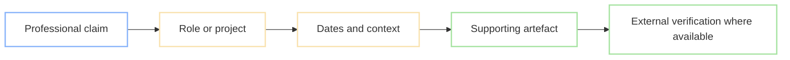
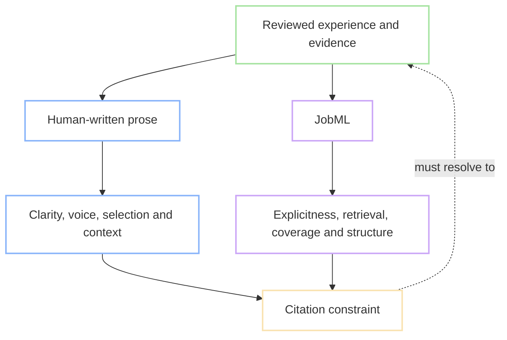
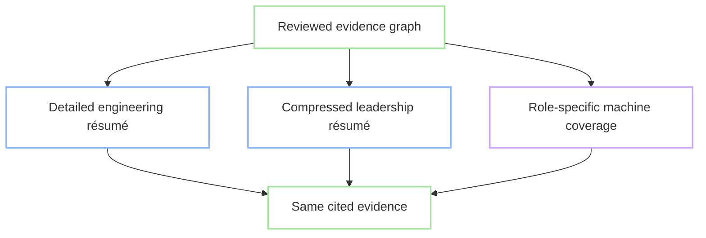
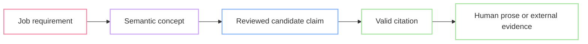

# The Problem With Résumés: Professional Claims Need Citations

<!--category-- AI, LLM, JobML, Résumés, RAG, Avalonia, Evidence, Open Formats -->

<datetime class="hidden">2026-09-18T12:00</datetime>

A résumé should work like a scientific paper: human-written prose for
communication, machine-readable structure for discovery, and references that
connect claims to evidence.

As I once more hunt for my next paying gig, I again face my nemesis: updating my
résumé, CV, professional profile, or whatever we're calling the bloody thing this
week. I have 35 years of professional experience and more than 50 gigs across
full-time and contract work. Some lasted years. Some lasted weeks and involved
fascinating technology. One was three months of distributed computing for an
intelligence service.

Compressing all of that into one document which is useful to both people and
machines is a task I cannot successfully complete. I know there is supposedly a
ruleset for a successful résumé, but I cannot see it. I do not know:

- what the definitive rules are;
- who decided they were definitive;
- or what evidence supports them.

The document is supposedly prose for a human, yet it needs the right structure, phrases and keywords to survive an ATS, recruiter search and whatever model has been bolted onto the process this month.

The modern résumé is an odd document.

A few months ago I started [lucidRESUME](https://github.com/scottgal/lucidresume),
a research project based around an evidence ledger for professional experience.
Having to look for a job again gave me a reason to return to the underlying
problem. This article is the result so far.

[](https://github.com/scottgal/lucidRESUME/releases)
[](https://www.nuget.org/packages/Mostlylucid.Avalonia.UITesting)


[TOC]

---

## Scientific Publishing Already Solved This Split

Scientific papers have served human readers and machine systems at the same time
for years. [JATS](https://jats.nlm.nih.gov/) provides a machine-readable model for
journal articles, while services such as
[Crossref](https://www.crossref.org/documentation/metadata-plus/) use structured
metadata and persistent identifiers to make scholarly work discoverable and
connected.

- The prose communicates an argument to people.
- Structured metadata makes the work discoverable to machines.
- Citations connect individual claims to supporting material.
- References let either reader move from a summary to higher-resolution evidence.

A paper does not force every detail of its datasets, methods and prior work into
the prose. It says what matters for the argument and provides routes to the rest.
Search indexes can remain explicit and repetitive without making the paper itself
read like a database export.

### Why Scientific Publishing Works This Way

Science is cumulative. A paper is not meant to stand alone as a polished piece of
writing. It joins a body of work. Its authors inherit methods, definitions,
results and disagreements from other people, then leave enough structure for the
next person to inspect and extend what they have done. This is the practical
meaning behind standing on the shoulders of giants.

Citations make that cumulative process possible. The
[ICMJE recommendations](https://www.icmje.org/recommendations/browse/manuscript-preparation/preparing-for-submission.html#references)
tell authors to cite original research directly where possible and to verify
their references. That discipline is not decorative bibliography. Citations
perform several jobs at once:

- **Justification:** they show why a claim is present.
- **Provenance:** they identify where an idea, method or result came from.
- **Navigation:** they let a reader move from a summary to the underlying work.
- **Attribution:** they give credit to the people who produced that work.
- **Challenge:** they expose enough of the chain for somebody to question it.
- **Reuse:** they let later work build on a specific source rather than repeat an
  unsupported assertion.

Structured metadata solves a different problem. Titles, authors, dates, subjects,
identifiers and abstracts let catalogues, search engines and research tools find
the paper without requiring its prose to be rewritten for each index. The prose,
metadata and citations cooperate, but none is forced to impersonate the others.

A career is cumulative too. Later roles build on earlier skills, projects,
decisions and results. Yet a résumé usually throws away the links between them.
It presents the latest compressed narrative while leaving the reader to guess
which prior work supports each statement. Bringing citations to professional
claims restores that missing chain.

Résumés have the prose and some crude metadata, but effectively no citation
system. Their most important statements are isolated assertions:

> Designed and delivered a high-throughput distributed platform.

The reader can believe that or not. There is no standard route from the sentence
to the role, dates, technical context, design document, repository, article or
other material which justifies it.

What I want is a traversable professional claim:



That does not prove the claim true. Citations do not magically make scientific
papers true either. They make claims inspectable, attributable and challengeable.
A reader can follow the reasoning, judge the source and disagree.

For a machine, this distinction is even more useful. “Kubernetes appears in this
document” is not the same statement as “the candidate claims a particular use of
Kubernetes and links it to contemporaneous code, documentation, an article or an
employer attestation.” One is a keyword hit. The other is an evidence graph.

We already have an enormous ecosystem of AI tools trained to extract claims,
follow citations, assess evidence quality, identify unsupported statements and
summarise papers. Applying the same pattern to résumés is hardly speculative.
What is strange is continuing to feed those systems flattened prose and asking
them to reconstruct the evidence graph for every application.

This is the thesis the rest of the article follows:

> **A résumé should work like a scientific paper: human-written prose for
> communication, machine-readable structure for discovery, and references that
> connect claims to evidence.**

## The Missing Layer in a Modern Résumé

The résumé is increasingly written with one AI and first read by another. It must
be parseable and explicit enough for an ATS, but readable and selective enough
for a person. Only after passing the machine may it reach a human, at which point
it must work as a concise and credible career narrative.

One document is therefore being asked to do two different jobs:

1. Provide explicit, structured and searchable data for machines.
2. Provide selective, readable and persuasive prose for humans.

Good human prose compresses. It avoids repetition, relies on implication and
varies its vocabulary. Good machine data is explicit, repetitive and predictable.
Optimising one representation for both readers damages both.

The missing piece is not more keywords. It is the citation layer connecting the
human statement to a richer, machine-readable account of the claim and its
evidence.

Having studied clinical psychology, I was taught to be almost paranoid about
[references](https://libguides.gold.ac.uk/psychology/referencing). The running joke
was that if you wrote “the sky is blue,” somebody would ask for a reference to a
smart person agreeing.

It is odd that résumés receive so little of the same discipline. Professional
claims influence consequential decisions, yet “distributed systems,” “technical
leadership” and “performance engineering” usually appear without citations.
Synthesising a plausible document now takes seconds. Employer reference checks
cannot provide a detailed, scalable answer for every claim in hundreds of
applications.

The answer is not to demand cryptographic proof of an entire career. It is to make
important claims traceable, so a person or machine can inspect why the document
is entitled to make them.

## The Loss Functions Are Different

“Loss function” is machine-learning language for the thing a system is trying to
minimise. In ordinary terms, it is how we decide whether an output is getting
better or worse.

Human résumé prose tries to minimise:

- reading effort;
- repetition;
- irrelevant detail;
- loss of voice;
- and the time needed to understand why somebody's work mattered.

A machine-readable résumé tries to minimise:

- ambiguity;
- missing entities and dates;
- inconsistent terminology;
- implicit relationships;
- and unsupported or untraceable claims.

Those targets conflict when they share one representation. A person does not want
“Kubernetes” repeated in every paragraph merely to improve retrieval. An ATS does
not reliably understand that “operated the production platform” implies a
particular technology, capability, period and level of responsibility.

Optimising only for people can hide useful structure. Optimising only for machines
produces keyword-stuffed prose which is tedious, generic and less credible. Trying
to average the two gives us the modern résumé: not quite good prose and not quite
good data.

Scientific publishing avoids this compromise by separating the targets:



The citation is the constraint between them. Each representation can optimise for
its own reader, but neither gets to invent a different underlying career. Human
prose can compress. JobML can remain high-resolution. Both must lead back to the
same reviewed evidence.


## What Does the Research Actually Say?


There is plenty of research into hiring signals and discrimination, but
surprisingly little experimental evidence for an ideal section order, page
length, bullet count or keyword density. Most supposedly important rules seem
to be repeated advice from recruiters, résumé services and ATS vendors. Waves
at SEO people, another field where much of the advice is spells and divination.


### Conventional Layouts Usually Win

[A controlled study by Arnulf, Tegner and Larssen](https://doi.org/10.1080/13594320902903613) found that formal layouts beat creative ones even when the candidate information was equivalent. It does not reveal the One True Template. It shows that presentation changes perception and predictable structure makes evidence easier to find.

### Detail, Clarity and Structure Matter

[A 2025 study by Wingate, Robie, Powell and Bourdage](https://doi.org/10.1111/ijsa.70022) followed 183 students through real applications. Clearer, more detailed and better-organised applications received more interviews and found work faster, even after controlling for experience, achievements and tailoring. The sample was narrow, but the useful conclusion is modest: compositional quality matters.

There is a wrinkle. If an LLM can improve clarity in seconds, writing quality may still influence selection while saying less about the candidate's own ability or effort. The signal survives as its meaning erodes.

### Recruiters Evaluate Signals

[Experimental studies](https://doi.org/10.1257/aer.20181714) show employers responding to visible signals such as experience, qualifications, grades and skills. The value of each changes by role and employer. [Eye-tracking research](https://doi.org/10.3389/fsoc.2024.1222850) also suggests selective scanning, although it does not justify the folklore that every recruiter reads a CV for exactly six or seven seconds.

All I think we can safely say is that recruiters inspect limited evidence and use it to infer qualification and fit.

The résumé is an information-retrieval interface pretending to be an essay.

### The Folklore Is Not Evidence

There is little strong independent evidence that:

* Every résumé must be exactly one or two pages.
* There is one universally optimal section order.
* Every achievement must use the same action-result formula.
* PDF always beats DOCX, or DOCX always beats PDF.
* A particular keyword density will satisfy an ATS.
* A professional summary always helps or always hurts.

ATS products are proprietary, varied and continually changing. The safest advice remains painfully generic: use predictable headings, preserve the reading order and make the evidence easy to recover. That is not optimisation. It is damage limitation.

## Three Layers, One Artefact

The scientific publishing model gives the résumé three distinct layers:

| Scientific paper | Evidence-aware résumé | Purpose |
|---|---|---|
| Human prose | Human-written Markdown | Communicate clearly to a person. |
| Indexing metadata | JobML entities, concepts and dates | Make the document explicit and discoverable to machines. |
| Citations and references | JobML evidence links | Connect each important claim to its justification. |

These layers live in one portable artefact, but they are not copies of one
another. The prose can remain concise, selective and recognisably human. The
machine layer can repeat skill names, use stable identifiers and preserve details
which would make the prose tedious.

The citation is what keeps the two honest:

```text
human claim
    ↓
JobML claim identity
    ↓
cited prose or external source
    ↓
reviewed evidence
```

Without that link, a machine-readable skills list is merely a second set of
assertions. It can say “distributed systems” without identifying which project
demonstrates it, what the candidate did, when it happened or what material still
exists to inspect.

The human résumé is authoritative about what its prose says, but it is not a
complete career record. The JobML layer can be richer, link to external sources
and support shorter role-specific documents. It must not overwrite the author's
words or turn an inference into fact.

This also exposes drift. If an edited paragraph no longer supports a claim, the
citation becomes stale. A skill cannot quietly survive in a detached keyword
list after its only supporting passage has disappeared.

## JobML Is the Citation Layer

[JobML 0.1](https://github.com/scottgal/lucidRESUME/blob/main/docs/jobml-0.1.md) is the small format I built around that idea. An ordinary Markdown résumé is followed by a fenced YAML block. The Markdown is the authored document. The YAML records claims and points each one back to evidence in the prose or to an external source.

The rule at the centre of it is:

> **A JobML claim MUST be traceable to the human-readable or external evidence that supports it, and machine-derived information MUST NOT silently become evidential fact.**

Here is a complete miniature example:

````markdown
# Jane Smith

## Experience

### Example Corp {#example-corp}

Led the modernisation of a high-volume ASP.NET Core platform.

---

```jobml
jobml:
  version: "0.1"
  purpose: >
    Machine-readable representation of claims made by this resume. Claims are
    supported by human-readable prose or external evidence. Absence of a claim
    does not imply absence of a skill or capability.
  semantics:
    - Every substantive claim should be supported by one or more evidence references.
    - Do not infer unsupported claims or treat machine-derived suggestions as evidence.
    - Use both the human-readable prose and JobML when evaluating this resume.
    - Treat JobML as a higher-resolution description, not as replacement prose.

document:
  id: jane-smith-resume
  language: en-GB

entities:
  - id: example-corp
    type: experience
    name: Example Corp
    source: "#example-corp"

claims:
  - id: platform-modernisation
    subject: example-corp
    statement: Led modernisation of a high-volume ASP.NET Core platform.
    concepts:
      skills: [aspnet-core]
    supported_by:
      - type: prose
        ref: "#example-corp:p1"
        fingerprint:
          text: "fnv1a64:78cf6acd1fd870af"
        selector:
          type: TextQuoteSelector
          exact: Led the modernisation of a high-volume ASP.NET Core platform.
      - type: repository
        uri: https://github.com/example/platform

concepts:
  - id: aspnet-core
    type: skill
    name: ASP.NET Core
    aliases: [ASP.NET, .NET web development]
```
````

Read cold, its intent should be obvious. JobML is schema-checkable YAML, but the explanation travels inside the file. The `purpose` and `semantics` tell an unfamiliar LLM what the document means and what it must not infer.

A formal [JSON Schema](https://github.com/scottgal/lucidRESUME/blob/main/docs/jobml-0.1.schema.json) supports deterministic tools. There is also a *cold-parser test*: give the document to a general model with no JobML prompt and ask it to identify the claims, evidence and unsupported assertions. If it cannot work that out from the file, the format has failed.

## The Citation Must Survive Editing

An inline citation which silently points at the wrong paragraph is worse than no citation at all.

Paragraph numbers break when somebody inserts a paragraph. Exact text breaks when punctuation changes. Semantic similarity can suggest candidates, but must not reinterpret weaker prose as stronger evidence. If:

> Led the modernisation...

becomes:

> Contributed to the modernisation...

the old claim cannot remain green merely because the sentences occupy the same position and look semantically similar.

JobML uses three ways to find the cited passage:

1. A readable structural reference such as `#example-corp:p1`.
2. A fast FNV-1a 64-bit fingerprint of the normalised evidence text.
3. A [W3C Web Annotation-style `TextQuoteSelector`](https://www.w3.org/TR/annotation-model/#text-quote-selector) containing the exact quote and, where useful, its surrounding context.

The hash is non-cryptographic because it detects editing drift, not fraud. The reference says where the evidence should be. The fingerprint says whether it is still the reviewed text. The quote selector helps recover it after a move.

Reconciliation produces four honest states:

| State | Meaning |
|---|---|
| `valid` | The cited evidence resolves and still matches. |
| `changed` | The passage exists, but it is no longer the reviewed text, or it moved uniquely. |
| `missing` | The evidence can no longer be found. |
| `ambiguous` | More than one passage could be the citation target. |

Nothing is silently repaired. A unique move or edit can be offered for acceptance. Missing and ambiguous citations need a human decision. Accepted claims with unresolved evidence block publication.

You can reopen the file after editing and see exactly what JobML believed, why it believed it and what changed underneath it.


The important part of that screenshot is not the red state by itself. The prose,
claim, reference and diagnostic remain visible together. Drift is something the
author can resolve in context, not a warning buried in an export log.

## Live Evidence, Not a Report You Run Later

References in a paper are useful because the author can see and maintain them
while writing. JobML needs the same property. If its model is hidden until an
export or validation step, it will drift like every other detached skills list.

The [lucidRESUME](https://github.com/scottgal/lucidRESUME) editor therefore acts
partly as a live citation manager. It shows three things together:

* the editable Markdown + JobML source
* the human résumé preview
* live evidence cards and validation diagnostics

Selecting an evidence card jumps to its source span. Editing that span updates its state. Claims extracted during ingestion begin as `origin: derived` and `review: required`, and count for nothing until accepted. Publishing commits the Markdown, reviewed JobML and document fingerprint as one snapshot.


It works like following a citation in a paper. The prose stays readable and the justification is one click away.

The document view should be equally direct. Markdown remains the editable source,
but the default visual view after ingestion is the actual résumé page produced by
the selected Word template. As the Markdown changes, lucidRESUME debounces the
edit, exports a fresh DOCX and asks Morph to render its pages. The editor therefore
has three views of the same revision:

- **Document:** the live Word-layout projection which will be exported;
- **Write:** the authoritative Markdown source;
- **Markdown preview:** a fast structural preview while typing.

The JobML and evidence cards remain beside all three. Changing a template changes
layout, typography and pagination. It does not run extraction again, alter the
ledger or rewrite the prose.

## Different Roles Need Different Resolution

Scientific publishing already works at several resolutions. A title identifies
the subject, an abstract compresses the argument, the paper gives the working
account, and supplementary material preserves details which would obstruct the
main text. Those layers differ in resolution without becoming different
research.

A role-specific résumé can work in the same way. Authoritative does not mean
exhaustive. A principal engineer version might retain the technical detail of an
architecture migration. A CTO version might summarise the same evidence around
risk and commercial outcome. Another application might omit it.

JobML can remain high-resolution while the prose is compressed. It can also expose a role-specific subset when the full graph would be irrelevant. The resolution changes. The evidence does not:



You can summarise it. You cannot make it up. An LLM may offer a draft or sample,
but that is not the point of the system and it is not authoritative. The person
reviews, edits and owns the prose. Changed text is linked and reconciled with the
ledger before publication. Rendering does none of that work. It only projects
already reviewed ledger records into a role-specific document.

That split is the product. Human prose should remain natural writing for human
readers. JobML gives ATS and AI systems the explicit, high-resolution detail they
need, with citations. lucidRESUME is not an application bot and it is not trying
to make generated text pass as human text.

That distinction matters. The output pipeline is not a final prompt which asks a model to rediscover the candidate from source documents. Extraction happens once at ingestion, using deterministic parsing, NER, and optionally an LLM. Each result keeps its source, method, confidence, review state, and evidence fingerprint. The ledger is then kept current as sources change. Markdown, JobML, Word, and PDF are projections of a particular ledger revision. They are not new interpretations of it.

## Importing Several Imperfect Résumés

Most people begin with `resume-final.docx`, `resume-final-2.pdf`, an old LinkedIn export and three role-specific variants which disagree about dates and wording.


lucidRESUME imports multiple documents, parses experience, education, projects and skills, then presents merge candidates. Finding "Kubernetes" in two files gives us something to review. It does not establish a fact.

There are two ways this can go wrong:

* **structural uncertainty:** did the parser correctly recognise the role, date or paragraph?
* **evidential uncertainty:** does that paragraph actually justify the proposed claim?

Layout detection, deterministic parsing and a local model can improve the first. The second is a review decision. [LLamaSharp](https://github.com/SciSharp/LLamaSharp) and the local [grug-9b GGUF model](https://huggingface.co/ProCreations/grug-9b-gguf) assist extraction. Imported prose and explicit human acceptance are authoritative.

The Avalonia UI tests exercise import → merge → draft → reconcile → publish against multiple real DOCX variants. That matters more than a parser demo: dangerous failures occur between stages, when uncertain extraction quietly becomes accepted fact.

### Extraction Produces Candidates, Not Facts

The ingestion pipeline deliberately combines several narrow signals. Structural
parsing finds sections and dates. NER identifies organisations, job titles and
skills. A taxonomy catches exact known terms. An optional LLM can propose missing
fields. Agreement raises confidence, but every result still carries its source
and review state.

This is the useful bit of the extraction pipeline, shortened slightly for the
article:

```csharp
var all = new List<ExtractedEntity>();

foreach (var detector in detectors.OrderBy(d => d.Priority))
{
    var found = await detector.DetectAsync(context, cancellationToken);
    all.AddRange(found);
}

var fused = all
    .GroupBy(entity => (
        entity.Classification,
        entity.NormalizedValue.ToLowerInvariant()))
    .Select(group =>
    {
        var best = group.OrderByDescending(e => e.Confidence).First();
        var sources = group.Select(e => e.Source).Distinct().Count();
        best.Confidence = Math.Min(1.0,
            best.Confidence + 0.08 * (sources - 1));
        return best;
    });
```

That code does not write résumé prose. It creates reviewable observations for the
ledger. A model can help recognise that `K8s` and `Kubernetes` are related, but it
cannot promote the relationship into accepted experience.

The drift check is intentionally much less glamorous:

```csharp
public static string Fingerprint(string text)
{
    const ulong offsetBasis = 14695981039346656037;
    const ulong prime = 1099511628211;
    var hash = offsetBasis;

    foreach (var value in Encoding.UTF8.GetBytes(NormalizeText(text)))
    {
        hash ^= value;
        hash *= prime;
    }

    return $"fnv1a64:{hash:x16}";
}
```

FNV-1a is fast enough to run continuously while somebody types. It is not there
to prove authorship or resist an attacker. It answers one precise question: is
this still the normalised passage which a person reviewed when accepting the
claim? The stable reference and quote selector handle location and recovery.

## Why Not Extend an Existing Résumé Format?

I looked at the obvious candidates before inventing another acronym:

| Format | What it is good at | Why it is not the authoring model |
|---|---|---|
| [JSON Resume](https://jsonresume.org/schema) | Portable structured résumé records and themes | Record-first, with no prose anchor, citation state or reconciliation lifecycle. It is a useful import/export target. |
| [HR Open Standards](https://schema.hropenstandards.org/) | Broad recruiting-system interchange | Deliberately much larger than an evidence-aware writing format. |
| [Europass](https://europass.europa.eu/system/files/2020-08/ECV_Schema_Documentation_v3.0.0_20200602.pdf) | Rich public-employment exchange | Useful downstream, but too broad and exchange-oriented for live authoring. |
| [h-resume](https://microformats.org/wiki/h-resume) | Human and machine content co-located in HTML | Skills remain assertions rather than evidence-linked claims with drift state. |
| [Schema.org Occupation](https://schema.org/Occupation) | Public linked data about people and occupations | A sensible web projection, not a document reconciliation model. |
| [W3C Web Annotation](https://www.w3.org/TR/annotation-model/) | Anchoring annotations to changing text | Exactly the useful citation machinery, but intentionally not a résumé schema. |

JobML does not replace these formats. It borrows the useful selector bits from Web Annotation and can export to JSON Resume, Europass or Schema.org when needed.

This is how I intend to avoid accidentally founding the W3C of CVs. 😄

## RAG, But With a Citation Discipline

[The DocSummarizer pipeline](/blog/docsummarizer-rag-pipeline) handles parsing, segmentation and citations before the LLM sees the document. [Reduced RAG](/blog/reduced-rag) narrows its input to useful signals and relevant evidence. [lucidRAG](/blog/lucidrag-multi-document-rag-web-app) keeps sentence-level links from answers back to their sources. [DoomSummarizer](/blog/doomsummarizer-deep-research#evidence-assignment-the-heart-of-reduced-rag) uses the same idea for deep research. Generated synthesis is not the source. The evidence is.

JobML applies that discipline to a far smaller, stranger document.

When comparing a résumé with a job description, the path should be:



That allows a coverage report to say:

```text
ASP.NET Core          ✓ directly evidenced
Kubernetes            ✓ directly evidenced
SOC 2                 ? related evidence; review required
Terraform             ✗ no supporting evidence found
```

The last line is not permission for an LLM to sprinkle "Terraform" into the résumé. It means we found no evidence for it. So don't add it.

## What JobML 0.1 Deliberately Does Not Do

The format supports Markdown, embedded YAML, entities, claims, concepts, aliases, evidence, drift detection and requirement coverage. It does not standardise a universal skill ontology, mandate embeddings, attest cryptographically, verify employers or integrate every ATS.

It never silently rewrites prose. Ask for a draft or role-specific sample and it
can suggest wording. The result stays a draft until the author reviews, edits and
accepts it. It cannot become evidence merely because a model wrote it.

A paper is not valuable because every sentence is magically true. It is valuable
because you can follow important claims back to their justification, argue with
them and revise them.

That is what I want from a résumé:

> **Do not merely tell me what this person claims. Let me follow the citation and see why the document is entitled to claim it.**

Scientific publishing does not ask prose, metadata and references to do the same
job. Neither should a résumé.

The prose communicates. JobML makes the document explicit and discoverable.
Citations let a reader inspect why each claim exists. Together they allow one
document to carry as much or as little detail as a role needs, while preserving
a route back to the reviewed evidence behind every important machine claim.

## References

* Arnulf, J. K., Tegner, L. and Larssen, Ø. (2010). ["Impression making by résumé layout: Its impact on the probability of being shortlisted."](https://doi.org/10.1080/13594320902903613) *European Journal of Work and Organizational Psychology*, 19(2), 221-230.
* Kessler, J. B., Low, C. and Sullivan, C. D. (2019). ["Incentivized Resume Rating: Eliciting Employer Preferences without Deception."](https://doi.org/10.1257/aer.20181714) *American Economic Review*, 109(11), 3713-3744.
* Piopiunik, M., Schwerdt, G., Simon, L. and Woessmann, L. (2020). ["Skills, signals, and employability: An experimental investigation."](https://doi.org/10.1016/j.euroecorev.2020.103374) *European Economic Review*, 123.
* Törngren, S. O., Schütze, C., Van Belle, E. and Nyström, M. (2024). ["We choose this CV because we choose diversity: What do eye movements say about the choices recruiters make?"](https://doi.org/10.3389/fsoc.2024.1222850) *Frontiers in Sociology*, 9.
* Wingate, T. G., Robie, C., Powell, D. M. and Bourdage, J. S. (2025). ["The Signals That Matter: Resumes, Cover Letters, and Success on the Job Search."](https://doi.org/10.1111/ijsa.70022) *International Journal of Selection and Assessment*, 33(3).
