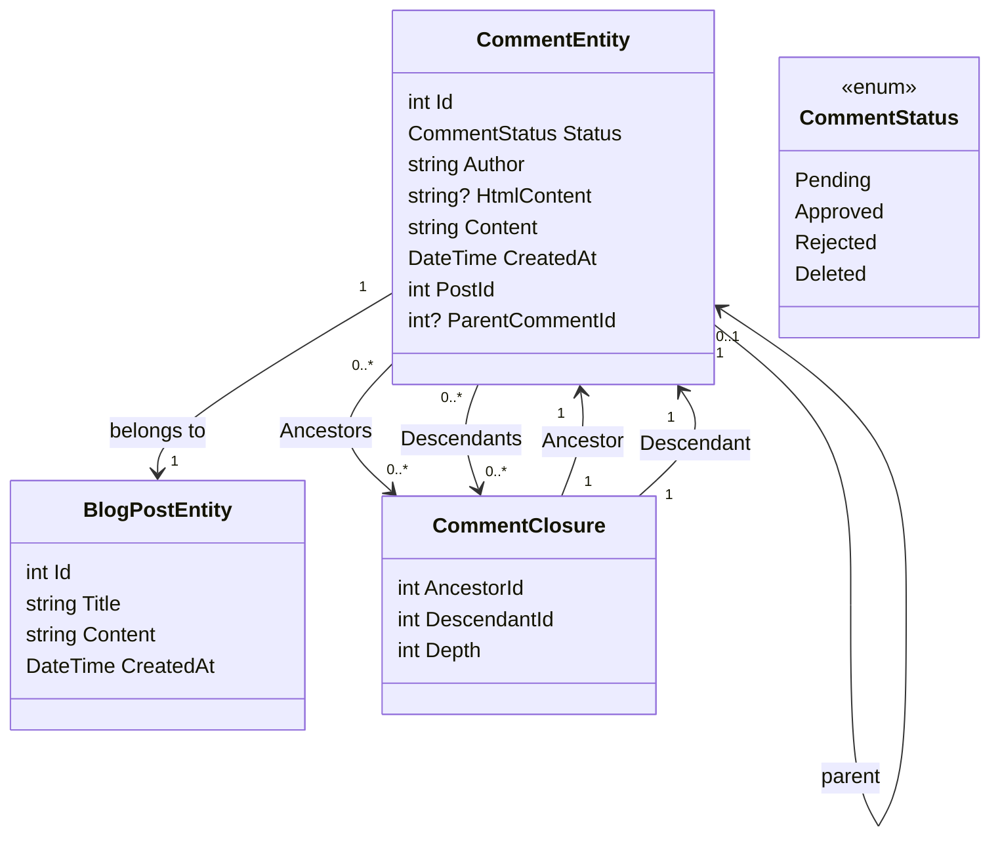

# إضافة جزء من الجزء 1 من نظام التعليق - إنشاء قاعدة البيانات

<!--category-- Entity Framework  -->
<datetime class="hidden">2024-08-26TT11: 53</datetime>

## أولاً

أحد الجوانب الرئيسية لموقع التدوين هذا هو نظام التعليقات. لذا قررت أن أبني واحداً وهذا هو الجزء الأول من سلسلة من الوظائف بشأن كيفية بناء نظام للتعليقات. في هذا المنصب، سأقوم بإنشاء قاعدة البيانات.

[رابعاً -

## إنشاء قاعدة البيانات

كما هو الحال مع بقية الموقع أنا استخدم Postgres للمدونات، للبدء مع استخدام الإستفسارات التكرارية لتخزين التعليقات. أنا أكره هذا بشكل مكثف، لكنه يخرجنا من البوابة مع نظام التعليق الخيط (وليس لدي الكثير من حركة المرور، لذلك فإنه ليس صفقة كبيرة). سأنتقل إلى نظام أكثر كفاءة في المستقبل

### الإطار المؤسسي

في النظام الحالي نستخدم "تعليق إغلاق" لتحديد العلاقات بين التعليقات - حتى أتمكن من تأييد التعليقات الخيطية. الرسم البياني لصفنا يبدو هكذا:



يمكنك أن ترى هنا أن `CommentEntity` (أ) حصل على `PostId` بالنسبة للوظيفة التي ترتبط بها، و `ParentCommentId` بالنسبة للتعليقات التي أُرفقت بها (إن وُجدت). الـ `CommentClosure` الجدول مُستخدَم لخزن العلاقات بين التعليقات.

### & معلقSS الخادم

الـ `CommentService` هو المسؤول عن إدارة التعليقات. وله أساليب لإضافة التعليقات والموافقة عليها ورفضها وحذفها. كما أن لديها أساليب للحصول على تعليقات بشأن وظيفة ما، والحصول على تعليقات للحصول على تعليق.

واجهة هذا الواجهة تبدو هكذا:

```csharp
public interface ICommentService
{
    Task<string> Add( int postId, int? parentCommentId, string author, string content);
    Task<List<CommentEntity>> GetForPost(int blogPostId, int page = 1, int pageSize = 10, int? maxDepth = null, CommentStatus? status = null);
    Task<List<CommentEntity>> GetDescendants(int commentId, int maxDepth = 0);

     Task<CommentEntity> Get(int commentId);
    Task<List<CommentEntity>> GetAncestors(int commentId);
    Task Delete(int commentId);
    Task Reject(int commentId);
    Task Approve(int commentId);
}
```

#### الـ مُضاف

طريقة الجمع لدينا تلخص هيكل نظام التعليقات هذا.

فهو يبدأ أولا معاملة جديدة؛ أما بالنسبة للمعاملات غير المألوفة فهي وسيلة لضمان معاملة مجموعة من العمليات على أنها وحدة عمل واحدة. وإذا فشلت أي من العمليات، يمكن إعادة المعاملة، وتلغى جميع التغييرات. وهذا أمر هام عندما يكون لديك عمليات متعددة تحتاج إلى القيام بها معاً، وتريد أن تضمن نجاحها أو فشلها جميعاً معاً.

ثم يقسم نص التعليق من علامة إلى HTML باستخدام مكتبة ماركديج. هذه طريقة بسيطة للسماح للمستخدمين لصياغة تعليقاتهم باستخدام العلامة.

بعد ذلك يخلق الكيان ويحفظ ذلك لقاعدة البيانات.

ويتم ذلك في خطوتين - أولاً يتم حفظ التعليق، ثم يتم حفظ تعليق الإغلاق. والسبب في ذلك هو أن التعليق يحتاج إلى حفظ لتوليد الهوية، التي تستخدم في الإغلاق.

سنبني تتالياً ترات ترات التدرج `CommentClosures` التي تحدد العلاقات بين التعليقات. نبدأ بمدخل الإغلاق الذاتي، ثم إذا كان هناك تعليق الأبوّة نجلب جميع أسلاف تعليق الأبوّة ونضيفهم إلى التعليق الجديد. ثم نضيف علاقة مباشرة بين الوالدين والطفل.

أخيراً، نلتزم بالمعاملة. وإذا فشلت أي من العمليات، تتراجع المعاملة.

```csharp
 public async Task<string> Add(int postId, int? parentCommentId, string author, string content)
  {
      await using var transaction = await context.Database.BeginTransactionAsync();
      try
      {
         var html = Markdig.Markdown.ToHtml(content);
          // Create the new comment
          var newComment = new CommentEntity()
          {
              HtmlContent = html,
              Content = content,
              CreatedAt = DateTime.UtcNow,
              PostId = postId,
              Author = author,
              Status = CommentStatus.Pending,
              ParentCommentId = parentCommentId
          };
            
          context.Comments.Add(newComment);
          await context.SaveChangesAsync();
          logger.LogInformation("Saved comment to DB");// Save to generate the new comment's Id

          // Insert into CommentClosure table
          var commentClosures = new List<CommentClosure>();

          // Self-referencing closure entry
          commentClosures.Add(new CommentClosure
          {
              AncestorId = newComment.Id,
              DescendantId = newComment.Id,
              Depth = 0
          });

          // If there is a parent comment, insert the ancestor relationships
          if (parentCommentId.HasValue)
          {
              // Fetch all ancestors of the parent comment
              var parentAncestors = await context.CommentClosures
                  .Where(cc => cc.DescendantId == parentCommentId.Value)
                  .ToListAsync();

              // Add ancestor relationships for the new comment
              foreach (var ancestor in parentAncestors)
              {
                  commentClosures.Add(new CommentClosure
                  {
                      AncestorId = ancestor.AncestorId,
                      DescendantId = newComment.Id,
                      Depth = ancestor.Depth + 1
                  });
              }

              // Add a direct parent-child relationship
              commentClosures.Add(new CommentClosure
              {
                  AncestorId = parentCommentId.Value,
                  DescendantId = newComment.Id,
                  Depth = 1
              });
          }

          context.CommentClosures.AddRange(commentClosures);
          await context.SaveChangesAsync();
          logger.LogInformation("Saved comment closure to DB");

          // Commit transaction
          await transaction.CommitAsync();
          return html;
      }
      catch (Exception e)
      {
          // Rollback transaction in case of failure
          await transaction.RollbackAsync();
          logger.LogError(e, "Failed to save comment to DB");
      }

      return string.Empty;
  }

```

#### الـ احصل على استمارة المُرَفَفث

نحن لَنْ نَغطّي كامل الشيء لكن `Add` وقد عقد مؤتمراً بشأن `Get` هي عملياتنا الرئيسية لهذه الخدمة.

كما ترون لدينا نداء بناءاً على تعليق المستوى الأعلى. لدينا أيضاً `maxDepth` البارامترات التي تسمح لنا بالحد من عمق شجرة التعليق. وهذا مفيد إذا أردنا فقط أن نظهر التعليقات على أعلى مستوى، أو إذا أردنا أن نحد من عمق الشجرة لتحسين الأداء.

لسوء الحظ مع هذا النهج التكراري نحن بحاجة إلى تطبيق مرشّح العمق بعد أن نكون قد جلبنا التعليقات، كما أننا لا نستطيع أن نفعل ذلك في الإستفسار. هذا لأن عمق التعليق يحدده عدد الاسلاف الذين لديه، ولا يمكننا بسهولة ان نستفسر عن هذا في SQL.

```csharp
  public async Task<List<CommentEntity>> GetForPost(int blogPostId, int page = 1, int pageSize = 10, int? maxDepth = null, CommentStatus? status = null)
  {
      // Step 1: Query the top-level comments for the specified blog post
      var query = context.Comments
          .Where(c => c.PostId == blogPostId)
          .OrderByDescending(c => c.CreatedAt)
          .Skip((page - 1) * pageSize)
          .Take(pageSize);

      // Step 2: Filter by status if provided
      if (status.HasValue)
      {
          query = query.Where(c => c.Status == status.Value);
      }

      var topLevelComments = await query
          .Include(c => c.ParentComment)
          .Include(d=>d.Descendants)
          .ToListAsync();

      // Step 4: Filter descendants based on the maxDepth
      foreach (var comment in topLevelComments)
      {
          if (maxDepth != null)
          {
              FilterDescendantsByDepth(comment, 0, maxDepth.Value);
          }
      }

      return topLevelComments;
  }

// Recursive helper method to limit the descendants based on the specified depth
  private void FilterDescendantsByDepth(CommentEntity comment, int currentDepth, int maxDepth)
  {
      if (currentDepth >= maxDepth)
      {
          // If the max depth is reached or there are no descendants, stop recursion
          comment.Descendants = new List<CommentClosure>();  // Clear further descendants beyond maxDepth
          return;
      }

      foreach (var closure in comment.Descendants.ToList())  // Iterate over a copy to prevent modification during iteration
      {
          FilterDescendantsByDepth(closure.Descendant, currentDepth + 1, maxDepth);
      }
  }

```

## في الإستنتاج

هذا نظام تعليق بسيط يستخدم الاستفسارات المتكررة لتخزين العلاقات بين التعليقات. إنه ليس النظام الأكثر كفاءة، لكنه بسيط ويعمل. في المستقبل، سأغطي الجوانب الأمامية لهذا النظام، الكثير من HTMX، Alpin.js، و Tailwind CSS.

لِذلِكَ ، لِتَتَرَكَ عَلَاقَةً مُسْتَقْلِلَةً لِأَنَّهُ لَا يَسْتَطِيعُ أَنْ يَتَرَكَّزَ عَلَاقَةً مِنَ ٱلْمَقَالَةِ ٱلتَّالِيَةِ!