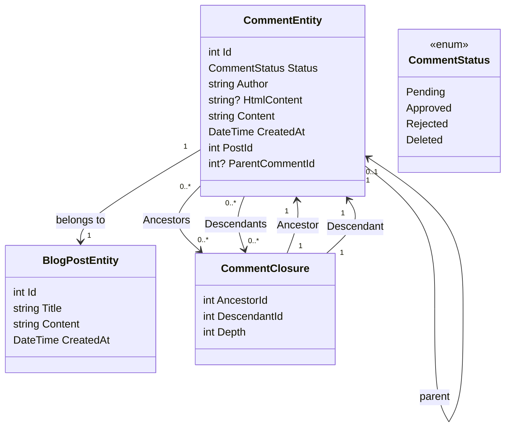

# Fügen Sie einen Kommentar System Teil 1 - Einrichtung der Datenbank

<!--category-- Entity Framework  -->
<datetime class="hidden">2024-08-26T11:53</datetime>

## Einleitung

Einer der wichtigsten Aspekte einer Blogging-Website wie diese ist ein Kommentar-System. Also beschloss ich, eins zu bauen. Dies ist der erste Teil einer Reihe von Beiträgen, wie man ein Kommentarsystem aufbauen kann. In diesem Beitrag werde ich die Datenbank einrichten.

[TOC]

## Einrichtung der Datenbank

Wie mit dem Rest der Website Ich bin mit Postgres für die Blogs; um mit zu beginnen Ich bin mit rekursiven Abfragen, um die Kommentare zu speichern. Ich mag dies sehr, aber es bringt uns aus dem Tor mit einem Gewinde Kommentar-System (und ich habe nicht viel Verkehr, so ist es keine große Sache). Ich werde in Zukunft zu einem effizienteren System übergehen.

### Der EF-Kontext

Im aktuellen System verwenden wir einen 'Comment Closure', um die Beziehungen zwischen Kommentaren zu definieren - so kann ich threaded comments unterstützen. Unser Klassendiagramm sieht so aus:



Sie können hier sehen, dass jeder `CommentEntity` hat eine `PostId` für den Pfosten, an dem er befestigt ist, und ein `ParentCommentId` für den Kommentar, dem er beigefügt ist (falls vorhanden). Das `CommentClosure` Tabelle wird verwendet, um die Beziehungen zwischen Kommentaren zu speichern.

### Der Kommentardienst

Das `CommentService` ist für die Verwaltung von Kommentaren zuständig. Sie hat Methoden, Kommentare hinzuzufügen, zu genehmigen, abzulehnen und zu streichen. Es hat auch Methoden für das Erhalten von Kommentaren für einen Beitrag und das Erhalten von Kommentaren für einen Kommentar.

Unsere Schnittstelle für diesen Service sieht so aus:

```csharp
public interface ICommentService
{
    Task<string> Add( int postId, int? parentCommentId, string author, string content);
    Task<List<CommentEntity>> GetForPost(int blogPostId, int page = 1, int pageSize = 10, int? maxDepth = null, CommentStatus? status = null);
    Task<List<CommentEntity>> GetDescendants(int commentId, int maxDepth = 0);

     Task<CommentEntity> Get(int commentId);
    Task<List<CommentEntity>> GetAncestors(int commentId);
    Task Delete(int commentId);
    Task Reject(int commentId);
    Task Approve(int commentId);
}
```

#### Die Hinzufügen-Methode

Unsere Add-Methode fasst die Struktur dieses Kommentarsystems zusammen.

Es beginnt zunächst eine neue Transaktion; denn diese nicht vertrauten Transaktionen sind eine Möglichkeit, sicherzustellen, dass eine Gruppe von Operationen als eine einzige Arbeitseinheit behandelt wird. Wenn eine der Operationen fehlschlägt, kann die Transaktion zurückgerollt werden, und alle Änderungen werden rückgängig gemacht. Dies ist wichtig, wenn Sie mehrere Operationen haben, die zusammen durchgeführt werden müssen, und Sie wollen sicherstellen, dass sie alle erfolgreich sind oder zusammen scheitern.

Anschließend wird der Kommentartext von Markdown nach HTML mit der Markdig-Bibliothek analysiert. Dies ist ein einfacher Weg, um Benutzern zu erlauben, ihre Kommentare mit Markdown zu formatieren.

Als nächstes erstellt es das Entity und speichert es in der Datenbank.

Dies geschieht in zwei Schritten - zuerst wird der Kommentar gespeichert, dann wird der Kommentarabschluss gespeichert. Dies liegt daran, dass der Kommentar gespeichert werden muss, um die Id zu generieren, die bei der Schließung verwendet wird.

Als nächstes bauen wir die Hierarchie von `CommentClosures` die die Beziehungen zwischen Kommentaren definieren. Wir beginnen mit einem selbstreferenzierenden Schließungseintrag, dann, wenn es einen Elternkommentar gibt, holen wir alle Vorfahren des Elternkommentars und fügen sie dem neuen Kommentar hinzu. Wir fügen dann eine direkte Eltern-Kind-Beziehung hinzu.

Schließlich verpflichten wir die Transaktion. Wenn eine der Operationen fehlschlägt, wird die Transaktion zurückgerollt.

```csharp
 public async Task<string> Add(int postId, int? parentCommentId, string author, string content)
  {
      await using var transaction = await context.Database.BeginTransactionAsync();
      try
      {
         var html = Markdig.Markdown.ToHtml(content);
          // Create the new comment
          var newComment = new CommentEntity()
          {
              HtmlContent = html,
              Content = content,
              CreatedAt = DateTime.UtcNow,
              PostId = postId,
              Author = author,
              Status = CommentStatus.Pending,
              ParentCommentId = parentCommentId
          };
            
          context.Comments.Add(newComment);
          await context.SaveChangesAsync();
          logger.LogInformation("Saved comment to DB");// Save to generate the new comment's Id

          // Insert into CommentClosure table
          var commentClosures = new List<CommentClosure>();

          // Self-referencing closure entry
          commentClosures.Add(new CommentClosure
          {
              AncestorId = newComment.Id,
              DescendantId = newComment.Id,
              Depth = 0
          });

          // If there is a parent comment, insert the ancestor relationships
          if (parentCommentId.HasValue)
          {
              // Fetch all ancestors of the parent comment
              var parentAncestors = await context.CommentClosures
                  .Where(cc => cc.DescendantId == parentCommentId.Value)
                  .ToListAsync();

              // Add ancestor relationships for the new comment
              foreach (var ancestor in parentAncestors)
              {
                  commentClosures.Add(new CommentClosure
                  {
                      AncestorId = ancestor.AncestorId,
                      DescendantId = newComment.Id,
                      Depth = ancestor.Depth + 1
                  });
              }

              // Add a direct parent-child relationship
              commentClosures.Add(new CommentClosure
              {
                  AncestorId = parentCommentId.Value,
                  DescendantId = newComment.Id,
                  Depth = 1
              });
          }

          context.CommentClosures.AddRange(commentClosures);
          await context.SaveChangesAsync();
          logger.LogInformation("Saved comment closure to DB");

          // Commit transaction
          await transaction.CommitAsync();
          return html;
      }
      catch (Exception e)
      {
          // Rollback transaction in case of failure
          await transaction.RollbackAsync();
          logger.LogError(e, "Failed to save comment to DB");
      }

      return string.Empty;
  }

```

#### Die GetForPost-Methode

Wir decken nicht alles ab, aber... `Add` und `Get` sind unsere wichtigsten CRUD-Operationen für diesen Service.

Wie Sie sehen können, haben wir auf der Top-Level-Kommentar basierende Seite. Wir haben auch eine `maxDepth` Parameter, der uns erlaubt, die Tiefe des Kommentarbaums zu begrenzen. Dies ist nützlich, wenn wir nur die Top-Level-Kommentare zeigen wollen, oder wenn wir die Tiefe des Baumes begrenzen wollen, um die Leistung zu verbessern.

Unfortunately mit diesem rekursiven Ansatz müssen wir den Tiefenfilter anwenden, nachdem wir die Kommentare erhalten haben, da wir es nicht in der Abfrage tun können. Dies liegt daran, dass die Tiefe eines Kommentars von der Anzahl der Vorfahren bestimmt wird, die er hat, und wir können dies in SQL nicht einfach abfragen.

```csharp
  public async Task<List<CommentEntity>> GetForPost(int blogPostId, int page = 1, int pageSize = 10, int? maxDepth = null, CommentStatus? status = null)
  {
      // Step 1: Query the top-level comments for the specified blog post
      var query = context.Comments
          .Where(c => c.PostId == blogPostId)
          .OrderByDescending(c => c.CreatedAt)
          .Skip((page - 1) * pageSize)
          .Take(pageSize);

      // Step 2: Filter by status if provided
      if (status.HasValue)
      {
          query = query.Where(c => c.Status == status.Value);
      }

      var topLevelComments = await query
          .Include(c => c.ParentComment)
          .Include(d=>d.Descendants)
          .ToListAsync();

      // Step 4: Filter descendants based on the maxDepth
      foreach (var comment in topLevelComments)
      {
          if (maxDepth != null)
          {
              FilterDescendantsByDepth(comment, 0, maxDepth.Value);
          }
      }

      return topLevelComments;
  }

// Recursive helper method to limit the descendants based on the specified depth
  private void FilterDescendantsByDepth(CommentEntity comment, int currentDepth, int maxDepth)
  {
      if (currentDepth >= maxDepth)
      {
          // If the max depth is reached or there are no descendants, stop recursion
          comment.Descendants = new List<CommentClosure>();  // Clear further descendants beyond maxDepth
          return;
      }

      foreach (var closure in comment.Descendants.ToList())  // Iterate over a copy to prevent modification during iteration
      {
          FilterDescendantsByDepth(closure.Descendant, currentDepth + 1, maxDepth);
      }
  }

```

## Schlussfolgerung

Dies ist ein einfaches Threaded-Comment-System, das rekursive Abfragen verwendet, um die Beziehungen zwischen Kommentaren zu speichern. Es ist nicht das effizienteste System, aber es ist einfach und es funktioniert. In Zukunft werde ich die Frontend-Aspekte dieses Systems abdecken; viele HTMX, Alpine.js und Tailwind CSS.

Bis dahin, zögern Sie nicht, einen Kommentar unten zu hinterlassen!