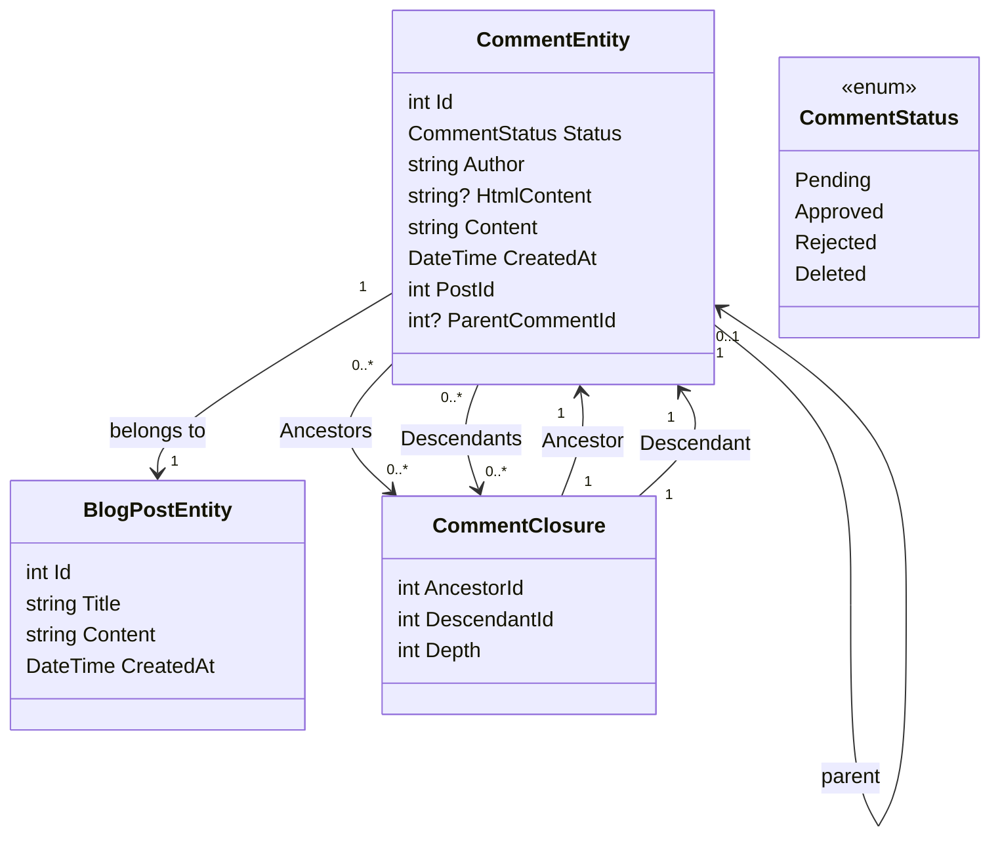

# Προσθήκη ενός συστήματος σχολίων μέρος 1 - Ρύθμιση της βάσης δεδομένων

<!--category-- Entity Framework  -->
<datetime class="hidden">2024-08-26T11:53</datetime>

## Εισαγωγή

Μια από τις βασικές πτυχές ενός ιστοτόπου blogging όπως αυτό είναι ένα σύστημα σχολίων. Έτσι, αποφάσισα να φτιάξω ένα. Αυτό είναι το πρώτο μέρος μιας σειράς θέσεων σχετικά με το πώς να οικοδομήσουμε ένα σύστημα σχολίων. Σε αυτή τη θέση, θα στήσω τη βάση δεδομένων.

[TOC]

## Ρύθμιση της βάσης δεδομένων

Όπως και με το υπόλοιπο site που χρησιμοποιώ Postgres για τα blogs; για να ξεκινήσω με τη χρήση αναδρομικών ερωτήσεων για την αποθήκευση των σχολίων. Μου αρέσει αυτό έντονα, αλλά μας βγάζει έξω από την πύλη με ένα κοχλιωτό σύστημα σχολίων (και δεν έχω πολλή κίνηση, έτσι δεν είναι μεγάλη υπόθεση). Θα μετακομίσω σε ένα πιο αποτελεσματικό σύστημα στο μέλλον.

### Το πλαίσιο EF

Στο σημερινό σύστημα χρησιμοποιούμε ένα "Σχόλιο Κλείσιμο" για να καθορίσουμε τις σχέσεις μεταξύ σχολίων - έτσι μπορώ να υποστηρίξω τα σχισμένα σχόλια. Το διάγραμμα της τάξης μας μοιάζει με αυτό:



Μπορείτε να δείτε εδώ ότι ο καθένας `CommentEntity` έχει ένα `PostId` για τη θέση στην οποία είναι προσαρτημένη, και a `ParentCommentId` για το σχόλιο συνδέεται με (εάν υπάρχει). Η `CommentClosure` Ο πίνακας χρησιμοποιείται για την αποθήκευση των σχέσεων μεταξύ σχολίων.

### The CommentService

Η `CommentService` είναι υπεύθυνος για τη διαχείριση των σχολίων. Διαθέτει μεθόδους για την προσθήκη, την έγκριση, την απόρριψη και τη διαγραφή σχολίων. Έχει επίσης μεθόδους για να πάρει σχόλια για μια δημοσίευση, και να πάρει σχόλια για ένα σχόλιο.

Η διεπαφή μας για αυτή την υπηρεσία μοιάζει με αυτό:

```csharp
public interface ICommentService
{
    Task<string> Add( int postId, int? parentCommentId, string author, string content);
    Task<List<CommentEntity>> GetForPost(int blogPostId, int page = 1, int pageSize = 10, int? maxDepth = null, CommentStatus? status = null);
    Task<List<CommentEntity>> GetDescendants(int commentId, int maxDepth = 0);

     Task<CommentEntity> Get(int commentId);
    Task<List<CommentEntity>> GetAncestors(int commentId);
    Task Delete(int commentId);
    Task Reject(int commentId);
    Task Approve(int commentId);
}
```

#### Η μέθοδος προσθήκης

Η μέθοδος Προσθήκη μας συνοψίζει τη δομή αυτού του συστήματος σχολίων.

Ξεκινά πρώτα μια νέα συναλλαγή.Για όσους δεν είναι εξοικειωμένοι οι συναλλαγές είναι ένας τρόπος για να εξασφαλιστεί ότι μια ομάδα πράξεων αντιμετωπίζεται ως μια ενιαία μονάδα εργασίας. Εάν κάποια από τις λειτουργίες αποτύχει, η συναλλαγή μπορεί να γυρίσει πίσω, και όλες οι αλλαγές έχουν καταργηθεί. Αυτό είναι σημαντικό όταν έχετε πολλαπλές λειτουργίες που πρέπει να γίνουν από κοινού, και θέλετε να διασφαλίσετε ότι όλα θα πετύχουν ή θα αποτύχουν μαζί.

Στη συνέχεια αναλύει το κείμενο σχολίων από Markdown σε HTML χρησιμοποιώντας τη βιβλιοθήκη Markdig. Αυτός είναι ένας απλός τρόπος για να επιτραπεί στους χρήστες να διαμορφώσουν τα σχόλιά τους χρησιμοποιώντας Markdown.

Στη συνέχεια δημιουργεί την οντότητα και την αποθηκεύει στη βάση δεδομένων.

Αυτό γίνεται σε δύο βήματα - πρώτα το σχόλιο σώζεται, στη συνέχεια το κλείσιμο σχολίων σώζεται. Αυτό συμβαίνει επειδή το σχόλιο πρέπει να σωθεί για να δημιουργηθεί η ταυτότητα, η οποία χρησιμοποιείται στο κλείσιμο.

Εμείς στη συνέχεια χτίζουμε την ιεραρχία του `CommentClosures` που καθορίζουν τις σχέσεις μεταξύ σχολίων. Ξεκινάμε με μια αυτο-αναφερόμενη καταχώρηση κλεισίματος, τότε αν υπάρχει ένα σχόλιο γονέα φέρνουμε όλους τους προγόνους του γονικού σχολίου και τους προσθέτουμε στο νέο σχόλιο. Στη συνέχεια προσθέτουμε μια άμεση σχέση γονέα-παιδιού.

Επιτέλους, κάνουμε τη συναλλαγή. Εάν κάποια από τις πράξεις αποτύχει, η συναλλαγή επανέρχεται.

```csharp
 public async Task<string> Add(int postId, int? parentCommentId, string author, string content)
  {
      await using var transaction = await context.Database.BeginTransactionAsync();
      try
      {
         var html = Markdig.Markdown.ToHtml(content);
          // Create the new comment
          var newComment = new CommentEntity()
          {
              HtmlContent = html,
              Content = content,
              CreatedAt = DateTime.UtcNow,
              PostId = postId,
              Author = author,
              Status = CommentStatus.Pending,
              ParentCommentId = parentCommentId
          };
            
          context.Comments.Add(newComment);
          await context.SaveChangesAsync();
          logger.LogInformation("Saved comment to DB");// Save to generate the new comment's Id

          // Insert into CommentClosure table
          var commentClosures = new List<CommentClosure>();

          // Self-referencing closure entry
          commentClosures.Add(new CommentClosure
          {
              AncestorId = newComment.Id,
              DescendantId = newComment.Id,
              Depth = 0
          });

          // If there is a parent comment, insert the ancestor relationships
          if (parentCommentId.HasValue)
          {
              // Fetch all ancestors of the parent comment
              var parentAncestors = await context.CommentClosures
                  .Where(cc => cc.DescendantId == parentCommentId.Value)
                  .ToListAsync();

              // Add ancestor relationships for the new comment
              foreach (var ancestor in parentAncestors)
              {
                  commentClosures.Add(new CommentClosure
                  {
                      AncestorId = ancestor.AncestorId,
                      DescendantId = newComment.Id,
                      Depth = ancestor.Depth + 1
                  });
              }

              // Add a direct parent-child relationship
              commentClosures.Add(new CommentClosure
              {
                  AncestorId = parentCommentId.Value,
                  DescendantId = newComment.Id,
                  Depth = 1
              });
          }

          context.CommentClosures.AddRange(commentClosures);
          await context.SaveChangesAsync();
          logger.LogInformation("Saved comment closure to DB");

          // Commit transaction
          await transaction.CommitAsync();
          return html;
      }
      catch (Exception e)
      {
          // Rollback transaction in case of failure
          await transaction.RollbackAsync();
          logger.LogError(e, "Failed to save comment to DB");
      }

      return string.Empty;
  }

```

#### Η μέθοδος GetForPost

Δεν θα το καλύψουμε όλο, αλλά... `Add` και `Get` είναι οι κύριες επιχειρήσεις μας CRUD για αυτή την υπηρεσία.

Όπως μπορείτε να δείτε, έχουμε τηλεειδοποίηση με βάση το σχόλιο πάνω επίπεδο. Έχουμε επίσης ένα `maxDepth` παράμετρος που μας επιτρέπει να περιορίσουμε το βάθος του δέντρου σχολίων. Αυτό είναι χρήσιμο μόνο αν θέλουμε να δείξουμε τα κορυφαία σχόλια, ή αν θέλουμε να περιορίσουμε το βάθος του δέντρου για να βελτιώσουμε την απόδοση.

Δυστυχώς με αυτή την αναδρομική προσέγγιση πρέπει να εφαρμόσουμε το φίλτρο βάθους αφού έχουμε φέρει τα σχόλια, καθώς δεν μπορούμε να το κάνουμε στο ερώτημα. Αυτό συμβαίνει επειδή το βάθος ενός σχολίου καθορίζεται από τον αριθμό των προγόνων που έχει, και δεν μπορούμε εύκολα να το εξετάσουμε αυτό στο SQL.

```csharp
  public async Task<List<CommentEntity>> GetForPost(int blogPostId, int page = 1, int pageSize = 10, int? maxDepth = null, CommentStatus? status = null)
  {
      // Step 1: Query the top-level comments for the specified blog post
      var query = context.Comments
          .Where(c => c.PostId == blogPostId)
          .OrderByDescending(c => c.CreatedAt)
          .Skip((page - 1) * pageSize)
          .Take(pageSize);

      // Step 2: Filter by status if provided
      if (status.HasValue)
      {
          query = query.Where(c => c.Status == status.Value);
      }

      var topLevelComments = await query
          .Include(c => c.ParentComment)
          .Include(d=>d.Descendants)
          .ToListAsync();

      // Step 4: Filter descendants based on the maxDepth
      foreach (var comment in topLevelComments)
      {
          if (maxDepth != null)
          {
              FilterDescendantsByDepth(comment, 0, maxDepth.Value);
          }
      }

      return topLevelComments;
  }

// Recursive helper method to limit the descendants based on the specified depth
  private void FilterDescendantsByDepth(CommentEntity comment, int currentDepth, int maxDepth)
  {
      if (currentDepth >= maxDepth)
      {
          // If the max depth is reached or there are no descendants, stop recursion
          comment.Descendants = new List<CommentClosure>();  // Clear further descendants beyond maxDepth
          return;
      }

      foreach (var closure in comment.Descendants.ToList())  // Iterate over a copy to prevent modification during iteration
      {
          FilterDescendantsByDepth(closure.Descendant, currentDepth + 1, maxDepth);
      }
  }

```

## Συμπέρασμα

Αυτό είναι ένα απλό κοχλιωτό σύστημα σχολίων που χρησιμοποιεί επαναλαμβανόμενες ερωτήσεις για να αποθηκεύσει τις σχέσεις μεταξύ των σχολίων. Δεν είναι το πιο αποτελεσματικό σύστημα, αλλά είναι απλό και λειτουργεί. Στο μέλλον, θα καλύψω τις μπροστινές πτυχές αυτού του συστήματος, πολλές HTMX, Alpine.js, και Tailwind CSS.

Μέχρι τότε, μη διστάσετε να αφήσετε ένα σχόλιο παρακάτω!