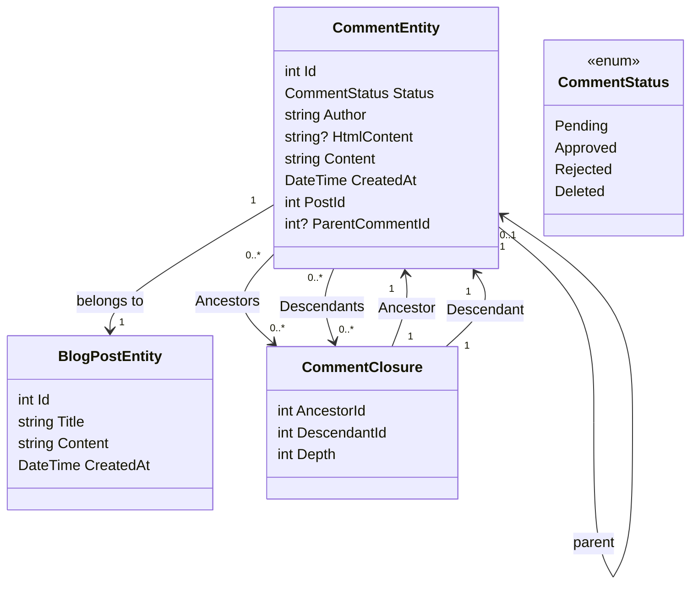

# Añadir un sistema de comentarios Parte 1 - Configuración de la base de datos

<!--category-- Entity Framework  -->
<datetime class="hidden">2024-08-26T11:53</datetime>

## Introducción

Uno de los aspectos clave de un sitio de blogs como este es un sistema de comentarios. Así que decidí construir uno. Esta es la primera parte de una serie de posts sobre cómo construir un sistema de comentarios. En este post, voy a configurar la base de datos.

[TOC]

## Creación de la base de datos

Como con el resto del sitio estoy usando Postgres para los blogs; para empezar estoy usando consultas recursivas para almacenar los comentarios. No me gusta esto intensamente, pero nos saca de la puerta con un sistema de comentarios roscado (y no tengo mucho tráfico, así que no es gran cosa). Me mudaré a un sistema más eficiente en el futuro.

### El contexto de la FE

En el sistema actual usamos un 'Comentario Cierre' para definir las relaciones entre los comentarios - por lo que puedo soportar comentarios roscados. Nuestro diagrama de clase se ve así:



Puedes ver aquí que cada uno `CommentEntity` tiene una `PostId` para el puesto al que se adjunta, y un `ParentCommentId` para el comentario que se adjunta a (si lo hay). Los `CommentClosure` tabla se utiliza para almacenar las relaciones entre los comentarios.

### El servicio de comentarios

Los `CommentService` es responsable de la gestión de los comentarios. Tiene métodos para agregar, aprobar, rechazar y eliminar comentarios. También tiene métodos para obtener comentarios para un post, y obtener comentarios para un comentario.

Nuestra interfaz para este servicio se ve así:

```csharp
public interface ICommentService
{
    Task<string> Add( int postId, int? parentCommentId, string author, string content);
    Task<List<CommentEntity>> GetForPost(int blogPostId, int page = 1, int pageSize = 10, int? maxDepth = null, CommentStatus? status = null);
    Task<List<CommentEntity>> GetDescendants(int commentId, int maxDepth = 0);

     Task<CommentEntity> Get(int commentId);
    Task<List<CommentEntity>> GetAncestors(int commentId);
    Task Delete(int commentId);
    Task Reject(int commentId);
    Task Approve(int commentId);
}
```

#### El método de añadir

Nuestro método Add resume la estructura de este sistema de comentarios.

Primero inicia una nueva transacción; para las transacciones no conocidas es una manera de asegurar que un grupo de operaciones se trate como una sola unidad de trabajo. Si alguna de las operaciones falla, la transacción se puede revertir, y todos los cambios están deshechos. Esto es importante cuando tienes múltiples operaciones que necesitan ser hechas juntas, y quieres asegurarte de que todas tengan éxito o fracasen juntas.

Luego analiza el texto de comentario de Markdown a HTML usando la biblioteca Markdig. Esta es una forma sencilla de permitir a los usuarios formatear sus comentarios usando Markdown.

A continuación crea la entidad y guarda eso en la base de datos.

Esto se hace en dos pasos - primero se guarda el comentario, luego se guarda el cierre del comentario. Esto se debe a que el comentario necesita ser guardado para generar el Id, que se utiliza en el cierre.

A continuación construimos la jerarquía de `CommentClosures` que definen las relaciones entre los comentarios. Comenzamos con una entrada de cierre de auto-referencia, entonces si hay un comentario de los padres, recogemos a todos los antepasados del comentario de los padres y los añadimos al nuevo comentario. Luego agregamos una relación directa padre-hijo.

Finalmente, realizamos la transacción. Si alguna de las operaciones falla, la transacción se revierte.

```csharp
 public async Task<string> Add(int postId, int? parentCommentId, string author, string content)
  {
      await using var transaction = await context.Database.BeginTransactionAsync();
      try
      {
         var html = Markdig.Markdown.ToHtml(content);
          // Create the new comment
          var newComment = new CommentEntity()
          {
              HtmlContent = html,
              Content = content,
              CreatedAt = DateTime.UtcNow,
              PostId = postId,
              Author = author,
              Status = CommentStatus.Pending,
              ParentCommentId = parentCommentId
          };
            
          context.Comments.Add(newComment);
          await context.SaveChangesAsync();
          logger.LogInformation("Saved comment to DB");// Save to generate the new comment's Id

          // Insert into CommentClosure table
          var commentClosures = new List<CommentClosure>();

          // Self-referencing closure entry
          commentClosures.Add(new CommentClosure
          {
              AncestorId = newComment.Id,
              DescendantId = newComment.Id,
              Depth = 0
          });

          // If there is a parent comment, insert the ancestor relationships
          if (parentCommentId.HasValue)
          {
              // Fetch all ancestors of the parent comment
              var parentAncestors = await context.CommentClosures
                  .Where(cc => cc.DescendantId == parentCommentId.Value)
                  .ToListAsync();

              // Add ancestor relationships for the new comment
              foreach (var ancestor in parentAncestors)
              {
                  commentClosures.Add(new CommentClosure
                  {
                      AncestorId = ancestor.AncestorId,
                      DescendantId = newComment.Id,
                      Depth = ancestor.Depth + 1
                  });
              }

              // Add a direct parent-child relationship
              commentClosures.Add(new CommentClosure
              {
                  AncestorId = parentCommentId.Value,
                  DescendantId = newComment.Id,
                  Depth = 1
              });
          }

          context.CommentClosures.AddRange(commentClosures);
          await context.SaveChangesAsync();
          logger.LogInformation("Saved comment closure to DB");

          // Commit transaction
          await transaction.CommitAsync();
          return html;
      }
      catch (Exception e)
      {
          // Rollback transaction in case of failure
          await transaction.RollbackAsync();
          logger.LogError(e, "Failed to save comment to DB");
      }

      return string.Empty;
  }

```

#### El método GetForPost

No cubriremos todo el asunto, pero `Add` y `Get` son nuestras principales operaciones CRUD para este servicio.

Como pueden ver tenemos paginación basada en el comentario del nivel superior. También tenemos un `maxDepth` parámetro que nos permite limitar la profundidad del árbol de comentarios. Esto es útil si sólo queremos mostrar los comentarios de nivel superior, o si queremos limitar la profundidad del árbol para mejorar el rendimiento.

Infortunadamente con este enfoque recursivo necesitamos aplicar el filtro de profundidad después de haber obtenido los comentarios, ya que no podemos hacerlo en la consulta. Esto se debe a que la profundidad de un comentario está determinada por el número de ancestros que tiene, y no podemos consultar fácilmente esto en SQL.

```csharp
  public async Task<List<CommentEntity>> GetForPost(int blogPostId, int page = 1, int pageSize = 10, int? maxDepth = null, CommentStatus? status = null)
  {
      // Step 1: Query the top-level comments for the specified blog post
      var query = context.Comments
          .Where(c => c.PostId == blogPostId)
          .OrderByDescending(c => c.CreatedAt)
          .Skip((page - 1) * pageSize)
          .Take(pageSize);

      // Step 2: Filter by status if provided
      if (status.HasValue)
      {
          query = query.Where(c => c.Status == status.Value);
      }

      var topLevelComments = await query
          .Include(c => c.ParentComment)
          .Include(d=>d.Descendants)
          .ToListAsync();

      // Step 4: Filter descendants based on the maxDepth
      foreach (var comment in topLevelComments)
      {
          if (maxDepth != null)
          {
              FilterDescendantsByDepth(comment, 0, maxDepth.Value);
          }
      }

      return topLevelComments;
  }

// Recursive helper method to limit the descendants based on the specified depth
  private void FilterDescendantsByDepth(CommentEntity comment, int currentDepth, int maxDepth)
  {
      if (currentDepth >= maxDepth)
      {
          // If the max depth is reached or there are no descendants, stop recursion
          comment.Descendants = new List<CommentClosure>();  // Clear further descendants beyond maxDepth
          return;
      }

      foreach (var closure in comment.Descendants.ToList())  // Iterate over a copy to prevent modification during iteration
      {
          FilterDescendantsByDepth(closure.Descendant, currentDepth + 1, maxDepth);
      }
  }

```

## Conclusión

Se trata de un simple sistema de comentarios roscados que utiliza consultas recursivas para almacenar las relaciones entre los comentarios. No es el sistema más eficiente, pero es simple y funciona. En el futuro, cubriré los aspectos frontales de este sistema; un montón de HTMX, Alpine.js y Tailwind CSS.

Hasta entonces, no dude en dejar un comentario a continuación!