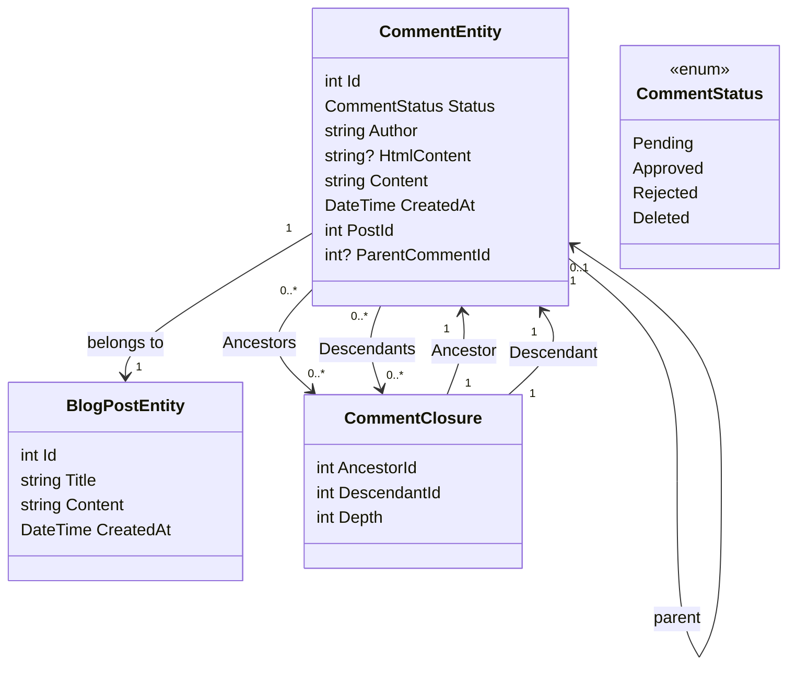

# Kommenttijärjestelmän lisääminen Osa 1 - Tietokannan perustaminen

<!--category-- Entity Framework  -->
<datetime class="hidden">2024-08-26T11:53</datetime>

## Johdanto

Yksi tämänkaltaisen bloggaussivuston keskeisistä puolista on kommenttijärjestelmä. Päätin siis rakentaa sellaisen. Tämä on ensimmäinen osa sarjaa, jossa kerrotaan kommenttijärjestelmän rakentamisesta. Tässä viestissä perustan tietokantaa.

[TOC]

## Tietokannan perustaminen

Kuten muuallakin sivustossa, käytän Postgresiä blogeissa; aluksi käytän rekursiiveja kyselyitä kommenttien tallentamiseen. En pidä tästä, mutta se saa meidät ulos portista kierteisellä kommenttijärjestelmällä (ja minulla ei ole paljoa liikennettä, joten se ei ole iso juttu). Siirryn jatkossa tehokkaampaan järjestelmään.

### EF-konteksti

Nykyisessä järjestelmässä käytämme kommenttiratkaisua kommenttien välisten suhteiden määrittelyyn - joten voin tukea kierrettyjä kommentteja. Luokkakaaviomme näyttää tältä:



Tästä näkee, että jokainen `CommentEntity` a `PostId` Postia varten se on liitetty, ja `ParentCommentId` Kommenttia varten se on liitetty (jos on). Erytropoietiini `CommentClosure` taulukkoa käytetään tallentamaan kommenttien välisiä suhteita.

### Kommenttipalvelu

Erytropoietiini `CommentService` vastaa kommenttien hallinnasta. Sillä on keinoja lisätä, hyväksyä, hylätä ja poistaa kommentteja. Se on myös menetelmiä saada kommentteja postitse, ja saada kommentteja kommenttia.

Käyttöliittymämme tälle palvelulle näyttää tältä:

```csharp
public interface ICommentService
{
    Task<string> Add( int postId, int? parentCommentId, string author, string content);
    Task<List<CommentEntity>> GetForPost(int blogPostId, int page = 1, int pageSize = 10, int? maxDepth = null, CommentStatus? status = null);
    Task<List<CommentEntity>> GetDescendants(int commentId, int maxDepth = 0);

     Task<CommentEntity> Get(int commentId);
    Task<List<CommentEntity>> GetAncestors(int commentId);
    Task Delete(int commentId);
    Task Reject(int commentId);
    Task Approve(int commentId);
}
```

#### Lisää menetelmä

Add-menetelmämme tiivistää kommenttijärjestelmän rakenteen.

Se aloittaa ensin uuden liiketoimen, sillä tuntemattomille liiketoimille se on keino varmistaa, että joukko toimintoja käsitellään yhtenä yksikkönä. Jos jokin operaatio epäonnistuu, tapahtuma voidaan kääntää takaisin, ja kaikki muutokset perutaan. Tämä on tärkeää, kun on useita operaatioita, jotka on tehtävä yhdessä, ja haluat varmistaa, että ne kaikki onnistuvat tai epäonnistuvat yhdessä.

Sitten se jäsentää kommenttitekstin Markdownista HTML:ään käyttäen Markdigin kirjastoa. Tämä on yksinkertainen tapa, jolla käyttäjät voivat muotoilla kommenttinsa Markdownin avulla.

Seuraavaksi se luo kokonaisuuden ja tallentaa sen tietokantaan.

Tämä tapahtuu kahdessa vaiheessa - ensin kommentti tallennetaan, sitten huomautus suljetaan. Tämä johtuu siitä, että kommentti on tallennettava, jotta sulkemisessa käytetty tunniste saadaan luotua.

Seuraavaksi rakennamme hierarkian `CommentClosures` joka määrittelee kommenttien väliset suhteet. Aloitamme itseviittaavalla lopetusotteella, niin jos on vanhemman kommentti, niin noutamme kaikki vanhemman esi-isät kommenttiin ja lisäämme ne uuteen kommenttiin. Sitten lisäämme suoran vanhempien ja lasten välisen suhteen.

Vihdoin sitoudumme liiketoimeen. Jos jokin operaatio epäonnistuu, kauppa peruuntuu.

```csharp
 public async Task<string> Add(int postId, int? parentCommentId, string author, string content)
  {
      await using var transaction = await context.Database.BeginTransactionAsync();
      try
      {
         var html = Markdig.Markdown.ToHtml(content);
          // Create the new comment
          var newComment = new CommentEntity()
          {
              HtmlContent = html,
              Content = content,
              CreatedAt = DateTime.UtcNow,
              PostId = postId,
              Author = author,
              Status = CommentStatus.Pending,
              ParentCommentId = parentCommentId
          };
            
          context.Comments.Add(newComment);
          await context.SaveChangesAsync();
          logger.LogInformation("Saved comment to DB");// Save to generate the new comment's Id

          // Insert into CommentClosure table
          var commentClosures = new List<CommentClosure>();

          // Self-referencing closure entry
          commentClosures.Add(new CommentClosure
          {
              AncestorId = newComment.Id,
              DescendantId = newComment.Id,
              Depth = 0
          });

          // If there is a parent comment, insert the ancestor relationships
          if (parentCommentId.HasValue)
          {
              // Fetch all ancestors of the parent comment
              var parentAncestors = await context.CommentClosures
                  .Where(cc => cc.DescendantId == parentCommentId.Value)
                  .ToListAsync();

              // Add ancestor relationships for the new comment
              foreach (var ancestor in parentAncestors)
              {
                  commentClosures.Add(new CommentClosure
                  {
                      AncestorId = ancestor.AncestorId,
                      DescendantId = newComment.Id,
                      Depth = ancestor.Depth + 1
                  });
              }

              // Add a direct parent-child relationship
              commentClosures.Add(new CommentClosure
              {
                  AncestorId = parentCommentId.Value,
                  DescendantId = newComment.Id,
                  Depth = 1
              });
          }

          context.CommentClosures.AddRange(commentClosures);
          await context.SaveChangesAsync();
          logger.LogInformation("Saved comment closure to DB");

          // Commit transaction
          await transaction.CommitAsync();
          return html;
      }
      catch (Exception e)
      {
          // Rollback transaction in case of failure
          await transaction.RollbackAsync();
          logger.LogError(e, "Failed to save comment to DB");
      }

      return string.Empty;
  }

```

#### GetforPost -menetelmä

Emme peitä koko juttua, mutta `Add` sekä `Get` ovat tärkeimmät CRUD-toimintomme tätä palvelua varten.

Kuten näette, meillä on hakupalvelu, joka perustuu huipputason kommenttiin. Meillä on myös `maxDepth` Parametri, jonka avulla voimme rajoittaa kommenttipuun syvyyttä. Tämä on hyödyllistä, jos haluamme näyttää vain huipputason kommentit, tai jos haluamme rajoittaa puun syvyyttä suorituskyvyn parantamiseksi.

Valitettavasti tällä rekursiivisella lähestymistavalla meidän on käytettävä syvyyssuodatinta noudettuamme kommentit, koska emme voi tehdä sitä kyselyssä. Tämä johtuu siitä, että kommentin syvyys määräytyy sen esi-isien lukumäärän mukaan, eikä tätä ole helppo tiedustella SQL:ssä.

```csharp
  public async Task<List<CommentEntity>> GetForPost(int blogPostId, int page = 1, int pageSize = 10, int? maxDepth = null, CommentStatus? status = null)
  {
      // Step 1: Query the top-level comments for the specified blog post
      var query = context.Comments
          .Where(c => c.PostId == blogPostId)
          .OrderByDescending(c => c.CreatedAt)
          .Skip((page - 1) * pageSize)
          .Take(pageSize);

      // Step 2: Filter by status if provided
      if (status.HasValue)
      {
          query = query.Where(c => c.Status == status.Value);
      }

      var topLevelComments = await query
          .Include(c => c.ParentComment)
          .Include(d=>d.Descendants)
          .ToListAsync();

      // Step 4: Filter descendants based on the maxDepth
      foreach (var comment in topLevelComments)
      {
          if (maxDepth != null)
          {
              FilterDescendantsByDepth(comment, 0, maxDepth.Value);
          }
      }

      return topLevelComments;
  }

// Recursive helper method to limit the descendants based on the specified depth
  private void FilterDescendantsByDepth(CommentEntity comment, int currentDepth, int maxDepth)
  {
      if (currentDepth >= maxDepth)
      {
          // If the max depth is reached or there are no descendants, stop recursion
          comment.Descendants = new List<CommentClosure>();  // Clear further descendants beyond maxDepth
          return;
      }

      foreach (var closure in comment.Descendants.ToList())  // Iterate over a copy to prevent modification during iteration
      {
          FilterDescendantsByDepth(closure.Descendant, currentDepth + 1, maxDepth);
      }
  }

```

## Johtopäätöksenä

Tämä on yksinkertainen kierteinen kommenttijärjestelmä, joka tallentaa kommenttien väliset suhteet rekursiivisilla kyselyillä. Se ei ole tehokkain järjestelmä, mutta se on yksinkertainen ja toimii. Tulevaisuudessa käsittelen järjestelmän etupään puolia: paljon HTMX:ää, alppij:ää ja Tailwind CSS:ää.

Siihen asti voit jättää kommenttisi alla!