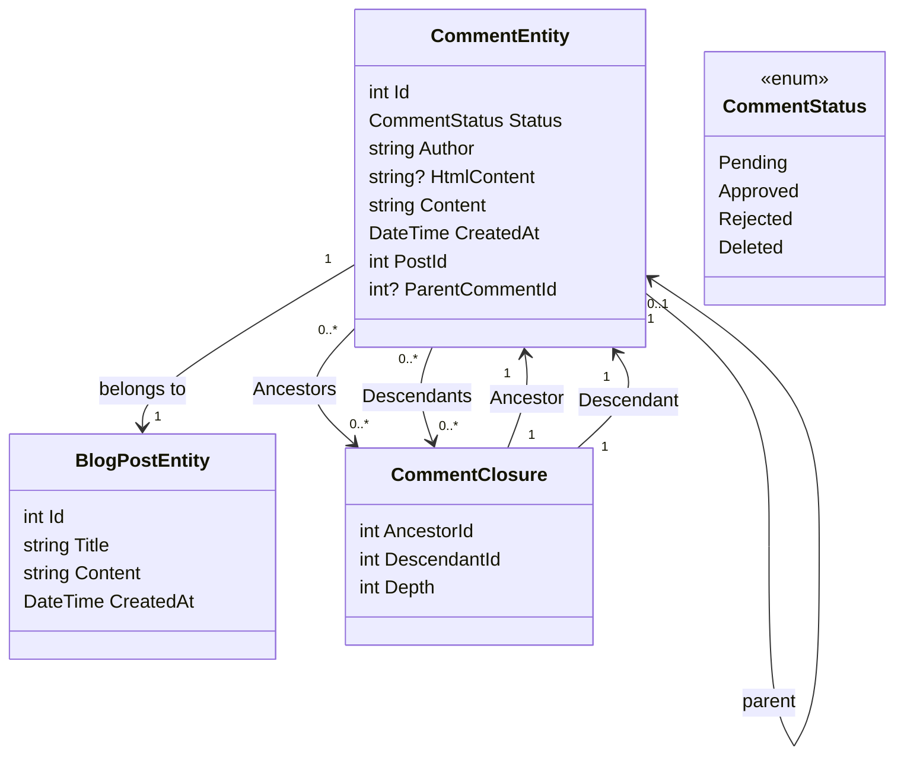

# Ajout d'un système de commentaires Partie 1 - Mise en place de la base de données

<!--category-- Entity Framework  -->
<datetime class="hidden">2024-08-26T11:53</datetime>

## Présentation

Un des aspects clés d'un site de blogs comme celui-ci est un système de commentaires. J'ai donc décidé d'en construire un. C'est la première partie d'une série de messages sur la façon de construire un système de commentaires. Dans ce billet, je vais mettre en place la base de données.

[TOC]

## Mise en place de la base de données

Comme pour le reste du site, j'utilise Postgres pour les blogs; pour commencer, j'utilise des requêtes récursives pour stocker les commentaires. Je n'aime pas cela intensément, mais il nous fait sortir de la porte avec un système de commentaires filetés (et je n'ai pas beaucoup de trafic, donc ce n'est pas une grosse affaire). Je vais passer à un système plus efficace à l'avenir.

### Le contexte de l'EE

Dans le système actuel, nous utilisons une « Clôture des commentaires » pour définir les relations entre les commentaires - afin que je puisse soutenir les commentaires threaded. Notre diagramme de classe ressemble à ceci :



Vous pouvez voir ici que chaque `CommentEntity` a une `PostId` pour le poste auquel il est attaché, et un `ParentCommentId` pour le commentaire il est joint à (le cas échéant). Les `CommentClosure` table est utilisé pour stocker les relations entre les commentaires.

### Le service des commentaires

Les `CommentService` est responsable de la gestion des commentaires. Il a des méthodes pour ajouter, approuver, rejeter et supprimer les commentaires. Il a également des méthodes pour obtenir des commentaires pour un article, et obtenir des commentaires pour un commentaire.

Notre interface pour ce service ressemble à ceci :

```csharp
public interface ICommentService
{
    Task<string> Add( int postId, int? parentCommentId, string author, string content);
    Task<List<CommentEntity>> GetForPost(int blogPostId, int page = 1, int pageSize = 10, int? maxDepth = null, CommentStatus? status = null);
    Task<List<CommentEntity>> GetDescendants(int commentId, int maxDepth = 0);

     Task<CommentEntity> Get(int commentId);
    Task<List<CommentEntity>> GetAncestors(int commentId);
    Task Delete(int commentId);
    Task Reject(int commentId);
    Task Approve(int commentId);
}
```

#### La méthode d'ajout

Notre méthode Add résume la structure de ce système de commentaires.

Il commence d'abord une nouvelle transaction; pour ceux qui ne connaissent pas les transactions, il s'agit d'un moyen de s'assurer qu'un groupe d'opérations est traité comme une seule unité de travail. Si l'une des opérations échoue, la transaction peut être reportée, et tous les changements sont annulés. C'est important lorsque vous avez plusieurs opérations qui doivent être effectuées ensemble, et vous voulez vous assurer qu'elles réussissent ou échouent toutes ensemble.

Il analyse ensuite le texte de commentaire de Markdown à HTML en utilisant la bibliothèque Markdig. C'est une façon simple de permettre aux utilisateurs de formater leurs commentaires en utilisant Markdown.

Ensuite, il crée l'entité et l'enregistre dans la base de données.

Cela se fait en deux étapes - d'abord le commentaire est enregistré, puis la fermeture du commentaire est enregistrée. C'est parce que le commentaire doit être sauvegardé pour générer l'Id, qui est utilisé dans la fermeture.

Nous construisons ensuite la hiérarchie de `CommentClosures` qui définissent les relations entre les commentaires. Nous commençons par une entrée de fermeture autoréférencée, puis s'il y a un commentaire parent, nous allons chercher tous les ancêtres du commentaire parent et les ajouter au nouveau commentaire. Nous ajoutons ensuite une relation parent-enfant directe.

Enfin, nous commettons la transaction. Si l'une des opérations échoue, la transaction est reportée.

```csharp
 public async Task<string> Add(int postId, int? parentCommentId, string author, string content)
  {
      await using var transaction = await context.Database.BeginTransactionAsync();
      try
      {
         var html = Markdig.Markdown.ToHtml(content);
          // Create the new comment
          var newComment = new CommentEntity()
          {
              HtmlContent = html,
              Content = content,
              CreatedAt = DateTime.UtcNow,
              PostId = postId,
              Author = author,
              Status = CommentStatus.Pending,
              ParentCommentId = parentCommentId
          };
            
          context.Comments.Add(newComment);
          await context.SaveChangesAsync();
          logger.LogInformation("Saved comment to DB");// Save to generate the new comment's Id

          // Insert into CommentClosure table
          var commentClosures = new List<CommentClosure>();

          // Self-referencing closure entry
          commentClosures.Add(new CommentClosure
          {
              AncestorId = newComment.Id,
              DescendantId = newComment.Id,
              Depth = 0
          });

          // If there is a parent comment, insert the ancestor relationships
          if (parentCommentId.HasValue)
          {
              // Fetch all ancestors of the parent comment
              var parentAncestors = await context.CommentClosures
                  .Where(cc => cc.DescendantId == parentCommentId.Value)
                  .ToListAsync();

              // Add ancestor relationships for the new comment
              foreach (var ancestor in parentAncestors)
              {
                  commentClosures.Add(new CommentClosure
                  {
                      AncestorId = ancestor.AncestorId,
                      DescendantId = newComment.Id,
                      Depth = ancestor.Depth + 1
                  });
              }

              // Add a direct parent-child relationship
              commentClosures.Add(new CommentClosure
              {
                  AncestorId = parentCommentId.Value,
                  DescendantId = newComment.Id,
                  Depth = 1
              });
          }

          context.CommentClosures.AddRange(commentClosures);
          await context.SaveChangesAsync();
          logger.LogInformation("Saved comment closure to DB");

          // Commit transaction
          await transaction.CommitAsync();
          return html;
      }
      catch (Exception e)
      {
          // Rollback transaction in case of failure
          await transaction.RollbackAsync();
          logger.LogError(e, "Failed to save comment to DB");
      }

      return string.Empty;
  }

```

#### La méthode GetForPost

On ne couvrira pas tout, mais `Add` et `Get` sont nos principales opérations CRUD pour ce service.

Comme vous pouvez le voir, nous avons la recherche basée sur le commentaire de haut niveau. Nous avons aussi une `maxDepth` paramètre qui nous permet de limiter la profondeur de l'arbre de commentaires. Ceci est utile si nous voulons seulement montrer les commentaires de haut niveau, ou si nous voulons limiter la profondeur de l'arbre pour améliorer les performances.

Inlassablement avec cette approche récursive, nous devons appliquer le filtre de profondeur après avoir récupéré les commentaires, car nous ne pouvons pas le faire dans la requête. C'est parce que la profondeur d'un commentaire est déterminée par le nombre d'ancêtres qu'il a, et nous ne pouvons pas facilement l'interroger dans SQL.

```csharp
  public async Task<List<CommentEntity>> GetForPost(int blogPostId, int page = 1, int pageSize = 10, int? maxDepth = null, CommentStatus? status = null)
  {
      // Step 1: Query the top-level comments for the specified blog post
      var query = context.Comments
          .Where(c => c.PostId == blogPostId)
          .OrderByDescending(c => c.CreatedAt)
          .Skip((page - 1) * pageSize)
          .Take(pageSize);

      // Step 2: Filter by status if provided
      if (status.HasValue)
      {
          query = query.Where(c => c.Status == status.Value);
      }

      var topLevelComments = await query
          .Include(c => c.ParentComment)
          .Include(d=>d.Descendants)
          .ToListAsync();

      // Step 4: Filter descendants based on the maxDepth
      foreach (var comment in topLevelComments)
      {
          if (maxDepth != null)
          {
              FilterDescendantsByDepth(comment, 0, maxDepth.Value);
          }
      }

      return topLevelComments;
  }

// Recursive helper method to limit the descendants based on the specified depth
  private void FilterDescendantsByDepth(CommentEntity comment, int currentDepth, int maxDepth)
  {
      if (currentDepth >= maxDepth)
      {
          // If the max depth is reached or there are no descendants, stop recursion
          comment.Descendants = new List<CommentClosure>();  // Clear further descendants beyond maxDepth
          return;
      }

      foreach (var closure in comment.Descendants.ToList())  // Iterate over a copy to prevent modification during iteration
      {
          FilterDescendantsByDepth(closure.Descendant, currentDepth + 1, maxDepth);
      }
  }

```

## En conclusion

Il s'agit d'un simple système de commentaires threaded qui utilise des requêtes récursives pour stocker les relations entre les commentaires. Ce n'est pas le système le plus efficace, mais c'est simple et ça marche. À l'avenir, je couvrirai les aspects avant de ce système, beaucoup de HTMX, Alpine.js et Tailwind CSS.

D'ici là, n'hésitez pas à laisser un commentaire ci-dessous!