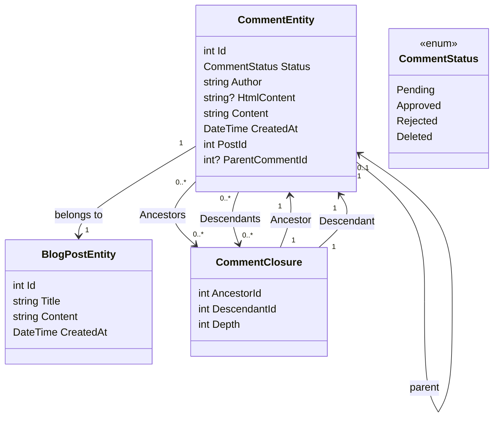

# एक टिप्पणी तंत्र पार्ट 1 - डाटाबेस का विन्यास जोड़ा

<!--category-- Entity Framework  -->
<datetime class="hidden">2024- 0. 2626टी11: 53</datetime>

## परिचय

ब्लॉगिंग साइट के एक मुख्य पहलू इस तरह के एक टिप्पणी तंत्र है। तो, मैं एक निर्माण करने का फैसला किया. यह एक टिप्पणी प्रणाली का निर्माण करने के बारे में पोस्टों का पहला भाग है । इस पोस्ट में, मैं डाटाबेस को स्थापित किया जाएगा.

[विषय

## डाटाबेस विन्यास किया जा रहा है

इस साइट के साथ मैं ब्लॉग्स का उपयोग कर रहा हूँ के लिए पोस्ट आइआरआईएस का उपयोग कर रहा हूँ, के साथ प्रारंभ करने के लिए मैं एक पुनरावर्ती घटना का इस्तेमाल कर रहा हूँ टिप्पणी जमा करने के लिए. मुझे यह बहुत अप्रिय लगता है, लेकिन यह हमें फाटक से बाहर हो जाता है एक थ्रेडेड टिप्पणी प्रणाली के साथ (और मैं ज्यादा यातायात नहीं है), तो यह एक बड़ा सौदा नहीं है. मैं भविष्य में एक अधिक कुशल प्रणाली के लिए आगे बढ़ रहा हूँ.

### EF संदर्भ

मौजूदा प्रणाली में हम एक 'Colooliz' का उपयोग कर सकते हैं टिप्पणी के बीच के रिश्ता को परिभाषित करने के लिए - तो मैं मौजूदा टिप्पणी को समर्थन दे सकते हैं. हमारी क्लास आरेख इस तरह दिखता है:



आप यहाँ देख सकते हैं कि हर कोई `CommentEntity` एक है `PostId` पोस्ट के लिए यह संलग्न है, और एक के लिए `ParentCommentId` टिप्पणी के लिए यह संलग्न है (यदि कोई हो). वह `CommentClosure` तालिका टिप्पणी के बीच संबंध रखने के लिए प्रयोग में लिया जाता है.

### टिप्पणी सेवा

वह `CommentService` जवाब देने के लिए ज़िम्मेदार है । इसमें और भी कई तरीके हैं, जिनसे लोगों को फायदा होता है । इसके अलावा, एक पोस्ट के लिए टिप्पणी करने के लिए भी तरीक़े हैं, और टिप्पणी के लिए टिप्पणियाँ हो रही हैं ।

इस सेवा के लिए हमारे इंटरफेस इस तरह दिखता है:

```csharp
public interface ICommentService
{
    Task<string> Add( int postId, int? parentCommentId, string author, string content);
    Task<List<CommentEntity>> GetForPost(int blogPostId, int page = 1, int pageSize = 10, int? maxDepth = null, CommentStatus? status = null);
    Task<List<CommentEntity>> GetDescendants(int commentId, int maxDepth = 0);

     Task<CommentEntity> Get(int commentId);
    Task<List<CommentEntity>> GetAncestors(int commentId);
    Task Delete(int commentId);
    Task Reject(int commentId);
    Task Approve(int commentId);
}
```

#### जोड़ने की विधि

हमारा तरीका इस टिप्पणी तंत्र का निर्माण करता है ।

यह पहले एक नया व्यापार शुरू होता है; क्योंकि जो परिचित नहीं हैं, उन्हें यह निश्‍चित करने का एक तरीक़ा है कि ऑपरेशन के एक समूह के तौर पर कार्य किया जाता है । अगर कोई ऑपरेशन असफल हो जाए, तो लेन - देन को वापस फेंक दिया जा सकता है, और सभी परिवर्तन नष्ट हो जाते हैं । यह तब महत्त्वपूर्ण है जब आपके पास अनेक ऑपरेशन हैं जिन्हें एकसाथ करने की ज़रूरत है, और आप निश्‍चित करना चाहते हैं कि वे सभी सफल हों या असफल हों ।

यह तब टिप्पणी पाठ की व्याख्या करता है मरकुस नीचे से एचटीएमएल में चिह्नित किए गए लाइब्रेरी के प्रयोग से. यह एक सरल तरीका है कि उपयोगकर्ता को मार्क नीचे के प्रयोग से उनकी टिप्पणियों को फॉर्मेट करने दें ।

अगला यह एंटिटी पैदा करता है तथा इसे डाटाबेस में सहेजता है.

यह दो चरणों में किया जाता है - पहले टिप्पणी को बचाया जाता है, फिर टिप्पणी को बचाया जाता है । यह इसलिए है क्योंकि टिप्पणी को ईडी बनाने के लिए बचाया जाना चाहिए, जो कि गर्भ में प्रयोग किया जाता है ।

हम अगले पदक्रम का निर्माण `CommentClosures` जो टिप्पणी के बीच सम्बन्धों को परिभाषित करता है. हम एक खुद के साथ प्रवेश के साथ शुरू करते हैं, तो अगर एक जनक टिप्पणी है हम जनक टिप्पणी के सभी पूर्वजों को लाने और उन्हें नए टिप्पणी के लिए जोड़ें। फिर हम एक सीधे माता पिता के संबंध में जोड़ देते हैं।

अंत में, हम व्यापार करते हैं. अगर कोई ऑपरेशन असफल हो जाए, तो ट्रांजेक्शन वापस चला जाता है ।

```csharp
 public async Task<string> Add(int postId, int? parentCommentId, string author, string content)
  {
      await using var transaction = await context.Database.BeginTransactionAsync();
      try
      {
         var html = Markdig.Markdown.ToHtml(content);
          // Create the new comment
          var newComment = new CommentEntity()
          {
              HtmlContent = html,
              Content = content,
              CreatedAt = DateTime.UtcNow,
              PostId = postId,
              Author = author,
              Status = CommentStatus.Pending,
              ParentCommentId = parentCommentId
          };
            
          context.Comments.Add(newComment);
          await context.SaveChangesAsync();
          logger.LogInformation("Saved comment to DB");// Save to generate the new comment's Id

          // Insert into CommentClosure table
          var commentClosures = new List<CommentClosure>();

          // Self-referencing closure entry
          commentClosures.Add(new CommentClosure
          {
              AncestorId = newComment.Id,
              DescendantId = newComment.Id,
              Depth = 0
          });

          // If there is a parent comment, insert the ancestor relationships
          if (parentCommentId.HasValue)
          {
              // Fetch all ancestors of the parent comment
              var parentAncestors = await context.CommentClosures
                  .Where(cc => cc.DescendantId == parentCommentId.Value)
                  .ToListAsync();

              // Add ancestor relationships for the new comment
              foreach (var ancestor in parentAncestors)
              {
                  commentClosures.Add(new CommentClosure
                  {
                      AncestorId = ancestor.AncestorId,
                      DescendantId = newComment.Id,
                      Depth = ancestor.Depth + 1
                  });
              }

              // Add a direct parent-child relationship
              commentClosures.Add(new CommentClosure
              {
                  AncestorId = parentCommentId.Value,
                  DescendantId = newComment.Id,
                  Depth = 1
              });
          }

          context.CommentClosures.AddRange(commentClosures);
          await context.SaveChangesAsync();
          logger.LogInformation("Saved comment closure to DB");

          // Commit transaction
          await transaction.CommitAsync();
          return html;
      }
      catch (Exception e)
      {
          // Rollback transaction in case of failure
          await transaction.RollbackAsync();
          logger.LogError(e, "Failed to save comment to DB");
      }

      return string.Empty;
  }

```

#### प्रेषित विधि के लिए जाओ

हम पूरी बात को कवर नहीं करेंगे लेकिन `Add` और `Get` इस सेवा के लिए हमारा मुख्य दोषी ऑपरेशन हैं.

जैसा कि आप देख सकते हैं हम शीर्ष स्तर टिप्पणी पर आधारित panceing है. हमारे पास भी है `maxDepth` पैरामीटर जो हमें टिप्पणी ट्री की गहराई को कम करने देता है. यह उपयोगी है यदि हम शीर्ष- स्तर- स्तर टिप्पणी दिखाने के लिए चाहते हैं, या यदि हम ट्री की गहराई को प्रदर्शित करने के लिए कम करना चाहते हैं.

इस पुनरावर्ती दृष्टिकोण के साथ स्पष्ट रूप से हम टिप्पणी लेने के बाद गहराई फ़िल्टर लागू करने की जरूरत है, के रूप में हम इसे प्रश्न में नहीं कर सकते. यह इस कारण है कि एक टिप्पणी की गहराई यह पूर्वजों की संख्या से निर्धारित की जाती है, और हम आसानी से एसक्यूएल में इस प्रश्न को आसानी से नहीं पूछ सकते.

```csharp
  public async Task<List<CommentEntity>> GetForPost(int blogPostId, int page = 1, int pageSize = 10, int? maxDepth = null, CommentStatus? status = null)
  {
      // Step 1: Query the top-level comments for the specified blog post
      var query = context.Comments
          .Where(c => c.PostId == blogPostId)
          .OrderByDescending(c => c.CreatedAt)
          .Skip((page - 1) * pageSize)
          .Take(pageSize);

      // Step 2: Filter by status if provided
      if (status.HasValue)
      {
          query = query.Where(c => c.Status == status.Value);
      }

      var topLevelComments = await query
          .Include(c => c.ParentComment)
          .Include(d=>d.Descendants)
          .ToListAsync();

      // Step 4: Filter descendants based on the maxDepth
      foreach (var comment in topLevelComments)
      {
          if (maxDepth != null)
          {
              FilterDescendantsByDepth(comment, 0, maxDepth.Value);
          }
      }

      return topLevelComments;
  }

// Recursive helper method to limit the descendants based on the specified depth
  private void FilterDescendantsByDepth(CommentEntity comment, int currentDepth, int maxDepth)
  {
      if (currentDepth >= maxDepth)
      {
          // If the max depth is reached or there are no descendants, stop recursion
          comment.Descendants = new List<CommentClosure>();  // Clear further descendants beyond maxDepth
          return;
      }

      foreach (var closure in comment.Descendants.ToList())  // Iterate over a copy to prevent modification during iteration
      {
          FilterDescendantsByDepth(closure.Descendant, currentDepth + 1, maxDepth);
      }
  }

```

## ऑन्टियम

यह एक साधारण स्टाइल युक्त टिप्पणी तंत्र है जो प्रत्येक प्रविष्टि का प्रयोग करता है कि टिप्पणी के बीच संबंध रखने के लिए. यह सबसे कुशल प्रणाली नहीं है, लेकिन यह सरल है और यह काम करता है. भविष्य में, मैं इस व्यवस्था के सामने के अंत के पहलुओं को कवर करूँगा; HMMMX, Ajs.js, और laypy सीएसएस.

तब तक, नीचे जवाब देने के लिए स्वतंत्र महसूस कीजिए!