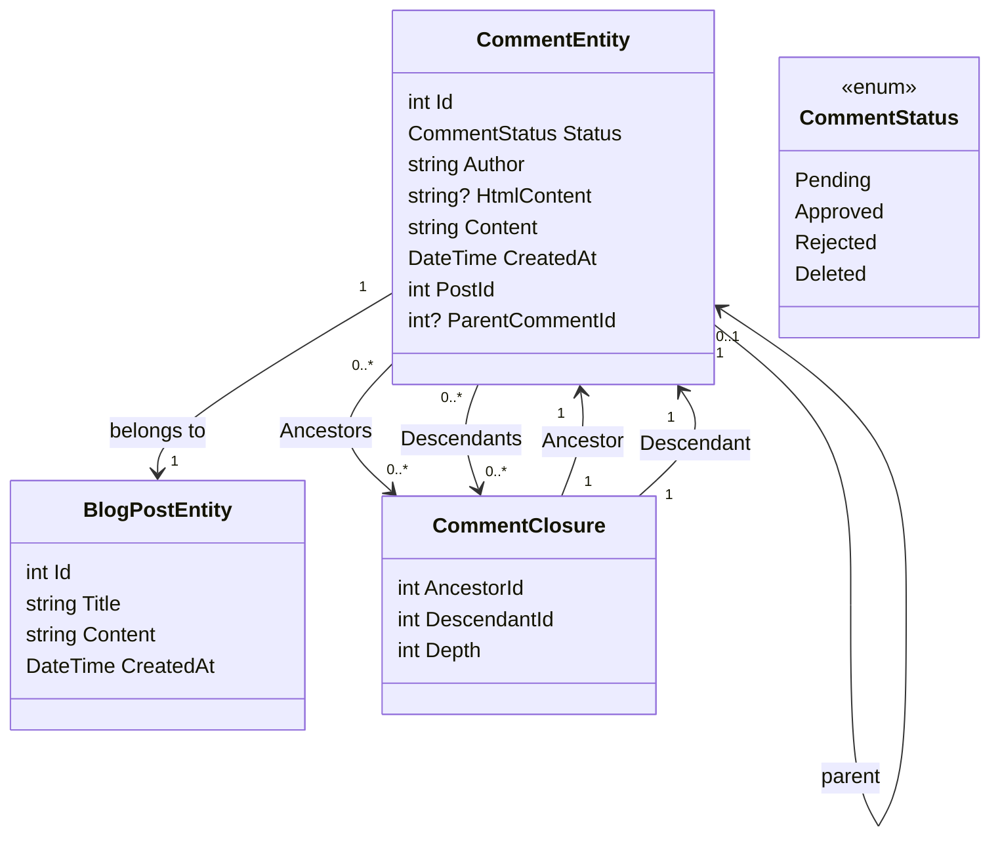

# Aggiunta del sistema di commento Parte 1 - Impostazione del database

<!--category-- Entity Framework  -->
<datetime class="hidden">2024-08-26T11:53</datetime>

## Introduzione

Uno degli aspetti chiave di un sito di blogging come questo è un sistema di commenti. Cosi' ho deciso di costruirne uno. Questa è la prima parte di una serie di post su come costruire un sistema di commenti. In questo post, organizzero' il database.

[TOC]

## Creazione della banca dati

Come per il resto del sito sto usando Postgres per i blog; per cominciare sto usando query ricorsive per memorizzare i commenti. Non mi piace molto, ma ci porta fuori dal cancello con un sistema di commenti filettato (e non ho molto traffico, quindi non è un grosso problema). Mi trasferiro' in un sistema piu' efficiente in futuro.

### Contesto dell'impronta ambientale

Nel sistema attuale usiamo una 'Chiusura Commento' per definire i rapporti tra i commenti - in modo da poter supportare i commenti filettati. Il nostro diagramma di classe assomiglia a questo:



Potete vedere qui che ogni `CommentEntity` ha un `PostId` per il post a cui è collegato, e un `ParentCommentId` per il commento è allegato a (se presente). La `CommentClosure` tabella è utilizzata per memorizzare le relazioni tra i commenti.

### Il servizio commenti

La `CommentService` è responsabile della gestione dei commenti. Dispone di metodi per aggiungere, approvare, respingere e cancellare i commenti. Ha anche metodi per ottenere commenti per un post, e ottenere commenti per un commento.

La nostra interfaccia per questo servizio è così:

```csharp
public interface ICommentService
{
    Task<string> Add( int postId, int? parentCommentId, string author, string content);
    Task<List<CommentEntity>> GetForPost(int blogPostId, int page = 1, int pageSize = 10, int? maxDepth = null, CommentStatus? status = null);
    Task<List<CommentEntity>> GetDescendants(int commentId, int maxDepth = 0);

     Task<CommentEntity> Get(int commentId);
    Task<List<CommentEntity>> GetAncestors(int commentId);
    Task Delete(int commentId);
    Task Reject(int commentId);
    Task Approve(int commentId);
}
```

#### Il metodo Aggiungi

Il nostro metodo Aggiungi riassume la struttura di questo sistema di commenti.

Inizia prima una nuova transazione; per coloro che non hanno familiarità transazioni sono un modo per garantire che un gruppo di operazioni sono trattati come un'unica unità di lavoro. Se una qualsiasi delle operazioni fallisce, la transazione può essere ribaltata, e tutte le modifiche sono annullate. Questo è importante quando si hanno più operazioni che devono essere fatte insieme, e si vuole garantire che tutti abbiano successo o fallire insieme.

Poi analizza il testo del commento da Markdown in HTML usando la libreria Markdig. Questo è un modo semplice per consentire agli utenti di formattare i propri commenti utilizzando Markdown.

Poi crea l'entità e la salva nel database.

Questo viene fatto in due fasi - prima il commento viene salvato, poi la chiusura del commento viene salvata. Questo perché il commento deve essere salvato per generare l'Id, che viene utilizzato nella chiusura.

Costruiamo la gerarchia di `CommentClosures` che definiscono i rapporti tra i commenti. Iniziamo con un'entrata di chiusura auto-referenziata, quindi se c'è un commento dei genitori prendiamo tutti gli antenati del commento dei genitori e li aggiungiamo al nuovo commento. Poi aggiungiamo un rapporto diretto genitori-figli.

Finalmente commettiamo la transazione. Se una delle operazioni fallisce, la transazione viene rimandata indietro.

```csharp
 public async Task<string> Add(int postId, int? parentCommentId, string author, string content)
  {
      await using var transaction = await context.Database.BeginTransactionAsync();
      try
      {
         var html = Markdig.Markdown.ToHtml(content);
          // Create the new comment
          var newComment = new CommentEntity()
          {
              HtmlContent = html,
              Content = content,
              CreatedAt = DateTime.UtcNow,
              PostId = postId,
              Author = author,
              Status = CommentStatus.Pending,
              ParentCommentId = parentCommentId
          };
            
          context.Comments.Add(newComment);
          await context.SaveChangesAsync();
          logger.LogInformation("Saved comment to DB");// Save to generate the new comment's Id

          // Insert into CommentClosure table
          var commentClosures = new List<CommentClosure>();

          // Self-referencing closure entry
          commentClosures.Add(new CommentClosure
          {
              AncestorId = newComment.Id,
              DescendantId = newComment.Id,
              Depth = 0
          });

          // If there is a parent comment, insert the ancestor relationships
          if (parentCommentId.HasValue)
          {
              // Fetch all ancestors of the parent comment
              var parentAncestors = await context.CommentClosures
                  .Where(cc => cc.DescendantId == parentCommentId.Value)
                  .ToListAsync();

              // Add ancestor relationships for the new comment
              foreach (var ancestor in parentAncestors)
              {
                  commentClosures.Add(new CommentClosure
                  {
                      AncestorId = ancestor.AncestorId,
                      DescendantId = newComment.Id,
                      Depth = ancestor.Depth + 1
                  });
              }

              // Add a direct parent-child relationship
              commentClosures.Add(new CommentClosure
              {
                  AncestorId = parentCommentId.Value,
                  DescendantId = newComment.Id,
                  Depth = 1
              });
          }

          context.CommentClosures.AddRange(commentClosures);
          await context.SaveChangesAsync();
          logger.LogInformation("Saved comment closure to DB");

          // Commit transaction
          await transaction.CommitAsync();
          return html;
      }
      catch (Exception e)
      {
          // Rollback transaction in case of failure
          await transaction.RollbackAsync();
          logger.LogError(e, "Failed to save comment to DB");
      }

      return string.Empty;
  }

```

#### Il metodo GetForPost

Non copriremo tutto, ma... `Add` e `Get` sono le nostre principali operazioni CRUD per questo servizio.

Come potete vedere abbiamo paging basato sul commento di primo livello. Abbiamo anche un `maxDepth` parametro che ci permette di limitare la profondità dell'albero dei commenti. Questo è utile se vogliamo solo mostrare i commenti di alto livello, o se vogliamo limitare la profondità dell'albero per migliorare le prestazioni.

Purtroppo con questo approccio ricorsivo dobbiamo applicare il filtro di profondità dopo aver preso i commenti, perché non possiamo farlo nella query. Questo perché la profondità di un commento è determinata dal numero di antenati che ha, e non possiamo interrogarlo facilmente in SQL.

```csharp
  public async Task<List<CommentEntity>> GetForPost(int blogPostId, int page = 1, int pageSize = 10, int? maxDepth = null, CommentStatus? status = null)
  {
      // Step 1: Query the top-level comments for the specified blog post
      var query = context.Comments
          .Where(c => c.PostId == blogPostId)
          .OrderByDescending(c => c.CreatedAt)
          .Skip((page - 1) * pageSize)
          .Take(pageSize);

      // Step 2: Filter by status if provided
      if (status.HasValue)
      {
          query = query.Where(c => c.Status == status.Value);
      }

      var topLevelComments = await query
          .Include(c => c.ParentComment)
          .Include(d=>d.Descendants)
          .ToListAsync();

      // Step 4: Filter descendants based on the maxDepth
      foreach (var comment in topLevelComments)
      {
          if (maxDepth != null)
          {
              FilterDescendantsByDepth(comment, 0, maxDepth.Value);
          }
      }

      return topLevelComments;
  }

// Recursive helper method to limit the descendants based on the specified depth
  private void FilterDescendantsByDepth(CommentEntity comment, int currentDepth, int maxDepth)
  {
      if (currentDepth >= maxDepth)
      {
          // If the max depth is reached or there are no descendants, stop recursion
          comment.Descendants = new List<CommentClosure>();  // Clear further descendants beyond maxDepth
          return;
      }

      foreach (var closure in comment.Descendants.ToList())  // Iterate over a copy to prevent modification during iteration
      {
          FilterDescendantsByDepth(closure.Descendant, currentDepth + 1, maxDepth);
      }
  }

```

## In conclusione

Questo è un semplice sistema di commenti filettato che utilizza query ricorsive per memorizzare le relazioni tra i commenti. Non è il sistema più efficiente, ma è semplice e funziona. In futuro, coprirò gli aspetti front end di questo sistema; un sacco di HTMX, Alpine.js, e Tailwind CSS.

Fino ad allora, sentitevi liberi di lasciare un commento qui sotto!