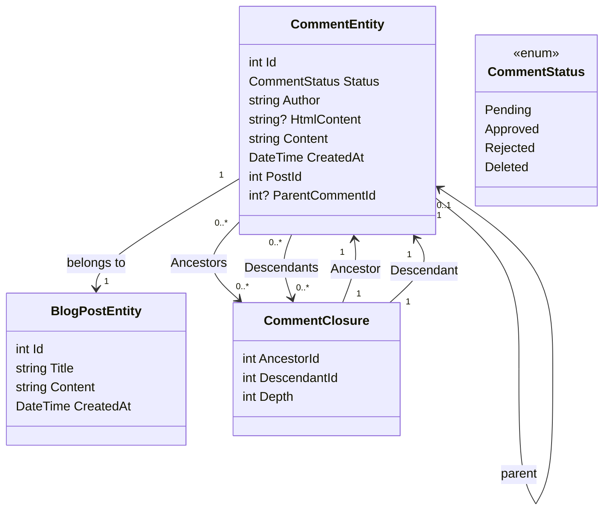

# Het toevoegen van een commentaarsysteem Deel 1 - Het opzetten van de database

<!--category-- Entity Framework  -->
<datetime class="hidden">2024-08-26T11:53</datetime>

## Inleiding

Een van de belangrijkste aspecten van een blogging site zoals dit is een commentaar systeem. Dus besloot ik er een te bouwen. Dit is het eerste deel van een reeks berichten over hoe een commentaarsysteem te bouwen. In deze post, zal ik het opzetten van de database.

[TOC]

## Het opzetten van de database

Net als bij de rest van de site gebruik ik Postgres voor de blogs; om te beginnen gebruik ik recursieve queries om de reacties op te slaan. Ik vind dit intens niet leuk, maar het haalt ons uit de gate met een draadloos commentaarsysteem (en ik heb niet veel verkeer, dus het is niet zo erg). Ik verhuis naar een efficiënter systeem in de toekomst.

### De EF-context

In het huidige systeem gebruiken we een 'Comment Closing' om de relaties tussen commentaren te definiëren - dus ik kan draadloze opmerkingen ondersteunen. Onze klasse diagram ziet er als volgt uit:



U kunt hier zien dat elk `CommentEntity` heeft een `PostId` voor de functie waaraan het is verbonden, en een `ParentCommentId` voor het commentaar waaraan het is gehecht (indien van toepassing). De `CommentClosure` tabel wordt gebruikt om de relaties tussen opmerkingen op te slaan.

### The CommentService

De `CommentService` is verantwoordelijk voor het beheer van opmerkingen. Het bevat methoden om opmerkingen toe te voegen, goed te keuren, te verwerpen en te schrappen. Het heeft ook methoden voor het krijgen van opmerkingen voor een post, en het krijgen van opmerkingen voor een reactie.

Onze interface voor deze service ziet er als volgt uit:

```csharp
public interface ICommentService
{
    Task<string> Add( int postId, int? parentCommentId, string author, string content);
    Task<List<CommentEntity>> GetForPost(int blogPostId, int page = 1, int pageSize = 10, int? maxDepth = null, CommentStatus? status = null);
    Task<List<CommentEntity>> GetDescendants(int commentId, int maxDepth = 0);

     Task<CommentEntity> Get(int commentId);
    Task<List<CommentEntity>> GetAncestors(int commentId);
    Task Delete(int commentId);
    Task Reject(int commentId);
    Task Approve(int commentId);
}
```

#### De methode toevoegen

Onze Toevoegen methode vat de structuur van dit commentaarsysteem samen.

Het start eerst een nieuwe transactie; voor degenen die niet vertrouwde transacties zijn een manier om ervoor te zorgen dat een groep van operaties worden behandeld als een enkele eenheid van het werk. Als een van de operaties mislukt, kan de transactie worden teruggedraaid, en alle wijzigingen worden ongedaan gemaakt. Dit is belangrijk wanneer u meerdere operaties die moeten worden gedaan samen, en je wilt ervoor zorgen dat ze allemaal slagen of falen samen.

Het ontleedt vervolgens de commentaartekst van Markdown naar HTML met behulp van de Markdig-bibliotheek. Dit is een eenvoudige manier om gebruikers in staat te stellen hun opmerkingen te formatteren met Markdown.

Vervolgens creëert het de entiteit en slaat dat op in de database.

Dit gebeurt in twee stappen - eerst wordt het commentaar opgeslagen, dan wordt het commentaar gesloten. Dit komt omdat de opmerking moet worden opgeslagen om het Id te genereren, dat wordt gebruikt in de sluiting.

Vervolgens bouwen we de hiërarchie van `CommentClosures` waarin de relatie tussen commentaar en commentaar wordt gedefinieerd. We beginnen met een zelfverwijzende sluitingsinvoer, dan als er een oudercommentaar is halen we alle voorouders van de oudercommentaar op en voegen ze toe aan het nieuwe commentaar. Dan voegen we een directe ouder-kind relatie toe.

Eindelijk plegen we de transactie. Als een van de operaties mislukt, wordt de transactie teruggedraaid.

```csharp
 public async Task<string> Add(int postId, int? parentCommentId, string author, string content)
  {
      await using var transaction = await context.Database.BeginTransactionAsync();
      try
      {
         var html = Markdig.Markdown.ToHtml(content);
          // Create the new comment
          var newComment = new CommentEntity()
          {
              HtmlContent = html,
              Content = content,
              CreatedAt = DateTime.UtcNow,
              PostId = postId,
              Author = author,
              Status = CommentStatus.Pending,
              ParentCommentId = parentCommentId
          };
            
          context.Comments.Add(newComment);
          await context.SaveChangesAsync();
          logger.LogInformation("Saved comment to DB");// Save to generate the new comment's Id

          // Insert into CommentClosure table
          var commentClosures = new List<CommentClosure>();

          // Self-referencing closure entry
          commentClosures.Add(new CommentClosure
          {
              AncestorId = newComment.Id,
              DescendantId = newComment.Id,
              Depth = 0
          });

          // If there is a parent comment, insert the ancestor relationships
          if (parentCommentId.HasValue)
          {
              // Fetch all ancestors of the parent comment
              var parentAncestors = await context.CommentClosures
                  .Where(cc => cc.DescendantId == parentCommentId.Value)
                  .ToListAsync();

              // Add ancestor relationships for the new comment
              foreach (var ancestor in parentAncestors)
              {
                  commentClosures.Add(new CommentClosure
                  {
                      AncestorId = ancestor.AncestorId,
                      DescendantId = newComment.Id,
                      Depth = ancestor.Depth + 1
                  });
              }

              // Add a direct parent-child relationship
              commentClosures.Add(new CommentClosure
              {
                  AncestorId = parentCommentId.Value,
                  DescendantId = newComment.Id,
                  Depth = 1
              });
          }

          context.CommentClosures.AddRange(commentClosures);
          await context.SaveChangesAsync();
          logger.LogInformation("Saved comment closure to DB");

          // Commit transaction
          await transaction.CommitAsync();
          return html;
      }
      catch (Exception e)
      {
          // Rollback transaction in case of failure
          await transaction.RollbackAsync();
          logger.LogError(e, "Failed to save comment to DB");
      }

      return string.Empty;
  }

```

#### De GetForPost-methode

We dekken niet alles, maar... `Add` en `Get` zijn onze belangrijkste CRUD operaties voor deze dienst.

Zoals u kunt zien hebben we paging op basis van het hoogste niveau commentaar. We hebben ook een `maxDepth` parameter die ons in staat stelt om de diepte van de commentaar boom te beperken. Dit is handig als we alleen de top-level commentaren willen tonen, of als we de diepte van de boom willen beperken om de prestaties te verbeteren.

Onfortuinlijk met deze recursieve aanpak moeten we de dieptefilter toepassen nadat we de commentaren hebben opgehaald, omdat we het niet kunnen doen in de query. Dit komt omdat de diepte van een commentaar wordt bepaald door het aantal voorouders dat het heeft, en we kunnen dit niet gemakkelijk opvragen in SQL.

```csharp
  public async Task<List<CommentEntity>> GetForPost(int blogPostId, int page = 1, int pageSize = 10, int? maxDepth = null, CommentStatus? status = null)
  {
      // Step 1: Query the top-level comments for the specified blog post
      var query = context.Comments
          .Where(c => c.PostId == blogPostId)
          .OrderByDescending(c => c.CreatedAt)
          .Skip((page - 1) * pageSize)
          .Take(pageSize);

      // Step 2: Filter by status if provided
      if (status.HasValue)
      {
          query = query.Where(c => c.Status == status.Value);
      }

      var topLevelComments = await query
          .Include(c => c.ParentComment)
          .Include(d=>d.Descendants)
          .ToListAsync();

      // Step 4: Filter descendants based on the maxDepth
      foreach (var comment in topLevelComments)
      {
          if (maxDepth != null)
          {
              FilterDescendantsByDepth(comment, 0, maxDepth.Value);
          }
      }

      return topLevelComments;
  }

// Recursive helper method to limit the descendants based on the specified depth
  private void FilterDescendantsByDepth(CommentEntity comment, int currentDepth, int maxDepth)
  {
      if (currentDepth >= maxDepth)
      {
          // If the max depth is reached or there are no descendants, stop recursion
          comment.Descendants = new List<CommentClosure>();  // Clear further descendants beyond maxDepth
          return;
      }

      foreach (var closure in comment.Descendants.ToList())  // Iterate over a copy to prevent modification during iteration
      {
          FilterDescendantsByDepth(closure.Descendant, currentDepth + 1, maxDepth);
      }
  }

```

## Conclusie

Dit is een eenvoudig commentaarsysteem met schroefdraad dat recursieve queries gebruikt om de relaties tussen opmerkingen op te slaan. Het is niet het meest efficiënte systeem, maar het is eenvoudig en het werkt. In de toekomst zal ik de front-end aspecten van dit systeem behandelen; veel HTMX, Alpine.js en Tailwind CSS.

Tot dan, voel je vrij om een reactie hieronder te laten!