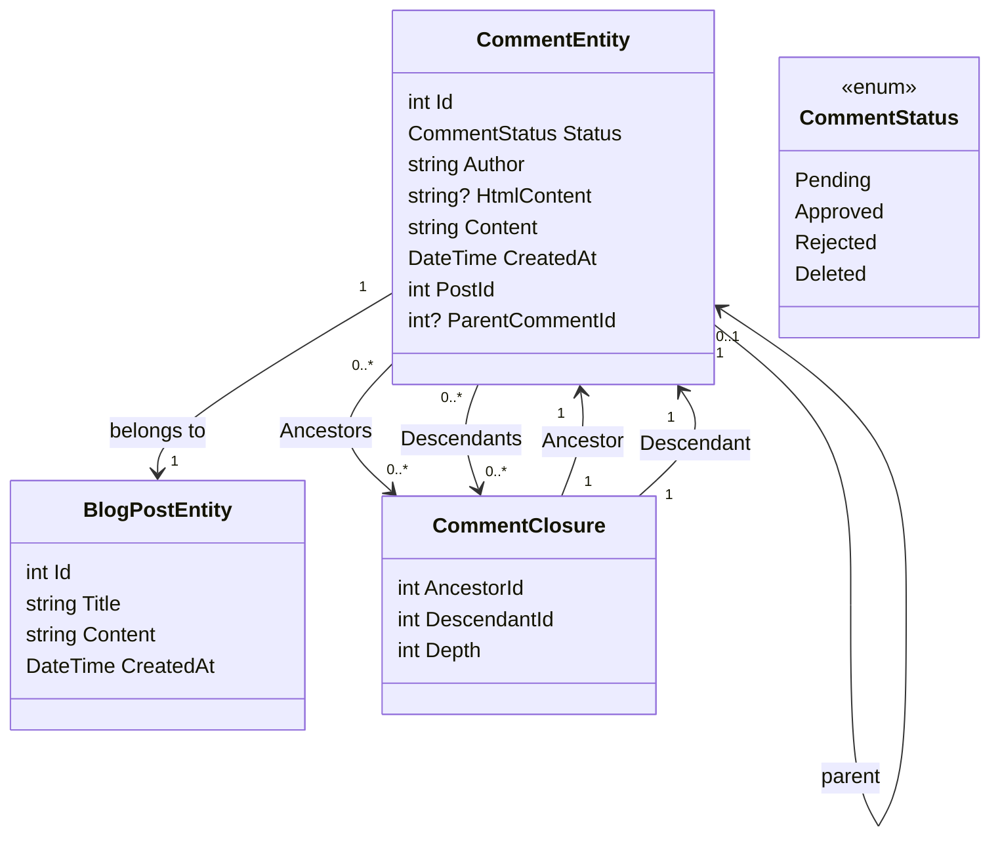

# Lägga till en kommentar System del 1 - Ställa in databasen

<!--category-- Entity Framework  -->
<datetime class="hidden">Förbehåll IIIA-PT-38</datetime>

## Inledning

En av de viktigaste aspekterna av en bloggande webbplats som denna är ett kommentarssystem. Så jag bestämde mig för att bygga en. Detta är den första delen av en serie inlägg om hur man bygger ett kommentarssystem. I det här inlägget kommer jag att upprätta databasen.

[TOC]

## Ställa in databasen

Som med resten av webbplatsen använder jag Postgres för bloggarna; till att börja med använder jag rekursiva frågor för att lagra kommentarerna. Jag ogillar detta intensivt, men det tar oss ut genom porten med ett gängat kommentarsystem (och jag har inte mycket trafik, så det är ingen stor sak). Jag ska gå över till ett effektivare system i framtiden.

### Miljöavtryckets bakgrund

I det nuvarande systemet använder vi en "Comment Closure" för att definiera sambanden mellan kommentarer - så att jag kan stödja gängade kommentarer. Vårt klassdiagram ser ut så här:



Du kan se här att varje `CommentEntity` har en `PostId` för det inlägg det är fäst vid, och en `ParentCommentId` för kommentaren den är fäst vid (om någon). I detta sammanhang är det viktigt att se till att `CommentClosure` Tabellen används för att lagra sambanden mellan kommentarer.

### Kommentarstjänsten

I detta sammanhang är det viktigt att se till att `CommentService` ansvarar för att hantera kommentarer. Den har metoder för att lägga till, godkänna, avvisa och ta bort kommentarer. Det har också metoder för att få kommentarer för ett inlägg, och få kommentarer för en kommentar.

Vårt gränssnitt för denna tjänst ser ut så här:

```csharp
public interface ICommentService
{
    Task<string> Add( int postId, int? parentCommentId, string author, string content);
    Task<List<CommentEntity>> GetForPost(int blogPostId, int page = 1, int pageSize = 10, int? maxDepth = null, CommentStatus? status = null);
    Task<List<CommentEntity>> GetDescendants(int commentId, int maxDepth = 0);

     Task<CommentEntity> Get(int commentId);
    Task<List<CommentEntity>> GetAncestors(int commentId);
    Task Delete(int commentId);
    Task Reject(int commentId);
    Task Approve(int commentId);
}
```

#### Tilläggsmetoden

Vår Add metod sammanfattar strukturen i detta kommentarssystem.

Den inleder först en ny transaktion; för de som inte känner till transaktioner är ett sätt att se till att en grupp av transaktioner behandlas som en enda arbetsenhet. Om någon av transaktionerna misslyckas, kan transaktionen rullas tillbaka, och alla ändringar är ogjorda. Detta är viktigt när ni har flera operationer som behöver göras tillsammans, och ni vill se till att de alla lyckas eller misslyckas tillsammans.

Den tolkar sedan kommentartexten från Markdown till HTML med hjälp av biblioteket Markdig. Detta är ett enkelt sätt att tillåta användare att formatera sina kommentarer med hjälp av Markdown.

Därefter skapar den enheten och sparar det till databasen.

Detta görs i två steg - först sparas kommentaren, sedan sparas kommentarsavslutningen. Detta beror på att kommentaren måste sparas för att generera id, som används i stängningen.

Vi bygger sedan hierarkin av `CommentClosures` som definierar förhållandet mellan kommentarerna. Vi börjar med en själv-referenciering avslutande post, sedan om det finns en förälder kommentar vi hämtar alla förfäder till föräldern kommentar och lägga till dem till den nya kommentaren. Vi lägger sedan till ett direkt förhållande mellan föräldrar och barn.

Slutligen åtar vi oss transaktionen. Om någon av transaktionerna misslyckas, rullas transaktionen tillbaka.

```csharp
 public async Task<string> Add(int postId, int? parentCommentId, string author, string content)
  {
      await using var transaction = await context.Database.BeginTransactionAsync();
      try
      {
         var html = Markdig.Markdown.ToHtml(content);
          // Create the new comment
          var newComment = new CommentEntity()
          {
              HtmlContent = html,
              Content = content,
              CreatedAt = DateTime.UtcNow,
              PostId = postId,
              Author = author,
              Status = CommentStatus.Pending,
              ParentCommentId = parentCommentId
          };
            
          context.Comments.Add(newComment);
          await context.SaveChangesAsync();
          logger.LogInformation("Saved comment to DB");// Save to generate the new comment's Id

          // Insert into CommentClosure table
          var commentClosures = new List<CommentClosure>();

          // Self-referencing closure entry
          commentClosures.Add(new CommentClosure
          {
              AncestorId = newComment.Id,
              DescendantId = newComment.Id,
              Depth = 0
          });

          // If there is a parent comment, insert the ancestor relationships
          if (parentCommentId.HasValue)
          {
              // Fetch all ancestors of the parent comment
              var parentAncestors = await context.CommentClosures
                  .Where(cc => cc.DescendantId == parentCommentId.Value)
                  .ToListAsync();

              // Add ancestor relationships for the new comment
              foreach (var ancestor in parentAncestors)
              {
                  commentClosures.Add(new CommentClosure
                  {
                      AncestorId = ancestor.AncestorId,
                      DescendantId = newComment.Id,
                      Depth = ancestor.Depth + 1
                  });
              }

              // Add a direct parent-child relationship
              commentClosures.Add(new CommentClosure
              {
                  AncestorId = parentCommentId.Value,
                  DescendantId = newComment.Id,
                  Depth = 1
              });
          }

          context.CommentClosures.AddRange(commentClosures);
          await context.SaveChangesAsync();
          logger.LogInformation("Saved comment closure to DB");

          // Commit transaction
          await transaction.CommitAsync();
          return html;
      }
      catch (Exception e)
      {
          // Rollback transaction in case of failure
          await transaction.RollbackAsync();
          logger.LogError(e, "Failed to save comment to DB");
      }

      return string.Empty;
  }

```

#### GetForPost- metoden

Vi kommer inte att täcka hela saken men `Add` och `Get` är vår huvudsakliga CRUD verksamhet för denna tjänst.

Som ni kan se har vi personsökning baserat på toppnivå kommentar. Vi har också en `maxDepth` parameter som gör att vi kan begränsa djupet av kommentarträdet. Detta är användbart om vi bara vill visa de högsta kommentarerna, eller om vi vill begränsa djupet av trädet för att förbättra prestanda.

Tyvärr med denna rekursiva strategi måste vi tillämpa djupfiltret efter att vi har hämtat kommentarerna, eftersom vi inte kan göra det i frågan. Detta beror på att djupet av en kommentar bestäms av antalet förfäder den har, och vi kan inte lätt ifrågasätta detta i SQL.

```csharp
  public async Task<List<CommentEntity>> GetForPost(int blogPostId, int page = 1, int pageSize = 10, int? maxDepth = null, CommentStatus? status = null)
  {
      // Step 1: Query the top-level comments for the specified blog post
      var query = context.Comments
          .Where(c => c.PostId == blogPostId)
          .OrderByDescending(c => c.CreatedAt)
          .Skip((page - 1) * pageSize)
          .Take(pageSize);

      // Step 2: Filter by status if provided
      if (status.HasValue)
      {
          query = query.Where(c => c.Status == status.Value);
      }

      var topLevelComments = await query
          .Include(c => c.ParentComment)
          .Include(d=>d.Descendants)
          .ToListAsync();

      // Step 4: Filter descendants based on the maxDepth
      foreach (var comment in topLevelComments)
      {
          if (maxDepth != null)
          {
              FilterDescendantsByDepth(comment, 0, maxDepth.Value);
          }
      }

      return topLevelComments;
  }

// Recursive helper method to limit the descendants based on the specified depth
  private void FilterDescendantsByDepth(CommentEntity comment, int currentDepth, int maxDepth)
  {
      if (currentDepth >= maxDepth)
      {
          // If the max depth is reached or there are no descendants, stop recursion
          comment.Descendants = new List<CommentClosure>();  // Clear further descendants beyond maxDepth
          return;
      }

      foreach (var closure in comment.Descendants.ToList())  // Iterate over a copy to prevent modification during iteration
      {
          FilterDescendantsByDepth(closure.Descendant, currentDepth + 1, maxDepth);
      }
  }

```

## Slutsatser

Detta är ett enkelt gängat kommentarsystem som använder rekursiva frågor för att lagra sambanden mellan kommentarer. Det är inte det mest effektiva systemet, men det är enkelt och fungerar. I framtiden ska jag täcka de främre delarna av detta system; massor av HTMX, Alpine.js, och Tailwind CSS.

Tills dess, lämna gärna en kommentar nedan!