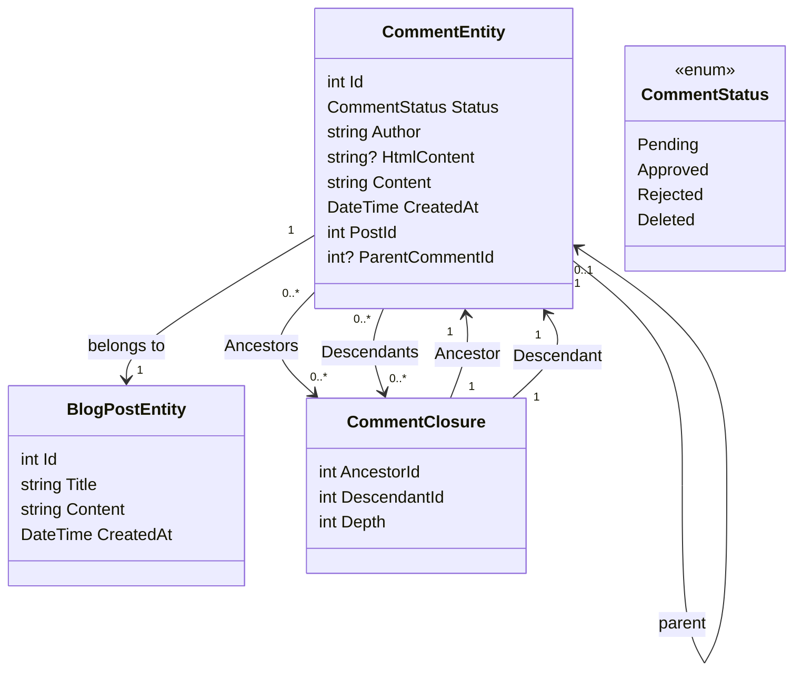

# Додавання частини коментаря 1 - Налаштування бази даних

<!--category-- Entity Framework  -->
<datetime class="hidden">2024- 08- 26T11: 53</datetime>

## Вступ

Одним з ключових аспектів такого сайту є система коментарів. Отже, я вирішив побудувати один. Це перша частина серії дописів про те, як побудувати систему коментарів. На цьому посту я налаштую базу даних.

[TOC]

## Налаштування бази даних

Як і решта сайту, я використовую Postgres для блогів; для початку я використовую рекурсивні запити для збереження коментарів. Мені це дуже не подобається, але це виводить нас за межі з системою коментування з нитками (і в мене немає багато транспортного руху, тому це не так вже й важливо). У майбутньому я перейду до більш ефективної системи.

### Контекст EF

У теперішній системі ми використовуємо "Клавання комерції" для визначення взаємозв'язків між коментарями, щоб я міг підтримувати коментарі. Наша діаграма класу виглядає ось так:



Тут ви можете побачити, що кожен `CommentEntity` має `PostId` для посту, до якого він прив'язаний, і `ParentCommentId` для коментаря, до якого прив' язано (якщо є). The `CommentClosure` таблиця використовується для зберігання взаємозв' язків між коментарями.

### The CommentService

The `CommentService` є відповідальною за керування коментарями. Вона має методи додавання, схвалення, відкидання та вилучення коментарів. Вона також має способи, щоб дати коментарі на лист, і щоб дати коментар.

Наш інтерфейс для цієї служби виглядає так:

```csharp
public interface ICommentService
{
    Task<string> Add( int postId, int? parentCommentId, string author, string content);
    Task<List<CommentEntity>> GetForPost(int blogPostId, int page = 1, int pageSize = 10, int? maxDepth = null, CommentStatus? status = null);
    Task<List<CommentEntity>> GetDescendants(int commentId, int maxDepth = 0);

     Task<CommentEntity> Get(int commentId);
    Task<List<CommentEntity>> GetAncestors(int commentId);
    Task Delete(int commentId);
    Task Reject(int commentId);
    Task Approve(int commentId);
}
```

#### Додати метод

Наш додатковий метод підсумовує структуру цієї системи коментарів.

Вона спочатку розпочинає нову операцію; для тих, хто не знайомий з нею, це спосіб переконатися, що група операцій розглядається як єдина одиниця роботи. Якщо будь- яка з операцій зазнає невдачі, операцію можна повернути назад, всі зміни буде скасовано. Це важливо, якщо у вас є декілька операцій, які треба зробити разом, і ви хочете переконатися, що вони всі досягають успіху або зазнають невдачі разом.

Потім програма аналізує текст коментаря з Markdown до HTML за допомогою бібліотеки Markdig. Це простий спосіб дозволити користувачам форматувати свої коментарі за допомогою пункту меню Помітка.

Далі він створює об'єкт і зберігає його у базі даних.

Це робиться у два етапи: спочатку коментар буде збережено, потім коментар буде закрито. Це тому, що коментар слід зберегти для створення ідентифікатора, який буде використано для завершення роботи.

Далі ми створюємо ієрархію `CommentClosures` визначає взаємозв' язки між коментарями. Починаємо з самозакриття запису, тоді, якщо є батьківський коментар, ми отримуємо всіх предків батьківського коментаря і додаємо їх до нового коментаря. Потім ми додаємо прямі зв'язки між батьками і дітьми.

Нарешті, ми вкладаємо угоду. Якщо будь-яка з операцій зазнає невдачі, операцію буде скинуто назад.

```csharp
 public async Task<string> Add(int postId, int? parentCommentId, string author, string content)
  {
      await using var transaction = await context.Database.BeginTransactionAsync();
      try
      {
         var html = Markdig.Markdown.ToHtml(content);
          // Create the new comment
          var newComment = new CommentEntity()
          {
              HtmlContent = html,
              Content = content,
              CreatedAt = DateTime.UtcNow,
              PostId = postId,
              Author = author,
              Status = CommentStatus.Pending,
              ParentCommentId = parentCommentId
          };
            
          context.Comments.Add(newComment);
          await context.SaveChangesAsync();
          logger.LogInformation("Saved comment to DB");// Save to generate the new comment's Id

          // Insert into CommentClosure table
          var commentClosures = new List<CommentClosure>();

          // Self-referencing closure entry
          commentClosures.Add(new CommentClosure
          {
              AncestorId = newComment.Id,
              DescendantId = newComment.Id,
              Depth = 0
          });

          // If there is a parent comment, insert the ancestor relationships
          if (parentCommentId.HasValue)
          {
              // Fetch all ancestors of the parent comment
              var parentAncestors = await context.CommentClosures
                  .Where(cc => cc.DescendantId == parentCommentId.Value)
                  .ToListAsync();

              // Add ancestor relationships for the new comment
              foreach (var ancestor in parentAncestors)
              {
                  commentClosures.Add(new CommentClosure
                  {
                      AncestorId = ancestor.AncestorId,
                      DescendantId = newComment.Id,
                      Depth = ancestor.Depth + 1
                  });
              }

              // Add a direct parent-child relationship
              commentClosures.Add(new CommentClosure
              {
                  AncestorId = parentCommentId.Value,
                  DescendantId = newComment.Id,
                  Depth = 1
              });
          }

          context.CommentClosures.AddRange(commentClosures);
          await context.SaveChangesAsync();
          logger.LogInformation("Saved comment closure to DB");

          // Commit transaction
          await transaction.CommitAsync();
          return html;
      }
      catch (Exception e)
      {
          // Rollback transaction in case of failure
          await transaction.RollbackAsync();
          logger.LogError(e, "Failed to save comment to DB");
      }

      return string.Empty;
  }

```

#### Метод GetForPost

Ми не покриватимемо все це, але `Add` і `Get` є основними операціями СРС для цієї служби.

Як бачите, у нас є графік на основі коментаря найвищого рівня. У нас також є `maxDepth` параметр, який надає нам можливість обмежити глибину дерева коментарів. Цей пункт буде корисним, якщо ми хочемо, щоб було показано коментарі найвищого рівня, або якщо ми хочемо обмежити глибину дерева для покращення швидкодії.

Не зовсім з цим рекурсивним підходом ми повинні застосувати фільтр глибини після того, як ми отримали коментарі, як ми не можемо зробити це в запиті. Це тому, що глибина коментаря визначається кількістю її предків, і ми не можемо легко запитати про це у SQL.

```csharp
  public async Task<List<CommentEntity>> GetForPost(int blogPostId, int page = 1, int pageSize = 10, int? maxDepth = null, CommentStatus? status = null)
  {
      // Step 1: Query the top-level comments for the specified blog post
      var query = context.Comments
          .Where(c => c.PostId == blogPostId)
          .OrderByDescending(c => c.CreatedAt)
          .Skip((page - 1) * pageSize)
          .Take(pageSize);

      // Step 2: Filter by status if provided
      if (status.HasValue)
      {
          query = query.Where(c => c.Status == status.Value);
      }

      var topLevelComments = await query
          .Include(c => c.ParentComment)
          .Include(d=>d.Descendants)
          .ToListAsync();

      // Step 4: Filter descendants based on the maxDepth
      foreach (var comment in topLevelComments)
      {
          if (maxDepth != null)
          {
              FilterDescendantsByDepth(comment, 0, maxDepth.Value);
          }
      }

      return topLevelComments;
  }

// Recursive helper method to limit the descendants based on the specified depth
  private void FilterDescendantsByDepth(CommentEntity comment, int currentDepth, int maxDepth)
  {
      if (currentDepth >= maxDepth)
      {
          // If the max depth is reached or there are no descendants, stop recursion
          comment.Descendants = new List<CommentClosure>();  // Clear further descendants beyond maxDepth
          return;
      }

      foreach (var closure in comment.Descendants.ToList())  // Iterate over a copy to prevent modification during iteration
      {
          FilterDescendantsByDepth(closure.Descendant, currentDepth + 1, maxDepth);
      }
  }

```

## Включення

Це проста система коментарів, яка використовує рекурсивні запити для збереження взаємозв' язків між коментарями. Це не найбільш ефективна система, але вона проста і працює. У майбутньому я покрию передній кінець цієї системи; багато HTMX, альпійських.js, і Tailwindwind CSS.

А до того часу, не соромтеся залишити коментар внизу!