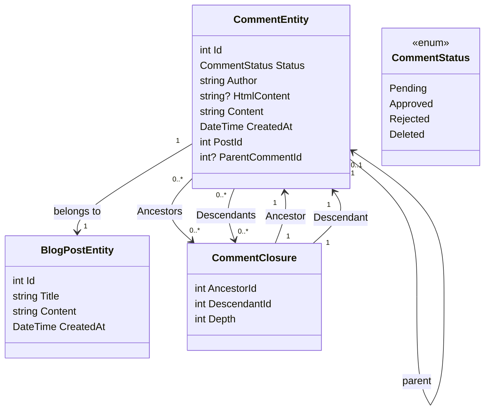

# 添加评论系统第1部分 - 建立数据库

<!--category-- Entity Framework  -->
<datetime class="hidden">2024-008-26T11:53</datetime>

## 一. 导言 导言 导言 导言 导言 导言 一,导言 导言 导言 导言 导言 导言

博客网站的其中一个关键方面就是评论系统。 所以,我决定建一个。 这是关于如何建立评论系统的一系列职位的第一部分。 在这个职位上,我将建立数据库。

[技选委

## 建立数据库

与网站其他部分一样, 我使用 Postgres 做博客; 首先,我使用循环查询来储存评论。 我强烈地不喜欢这样, 但是它能带我们离开大门, 并配有一丝评论系统(而且我没有太多流量,所以没什么大不了的)。 我以后会改用更有效率的系统

### EF背景

在目前的系统里,我们使用“评论结束”来定义评论之间的关系,这样我就可以支持线性的评论。 我们的班级图表看起来是这样的:



你可以看到这里的每一个 `CommentEntity` 具有 a 的 `PostId` A. 和A. 和A. 与A. 和A. 和A. `ParentCommentId` (如果有的话)附于(如果有的话)的评论中。 缩略 `CommentClosure` 表格用于存储注释之间的关系。

### 注释服务

缩略 `CommentService` 负责管理评论意见。 它有增加、核准、拒绝和删除评论的方法。 网站还有获取文章评论和获取评论的方法。

这个服务的界面看起来是这样的:

```csharp
public interface ICommentService
{
    Task<string> Add( int postId, int? parentCommentId, string author, string content);
    Task<List<CommentEntity>> GetForPost(int blogPostId, int page = 1, int pageSize = 10, int? maxDepth = null, CommentStatus? status = null);
    Task<List<CommentEntity>> GetDescendants(int commentId, int maxDepth = 0);

     Task<CommentEntity> Get(int commentId);
    Task<List<CommentEntity>> GetAncestors(int commentId);
    Task Delete(int commentId);
    Task Reject(int commentId);
    Task Approve(int commentId);
}
```

#### 添加方法

我们添加的方法总结了这个评论系统的结构。

它首先开始新的交易;对那些不熟悉的交易来说,是确保将一组业务作为一个单一的工作单位处理的一种方式。 如果任何操作失败,交易可以回滚,所有更改都撤销。 当您有多重操作需要一起完成时, 这一点很重要, 您想要确保它们一起成功或者一起失败 。

然后它用 Markdig 库来解析从 Markdown 到 HTML 的评论文本 。 这是允许用户使用 Markdown 格式化其评论的简单方式 。

其次,它创建实体,并将实体保存到数据库中。

这是分两个步骤完成的- 首先保存了注释, 然后保存了注释关闭 。 这是因为该评论需要保存以生成在关闭时使用的标识。

接下来,我们建立 等级的等级 `CommentClosures` 界定评论之间的关系。 我们从自我参考关闭条目开始, 如果有家长意见的话, 我们把家长意见的所有祖先都带走, 把他们添加到新的评论中。 然后我们增加直接的亲子关系。

最后,我们进行交易。 如果任何操作失败,交易将被退回。

```csharp
 public async Task<string> Add(int postId, int? parentCommentId, string author, string content)
  {
      await using var transaction = await context.Database.BeginTransactionAsync();
      try
      {
         var html = Markdig.Markdown.ToHtml(content);
          // Create the new comment
          var newComment = new CommentEntity()
          {
              HtmlContent = html,
              Content = content,
              CreatedAt = DateTime.UtcNow,
              PostId = postId,
              Author = author,
              Status = CommentStatus.Pending,
              ParentCommentId = parentCommentId
          };
            
          context.Comments.Add(newComment);
          await context.SaveChangesAsync();
          logger.LogInformation("Saved comment to DB");// Save to generate the new comment's Id

          // Insert into CommentClosure table
          var commentClosures = new List<CommentClosure>();

          // Self-referencing closure entry
          commentClosures.Add(new CommentClosure
          {
              AncestorId = newComment.Id,
              DescendantId = newComment.Id,
              Depth = 0
          });

          // If there is a parent comment, insert the ancestor relationships
          if (parentCommentId.HasValue)
          {
              // Fetch all ancestors of the parent comment
              var parentAncestors = await context.CommentClosures
                  .Where(cc => cc.DescendantId == parentCommentId.Value)
                  .ToListAsync();

              // Add ancestor relationships for the new comment
              foreach (var ancestor in parentAncestors)
              {
                  commentClosures.Add(new CommentClosure
                  {
                      AncestorId = ancestor.AncestorId,
                      DescendantId = newComment.Id,
                      Depth = ancestor.Depth + 1
                  });
              }

              // Add a direct parent-child relationship
              commentClosures.Add(new CommentClosure
              {
                  AncestorId = parentCommentId.Value,
                  DescendantId = newComment.Id,
                  Depth = 1
              });
          }

          context.CommentClosures.AddRange(commentClosures);
          await context.SaveChangesAsync();
          logger.LogInformation("Saved comment closure to DB");

          // Commit transaction
          await transaction.CommitAsync();
          return html;
      }
      catch (Exception e)
      {
          // Rollback transaction in case of failure
          await transaction.RollbackAsync();
          logger.LogError(e, "Failed to save comment to DB");
      }

      return string.Empty;
  }

```

#### GetForest 后方法

我们不会覆盖整个事情 但是... `Add` 和 `Get` 我们的CRUD是这项服务的主要业务。

正如你可以看到的,我们有基于 顶级评论的传呼。 我们还有一个 `maxDepth` 参数允许我们限制注释树的深度。 如果我们只想显示顶级评论,或者如果我们想限制树的深度以改善业绩,这是有用的。

令人不快的是,由于这种循环方法,我们需要在我们收到评论后应用深度过滤器,因为在查询中我们无法做到这一点。 这是因为评论的深度是由它拥有的祖先数量决定的, 我们无法在 SQL 中轻而易举地查询这一点。

```csharp
  public async Task<List<CommentEntity>> GetForPost(int blogPostId, int page = 1, int pageSize = 10, int? maxDepth = null, CommentStatus? status = null)
  {
      // Step 1: Query the top-level comments for the specified blog post
      var query = context.Comments
          .Where(c => c.PostId == blogPostId)
          .OrderByDescending(c => c.CreatedAt)
          .Skip((page - 1) * pageSize)
          .Take(pageSize);

      // Step 2: Filter by status if provided
      if (status.HasValue)
      {
          query = query.Where(c => c.Status == status.Value);
      }

      var topLevelComments = await query
          .Include(c => c.ParentComment)
          .Include(d=>d.Descendants)
          .ToListAsync();

      // Step 4: Filter descendants based on the maxDepth
      foreach (var comment in topLevelComments)
      {
          if (maxDepth != null)
          {
              FilterDescendantsByDepth(comment, 0, maxDepth.Value);
          }
      }

      return topLevelComments;
  }

// Recursive helper method to limit the descendants based on the specified depth
  private void FilterDescendantsByDepth(CommentEntity comment, int currentDepth, int maxDepth)
  {
      if (currentDepth >= maxDepth)
      {
          // If the max depth is reached or there are no descendants, stop recursion
          comment.Descendants = new List<CommentClosure>();  // Clear further descendants beyond maxDepth
          return;
      }

      foreach (var closure in comment.Descendants.ToList())  // Iterate over a copy to prevent modification during iteration
      {
          FilterDescendantsByDepth(closure.Descendant, currentDepth + 1, maxDepth);
      }
  }

```

## 在结论结论中

这是一个简单的线条评论系统, 使用循环查询来存储批注之间的关系 。 这不是最有效率的系统, 但它是简单的,它的工作原理。 未来,我将覆盖这个系统的前端方面, 包括许多HTMX,Alpine.js, 和尾风CSS。

在那之前,请在下面留言!