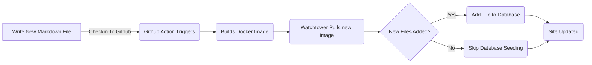

# إطار الهيئة المُضافة للوظائف المدرجة في قائمة الوظائف (Pt 6)

<!--category-- ASP.NET, Entity Framework -->
<datetime class="hidden">2024-2024-08-20TT05: 45</datetime>

# أولاً

الآن بما أن لدي هذه المدونة التي تعمل باستخدام إطار الكيان يمكنني أن أضيف مقالات و لغات جديدة بسهولة. أنا فقط أضيف ملف جديد للمشروع وأتحقق منه وتُحدَّث مُنافذ العمل في غيت هوب ويُحدَّث الموقع.

في هذا الموقع سأغطي بعض الإضافات الصغيرة التي قمت بها لهذه العملية وكيف أنها تمكن من التعزيزات المستقبلية.

[رابعاً -

انظر الأجزاء [1](/blog/addingentityframeworkforblogpostspt1), [2](/blog/addingentityframeworkforblogpostspt2), [3](/blog/addingentityframeworkforblogpostspt3) , [4](/blog/addingentityframeworkforblogpostspt4) وقد عقد مؤتمراً بشأن [5](/blog/addingentityframeworkforblogpostspt5) عن الخطوات السابقة.

# تحديث معلومات أساسية

ومن بين المسائل التي واجهتها في الانتقال إلى مرفق الطوارئ الحفاظ على عمليتي لتحديث الموقع مع عدم تأخير تحديث الموقع. وأود أن أبقي عملية إضافة وظيفة جديدة بسيطة قدر الإمكان.

في الأجزاء السابقة أظهرت كيف استخدمت `MarkdownBlogService` للحصول على تدوينات المدونات واللغات. تم إدخال هذه الخدمة في أجهزة التحكم و وجهات النظر لدينا. كانت هذه الخدمة خدمة بسيطة تقوم بقراءة ملفات التدرج من القرص وإعادتها كما يلي: `BlogViewModels`.

وفيما يلي عملية الاستكمال:



من أجل إتاحة تحديث المعلومات الأساسية عند بدء الموقع في ASP.net I  `IHostedService` للتحقق من ملفات جديدة وإضافتها إلى قاعدة البيانات.

انه بسيط جداً وكل ما يفعله هو تحت

```csharp
public class BackgroundEFBlogUpdater(IServiceScopeFactory scopeFactory, ILogger<BackgroundEFBlogUpdater> logger) : IHostedService
{
    private Task _backgroundTask;
    public async Task StartAsync(CancellationToken cancellationToken)
    {
       
        var scope = scopeFactory.CreateScope();
        var context = scope.ServiceProvider.GetRequiredService<IBlogPopulator>();
        logger.LogInformation("Starting EF Blog Updater");
      
        _backgroundTask = Task.Run(async () =>    await  context.Populate(), cancellationToken);
       logger.LogInformation("EF Blog Updater Finished");
    }

    public async Task StopAsync(CancellationToken cancellationToken)
    {
        
    }
}
```

ملاحظة أن أحد الجوانب الحرجة هنا هو أن FF متردد جداً في تحديد نطاقه. كان علي أن أستخدم `IServiceScopeFactory` لإنشاء نطاق جديد للخدمة. هذا لأن الخدمة هي واحدة و EF لا تحب أن تستخدم في واحدة.
الـج الـي الـ `IServiceScopeFactory` هو نمط شائع في ASP.net الأساسية عندما تحتاج إلى استخدام خدمة نطاقية في خدمة واحدة.

كان عليّ أيضاً أن أستخدم `Task.Run` إلى تنفيذ المهمة في a جديد. هذا هو السبب في أن `IHostedService` تشغيل على الخيط الرئيسي ولم أكن أريد منع التطبيق من البداية.

هذا هو `BackgroundEFBlogUpdater` -مصنفة. -مصنفة. وهو حق باستخدام `SetupBlog` طريقة التمديد التي عرضتها قبل:

```csharp
    public static void SetupBlog(this IServiceCollection services, IConfiguration configuration, IWebHostEnvironment env)
    {
        var config = services.ConfigurePOCO<BlogConfig>(configuration.GetSection(BlogConfig.Section));
       services.ConfigurePOCO<MarkdownConfig>(configuration.GetSection(MarkdownConfig.Section));
       services.AddScoped<CommentService>();
        switch (config.Mode)
        {
            case BlogMode.File:
                Log.Information("Using file based blog");
                services.AddScoped<IBlogService, MarkdownBlogService>();
                services.AddScoped<IBlogPopulator, MarkdownBlogPopulator>();
                break;
            case BlogMode.Database:
                Log.Information("Using Database based blog");
                services.AddDbContext<MostlylucidDbContext>(options =>
                {
                    if (env.IsDevelopment())
                    {
                        options.EnableSensitiveDataLogging(true);
                    }
                    options.UseNpgsql(configuration.GetConnectionString("DefaultConnection"));
                });
                services.AddScoped<IBlogService, EFBlogService>();
            
                services.AddScoped<IBlogPopulator, EFBlogPopulator>();
                services.AddHostedService<BackgroundEFBlogUpdater>();
                break;
        }
        services.AddScoped<IMarkdownBlogService, MarkdownBlogPopulator>();

        services.AddScoped<MarkdownRenderingService>();
    }
```

هذا السطر تحديداً هذا السطر `services.AddHostedService<BackgroundEFBlogUpdater>();`
في ASP.NET الأساسية يبدأ هذا الجديد خدمة مضيفة جديدة تعمل في الخلفية. تبدأ هذه الخدمة عندما يبدأ التطبيق ويستمر حتى يتوقف التطبيق.

هذه طريقة بسيطة لإضافة تجهيز المعلومات الأساسية إلى تطبيقك الأساسي ASP.net.

# في الإستنتاج

عرضت في هذا المقال كيف أضفت خدمة خلفية إلى تطبيقي الأساسي ASP.NET لتحديث قاعدة البيانات بمواقع جديدة. تعمل هذه الخدمة عندما يبدأ التطبيق ويضيف أي ملفات جديدة إلى قاعدة البيانات.