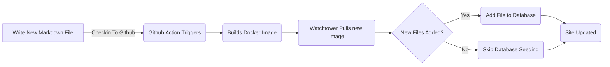

# Hinzufügen des Entity Framework für Blog-Posts (Pt 6)

<!--category-- ASP.NET, Entity Framework -->
<datetime class="hidden">2024-08-20T05:45</datetime>

# Einleitung

Jetzt, da ich dieses Blog läuft mit Entity Framework Ich kann neue Beiträge und Sprachen leicht hinzufügen. Ich füge dem Projekt eine neue Markdown-Datei hinzu und checke sie ein. Die GitHub Aktion löst aus und die Seite wird aktualisiert.

In diesem Beitrag werde ich ein paar kleine Ergänzungen abdecken, die ich zu diesem Prozess gemacht habe und wie es zukünftige Verbesserungen ermöglicht.

[TOC]

Siehe Teile [1](/blog/addingentityframeworkforblogpostspt1), [2](/blog/addingentityframeworkforblogpostspt2), [3](/blog/addingentityframeworkforblogpostspt3) , [4](/blog/addingentityframeworkforblogpostspt4) und [5](/blog/addingentityframeworkforblogpostspt5) für die vorherigen Schritte.

# Hintergrund-Aktualisierung

Eines der Probleme, die ich mit dem Umzug in EF konfrontiert war mein Prozess für die Aktualisierung der Website, während nicht verzögert die Website-Update. Ich wollte den Prozess des Hinzufügens eines neuen Post so einfach wie möglich zu halten.

In den vorherigen Teilen zeigte ich, wie ich eine `MarkdownBlogService` um die Blogposts und Sprachen zu erhalten. Dieser Service wurde in unsere Controller und Ansichten eingespritzt. Dieser Dienst war ein einfacher Dienst, der Markdown-Dateien von der Festplatte abliest und sie als `BlogViewModels`.

Der Update-Prozess ist wie folgt:



Um Hintergrund-Updates zu ermöglichen, wenn die Seite in ASP.NET startet, verwende ich eine  `IHostedService` um nach neuen Dateien zu suchen und diese der Datenbank hinzuzufügen.

Es ist super einfach und alles, was es tut, ist unten:

```csharp
public class BackgroundEFBlogUpdater(IServiceScopeFactory scopeFactory, ILogger<BackgroundEFBlogUpdater> logger) : IHostedService
{
    private Task _backgroundTask;
    public async Task StartAsync(CancellationToken cancellationToken)
    {
       
        var scope = scopeFactory.CreateScope();
        var context = scope.ServiceProvider.GetRequiredService<IBlogPopulator>();
        logger.LogInformation("Starting EF Blog Updater");
      
        _backgroundTask = Task.Run(async () =>    await  context.Populate(), cancellationToken);
       logger.LogInformation("EF Blog Updater Finished");
    }

    public async Task StopAsync(CancellationToken cancellationToken)
    {
        
    }
}
```

Beachten Sie, dass ein kritischer Aspekt hier ist, dass EF sehr wählerisch über es ist Scoping. Ich musste es benutzen. `IServiceScopeFactory` um einen neuen Raum für den Dienst zu schaffen. Dies liegt daran, dass der Service ein Singleton ist und EF nicht gerne in einem Singleton verwendet wird.
Die Verwendung der `IServiceScopeFactory` ist ein gängiges Muster in ASP.NET Core, wenn Sie einen Scoped-Dienst in einem Singleton-Dienst verwenden müssen.

Ich musste auch benutzen `Task.Run` die Aufgabe in einem neuen Thread auszuführen. Dies ist, weil die `IHostedService` läuft auf dem Hauptgewinde und ich wollte die Anwendung nicht vom Starten blockieren.

Das ist die `BackgroundEFBlogUpdater` Unterricht. Es wird injiziert mit dem `SetupBlog` Erweiterungsmethode, die ich zuvor gezeigt habe:

```csharp
    public static void SetupBlog(this IServiceCollection services, IConfiguration configuration, IWebHostEnvironment env)
    {
        var config = services.ConfigurePOCO<BlogConfig>(configuration.GetSection(BlogConfig.Section));
       services.ConfigurePOCO<MarkdownConfig>(configuration.GetSection(MarkdownConfig.Section));
       services.AddScoped<CommentService>();
        switch (config.Mode)
        {
            case BlogMode.File:
                Log.Information("Using file based blog");
                services.AddScoped<IBlogService, MarkdownBlogService>();
                services.AddScoped<IBlogPopulator, MarkdownBlogPopulator>();
                break;
            case BlogMode.Database:
                Log.Information("Using Database based blog");
                services.AddDbContext<MostlylucidDbContext>(options =>
                {
                    if (env.IsDevelopment())
                    {
                        options.EnableSensitiveDataLogging(true);
                    }
                    options.UseNpgsql(configuration.GetConnectionString("DefaultConnection"));
                });
                services.AddScoped<IBlogService, EFBlogService>();
            
                services.AddScoped<IBlogPopulator, EFBlogPopulator>();
                services.AddHostedService<BackgroundEFBlogUpdater>();
                break;
        }
        services.AddScoped<IMarkdownBlogService, MarkdownBlogPopulator>();

        services.AddScoped<MarkdownRenderingService>();
    }
```

Insbesondere diese Linie `services.AddHostedService<BackgroundEFBlogUpdater>();`
In ASP.NET Core startet dies einen neuen HostedService, der im Hintergrund läuft. Dieser Dienst wird gestartet, wenn die Anwendung startet und läuft, bis die Anwendung aufhört.

Dies ist eine einfache Möglichkeit, die Hintergrundbearbeitung Ihrer ASP.NET Core-Anwendung hinzuzufügen.

# Schlussfolgerung

In diesem Beitrag zeigte ich, wie ich einen Hintergrunddienst zu meiner ASP.NET Core-Anwendung hinzugefügt habe, um die Datenbank mit neuen Blog-Posts zu aktualisieren. Dieser Dienst läuft, wenn die Anwendung startet und fügt neue Dateien in die Datenbank.