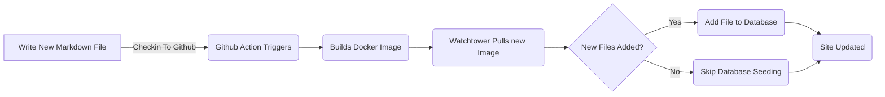

# Προσθήκη πλαισίου οντοτήτων για δημοσιεύσεις blog (Pt 6)

<!--category-- ASP.NET, Entity Framework -->
<datetime class="hidden">2024-08-20T05:45</datetime>

# Εισαγωγή

Τώρα που έχω αυτό το blog που τρέχει χρησιμοποιώντας το πλαίσιο οντότητας μπορώ να προσθέσω νέες δημοσιεύσεις και γλώσσες εύκολα. Απλά προσθέτω ένα νέο αρχείο στο πρόγραμμα και το ελέγχω. Η δράση GitHub ενεργοποιεί και η ιστοσελίδα ενημερώνεται.

Σε αυτή τη θέση θα καλύψω μερικές μικρές προσθήκες που έκανα σε αυτή τη διαδικασία και πώς επιτρέπει μελλοντικές βελτιώσεις.

[TOC]

Δείτε μέρη [1](/blog/addingentityframeworkforblogpostspt1), [2](/blog/addingentityframeworkforblogpostspt2), [3](/blog/addingentityframeworkforblogpostspt3) , [4](/blog/addingentityframeworkforblogpostspt4) και [5](/blog/addingentityframeworkforblogpostspt5) για τα προηγούμενα βήματα.

# Ενημέρωση φόντουName

Ένα από τα ζητήματα που αντιμετώπισα να μετακομίσω στην EF ήταν η διατήρηση της διαδικασίας μου για την ενημέρωση της ιστοσελίδας ενώ δεν καθυστερούσα την ενημέρωση της ιστοσελίδας. Ήθελα να κρατήσω τη διαδικασία να προσθέσω μια νέα θέση όσο το δυνατόν πιο απλή.

Στα προηγούμενα μέρη έδειξα πώς χρησιμοποιούσα ένα `MarkdownBlogService` για να πάρετε τις δημοσιεύσεις blog και τις γλώσσες. Αυτή η υπηρεσία εισέβαλε στους ελεγκτές και τις απόψεις μας. Αυτή η υπηρεσία ήταν μια απλή υπηρεσία που διαβάζει τα αρχεία markdown από το δίσκο και τα επέστρεψε ως `BlogViewModels`.

Η διαδικασία ενημέρωσης έχει ως εξής:



Για να επιτρέψετε την ενημέρωση του ιστορικού όταν η ιστοσελίδα ξεκινά από το ASP.NET Χρησιμοποιώ ένα  `IHostedService` για να ελέγξετε για νέα αρχεία και να τα προσθέσετε στη βάση δεδομένων.

Είναι πολύ απλό και το μόνο που κάνει είναι παρακάτω:

```csharp
public class BackgroundEFBlogUpdater(IServiceScopeFactory scopeFactory, ILogger<BackgroundEFBlogUpdater> logger) : IHostedService
{
    private Task _backgroundTask;
    public async Task StartAsync(CancellationToken cancellationToken)
    {
       
        var scope = scopeFactory.CreateScope();
        var context = scope.ServiceProvider.GetRequiredService<IBlogPopulator>();
        logger.LogInformation("Starting EF Blog Updater");
      
        _backgroundTask = Task.Run(async () =>    await  context.Populate(), cancellationToken);
       logger.LogInformation("EF Blog Updater Finished");
    }

    public async Task StopAsync(CancellationToken cancellationToken)
    {
        
    }
}
```

Σημειώστε ότι μια κρίσιμη πτυχή εδώ είναι ότι EF είναι πολύ επιλεκτικό σχετικά με το scoping. Έπρεπε να χρησιμοποιήσω. `IServiceScopeFactory` να δημιουργήσει ένα νέο πεδίο εφαρμογής για την υπηρεσία. Αυτό συμβαίνει επειδή η υπηρεσία είναι ένα singleton και EF δεν αρέσει να χρησιμοποιείται σε ένα singleton.
Η χρήση του `IServiceScopeFactory` είναι ένα κοινό μοτίβο στο ASP.NET Core όταν πρέπει να χρησιμοποιήσετε μια υπηρεσία πεδίου εφαρμογής σε μια υπηρεσία singleton.

Έπρεπε επίσης να χρησιμοποιήσω `Task.Run` να τρέξει το έργο σε μια νέα κλωστή. Αυτό συμβαίνει επειδή η `IHostedService` τρέχει στην κύρια κλωστή και δεν ήθελα να μπλοκάρω την εφαρμογή από την αρχή.

Αυτό είναι το `BackgroundEFBlogUpdater` Μαθήματα. Χρησιμοποιήθηκε με ένεση. `SetupBlog` μέθοδος επέκτασης που έδειξα πριν:

```csharp
    public static void SetupBlog(this IServiceCollection services, IConfiguration configuration, IWebHostEnvironment env)
    {
        var config = services.ConfigurePOCO<BlogConfig>(configuration.GetSection(BlogConfig.Section));
       services.ConfigurePOCO<MarkdownConfig>(configuration.GetSection(MarkdownConfig.Section));
       services.AddScoped<CommentService>();
        switch (config.Mode)
        {
            case BlogMode.File:
                Log.Information("Using file based blog");
                services.AddScoped<IBlogService, MarkdownBlogService>();
                services.AddScoped<IBlogPopulator, MarkdownBlogPopulator>();
                break;
            case BlogMode.Database:
                Log.Information("Using Database based blog");
                services.AddDbContext<MostlylucidDbContext>(options =>
                {
                    if (env.IsDevelopment())
                    {
                        options.EnableSensitiveDataLogging(true);
                    }
                    options.UseNpgsql(configuration.GetConnectionString("DefaultConnection"));
                });
                services.AddScoped<IBlogService, EFBlogService>();
            
                services.AddScoped<IBlogPopulator, EFBlogPopulator>();
                services.AddHostedService<BackgroundEFBlogUpdater>();
                break;
        }
        services.AddScoped<IMarkdownBlogService, MarkdownBlogPopulator>();

        services.AddScoped<MarkdownRenderingService>();
    }
```

Συγκεκριμένα αυτή η γραμμή `services.AddHostedService<BackgroundEFBlogUpdater>();`
Στο ASP.NET Core αυτό ξεκινά μια νέα HostedService που τρέχει στο παρασκήνιο. Αυτή η υπηρεσία ξεκινά όταν η εφαρμογή ξεκινά και εκτελείται μέχρι να σταματήσει η εφαρμογή.

Αυτός είναι ένας απλός τρόπος για να προσθέσετε την επεξεργασία υποβάθρου στην εφαρμογή σας ASP.NET Core.

# Συμπέρασμα

Σε αυτό το άρθρο έδειξα πώς πρόσθεσα μια υπηρεσία υποβάθρου στην εφαρμογή ASP.NET Core μου για την ενημέρωση της βάσης δεδομένων με νέες δημοσιεύσεις blog. Αυτή η υπηρεσία λειτουργεί όταν η εφαρμογή ξεκινά και προσθέτει οποιοδήποτε νέο αρχείο στη βάση δεδομένων.