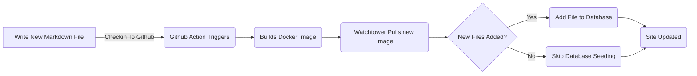

# Añadiendo marco de entidad para entradas de blog (Pt 6)

<!--category-- ASP.NET, Entity Framework -->
<datetime class="hidden">2024-08-20T05:45</datetime>

# Introducción

Ahora que tengo este blog corriendo usando Entity Framework puedo añadir nuevos posts e idiomas fácilmente. Sólo añado un nuevo archivo Markdown al proyecto y lo comprobé. La acción GitHub activa y el sitio se actualiza.

En este post cubriré un par de pequeñas adiciones que hice a este proceso y cómo permite futuras mejoras.

[TOC]

Ver partes [1](/blog/addingentityframeworkforblogpostspt1), [2](/blog/addingentityframeworkforblogpostspt2), [3](/blog/addingentityframeworkforblogpostspt3) , [4](/blog/addingentityframeworkforblogpostspt4) y [5](/blog/addingentityframeworkforblogpostspt5) para los pasos anteriores.

# Actualización de los antecedentes

Uno de los problemas que me enfrenté con el traslado a EF fue mantener mi proceso para actualizar el sitio sin retrasar la actualización del sitio. Quería mantener el proceso de añadir un nuevo post lo más simple posible.

En las partes anteriores mostré cómo usé un `MarkdownBlogService` para obtener los posts del blog y los idiomas. Este servicio fue inyectado en nuestros controladores y puntos de vista. Este servicio era un servicio simple que leía los archivos de marca hacia abajo del disco y los devolvía como `BlogViewModels`.

El proceso de actualización es el siguiente:



Con el fin de permitir la actualización de fondo cuando el sitio comienza en ASP.NET uso un  `IHostedService` para comprobar si hay nuevos archivos y añadirlos a la base de datos.

Es súper simple y todo lo que hace es a continuación:

```csharp
public class BackgroundEFBlogUpdater(IServiceScopeFactory scopeFactory, ILogger<BackgroundEFBlogUpdater> logger) : IHostedService
{
    private Task _backgroundTask;
    public async Task StartAsync(CancellationToken cancellationToken)
    {
       
        var scope = scopeFactory.CreateScope();
        var context = scope.ServiceProvider.GetRequiredService<IBlogPopulator>();
        logger.LogInformation("Starting EF Blog Updater");
      
        _backgroundTask = Task.Run(async () =>    await  context.Populate(), cancellationToken);
       logger.LogInformation("EF Blog Updater Finished");
    }

    public async Task StopAsync(CancellationToken cancellationToken)
    {
        
    }
}
```

Tenga en cuenta que un aspecto crítico aquí es que la FE es muy exigente acerca de su alcance. Tenía que usar `IServiceScopeFactory` crear un nuevo alcance para el servicio. Esto se debe a que el servicio es un singleton y EF no le gusta ser utilizado en un singleton.
El uso de la `IServiceScopeFactory` es un patrón común en ASP.NET Core cuando necesita utilizar un servicio con alcance en un servicio singleton.

También tuve que usar `Task.Run` ejecutar la tarea en un nuevo hilo. Esto es porque el `IHostedService` se ejecuta en el hilo principal y no quería bloquear la aplicación desde el inicio.

Esta es la `BackgroundEFBlogUpdater` clase. Se inyecta usando el `SetupBlog` método de extensión que mostré antes:

```csharp
    public static void SetupBlog(this IServiceCollection services, IConfiguration configuration, IWebHostEnvironment env)
    {
        var config = services.ConfigurePOCO<BlogConfig>(configuration.GetSection(BlogConfig.Section));
       services.ConfigurePOCO<MarkdownConfig>(configuration.GetSection(MarkdownConfig.Section));
       services.AddScoped<CommentService>();
        switch (config.Mode)
        {
            case BlogMode.File:
                Log.Information("Using file based blog");
                services.AddScoped<IBlogService, MarkdownBlogService>();
                services.AddScoped<IBlogPopulator, MarkdownBlogPopulator>();
                break;
            case BlogMode.Database:
                Log.Information("Using Database based blog");
                services.AddDbContext<MostlylucidDbContext>(options =>
                {
                    if (env.IsDevelopment())
                    {
                        options.EnableSensitiveDataLogging(true);
                    }
                    options.UseNpgsql(configuration.GetConnectionString("DefaultConnection"));
                });
                services.AddScoped<IBlogService, EFBlogService>();
            
                services.AddScoped<IBlogPopulator, EFBlogPopulator>();
                services.AddHostedService<BackgroundEFBlogUpdater>();
                break;
        }
        services.AddScoped<IMarkdownBlogService, MarkdownBlogPopulator>();

        services.AddScoped<MarkdownRenderingService>();
    }
```

Específicamente esta línea `services.AddHostedService<BackgroundEFBlogUpdater>();`
En ASP.NET Core esto inicia un nuevo HostedService que se ejecuta en segundo plano. Este servicio se inicia cuando la aplicación comienza y se ejecuta hasta que la aplicación se detiene.

Esta es una forma sencilla de agregar procesamiento de fondo a su aplicación ASP.NET Core.

# Conclusión

En este post mostré cómo añadí un servicio de fondo a mi aplicación ASP.NET Core para actualizar la base de datos con nuevas publicaciones de blog. Este servicio se ejecuta cuando se inicia la aplicación y añade cualquier archivo nuevo a la base de datos.