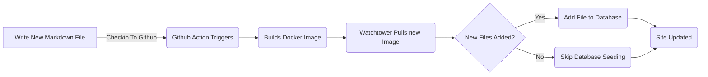

# Bloggaamiseen liittyvän kokonaisuuden lisääminen (Pt 6)

<!--category-- ASP.NET, Entity Framework -->
<datetime class="hidden">2024-08-20T05:45</datetime>

# Johdanto

Nyt kun minulla on tämä blogi käynnissä käyttäen Entity Frameworkiä, voin helposti lisätä uusia viestejä ja kieliä. Lisään projektiin uuden markdown-tiedoston ja tarkistan sen. GitHub-toiminta käynnistyy ja sivustoa päivitetään.

Tässä viestissä käsittelen pari pientä lisäystä, jotka tein tähän prosessiin ja miten se mahdollistaa tulevat parannukset.

[TÄYTÄNTÖÖNPANO

Katso osat [1](/blog/addingentityframeworkforblogpostspt1), [2](/blog/addingentityframeworkforblogpostspt2), [3](/blog/addingentityframeworkforblogpostspt3) , [4](/blog/addingentityframeworkforblogpostspt4) sekä [5](/blog/addingentityframeworkforblogpostspt5) edellisten vaiheiden osalta.

# Taustapäivitys

Yksi niistä ongelmista, joita jouduin kohtaamaan siirtyessäni EF:ään, oli pitää prosessini sivuston päivityksessä, mutta ei viivästyttää sivuston päivitystä. Halusin pitää prosessin uuden viran lisäämisessä mahdollisimman yksinkertaisena.

Edellisissä osissa näytin, kuinka käytin `MarkdownBlogService` Saada blogikirjoituksia ja kieliä. Tämä palvelu ruiskutettiin ohjaimiimme ja näkökulmiimme. Tämä palvelu oli yksinkertainen palvelu, joka luki levyltä markown-tiedostoja ja palautti ne `BlogViewModels`.

Päivitysprosessi on seuraava:



Taustapäivityksen mahdollistamiseksi sivuston käynnistyessä ASP.NETissä käytän  `IHostedService` Voit tarkistaa uudet tiedostot ja lisätä ne tietokantaan.

Se on superyksinkertaista ja kaikki mitä se tekee, on alla:

```csharp
public class BackgroundEFBlogUpdater(IServiceScopeFactory scopeFactory, ILogger<BackgroundEFBlogUpdater> logger) : IHostedService
{
    private Task _backgroundTask;
    public async Task StartAsync(CancellationToken cancellationToken)
    {
       
        var scope = scopeFactory.CreateScope();
        var context = scope.ServiceProvider.GetRequiredService<IBlogPopulator>();
        logger.LogInformation("Starting EF Blog Updater");
      
        _backgroundTask = Task.Run(async () =>    await  context.Populate(), cancellationToken);
       logger.LogInformation("EF Blog Updater Finished");
    }

    public async Task StopAsync(CancellationToken cancellationToken)
    {
        
    }
}
```

Huomaa, että yksi kriittinen näkökohta tässä on se, että EF on hyvin nirso siitä, että se nirsoilee. Minun oli pakko käyttää `IServiceScopeFactory` luoda palvelulle uusi toiminta-alue. Tämä johtuu siitä, että palvelu on singleton eikä EF pidä siitä, että sitä käytetään singletonissa.
Erytropoietiini- reseptorin salpaajien käyttö `IServiceScopeFactory` on yleinen malli ASP.NET Coressa, kun sinun täytyy käyttää laajennettua palvelua yhden tonnin palvelussa.

Minun piti myös käyttää `Task.Run` urakan pyörittäminen uudella langalla. Tämä johtuu siitä, että `IHostedService` Toimii päälangalla, enkä halunnut estää sovelluksen käynnistymistä.

Tämä on `BackgroundEFBlogUpdater` Luokka. Se injektoidaan käyttämällä `SetupBlog` laajennusmenetelmä, jonka näytin aiemmin:

```csharp
    public static void SetupBlog(this IServiceCollection services, IConfiguration configuration, IWebHostEnvironment env)
    {
        var config = services.ConfigurePOCO<BlogConfig>(configuration.GetSection(BlogConfig.Section));
       services.ConfigurePOCO<MarkdownConfig>(configuration.GetSection(MarkdownConfig.Section));
       services.AddScoped<CommentService>();
        switch (config.Mode)
        {
            case BlogMode.File:
                Log.Information("Using file based blog");
                services.AddScoped<IBlogService, MarkdownBlogService>();
                services.AddScoped<IBlogPopulator, MarkdownBlogPopulator>();
                break;
            case BlogMode.Database:
                Log.Information("Using Database based blog");
                services.AddDbContext<MostlylucidDbContext>(options =>
                {
                    if (env.IsDevelopment())
                    {
                        options.EnableSensitiveDataLogging(true);
                    }
                    options.UseNpgsql(configuration.GetConnectionString("DefaultConnection"));
                });
                services.AddScoped<IBlogService, EFBlogService>();
            
                services.AddScoped<IBlogPopulator, EFBlogPopulator>();
                services.AddHostedService<BackgroundEFBlogUpdater>();
                break;
        }
        services.AddScoped<IMarkdownBlogService, MarkdownBlogPopulator>();

        services.AddScoped<MarkdownRenderingService>();
    }
```

Erityisesti tämä rivi `services.AddHostedService<BackgroundEFBlogUpdater>();`
ASP.NET Coressa käynnistyy uusi HostedService, joka kulkee taustalla. Tämä palvelu käynnistyy, kun sovellus käynnistyy ja jatkuu, kunnes sovellus loppuu.

Tämä on yksinkertainen tapa lisätä taustakäsittely ASP.NET Core -sovellukseesi.

# Johtopäätöksenä

Tässä viestissä näytin, kuinka lisäsin ASP.NET Core -sovellukseeni taustapalvelun, jolla päivitin tietokantaa uusilla blogikirjoituksilla. Tämä palvelu toimii, kun sovellus käynnistyy ja lisää mahdolliset uudet tiedostot tietokantaan.