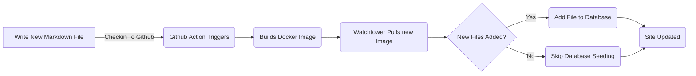

# Ajouter un cadre d'entité pour les billets de blog (Pt 6)

<!--category-- ASP.NET, Entity Framework -->
<datetime class="hidden">2024-08-20T05:45</datetime>

# Présentation

Maintenant que j'ai ce blog en cours d'exécution en utilisant Entity Framework, je peux ajouter de nouveaux messages et de nouvelles langues facilement. J'ajoute juste un nouveau fichier de balisage au projet et je l'enregistre. L'action GitHub déclenche et le site est mis à jour.

Dans ce post, je vais couvrir quelques petits ajouts que j'ai faits à ce processus et comment il permet des améliorations futures.

[TOC]

Voir parties [1](/blog/addingentityframeworkforblogpostspt1), [2](/blog/addingentityframeworkforblogpostspt2), [3](/blog/addingentityframeworkforblogpostspt3) , [4](/blog/addingentityframeworkforblogpostspt4) et [5](/blog/addingentityframeworkforblogpostspt5) pour les étapes précédentes.

# Mise à jour générale

L'un des problèmes auxquels j'ai eu à passer à l'EF était de garder mon processus de mise à jour du site sans retarder la mise à jour du site. Je voulais garder le processus d'ajout d'un nouveau poste aussi simple que possible.

Dans les parties précédentes, j'ai montré comment j'ai utilisé un `MarkdownBlogService` pour obtenir les messages de blog et les langues. Ce service a été injecté dans nos contrôleurs et nos vues. Ce service était un service simple qui lisait les fichiers de balisage à partir du disque et les renvoyait comme `BlogViewModels`.

Le processus de mise à jour est le suivant :



Afin de permettre la mise à jour du contexte lorsque le site commence dans ASP.NET J'utilise un  `IHostedService` pour vérifier les nouveaux fichiers et les ajouter à la base de données.

C'est super simple et tout ce qu'il fait est ci-dessous :

```csharp
public class BackgroundEFBlogUpdater(IServiceScopeFactory scopeFactory, ILogger<BackgroundEFBlogUpdater> logger) : IHostedService
{
    private Task _backgroundTask;
    public async Task StartAsync(CancellationToken cancellationToken)
    {
       
        var scope = scopeFactory.CreateScope();
        var context = scope.ServiceProvider.GetRequiredService<IBlogPopulator>();
        logger.LogInformation("Starting EF Blog Updater");
      
        _backgroundTask = Task.Run(async () =>    await  context.Populate(), cancellationToken);
       logger.LogInformation("EF Blog Updater Finished");
    }

    public async Task StopAsync(CancellationToken cancellationToken)
    {
        
    }
}
```

Notez que l'un des aspects critiques ici est que EF est très difficile au sujet de sa portée. J'ai dû m'en servir. `IServiceScopeFactory` créer une nouvelle portée pour le service. C'est parce que le service est un singleton et EF n'aime pas être utilisé dans un singleton.
L'utilisation des `IServiceScopeFactory` est un modèle courant dans ASP.NET Core lorsque vous avez besoin d'utiliser un service étendu dans un service simpleton.

J'ai aussi dû m'en servir. `Task.Run` pour exécuter la tâche dans un nouveau thread. C'est parce que les `IHostedService` fonctionne sur le thread principal et je ne voulais pas bloquer l'application de commencer.

C'est la `BackgroundEFBlogUpdater` En cours. Il est injecté à l'aide de `SetupBlog` méthode d'extension que j'ai montré avant:

```csharp
    public static void SetupBlog(this IServiceCollection services, IConfiguration configuration, IWebHostEnvironment env)
    {
        var config = services.ConfigurePOCO<BlogConfig>(configuration.GetSection(BlogConfig.Section));
       services.ConfigurePOCO<MarkdownConfig>(configuration.GetSection(MarkdownConfig.Section));
       services.AddScoped<CommentService>();
        switch (config.Mode)
        {
            case BlogMode.File:
                Log.Information("Using file based blog");
                services.AddScoped<IBlogService, MarkdownBlogService>();
                services.AddScoped<IBlogPopulator, MarkdownBlogPopulator>();
                break;
            case BlogMode.Database:
                Log.Information("Using Database based blog");
                services.AddDbContext<MostlylucidDbContext>(options =>
                {
                    if (env.IsDevelopment())
                    {
                        options.EnableSensitiveDataLogging(true);
                    }
                    options.UseNpgsql(configuration.GetConnectionString("DefaultConnection"));
                });
                services.AddScoped<IBlogService, EFBlogService>();
            
                services.AddScoped<IBlogPopulator, EFBlogPopulator>();
                services.AddHostedService<BackgroundEFBlogUpdater>();
                break;
        }
        services.AddScoped<IMarkdownBlogService, MarkdownBlogPopulator>();

        services.AddScoped<MarkdownRenderingService>();
    }
```

Plus précisément, cette ligne `services.AddHostedService<BackgroundEFBlogUpdater>();`
Dans ASP.NET Core, cela lance un nouveau service hébergé qui fonctionne en arrière-plan. Ce service est lancé lorsque l'application démarre et s'exécute jusqu'à l'arrêt de l'application.

C'est une façon simple d'ajouter le traitement d'arrière-plan à votre application ASP.NET Core.

# En conclusion

Dans ce post, j'ai montré comment j'ai ajouté un service d'arrière-plan à mon application ASP.NET Core pour mettre à jour la base de données avec de nouveaux blogs. Ce service s'exécute lorsque l'application démarre et ajoute de nouveaux fichiers à la base de données.