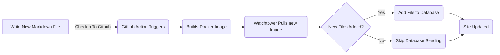

# ब्लॉग पोस्ट के लिए एंटिटी फ्रेमवर्क जोड़े (Pt 6)

<!--category-- ASP.NET, Entity Framework -->
<datetime class="hidden">2024- 0. 1420टी05: 45</datetime>

# परिचय

अब कि मेरे पास इस ब्लॉग को एंटिटी फ्रेमवर्क का उपयोग करने के लिए चल रहा है...... मैं नए पोस्ट और भाषा आसानी से जोड़ सकते हैं. मैं तो बस एक नया निशान नीचे फ़ाइल को परियोजना में जोड़ें और इसे जाँच करें. GiHHW क्रिया ट्रिगर है और साइट अद्यतन किया जा रहा है.

इस पोस्ट में मैं इस प्रक्रिया के लिए बनाया गया थोड़ा सा योग का एक जोड़े कवर करेंगे और यह कैसे भविष्य बढ़ाने के लिए सक्षम करता है.

[विषय

हिस्से में देखें [1](/blog/addingentityframeworkforblogpostspt1), [2](/blog/addingentityframeworkforblogpostspt2), [3](/blog/addingentityframeworkforblogpostspt3) , [4](/blog/addingentityframeworkforblogpostspt4) और [5](/blog/addingentityframeworkforblogpostspt5) पिछले चरण के लिए.

# पृष्ठभूमि अद्यतन

एसएफ में जाने के लिए मुझे एक विषय का सामना करना पड़ा और मैं इस साइट को अद्यतन करने की अपनी प्रक्रिया को जारी रख रहा था, जबकि साइट अद्यतन करने में देर नहीं कर रहा था । मैं आसान के रूप में एक नया पोस्ट जोड़ने की प्रक्रिया को रखना चाहता था.

मैं पिछले भागों में दिखाया कि कैसे मैं एक इस्तेमाल किया `MarkdownBlogService` ब्लॉग पोस्ट्स तथा भाषाओं को प्राप्त करने के लिए। यह सेवा हमारे नियंत्रण और विचारों में शामिल थी । यह सेवा एक सरल सेवा थी जो डिस्क से फ़ाइलों को चिन्हित करती है और उन्हें वापस लौटा `BlogViewModels`.

अद्यतन प्रक्रिया इस प्रकार है:



जब इस साइट में प्रारंभ होता है तो पृष्ठभूमि अद्यतन की अनुमति देने के लिए. NENT मैं एक उपयोग करता हूँ  `IHostedService` नई फ़ाइलों की जाँच हेतु तथा डाटाबेस में जोड़ें.

यह सुपर सरल है और यह नीचे है:

```csharp
public class BackgroundEFBlogUpdater(IServiceScopeFactory scopeFactory, ILogger<BackgroundEFBlogUpdater> logger) : IHostedService
{
    private Task _backgroundTask;
    public async Task StartAsync(CancellationToken cancellationToken)
    {
       
        var scope = scopeFactory.CreateScope();
        var context = scope.ServiceProvider.GetRequiredService<IBlogPopulator>();
        logger.LogInformation("Starting EF Blog Updater");
      
        _backgroundTask = Task.Run(async () =>    await  context.Populate(), cancellationToken);
       logger.LogInformation("EF Blog Updater Finished");
    }

    public async Task StopAsync(CancellationToken cancellationToken)
    {
        
    }
}
```

ध्यान दीजिए कि एक महत्वपूर्ण पहलू यहाँ है कि EF इसके बारे में बहुत रुचि है। मुझे उपयोग करना पड़ा `IServiceScopeFactory` सेवा के लिए नया स्कोप बनाने के लिए. यह है क्योंकि सेवा एक एकलटन है और EF एक एकलटन में उपयोग किया जा करने के लिए पसंद नहीं है.
इसका प्रयोग `IServiceScopeFactory` यह एक आम तरीका है जिसे एक हीटन सेवा में इस्तेमाल करने की ज़रूरत है ।

मुझे भी उपयोग करना पड़ा `Task.Run` नए लड़ी में कार्य को चलाने के लिए. यह इसलिए है क्योंकि `IHostedService` मुख्य थ्रेड पर दौड़ता है और मैं अनुप्रयोग को प्रारंभ से ब्लॉक नहीं करना चाहता था.

यह है `BackgroundEFBlogUpdater` वर्ग. यह का प्रयोग कर रहा है `SetupBlog` विस्तार विधि जो मैं पहले दिखाई देता हूं:

```csharp
    public static void SetupBlog(this IServiceCollection services, IConfiguration configuration, IWebHostEnvironment env)
    {
        var config = services.ConfigurePOCO<BlogConfig>(configuration.GetSection(BlogConfig.Section));
       services.ConfigurePOCO<MarkdownConfig>(configuration.GetSection(MarkdownConfig.Section));
       services.AddScoped<CommentService>();
        switch (config.Mode)
        {
            case BlogMode.File:
                Log.Information("Using file based blog");
                services.AddScoped<IBlogService, MarkdownBlogService>();
                services.AddScoped<IBlogPopulator, MarkdownBlogPopulator>();
                break;
            case BlogMode.Database:
                Log.Information("Using Database based blog");
                services.AddDbContext<MostlylucidDbContext>(options =>
                {
                    if (env.IsDevelopment())
                    {
                        options.EnableSensitiveDataLogging(true);
                    }
                    options.UseNpgsql(configuration.GetConnectionString("DefaultConnection"));
                });
                services.AddScoped<IBlogService, EFBlogService>();
            
                services.AddScoped<IBlogPopulator, EFBlogPopulator>();
                services.AddHostedService<BackgroundEFBlogUpdater>();
                break;
        }
        services.AddScoped<IMarkdownBlogService, MarkdownBlogPopulator>();

        services.AddScoped<MarkdownRenderingService>();
    }
```

इस लकीर को विशिष्ट करें `services.AddHostedService<BackgroundEFBlogUpdater>();`
एनईएस. में कोर कोर यह एक नई होस्ट सेवा शुरू करता है जो पृष्ठभूमि में चलता है. यह सेवा प्रारंभ होती है जब अनुप्रयोग प्रारंभ होता है और तब तक चलता है जब तक कि अनुप्रयोग बन्द नहीं होता.

यह एक सरल तरीका है आपके प्रमाणीकरण अनुप्रयोग में पृष्ठभूमि प्रक्रिया जोड़ने के लिए.

# ऑन्टियम

इस पोस्ट में मैंने दिखाया कि कैसे मैंने अपने एनईपी को एक पृष्ठभूमि सेवा जोड़ी. वेर कोरस अनुप्रयोग को नए ब्लॉग पोस्ट के साथ अद्यतन करने के लिए भेज दिया. यह सेवा तब चलाता है जब अनुप्रयोग प्रारंभ होता है तथा डाटाबेस में कोई नया फ़ाइल जोड़ता है.