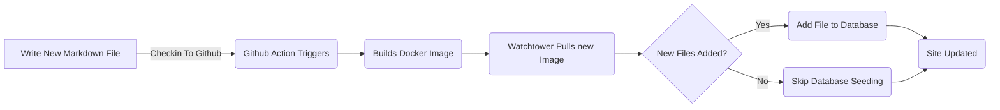

# Aggiunta del quadro dell'entità per i post del blog (Pt 6)

<!--category-- ASP.NET, Entity Framework -->
<datetime class="hidden">2024-08-20T05:45</datetime>

# Introduzione

Ora che ho questo blog in esecuzione utilizzando Entity Framework posso aggiungere facilmente nuovi post e lingue. Aggiungo un nuovo file di markdown al progetto e lo controllo. L'azione GitHub attiva e il sito viene aggiornato.

In questo post coprirò un paio di piccole aggiunte che ho fatto a questo processo e come consente miglioramenti futuri.

[TOC]

Vedere parti [1](/blog/addingentityframeworkforblogpostspt1), [2](/blog/addingentityframeworkforblogpostspt2), [3](/blog/addingentityframeworkforblogpostspt3) , [4](/blog/addingentityframeworkforblogpostspt4) e [5](/blog/addingentityframeworkforblogpostspt5) per le fasi precedenti.

# Aggiornamento sfondo

Uno dei problemi che ho affrontato con il trasferimento a EF è stato mantenere il mio processo per l'aggiornamento del sito, senza ritardare l'aggiornamento del sito. Volevo mantenere il processo di aggiunta di un nuovo post il più semplice possibile.

Nelle parti precedenti ho mostrato come ho usato un `MarkdownBlogService` per ottenere i post del blog e le lingue. Questo servizio è stato iniettato nei nostri controllori e punti di vista. Questo servizio era un servizio semplice che leggeva i file markdown dal disco e li restituiva come `BlogViewModels`.

Il processo di aggiornamento è il seguente:



Al fine di consentire l'aggiornamento di sfondo quando il sito inizia in ASP.NET utilizzo un  `IHostedService` per controllare se ci sono nuovi file e aggiungerli al database.

E'super semplice e tutto ciò che fa è sotto:

```csharp
public class BackgroundEFBlogUpdater(IServiceScopeFactory scopeFactory, ILogger<BackgroundEFBlogUpdater> logger) : IHostedService
{
    private Task _backgroundTask;
    public async Task StartAsync(CancellationToken cancellationToken)
    {
       
        var scope = scopeFactory.CreateScope();
        var context = scope.ServiceProvider.GetRequiredService<IBlogPopulator>();
        logger.LogInformation("Starting EF Blog Updater");
      
        _backgroundTask = Task.Run(async () =>    await  context.Populate(), cancellationToken);
       logger.LogInformation("EF Blog Updater Finished");
    }

    public async Task StopAsync(CancellationToken cancellationToken)
    {
        
    }
}
```

Si noti che un aspetto critico qui è che EF è molto esigente su di esso è scoping. Ho dovuto usarlo. `IServiceScopeFactory` creare un nuovo spazio per il servizio. Questo perché il servizio è un singleton e EF non ama essere utilizzato in un singleton.
L'uso del `IServiceScopeFactory` è un modello comune in ASP.NET Core quando è necessario utilizzare un servizio a scopo in un servizio singleton.

Ho anche dovuto usare `Task.Run` per eseguire l'attività in un nuovo thread. Ciò è dovuto al fatto che `IHostedService` funziona sul thread principale e non volevo bloccare l'applicazione dall'avvio.

Questo è il `BackgroundEFBlogUpdater` classe. E' iniettato usando il `SetupBlog` metodo di estensione che ho mostrato prima:

```csharp
    public static void SetupBlog(this IServiceCollection services, IConfiguration configuration, IWebHostEnvironment env)
    {
        var config = services.ConfigurePOCO<BlogConfig>(configuration.GetSection(BlogConfig.Section));
       services.ConfigurePOCO<MarkdownConfig>(configuration.GetSection(MarkdownConfig.Section));
       services.AddScoped<CommentService>();
        switch (config.Mode)
        {
            case BlogMode.File:
                Log.Information("Using file based blog");
                services.AddScoped<IBlogService, MarkdownBlogService>();
                services.AddScoped<IBlogPopulator, MarkdownBlogPopulator>();
                break;
            case BlogMode.Database:
                Log.Information("Using Database based blog");
                services.AddDbContext<MostlylucidDbContext>(options =>
                {
                    if (env.IsDevelopment())
                    {
                        options.EnableSensitiveDataLogging(true);
                    }
                    options.UseNpgsql(configuration.GetConnectionString("DefaultConnection"));
                });
                services.AddScoped<IBlogService, EFBlogService>();
            
                services.AddScoped<IBlogPopulator, EFBlogPopulator>();
                services.AddHostedService<BackgroundEFBlogUpdater>();
                break;
        }
        services.AddScoped<IMarkdownBlogService, MarkdownBlogPopulator>();

        services.AddScoped<MarkdownRenderingService>();
    }
```

In particolare questa riga `services.AddHostedService<BackgroundEFBlogUpdater>();`
In ASP.NET Core inizia un nuovo HostedService che viene eseguito in background. Questo servizio viene avviato quando l'applicazione inizia e funziona fino a quando l'applicazione si ferma.

Questo è un modo semplice per aggiungere l'elaborazione dello sfondo alla tua applicazione ASP.NET Core.

# In conclusione

In questo post ho mostrato come ho aggiunto un servizio di background alla mia applicazione ASP.NET Core per aggiornare il database con nuovi post sul blog. Questo servizio viene eseguito quando l'applicazione inizia e aggiunge nuovi file al database.