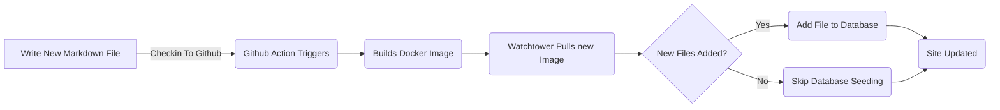

# Het toevoegen van een entiteitskader voor blogberichten (Pt 6)

<!--category-- ASP.NET, Entity Framework -->
<datetime class="hidden">2024-08-20T05:45</datetime>

# Inleiding

Nu dat ik deze blog draaien met behulp van Entity Framework kan ik nieuwe berichten en talen gemakkelijk toevoegen. Ik voeg gewoon een nieuw markdown bestand toe aan het project en check het in. De GitHub actie triggers en de site wordt bijgewerkt.

In dit bericht zal ik een paar kleine toevoegingen die ik heb gemaakt aan dit proces en hoe het maakt toekomstige verbeteringen.

[TOC]

Zie delen [1](/blog/addingentityframeworkforblogpostspt1), [2](/blog/addingentityframeworkforblogpostspt2), [3](/blog/addingentityframeworkforblogpostspt3) , [4](/blog/addingentityframeworkforblogpostspt4) en [5](/blog/addingentityframeworkforblogpostspt5) voor de vorige stappen.

# Achtergrond bijwerken

Een van de problemen die ik geconfronteerd met het verplaatsen naar EF was het houden van mijn proces voor het bijwerken van de site, terwijl het niet uitstellen van de site update. Ik wilde het proces van het toevoegen van een nieuwe post zo eenvoudig mogelijk houden.

In de vorige delen liet ik zien hoe ik een `MarkdownBlogService` om de blog berichten en talen te krijgen. Deze service werd geïnjecteerd in onze controllers en views. Deze dienst was een eenvoudige dienst die markdown bestanden van de schijf af te lezen en ze terug te geven als `BlogViewModels`.

Het updateproces is als volgt:



Om achtergrondupdates mogelijk te maken wanneer de site begint in ASP.NET gebruik ik een  `IHostedService` om te controleren op nieuwe bestanden en ze toe te voegen aan de database.

Het is super eenvoudig en alles wat het doet is hieronder:

```csharp
public class BackgroundEFBlogUpdater(IServiceScopeFactory scopeFactory, ILogger<BackgroundEFBlogUpdater> logger) : IHostedService
{
    private Task _backgroundTask;
    public async Task StartAsync(CancellationToken cancellationToken)
    {
       
        var scope = scopeFactory.CreateScope();
        var context = scope.ServiceProvider.GetRequiredService<IBlogPopulator>();
        logger.LogInformation("Starting EF Blog Updater");
      
        _backgroundTask = Task.Run(async () =>    await  context.Populate(), cancellationToken);
       logger.LogInformation("EF Blog Updater Finished");
    }

    public async Task StopAsync(CancellationToken cancellationToken)
    {
        
    }
}
```

Merk op dat een cruciaal aspect hier is dat EF is erg kieskeurig over het scoping. Ik moest hem gebruiken. `IServiceScopeFactory` het creëren van een nieuwe ruimte voor de dienst. Dit komt omdat de service is een singleton en EF niet graag worden gebruikt in een singleton.
Het gebruik van de `IServiceScopeFactory` is een gemeenschappelijk patroon in ASP.NET Core wanneer u een scoped service moet gebruiken in een singleton service.

Ik moest ook gebruiken `Task.Run` om de taak in een nieuwe thread uit te voeren. Dit is omdat de `IHostedService` draait op de hoofddraad en ik wilde de toepassing niet blokkeren van het starten.

Dit is de `BackgroundEFBlogUpdater` Klas. Het wordt geïnjecteerd met behulp van de `SetupBlog` uitbreidingsmethode die ik eerder heb laten zien:

```csharp
    public static void SetupBlog(this IServiceCollection services, IConfiguration configuration, IWebHostEnvironment env)
    {
        var config = services.ConfigurePOCO<BlogConfig>(configuration.GetSection(BlogConfig.Section));
       services.ConfigurePOCO<MarkdownConfig>(configuration.GetSection(MarkdownConfig.Section));
       services.AddScoped<CommentService>();
        switch (config.Mode)
        {
            case BlogMode.File:
                Log.Information("Using file based blog");
                services.AddScoped<IBlogService, MarkdownBlogService>();
                services.AddScoped<IBlogPopulator, MarkdownBlogPopulator>();
                break;
            case BlogMode.Database:
                Log.Information("Using Database based blog");
                services.AddDbContext<MostlylucidDbContext>(options =>
                {
                    if (env.IsDevelopment())
                    {
                        options.EnableSensitiveDataLogging(true);
                    }
                    options.UseNpgsql(configuration.GetConnectionString("DefaultConnection"));
                });
                services.AddScoped<IBlogService, EFBlogService>();
            
                services.AddScoped<IBlogPopulator, EFBlogPopulator>();
                services.AddHostedService<BackgroundEFBlogUpdater>();
                break;
        }
        services.AddScoped<IMarkdownBlogService, MarkdownBlogPopulator>();

        services.AddScoped<MarkdownRenderingService>();
    }
```

In het bijzonder deze regel `services.AddHostedService<BackgroundEFBlogUpdater>();`
In ASP.NET Core start dit een nieuwe HostedService die op de achtergrond draait. Deze dienst wordt gestart wanneer de toepassing begint en loopt tot de toepassing stopt.

Dit is een eenvoudige manier om achtergrondverwerking toe te voegen aan uw ASP.NET Core applicatie.

# Conclusie

In dit bericht liet ik zien hoe ik een background service toegevoegd aan mijn ASP.NET Core applicatie om de database te updaten met nieuwe blog berichten. Deze service draait wanneer de applicatie start en voegt nieuwe bestanden toe aan de database.