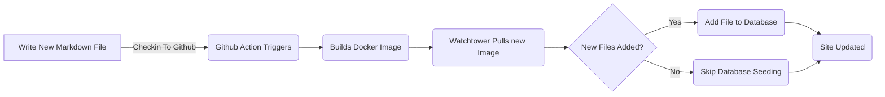

# Lägga till Entity Framework för blogginlägg (Pt 6)

<!--category-- ASP.NET, Entity Framework -->
<datetime class="hidden">2024-08-20T05:45</datetime>

# Inledning

Nu när jag har denna blogg körs med Entity Framework Jag kan lägga till nya inlägg och språk lätt. Jag lägger bara till en ny markdown-fil till projektet och checkar in den. GitHub-åtgärden utlöser och webbplatsen uppdateras.

I det här inlägget ska jag täcka ett par små tillägg jag gjort till denna process och hur det möjliggör framtida förbättringar.

[TOC]

Se även de delar som är avsedda att användas vid tillverkning av varor enligt kapitel 87. [1](/blog/addingentityframeworkforblogpostspt1), [2](/blog/addingentityframeworkforblogpostspt2), [3](/blog/addingentityframeworkforblogpostspt3) , [4](/blog/addingentityframeworkforblogpostspt4) och [5](/blog/addingentityframeworkforblogpostspt5) för de föregående stegen.

# Bakgrund Uppdatering

En av de problem jag stod inför med att flytta till EF var att hålla min process för att uppdatera webbplatsen utan att fördröja uppdateringen av webbplatsen. Jag ville hålla processen med att lägga till ett nytt inlägg så enkelt som möjligt.

I de tidigare delarna visade jag hur jag använde en `MarkdownBlogService` för att få blogginlägg och språk. Denna tjänst injicerades i våra styrenheter och vyer. Denna tjänst var en enkel tjänst som läste markdown filer från disk och returnerade dem som `BlogViewModels`.

Uppdateringsprocessen är följande:



För att möjliggöra bakgrundsuppdatering när webbplatsen startar i ASP.NET använder jag en  `IHostedService` för att kontrollera nya filer och lägga till dem i databasen.

Det är super enkelt och allt det gör är nedan:

```csharp
public class BackgroundEFBlogUpdater(IServiceScopeFactory scopeFactory, ILogger<BackgroundEFBlogUpdater> logger) : IHostedService
{
    private Task _backgroundTask;
    public async Task StartAsync(CancellationToken cancellationToken)
    {
       
        var scope = scopeFactory.CreateScope();
        var context = scope.ServiceProvider.GetRequiredService<IBlogPopulator>();
        logger.LogInformation("Starting EF Blog Updater");
      
        _backgroundTask = Task.Run(async () =>    await  context.Populate(), cancellationToken);
       logger.LogInformation("EF Blog Updater Finished");
    }

    public async Task StopAsync(CancellationToken cancellationToken)
    {
        
    }
}
```

Observera att en kritisk aspekt här är att EF är mycket kräsen om det är scoping. Jag var tvungen att använda `IServiceScopeFactory` skapa ett nytt utrymme för tjänsten. Detta beror på att tjänsten är en singelton och EF inte gillar att användas i en singelton.
Användning av `IServiceScopeFactory` är ett vanligt mönster i ASP.NET Core när du behöver använda en scoped service i en singleton-tjänst.

Jag var också tvungen att använda `Task.Run` för att köra uppgiften i en ny tråd. Detta beror på att `IHostedService` körs på huvudtråden och jag ville inte blockera programmet från att starta.

Det här är... `BackgroundEFBlogUpdater` Klassen. Det injiceras med hjälp av `SetupBlog` förlängningsmetod som jag visade tidigare:

```csharp
    public static void SetupBlog(this IServiceCollection services, IConfiguration configuration, IWebHostEnvironment env)
    {
        var config = services.ConfigurePOCO<BlogConfig>(configuration.GetSection(BlogConfig.Section));
       services.ConfigurePOCO<MarkdownConfig>(configuration.GetSection(MarkdownConfig.Section));
       services.AddScoped<CommentService>();
        switch (config.Mode)
        {
            case BlogMode.File:
                Log.Information("Using file based blog");
                services.AddScoped<IBlogService, MarkdownBlogService>();
                services.AddScoped<IBlogPopulator, MarkdownBlogPopulator>();
                break;
            case BlogMode.Database:
                Log.Information("Using Database based blog");
                services.AddDbContext<MostlylucidDbContext>(options =>
                {
                    if (env.IsDevelopment())
                    {
                        options.EnableSensitiveDataLogging(true);
                    }
                    options.UseNpgsql(configuration.GetConnectionString("DefaultConnection"));
                });
                services.AddScoped<IBlogService, EFBlogService>();
            
                services.AddScoped<IBlogPopulator, EFBlogPopulator>();
                services.AddHostedService<BackgroundEFBlogUpdater>();
                break;
        }
        services.AddScoped<IMarkdownBlogService, MarkdownBlogPopulator>();

        services.AddScoped<MarkdownRenderingService>();
    }
```

I synnerhet denna linje `services.AddHostedService<BackgroundEFBlogUpdater>();`
I ASP.NET Core startar detta en ny HostedService som körs i bakgrunden. Denna tjänst startas när programmet startar och körs tills programmet slutar.

Detta är ett enkelt sätt att lägga till bakgrundsbehandling till din ASP.NET Core-applikation.

# Slutsatser

I det här inlägget visade jag hur jag lagt till en bakgrundstjänst till min ASP.NET Core ansökan för att uppdatera databasen med nya blogginlägg. Denna tjänst körs när programmet startar och lägger till nya filer i databasen.